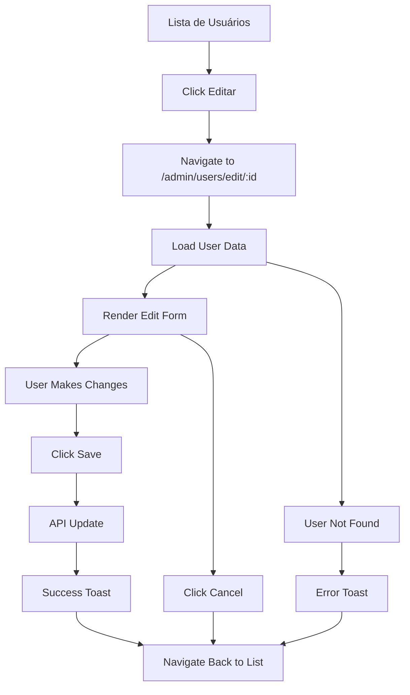

# Design Document

## Overview

Esta refatoração substitui o modal de edição de usuários por uma página dedicada, proporcionando melhor experiência do usuário e mais espaço para configurações. A nova página seguirá o mesmo padrão visual do formulário de criação, mantendo consistência na interface.

## Architecture

### Routing Structure
```
/admin/users              -> Lista de usuários (AdminUsers)
/admin/users/edit/:userId -> Página de edição (EditUserPage)
```

### Component Hierarchy
```
App
├── Router
    ├── AdminUsers (lista)
    └── EditUserPage (nova página)
        ├── UserEditForm (formulário principal)
        ├── Breadcrumb (navegação)
        └── ActionButtons (salvar/cancelar)
```

### Data Flow
1. **Navegação**: AdminUsers → EditUserPage via React Router
2. **Carregamento**: EditUserPage busca dados do usuário via API
3. **Edição**: Formulário controlado com validação local
4. **Salvamento**: API call + navegação de volta + notificação

## Components and Interfaces

### 1. EditUserPage Component
```typescript
interface EditUserPageProps {
  // Sem props - usa useParams() para obter userId
}

interface EditUserPageState {
  user: WuzAPIUser | null;
  loading: boolean;
  saving: boolean;
  error: string | null;
  formData: EditUserFormData;
}
```

**Responsabilidades:**
- Gerenciar estado da página
- Carregar dados do usuário
- Coordenar salvamento
- Controlar navegação

### 2. UserEditForm Component
```typescript
interface UserEditFormProps {
  user: WuzAPIUser;
  formData: EditUserFormData;
  onFormChange: (data: EditUserFormData) => void;
  onSubmit: () => void;
  onCancel: () => void;
  loading: boolean;
}

interface EditUserFormData {
  name: string;
  webhook: string;
  events: string;
  // Campos adicionais conforme necessário
}
```

**Responsabilidades:**
- Renderizar formulário organizado em seções
- Validação de campos
- Controle de eventos de input

### 3. Breadcrumb Component
```typescript
interface BreadcrumbProps {
  items: BreadcrumbItem[];
}

interface BreadcrumbItem {
  label: string;
  href?: string;
  current?: boolean;
}
```

## Data Models

### WuzAPIUser (existente)
```typescript
interface WuzAPIUser {
  id: string;
  name: string;
  token: string;
  webhook: string;
  events: string;
  jid: string;
  connected: boolean;
  loggedIn: boolean;
}
```

### EditUserFormData
```typescript
interface EditUserFormData {
  name: string;
  webhook: string;
  events: string;
  // Mantém apenas campos editáveis
}
```

## Layout Design

### Page Structure
```
┌─────────────────────────────────────────┐
│ Breadcrumb: Home > Admin > Users > Edit │
├─────────────────────────────────────────┤
│ Header: "Editar Usuário - [Nome]"       │
├─────────────────────────────────────────┤
│ ┌─────────────────────────────────────┐ │
│ │ Card: Informações Básicas           │ │
│ │ - Nome (editável)                   │ │
│ │ - Token (readonly)                  │ │
│ │ - Status (readonly)                 │ │
│ │ - JID (readonly)                    │ │
│ └─────────────────────────────────────┘ │
│ ┌─────────────────────────────────────┐ │
│ │ Card: Configurações de Webhook      │ │
│ │ - URL do Webhook                    │ │
│ │ - Eventos (checkboxes)              │ │
│ └─────────────────────────────────────┘ │
│ ┌─────────────────────────────────────┐ │
│ │ Actions                             │ │
│ │ [Cancelar] [Salvar Alterações]      │ │
│ └─────────────────────────────────────┘ │
└─────────────────────────────────────────┘
```

### Visual Design Patterns

**Cards com Seções:**
- Usar mesmo padrão do CreateUserForm
- Headers com ícones e títulos descritivos
- Separação clara entre seções

**Form Fields:**
- Labels consistentes
- Inputs com placeholder apropriados
- Campos readonly com visual diferenciado
- Validação visual em tempo real

**Action Buttons:**
- Botão "Cancelar" (outline, à esquerda)
- Botão "Salvar" (primary, à direita)
- Loading states durante salvamento

## Error Handling

### Cenários de Erro
1. **Usuário não encontrado**: Redirect para lista com toast de erro
2. **Erro de carregamento**: Exibir página de erro com retry
3. **Erro de salvamento**: Toast de erro, manter na página
4. **Validação**: Highlight de campos inválidos

### Error Boundaries
- Implementar ErrorBoundary para capturar erros de renderização
- Fallback UI com opção de voltar à lista

## Navigation Flow

### Fluxo Principal


### URL Handling
- **Direct Access**: `/admin/users/edit/123` deve funcionar
- **Invalid ID**: Redirect para lista com erro
- **Browser Back**: Funcionar normalmente

## Testing Strategy

### Unit Tests
- EditUserPage: carregamento, estados, navegação
- UserEditForm: validação, eventos, renderização
- Breadcrumb: navegação, items ativos

### Integration Tests
- Fluxo completo de edição
- Navegação entre páginas
- Persistência de dados

### E2E Tests
- Cenário completo: lista → editar → salvar → voltar
- Validação de URLs
- Tratamento de erros

## Performance Considerations

### Otimizações
- **Lazy Loading**: Carregar EditUserPage apenas quando necessário
- **Memoization**: React.memo para componentes que não mudam
- **Debounce**: Validação de campos com delay

### Bundle Size
- Reutilizar componentes existentes (Cards, Inputs, etc.)
- Evitar duplicação de código com CreateUserForm

## Accessibility

### WCAG Compliance
- **Keyboard Navigation**: Tab order lógico
- **Screen Readers**: Labels apropriados, ARIA attributes
- **Focus Management**: Focus no primeiro campo ao carregar
- **Color Contrast**: Manter padrões existentes

### Semantic HTML
- Usar elementos semânticos (form, fieldset, legend)
- Headings hierárquicos (h1, h2, h3)
- Proper form associations

## Migration Strategy

### Fase 1: Criação da Nova Página
1. Criar EditUserPage component
2. Adicionar rota no Router
3. Implementar carregamento de dados

### Fase 2: Implementação do Formulário
1. Criar UserEditForm component
2. Implementar validação
3. Conectar com API de atualização

### Fase 3: Integração e Limpeza
1. Atualizar AdminUsers para usar navegação
2. Remover modal de edição
3. Limpar código não utilizado

### Fase 4: Testes e Refinamentos
1. Testes unitários e integração
2. Ajustes de UX baseados em feedback
3. Otimizações de performance