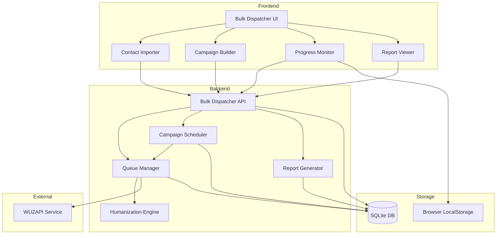
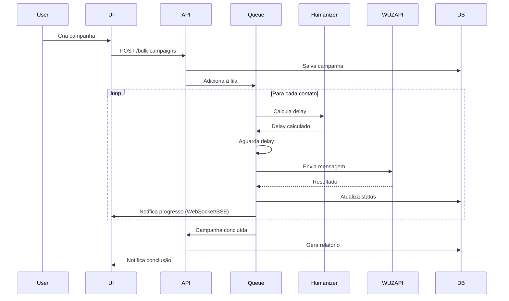

# Design Document

## Overview

O Advanced Bulk Message Dispatcher é uma evolução completa do sistema de disparo de mensagens do WUZAPI Manager. O sistema permitirá importação de contatos de múltiplas fontes (agenda WUZAPI, CSV, entrada manual), agendamento de campanhas, e implementará técnicas avançadas de humanização para evitar detecção como automação, incluindo delays variáveis, randomização de ordem, e controles de pausa/retomada em tempo real.

### Key Design Principles

1. **Humanização First**: Todas as funcionalidades devem priorizar comportamento natural e não-robotizado
2. **Inline UX**: Seguir padrão de inline editing do projeto (sem modais para formulários)
3. **Feedback em Tempo Real**: Progresso e status visíveis durante toda a execução
4. **Resiliência**: Sistema deve continuar funcionando mesmo com falhas parciais
5. **Auditabilidade**: Histórico completo e relatórios detalhados de todas as campanhas

## Architecture

### High-Level Architecture



### Component Interaction Flow



## Components and Interfaces

### Frontend Components

#### 1. BulkDispatcherDashboard (Main Container)

**Localização**: `src/components/disparador/BulkDispatcherDashboard.tsx`

**Responsabilidades**:
- Container principal com tabs para diferentes funcionalidades
- Gerenciamento de estado global do disparador
- Navegação entre: Nova Campanha, Campanhas Ativas, Histórico, Relatórios

**Props**:
```typescript
interface BulkDispatcherDashboardProps {
  instance: string;
}
```

**State**:
```typescript
{
  activeTab: 'new' | 'active' | 'history' | 'reports';
  activeCampaigns: Campaign[];
  connectionStatus: 'connected' | 'disconnected';
}
```

#### 2. ContactImporter

**Localização**: `src/components/disparador/ContactImporter.tsx`

**Responsabilidades**:
- Importação de contatos de múltiplas fontes
- Validação de números de telefone
- Preview de contatos importados
- Gerenciamento de variáveis customizadas

**Fontes de Importação**:
1. **Agenda WUZAPI**: Busca via API `/users/contacts`
2. **Upload CSV**: Parser local com validação
3. **Entrada Manual**: Campo de texto com separadores

**Interface**:
```typescript
interface ContactSource {
  type: 'wuzapi' | 'csv' | 'manual';
  contacts: Contact[];
  customVariables?: string[]; // Para CSV
}

interface Contact {
  phone: string;
  name?: string;
  variables?: Record<string, string>; // Variáveis customizadas do CSV
}
```

**CSV Format Expected**:
```csv
telefone,nome,variavel1,variavel2
5511999999999,João Silva,Empresa A,Premium
5511888888888,Maria Santos,Empresa B,Basic
```

#### 3. CampaignBuilder

**Localização**: `src/components/disparador/CampaignBuilder.tsx`

**Responsabilidades**:
- Configuração da mensagem (texto/mídia)
- Configuração de delays e humanização
- Agendamento de campanha
- Preview da campanha antes do envio

**Configuration Options**:
```typescript
interface CampaignConfig {
  name: string;
  message: {
    type: 'text' | 'media';
    content: string; // Texto ou caption
    mediaUrl?: string;
    mediaType?: 'image' | 'video' | 'document';
    fileName?: string;
  };
  humanization: {
    delayMin: number; // segundos (5-300)
    delayMax: number; // segundos (5-300)
    randomizeOrder: boolean;
  };
  scheduling: {
    isScheduled: boolean;
    scheduledAt?: Date;
  };
  contacts: Contact[];
}
```

#### 4. CampaignProgressMonitor

**Localização**: `src/components/disparador/CampaignProgressMonitor.tsx`

**Responsabilidades**:
- Exibição de progresso em tempo real
- Controles de pausa/retomada/cancelamento
- Estatísticas ao vivo (enviadas, pendentes, erros)
- Lista de últimos contatos processados

**Real-time Updates**: Usar polling a cada 2 segundos ou WebSocket se disponível

**Interface**:
```typescript
interface CampaignProgress {
  campaignId: string;
  status: 'running' | 'paused' | 'completed' | 'cancelled' | 'failed';
  stats: {
    total: number;
    sent: number;
    pending: number;
    failed: number;
    successRate: number;
  };
  currentContact?: Contact;
  estimatedTimeRemaining: number; // segundos
  errors: CampaignError[];
}

interface CampaignError {
  contactPhone: string;
  errorType: 'invalid_number' | 'disconnected' | 'timeout' | 'api_error';
  errorMessage: string;
  timestamp: Date;
}
```

#### 5. CampaignReportViewer

**Localização**: `src/components/disparador/CampaignReportViewer.tsx`

**Responsabilidades**:
- Visualização de relatórios de campanhas concluídas
- Gráficos de performance (sucesso vs falhas)
- Lista detalhada de erros
- Exportação de relatórios em CSV
- Comparação entre campanhas

**Report Structure**:
```typescript
interface CampaignReport {
  campaignId: string;
  campaignName: string;
  executedAt: Date;
  completedAt: Date;
  duration: number; // segundos
  stats: {
    total: number;
    sent: number;
    failed: number;
    successRate: number;
  };
  errors: CampaignError[];
  errorsByType: Record<string, number>;
  config: CampaignConfig;
}
```

### Backend Routes

#### 1. Bulk Campaign Routes

**Localização**: `server/routes/bulkCampaignRoutes.js`

**Endpoints**:

```javascript
// Criar nova campanha
POST /api/user/bulk-campaigns
Body: {
  name: string,
  instance: string,
  message: MessageConfig,
  humanization: HumanizationConfig,
  scheduling: SchedulingConfig,
  contacts: Contact[]
}
Response: { campaignId: string, status: 'created' | 'scheduled' }

// Listar campanhas ativas
GET /api/user/bulk-campaigns/active?instance={instance}
Response: { campaigns: Campaign[] }

// Obter progresso de campanha
GET /api/user/bulk-campaigns/:campaignId/progress
Response: CampaignProgress

// Pausar campanha
POST /api/user/bulk-campaigns/:campaignId/pause
Response: { status: 'paused' }

// Retomar campanha
POST /api/user/bulk-campaigns/:campaignId/resume
Response: { status: 'running' }

// Cancelar campanha
POST /api/user/bulk-campaigns/:campaignId/cancel
Response: { status: 'cancelled' }

// Listar histórico de campanhas
GET /api/user/bulk-campaigns/history?instance={instance}&page={page}&limit={limit}
Response: { campaigns: Campaign[], total: number }

// Obter relatório de campanha
GET /api/user/bulk-campaigns/:campaignId/report
Response: CampaignReport

// Exportar relatório em CSV
GET /api/user/bulk-campaigns/:campaignId/report/export
Response: CSV file download

// Comparar campanhas
POST /api/user/bulk-campaigns/compare
Body: { campaignIds: string[] }
Response: { comparison: ComparisonData }
```

#### 2. Contact Import Routes

**Localização**: `server/routes/contactImportRoutes.js`

**Endpoints**:

```javascript
// Importar contatos da agenda WUZAPI
GET /api/user/contacts/import/wuzapi?instance={instance}
Response: { contacts: Contact[] }

// Validar CSV
POST /api/user/contacts/validate-csv
Body: FormData with CSV file
Response: { 
  valid: boolean, 
  contacts: Contact[], 
  errors: ValidationError[],
  customVariables: string[]
}

// Validar números manuais
POST /api/user/contacts/validate-manual
Body: { numbers: string[] }
Response: { 
  valid: Contact[], 
  invalid: { number: string, reason: string }[] 
}
```

### Backend Services

#### 1. QueueManager Service

**Localização**: `server/services/QueueManager.js`

**Responsabilidades**:
- Gerenciar fila de mensagens para envio
- Processar mensagens sequencialmente com delays
- Controlar estado (running, paused, cancelled)
- Atualizar progresso no banco de dados
- Retry logic para falhas temporárias

**Key Methods**:
```javascript
class QueueManager {
  constructor(campaignId, config, contacts) {}
  
  async start() {
    // Inicia processamento da fila
    // Randomiza ordem se configurado
    // Processa cada contato com delay humanizado
  }
  
  async pause() {
    // Pausa após mensagem atual
  }
  
  async resume() {
    // Retoma do ponto onde parou
  }
  
  async cancel() {
    // Cancela e marca como cancelado
  }
  
  async processContact(contact) {
    // Substitui variáveis na mensagem
    // Envia via WUZAPI
    // Registra resultado
    // Atualiza progresso
  }
  
  getProgress() {
    // Retorna progresso atual
  }
}
```

**Queue State Management**:
- Estado armazenado em memória durante execução
- Persistido no SQLite a cada atualização
- Recuperável em caso de restart do servidor

#### 2. HumanizationEngine Service

**Localização**: `server/services/HumanizationEngine.js`

**Responsabilidades**:
- Calcular delays aleatórios dentro do intervalo configurado
- Randomizar ordem de contatos (Fisher-Yates shuffle)
- Adicionar variações naturais ao comportamento

**Key Methods**:
```javascript
class HumanizationEngine {
  static calculateDelay(minSeconds, maxSeconds) {
    // Retorna delay aleatório em ms
    // Usa distribuição normal para parecer mais natural
    const mean = (minSeconds + maxSeconds) / 2;
    const stdDev = (maxSeconds - minSeconds) / 6;
    return this.normalRandom(mean, stdDev) * 1000;
  }
  
  static shuffleContacts(contacts) {
    // Fisher-Yates shuffle
    // Preserva mapeamento de variáveis
  }
  
  static normalRandom(mean, stdDev) {
    // Box-Muller transform para distribuição normal
  }
}
```

**Humanization Techniques**:
1. **Delay Variável**: Distribuição normal dentro do intervalo
2. **Randomização**: Fisher-Yates para ordem imprevisível
3. **Micro-delays**: Pequenas variações adicionais (±500ms)

#### 3. CampaignScheduler Service

**Localização**: `server/services/CampaignScheduler.js`

**Responsabilidades**:
- Verificar campanhas agendadas periodicamente
- Iniciar campanhas no horário configurado
- Validar conexão WUZAPI antes de iniciar
- Notificar falhas de agendamento

**Implementation**:
```javascript
class CampaignScheduler {
  constructor() {
    this.checkInterval = 60000; // 1 minuto
    this.intervalId = null;
  }
  
  start() {
    this.intervalId = setInterval(() => {
      this.checkScheduledCampaigns();
    }, this.checkInterval);
  }
  
  async checkScheduledCampaigns() {
    // Busca campanhas agendadas para agora
    // Valida conexão WUZAPI
    // Inicia QueueManager para cada campanha
  }
  
  stop() {
    clearInterval(this.intervalId);
  }
}
```

#### 4. ReportGenerator Service

**Localização**: `server/services/ReportGenerator.js`

**Responsabilidades**:
- Gerar relatórios completos de campanhas
- Calcular estatísticas e métricas
- Categorizar erros por tipo
- Exportar relatórios em CSV

**Key Methods**:
```javascript
class ReportGenerator {
  static async generateReport(campaignId) {
    // Busca dados da campanha
    // Calcula estatísticas
    // Categoriza erros
    // Retorna relatório estruturado
  }
  
  static async exportToCSV(campaignId) {
    // Gera CSV com detalhes de cada envio
    // Inclui: telefone, status, erro, timestamp
  }
  
  static async compareCampaigns(campaignIds) {
    // Compara métricas entre campanhas
    // Retorna análise comparativa
  }
}
```

## Data Models

### Database Schema

#### campaigns Table

```sql
CREATE TABLE IF NOT EXISTS campaigns (
  id TEXT PRIMARY KEY,
  name TEXT NOT NULL,
  instance TEXT NOT NULL,
  user_token TEXT NOT NULL,
  status TEXT NOT NULL, -- 'scheduled', 'running', 'paused', 'completed', 'cancelled', 'failed'
  message_type TEXT NOT NULL, -- 'text', 'media'
  message_content TEXT NOT NULL,
  media_url TEXT,
  media_type TEXT, -- 'image', 'video', 'document'
  media_file_name TEXT,
  delay_min INTEGER NOT NULL,
  delay_max INTEGER NOT NULL,
  randomize_order BOOLEAN NOT NULL DEFAULT 1,
  is_scheduled BOOLEAN NOT NULL DEFAULT 0,
  scheduled_at DATETIME,
  started_at DATETIME,
  completed_at DATETIME,
  total_contacts INTEGER NOT NULL,
  sent_count INTEGER DEFAULT 0,
  failed_count INTEGER DEFAULT 0,
  current_index INTEGER DEFAULT 0,
  created_at DATETIME DEFAULT CURRENT_TIMESTAMP,
  updated_at DATETIME DEFAULT CURRENT_TIMESTAMP
);

CREATE INDEX idx_campaigns_instance ON campaigns(instance);
CREATE INDEX idx_campaigns_status ON campaigns(status);
CREATE INDEX idx_campaigns_scheduled ON campaigns(scheduled_at) WHERE is_scheduled = 1;
```

#### campaign_contacts Table

```sql
CREATE TABLE IF NOT EXISTS campaign_contacts (
  id INTEGER PRIMARY KEY AUTOINCREMENT,
  campaign_id TEXT NOT NULL,
  phone TEXT NOT NULL,
  name TEXT,
  variables TEXT, -- JSON string com variáveis customizadas
  status TEXT NOT NULL, -- 'pending', 'sent', 'failed'
  error_type TEXT,
  error_message TEXT,
  sent_at DATETIME,
  processing_order INTEGER, -- Ordem após randomização
  FOREIGN KEY (campaign_id) REFERENCES campaigns(id) ON DELETE CASCADE
);

CREATE INDEX idx_campaign_contacts_campaign ON campaign_contacts(campaign_id);
CREATE INDEX idx_campaign_contacts_status ON campaign_contacts(campaign_id, status);
```

#### campaign_reports Table

```sql
CREATE TABLE IF NOT EXISTS campaign_reports (
  id INTEGER PRIMARY KEY AUTOINCREMENT,
  campaign_id TEXT NOT NULL UNIQUE,
  total_contacts INTEGER NOT NULL,
  sent_count INTEGER NOT NULL,
  failed_count INTEGER NOT NULL,
  success_rate REAL NOT NULL,
  duration_seconds INTEGER NOT NULL,
  errors_by_type TEXT, -- JSON string com contagem por tipo
  generated_at DATETIME DEFAULT CURRENT_TIMESTAMP,
  FOREIGN KEY (campaign_id) REFERENCES campaigns(id) ON DELETE CASCADE
);

CREATE INDEX idx_campaign_reports_campaign ON campaign_reports(campaign_id);
```

### Frontend State Models

#### Campaign State (React Context)

```typescript
interface CampaignContextState {
  activeCampaigns: Map<string, CampaignProgress>;
  updateProgress: (campaignId: string, progress: CampaignProgress) => void;
  pauseCampaign: (campaignId: string) => Promise<void>;
  resumeCampaign: (campaignId: string) => Promise<void>;
  cancelCampaign: (campaignId: string) => Promise<void>;
}
```

## Error Handling

### Error Categories

1. **Validation Errors** (400)
   - Número de telefone inválido
   - CSV mal formatado
   - Configuração inválida (delay min > max)
   - Data de agendamento no passado

2. **Connection Errors** (503)
   - Instância WUZAPI desconectada
   - Timeout na API WUZAPI
   - Falha de rede

3. **Business Logic Errors** (422)
   - Campanha já em execução
   - Campanha não encontrada
   - Operação inválida para status atual

4. **System Errors** (500)
   - Erro no banco de dados
   - Erro inesperado no processamento

### Error Recovery Strategies

1. **Retry Logic**: 
   - Até 3 tentativas para erros de timeout
   - Backoff exponencial (1s, 2s, 4s)
   - Apenas para erros temporários

2. **Graceful Degradation**:
   - Continuar campanha mesmo com falhas individuais
   - Registrar erros mas não interromper fila
   - Notificar usuário de falhas críticas

3. **State Recovery**:
   - Persistir estado da fila a cada 10 mensagens
   - Recuperar campanhas interrompidas no restart
   - Marcar como "failed" se não recuperável

## Testing Strategy

### Unit Tests

**Backend Services**:
- `QueueManager.test.js`: Testar processamento de fila, pausa/retomada
- `HumanizationEngine.test.js`: Testar cálculo de delays, randomização
- `CampaignScheduler.test.js`: Testar verificação de agendamentos
- `ReportGenerator.test.js`: Testar geração de relatórios

**Frontend Components**:
- `ContactImporter.test.tsx`: Testar importação de cada fonte
- `CampaignBuilder.test.tsx`: Testar validações de configuração
- `CampaignProgressMonitor.test.tsx`: Testar atualização de progresso

### Integration Tests

1. **Fluxo Completo de Campanha**:
   - Criar campanha → Processar fila → Gerar relatório
   - Validar persistência em cada etapa

2. **Agendamento**:
   - Criar campanha agendada → Verificar execução no horário

3. **Pausa e Retomada**:
   - Iniciar campanha → Pausar → Retomar → Validar continuidade

4. **Tratamento de Erros**:
   - Simular falhas WUZAPI → Validar retry e registro de erros

### E2E Tests (Cypress)

```typescript
describe('Bulk Message Dispatcher', () => {
  it('should create and execute a bulk campaign', () => {
    // Importar contatos
    // Configurar mensagem
    // Iniciar campanha
    // Monitorar progresso
    // Validar relatório
  });
  
  it('should pause and resume campaign', () => {
    // Iniciar campanha
    // Pausar durante execução
    // Validar pausa
    // Retomar
    // Validar continuidade
  });
});
```

### Performance Tests

- **Load Testing**: Campanhas com 1000+ contatos
- **Concurrent Campaigns**: Múltiplas campanhas simultâneas
- **Memory Leaks**: Monitorar uso de memória durante execução longa

## Security Considerations

1. **Autenticação**: Todas as rotas requerem token de usuário válido
2. **Autorização**: Usuário só pode acessar suas próprias campanhas
3. **Rate Limiting**: Limitar criação de campanhas (ex: 10 por hora)
4. **Input Validation**: Sanitizar todos os inputs (números, mensagens, CSV)
5. **File Upload**: Validar tamanho e tipo de arquivo CSV (max 5MB)
6. **SQL Injection**: Usar prepared statements em todas as queries
7. **XSS Prevention**: Sanitizar mensagens antes de exibir no frontend

## Performance Optimizations

1. **Database Indexing**: Índices em campos frequentemente consultados
2. **Batch Updates**: Atualizar progresso em lotes de 10 mensagens
3. **Connection Pooling**: Reutilizar conexões WUZAPI
4. **Lazy Loading**: Carregar histórico de campanhas sob demanda
5. **Caching**: Cache de contatos importados da agenda (5 minutos)
6. **Pagination**: Limitar resultados de histórico (20 por página)

## Deployment Considerations

1. **Database Migration**: Script para criar novas tabelas
2. **Backward Compatibility**: Manter compatibilidade com disparador atual
3. **Feature Flag**: Permitir ativar/desativar novo disparador
4. **Monitoring**: Logs detalhados de execução de campanhas
5. **Cleanup**: Job para limpar campanhas antigas (>90 dias)

## Future Enhancements

1. **Webhooks**: Notificar URL externa ao completar campanha
2. **A/B Testing**: Testar múltiplas variações de mensagem
3. **Segmentação**: Filtros avançados para seleção de contatos
4. **Analytics**: Dashboard com métricas agregadas de todas as campanhas
5. **Templates**: Biblioteca de templates de mensagem reutilizáveis
6. **Integração com CRM**: Sincronizar contatos com sistemas externos
7. **Multi-instância**: Distribuir campanha entre múltiplas instâncias WUZAPI
