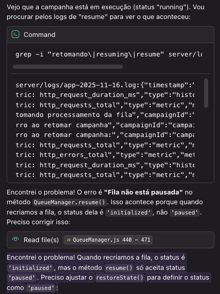

# Implementation Plan - Correção de Retomada de Campanhas

## Visão Geral

Este plano detalha as tarefas necessárias para corrigir o problema de retomada de campanhas pausadas. As tarefas estão organizadas em ordem de execução, com cada uma construindo sobre as anteriores.

## Tasks

- [x] 1. Adicionar métodos auxiliares no CampaignScheduler
  - Criar método `getCampaignFromDB()` para buscar campanha com validação
  - Criar método `transformCampaignToConfig()` para transformar dados do banco
  - Adicionar logs detalhados em cada método
  - _Requirements: 2.2, 2.3, 6.1, 6.2_

- [x] 2. Implementar método restoreState() no QueueManager
  - Criar novo método `restoreState(campaign)` na classe QueueManager
  - Restaurar `currentIndex`, `sentCount`, `failedCount` do objeto campaign
  - Restaurar timestamps `startedAt` e `pausedAt`
  - Validar que `currentIndex < contacts.length`
  - Lançar erro descritivo se não há contatos pendentes
  - Adicionar logs detalhados do estado restaurado
  - _Requirements: 1.1, 1.2, 5.2, 6.3_

- [x] 3. Modificar método loadContacts() no QueueManager
  - Alterar query SQL para filtrar apenas `status = 'pending'`
  - Manter ordenação por `processing_order`
  - Adicionar log de warning se nenhum contato pendente for encontrado
  - Retornar array vazio (não lançar erro) se não há pendentes
  - _Requirements: 1.3, 1.4, 6.2_

- [x] 4. Refatorar método resumeCampaign() no CampaignScheduler
  - Usar `getCampaignFromDB()` para buscar campanha
  - Validar que `campaign.status === 'paused'` antes de continuar
  - Validar conexão WUZAPI com `validateWuzapiConnection()`
  - Usar `transformCampaignToConfig()` para criar config correto
  - Criar nova instância de QueueManager com config correto
  - Chamar `queue.loadContacts()` após criar a fila
  - Chamar `queue.restoreState(campaign)` após carregar contatos
  - Adicionar fila ao `activeQueues` antes de chamar `resume()`
  - Adicionar try-catch com logs detalhados de erro
  - _Requirements: 2.1, 2.4, 2.5, 4.1, 4.2, 4.3, 6.1, 6.4_

- [x] 5. Melhorar tratamento de erros no endpoint /resume
  - Adicionar validação de status da campanha antes de chamar scheduler
  - Retornar 404 com mensagem clara se campanha não existe
  - Retornar 400 com mensagem clara se campanha não está pausada
  - Retornar 503 com mensagem clara se WhatsApp não está conectado
  - Retornar 400 com mensagem clara se não há contatos pendentes
  - Adicionar log completo com stack trace em caso de erro
  - _Requirements: 3.1, 3.2, 3.3, 3.4, 3.5, 6.4_

- [x] 6. Adicionar validação de conexão WUZAPI na retomada
  - Chamar `validateWuzapiConnection()` antes de retomar
  - Retornar erro 503 se conexão não está disponível
  - Manter campanha em status 'paused' se validação falhar
  - Adicionar log de confirmação quando conexão é validada
  - _Requirements: 4.1, 4.2, 4.3, 4.4_

- 
  - Criar índice em `campaign_contacts(campaign_id, status, processing_order)`
  - Adicionar migração para criar o índice
  - Testar performance da query de contatos pendentes
  - _Requirements: Performance_

- [ ]* 8. Criar testes unitários para CampaignScheduler
  - Testar `getCampaignFromDB()` com campanha existente e inexistente
  - Testar `transformCampaignToConfig()` com dados válidos
  - Testar `resumeCampaign()` com fila em memória
  - Testar `resumeCampaign()` sem fila em memória (recriação)
  - Testar validação de status antes de retomar
  - Testar validação de conexão WUZAPI
  - _Requirements: 7.1, 7.2, 7.5_

- [ ]* 9. Criar testes unitários para QueueManager
  - Testar `restoreState()` com dados válidos
  - Testar `restoreState()` com currentIndex >= contacts.length (erro)
  - Testar `loadContacts()` carregando apenas pendentes
  - Testar `loadContacts()` com nenhum contato pendente
  - _Requirements: 7.1, 7.4_

- [ ]* 10. Criar teste de integração de pausa/retomada
  - Criar campanha com 10 contatos
  - Iniciar e aguardar envio de 3 contatos
  - Pausar campanha
  - Verificar status e current_index no banco
  - Retomar campanha
  - Verificar que continua do contato 4
  - Aguardar conclusão
  - Verificar que todos foram enviados sem duplicatas
  - _Requirements: 7.1, 7.3_

- [ ]* 11. Criar teste de retomada após reinício
  - Criar e pausar campanha
  - Limpar `activeQueues` (simular reinício)
  - Retomar campanha
  - Verificar que fila foi recriada
  - Verificar que processamento continua corretamente
  - _Requirements: 7.2_

- [ ]* 12. Criar testes de tratamento de erros
  - Testar retomada de campanha inexistente (404)
  - Testar retomada de campanha 'running' (400)
  - Testar retomada sem contatos pendentes (400)
  - Testar retomada com WhatsApp desconectado (503)
  - _Requirements: 7.4, 7.5_

- [ ] 13. Atualizar documentação
  - Documentar novo fluxo de retomada no README
  - Adicionar exemplos de uso da API
  - Documentar códigos de erro e suas causas
  - Adicionar troubleshooting guide
  - _Requirements: Documentation_

## Notas Importantes

### Ordem de Execução

As tarefas devem ser executadas na ordem listada, pois cada uma depende das anteriores:

1. **Tasks 1-3**: Preparação - Criar métodos auxiliares e modificar loadContacts
2. **Task 4**: Core - Refatorar resumeCampaign (usa tasks 1-3)
3. **Tasks 5-6**: Validação - Melhorar tratamento de erros e validações
4. **Task 7**: Performance - Otimizar queries
5. **Tasks 8-12**: Testes - Validar implementação
6. **Task 13**: Documentação - Finalizar

### Testes Opcionais

Tasks marcadas com `*` são testes opcionais. Embora importantes, não são críticos para o funcionamento básico da correção. Podem ser implementados após validação manual do fluxo principal.

### Validação Manual

Após completar as tasks 1-6, realizar validação manual:

1. Criar campanha com 5 contatos
2. Iniciar e aguardar envio de 2 contatos
3. Pausar via UI
4. Verificar no banco: `status = 'paused'`, `current_index = 2`
5. Retomar via UI
6. Verificar que continua do contato 3
7. Aguardar conclusão
8. Verificar que todos os 5 foram enviados (sem duplicatas)

### Rollback

Se houver problemas após deploy:

1. Reverter commits das modificações
2. Campanhas pausadas continuarão pausadas (sem perda de dados)
3. Usuários podem cancelar e recriar campanhas se necessário

### Logs para Debugging

Durante a implementação, adicionar logs em pontos críticos:

- Início e fim de cada método
- Valores de variáveis importantes (currentIndex, sentCount, etc.)
- Erros com stack trace completo
- Validações (status, conexão, contatos pendentes)

Usar níveis apropriados:
- `logger.debug()` - Detalhes de execução
- `logger.info()` - Eventos importantes
- `logger.warn()` - Situações anormais mas não críticas
- `logger.error()` - Erros que impedem execução
