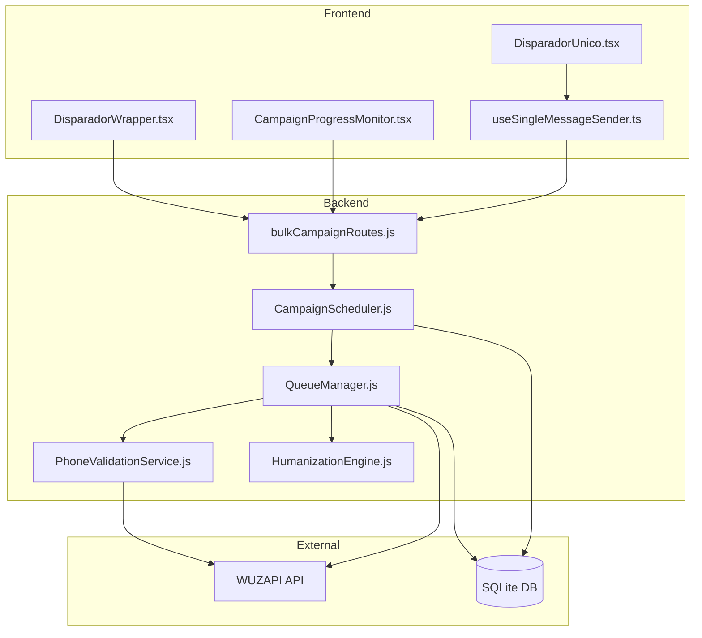
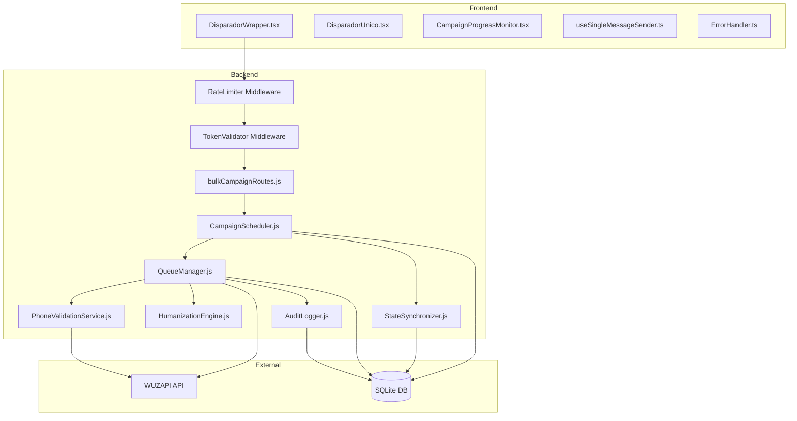

# Design Document: Disparador Review & Cleanup

## Overview

Este documento descreve o design técnico para a revisão e melhoria do sistema de disparador de mensagens do WUZAPI Manager. O sistema atual permite envio de mensagens únicas e em massa via WhatsApp, com funcionalidades de agendamento, humanização e gerenciamento de campanhas.

A revisão aborda problemas identificados em 4 categorias principais:
1. **Segurança**: Exposição de tokens, falta de rate limiting, validação insuficiente
2. **Resiliência**: Memory leaks, race conditions, inconsistência de estado
3. **UX/Usabilidade**: Feedback insuficiente, validação confusa
4. **Performance**: Consultas N+1, cache ineficiente

## Architecture

### Arquitetura Atual



### Arquitetura Proposta



## Components and Interfaces

### 1. TokenValidator Middleware

Novo middleware para validação segura de tokens.

```javascript
// server/middleware/tokenValidator.js
interface TokenValidationResult {
  valid: boolean;
  userId: string | null;
  isAdmin: boolean;
  error?: string;
}

async function validateToken(token: string, requestingUserId: string): Promise<TokenValidationResult>
```

**Responsabilidades:**
- Validar se token pertence ao usuário autenticado
- Verificar permissões de admin
- Retornar erros genéricos sem expor detalhes do token

### 2. RateLimiter Middleware

Middleware de rate limiting para rotas de campanha.

```javascript
// server/middleware/campaignRateLimiter.js
interface RateLimitConfig {
  windowMs: number;      // 60000 (1 minuto)
  maxRequests: number;   // 10
  keyGenerator: (req) => string;
}

function createCampaignRateLimiter(config: RateLimitConfig): ExpressMiddleware
```

### 3. StateSynchronizer Service

Serviço para sincronização de estado entre memória e banco.

```javascript
// server/services/StateSynchronizer.js
class StateSynchronizer {
  constructor(db: Database, scheduler: CampaignScheduler);
  
  // Sincroniza estado a cada 30 segundos
  startSync(): void;
  stopSync(): void;
  
  // Restaura campanhas após reinício
  async restoreRunningCampaigns(): Promise<Campaign[]>;
  
  // Detecta e corrige inconsistências
  async detectInconsistencies(): Promise<Inconsistency[]>;
  async autoCorrect(inconsistencies: Inconsistency[]): Promise<void>;
}
```

### 4. AuditLogger Service

Serviço para auditoria de operações.

```javascript
// server/services/AuditLogger.js
interface AuditEntry {
  id: string;
  campaignId: string;
  userId: string;
  action: 'create' | 'pause' | 'resume' | 'cancel' | 'delete';
  timestamp: Date;
  details: object;
}

class AuditLogger {
  async log(entry: Omit<AuditEntry, 'id' | 'timestamp'>): Promise<void>;
  async getHistory(campaignId: string): Promise<AuditEntry[]>;
  async cleanup(retentionDays: number): Promise<number>;
}
```

### 5. Enhanced PhoneValidationService

Melhorias no serviço de validação de telefone.

```javascript
// server/services/PhoneValidationService.js (enhanced)
interface PhoneValidationResult {
  isValid: boolean;
  validatedPhone: string | null;
  jid: string | null;
  name: string | null;
  error: string | null;
  suggestion?: string;  // Novo: sugestão de correção
}

// Novo: Limite de cache
const MAX_CACHE_SIZE = 10000;

// Novo: Normalização multi-formato
function normalizePhoneInput(phone: string): string;
function suggestCorrection(phone: string): string | null;
```

### 6. Enhanced QueueManager

Melhorias no gerenciador de filas.

```javascript
// server/services/QueueManager.js (enhanced)
class QueueManager {
  // Novo: Processamento em lotes
  async processContactsBatch(contacts: Contact[], batchSize: number): Promise<void>;
  
  // Novo: Cálculo de progresso melhorado
  getEnhancedProgress(): EnhancedProgress;
  
  // Novo: Histórico de erros em tempo real
  getRecentErrors(limit: number): Error[];
}

interface EnhancedProgress {
  // Existentes
  campaignId: string;
  status: string;
  stats: Stats;
  
  // Novos
  estimatedTimeRemaining: string;  // "2h 30min restantes"
  averageSpeed: number;            // mensagens/minuto
  recentErrors: Error[];           // últimos 5 erros
}
```

### 7. Enhanced CampaignScheduler

Melhorias no agendador de campanhas.

```javascript
// server/services/CampaignScheduler.js (enhanced)
class CampaignScheduler {
  // Novo: Lock para evitar processamento duplicado
  private processingLocks: Map<string, boolean>;
  
  async acquireLock(campaignId: string): Promise<boolean>;
  releaseLock(campaignId: string): void;
  
  // Novo: Limpeza de filas após conclusão
  async cleanupQueue(campaignId: string): Promise<void>;
  
  // Novo: Restauração após reinício
  async restoreFromDatabase(): Promise<void>;
}
```

## Data Models

### Tabela: campaign_audit_logs (Nova)

```sql
CREATE TABLE campaign_audit_logs (
  id TEXT PRIMARY KEY,
  campaign_id TEXT NOT NULL,
  user_id TEXT NOT NULL,
  action TEXT NOT NULL,
  details TEXT,
  created_at DATETIME DEFAULT CURRENT_TIMESTAMP,
  
  FOREIGN KEY (campaign_id) REFERENCES campaigns(id)
);

CREATE INDEX idx_audit_campaign ON campaign_audit_logs(campaign_id);
CREATE INDEX idx_audit_created ON campaign_audit_logs(created_at);
```

### Tabela: campaign_error_logs (Nova)

```sql
CREATE TABLE campaign_error_logs (
  id TEXT PRIMARY KEY,
  campaign_id TEXT NOT NULL,
  contact_id TEXT,
  error_type TEXT NOT NULL,
  error_message TEXT,
  stack_trace TEXT,
  created_at DATETIME DEFAULT CURRENT_TIMESTAMP,
  
  FOREIGN KEY (campaign_id) REFERENCES campaigns(id)
);

CREATE INDEX idx_error_campaign ON campaign_error_logs(campaign_id);
CREATE INDEX idx_error_created ON campaign_error_logs(created_at);
```

### Alterações na Tabela campaigns

```sql
-- Adicionar coluna para tracking de lock
ALTER TABLE campaigns ADD COLUMN processing_lock TEXT;
ALTER TABLE campaigns ADD COLUMN lock_acquired_at DATETIME;

-- Índices para performance
CREATE INDEX IF NOT EXISTS idx_campaigns_status ON campaigns(status);
CREATE INDEX IF NOT EXISTS idx_campaigns_scheduled ON campaigns(scheduled_at);
CREATE INDEX IF NOT EXISTS idx_campaigns_user ON campaigns(user_token);
```

### Alterações na Tabela campaign_contacts

```sql
-- Índices para batch updates
CREATE INDEX IF NOT EXISTS idx_contacts_campaign_status ON campaign_contacts(campaign_id, status);
CREATE INDEX IF NOT EXISTS idx_contacts_processing ON campaign_contacts(campaign_id, processing_order);
```

## Correctness Properties

*A property is a characteristic or behavior that should hold true across all valid executions of a system-essentially, a formal statement about what the system should do. Properties serve as the bridge between human-readable specifications and machine-verifiable correctness guarantees.*

### Property 1: Token Validation Security
*For any* request with a custom token, the system should reject the token if it does not belong to the authenticated user (unless the user is admin).
**Validates: Requirements 1.1**

### Property 2: Error Response Privacy
*For any* invalid token provided to the system, the error response should not contain the original token value or any substring of it longer than 4 characters.
**Validates: Requirements 1.3**

### Property 3: Rate Limiting Enforcement
*For any* user making campaign creation requests, after 10 requests within 60 seconds, the 11th request should be rejected with a rate limit error.
**Validates: Requirements 1.4**

### Property 4: Campaign State Restoration
*For any* campaign that was in 'running' status when the server stopped, after server restart, the campaign should be restored with status 'paused' and be resumable.
**Validates: Requirements 2.1, 4.1**

### Property 5: Processing Lock Exclusivity
*For any* campaign, at most one processing instance should be active at any time. Concurrent attempts to process the same campaign should result in only one successful acquisition.
**Validates: Requirements 2.2**

### Property 6: Queue Cleanup After Completion
*For any* campaign that reaches 'completed' or 'cancelled' status, the campaign should be removed from the activeQueues Map within 5 seconds.
**Validates: Requirements 2.4**

### Property 7: Error Categorization Consistency
*For any* error thrown during message sending, the categorizeError function should return a consistent error type that matches the error characteristics (INVALID_NUMBER, DISCONNECTED, RATE_LIMIT, etc.).
**Validates: Requirements 3.1**

### Property 8: Auto-Pause on Disconnection
*For any* campaign in 'running' status, when a DISCONNECTED or UNAUTHORIZED error is detected, the campaign should be automatically paused.
**Validates: Requirements 3.3**

### Property 9: Error Persistence
*For any* error that occurs during campaign processing, the error should be persisted to the campaign_error_logs table with campaign_id, error_type, and error_message.
**Validates: Requirements 3.4, 8.2**

### Property 10: State Synchronization
*For any* campaign with in-memory state changes, the state should be synchronized to the database within 30 seconds.
**Validates: Requirements 4.4**

### Property 11: Batch Processing for Large Campaigns
*For any* campaign with more than 1000 contacts, the contacts should be processed in batches of at most 100.
**Validates: Requirements 5.3**

### Property 12: Cache Size Limit
*For any* state of the PhoneValidationService cache, the number of entries should not exceed 10,000.
**Validates: Requirements 5.4**

### Property 13: Progress Time Estimation Format
*For any* campaign progress calculation, the estimatedTimeRemaining should be in human-readable format (e.g., "2h 30min restantes", "45min restantes", "5min restantes").
**Validates: Requirements 6.1**

### Property 14: Speed Calculation Accuracy
*For any* campaign with at least one sent message, the averageSpeed (messages/minute) should equal sentCount divided by elapsed time in minutes.
**Validates: Requirements 6.2**

### Property 15: Recent Errors Limit
*For any* campaign progress query, the recentErrors array should contain at most 5 entries, representing the most recent errors.
**Validates: Requirements 6.3**

### Property 16: Phone Number Normalization Round-Trip
*For any* valid phone number in any supported format (with/without country code, with/without formatting), normalizing it and then validating should produce a consistent validatedPhone result.
**Validates: Requirements 7.2, 7.3**

### Property 17: Audit Log Completeness
*For any* campaign operation (create, pause, resume, cancel), an audit log entry should be created with the correct action, timestamp, and userId.
**Validates: Requirements 8.1**

### Property 18: Audit Retention After Deletion
*For any* deleted campaign, the audit log entries should remain in the database for at least 90 days after deletion.
**Validates: Requirements 8.4**

## Error Handling

### Error Categories

| Category | HTTP Status | Retry | Action |
|----------|-------------|-------|--------|
| INVALID_NUMBER | 400 | No | Mark contact as failed |
| BLOCKED_NUMBER | 400 | No | Mark contact as failed |
| DISCONNECTED | 503 | No | Pause campaign |
| UNAUTHORIZED | 401 | No | Pause campaign |
| RATE_LIMIT | 429 | Yes | Exponential backoff (min 60s) |
| SERVER_BUSY | 503 | Yes | Exponential backoff |
| TIMEOUT | 408 | Yes | Exponential backoff |
| API_ERROR | 500 | Yes | Exponential backoff (max 3 retries) |

### Exponential Backoff Strategy

```javascript
function calculateBackoff(errorType, attempt) {
  const baseDelay = 2000; // 2 segundos
  let delay = baseDelay * Math.pow(2, attempt);
  
  // Ajustes por tipo
  if (errorType === 'RATE_LIMIT') delay = Math.max(delay, 60000);
  if (errorType === 'SERVER_BUSY') delay = Math.max(delay, 10000);
  
  // Jitter para evitar thundering herd
  const jitter = Math.random() * 1000;
  
  return Math.min(delay + jitter, 300000); // Max 5 minutos
}
```

### Frontend Error Handling

```typescript
// src/lib/errorHandler.ts
interface ErrorHandlerResult {
  message: string;
  type: 'error' | 'warning' | 'info';
  retryable: boolean;
  suggestion?: string;
}

function handleApiError(error: ApiError): ErrorHandlerResult {
  switch (error.code) {
    case 'NETWORK_ERROR':
      return {
        message: 'Erro de conexão. Verifique sua internet.',
        type: 'error',
        retryable: true,
        suggestion: 'Clique para tentar novamente'
      };
    case 'VALIDATION_ERROR':
      return {
        message: error.details?.field 
          ? `Campo "${error.details.field}" inválido`
          : 'Dados inválidos',
        type: 'warning',
        retryable: false,
        suggestion: error.details?.suggestion
      };
    // ... outros casos
  }
}
```

## Testing Strategy

### Dual Testing Approach

O projeto utiliza duas abordagens complementares de teste:

1. **Unit Tests**: Verificam exemplos específicos e edge cases
2. **Property-Based Tests**: Verificam propriedades universais usando fast-check

### Property-Based Testing Framework

- **Library**: fast-check (já instalado no projeto)
- **Minimum iterations**: 100 por propriedade
- **Location**: Arquivos `*.property.test.js` adjacentes aos módulos

### Test File Structure

```
server/services/
├── QueueManager.js
├── QueueManager.test.js           # Unit tests
├── QueueManager.property.test.js  # Property tests
├── CampaignScheduler.js
├── CampaignScheduler.test.js
├── CampaignScheduler.property.test.js
├── PhoneValidationService.js
├── PhoneValidationService.test.js
├── PhoneValidationService.property.test.js
└── ...
```

### Property Test Annotation Format

Cada teste de propriedade deve ser anotado com:
```javascript
/**
 * **Feature: disparador-review-cleanup, Property {number}: {property_text}**
 * **Validates: Requirements {X.Y}**
 */
```

### Unit Test Coverage

- Validação de entrada (bulkCampaignValidator)
- Normalização de telefone (phoneUtils, PhoneValidationService)
- Categorização de erros (QueueManager.categorizeError)
- Cálculo de backoff (QueueManager.calculateBackoff)
- Formatação de tempo estimado
- Operações CRUD de campanha

### Integration Test Scenarios

- Fluxo completo de criação e execução de campanha
- Pausa e retomada de campanha
- Restauração após reinício do servidor
- Rate limiting em ação
- Validação de token customizado
