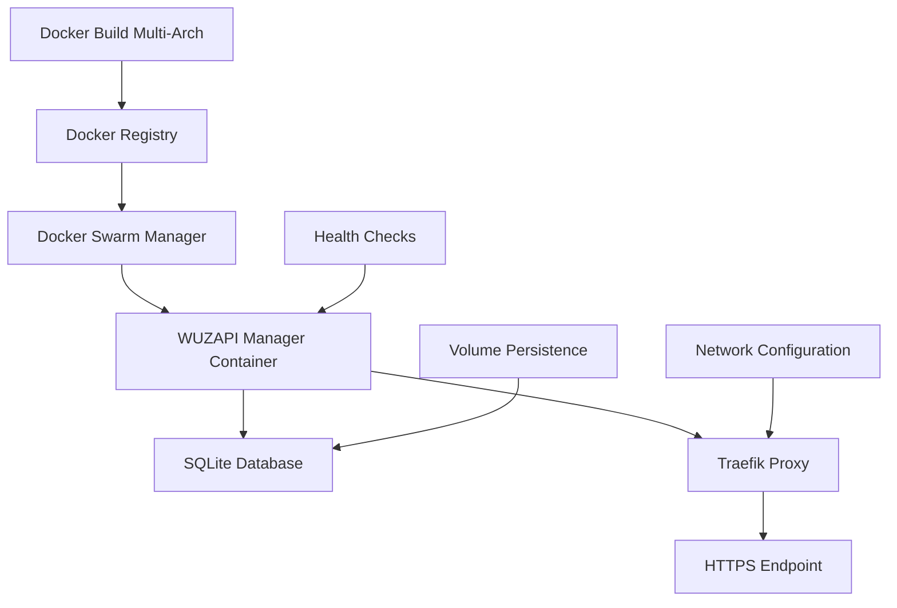

# Design Document

## Overview

O design da solução foca em identificar e corrigir os problemas específicos que impedem o Docker Swarm de funcionar corretamente. A abordagem será diagnóstica primeiro, seguida de correções incrementais nos componentes: build multi-arquitetura, configuração do stack, health checks, e persistência de dados.

## Architecture



## Components and Interfaces

### 1. Multi-Architecture Build System
- **Dockerfile Optimization**: Garantir compatibilidade ARM64/AMD64
- **Build Process**: Script automatizado para build e push
- **Registry Management**: Versionamento adequado das imagens

### 2. Docker Swarm Stack Configuration
- **Service Definition**: Configuração otimizada para SQLite
- **Network Setup**: Rede externa correta para Traefik
- **Volume Management**: Persistência adequada de dados
- **Resource Limits**: Limites apropriados para o ambiente

### 3. Health Check System
- **Application Health**: Endpoint `/health` funcional
- **Database Health**: Verificação de conectividade SQLite
- **Traefik Integration**: Health checks via proxy

### 4. SQLite Configuration
- **WAL Mode**: Configuração otimizada para containers
- **File Permissions**: Permissões adequadas no volume
- **Backup Strategy**: Estratégia de backup automático

## Data Models

### Stack Configuration Model
```yaml
version: "3.8"
services:
  wuzapi-manager:
    image: heltonfraga/wuzapi-manager:latest
    environment:
      # Configurações otimizadas
    volumes:
      # Volumes persistentes
    deploy:
      # Configurações de deployment
    healthcheck:
      # Health check robusto
```

### Build Configuration Model
```bash
docker buildx build \
  --platform linux/amd64,linux/arm64 \
  --tag heltonfraga/wuzapi-manager:latest \
  --tag heltonfraga/wuzapi-manager:v1.2.3 \
  --push .
```

## Error Handling

### 1. Build Failures
- **Multi-arch Compatibility**: Verificar dependências específicas de arquitetura
- **Layer Caching**: Otimizar cache de layers para builds mais rápidos
- **Registry Authentication**: Validar credenciais do Docker Hub

### 2. Deployment Failures
- **Network Issues**: Verificar se a rede `network_public` existe
- **Volume Issues**: Validar permissões e paths dos volumes
- **Resource Constraints**: Ajustar limites de CPU/memória

### 3. Runtime Failures
- **SQLite Lock Issues**: Configurar timeouts adequados
- **Health Check Failures**: Implementar retry logic
- **Traefik Routing**: Validar labels e configurações

### 4. Diagnostic Tools
- **Log Analysis**: Scripts para análise de logs do Swarm
- **Service Inspection**: Comandos para debug de serviços
- **Network Debugging**: Ferramentas para debug de rede

## Testing Strategy

### 1. Local Testing
- **Docker Compose**: Testar localmente antes do Swarm
- **Multi-arch Emulation**: Testar em diferentes arquiteturas
- **Volume Persistence**: Validar persistência de dados

### 2. Staging Environment
- **Swarm Simulation**: Ambiente de teste similar à produção
- **Load Testing**: Testar sob carga
- **Failover Testing**: Testar recuperação de falhas

### 3. Production Validation
- **Health Monitoring**: Monitoramento contínuo
- **Performance Metrics**: Coleta de métricas
- **Backup Validation**: Testar restauração de backups

## Implementation Phases

### Phase 1: Diagnostic
- Analisar logs atuais do Swarm
- Verificar status dos serviços
- Identificar problemas específicos

### Phase 2: Build Fix
- Corrigir Dockerfile para multi-arch
- Implementar build script robusto
- Validar imagem no registry

### Phase 3: Stack Fix
- Corrigir configuração do stack
- Otimizar configurações SQLite
- Ajustar health checks

### Phase 4: Validation
- Testar deployment completo
- Validar funcionalidade
- Implementar monitoramento