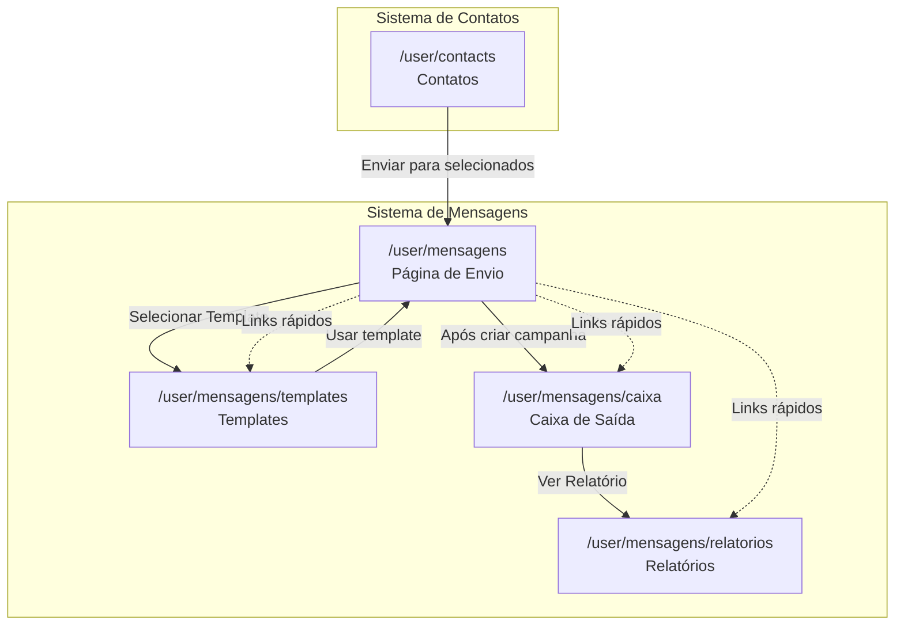
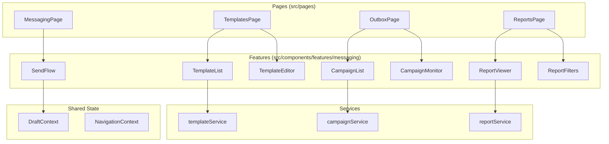

# Design Document

## Overview

Este documento descreve a arquitetura para modularização do sistema de envio de mensagens do WUZAPI Manager. A refatoração transforma a página monolítica `DisparadorWrapper` em 4 páginas independentes conectadas por navegação e estado compartilhado.

### Estrutura Atual vs Proposta

```
ATUAL (Monolítico):
/user/disparador
├── DisparadorWrapper.tsx
│   └── DisparadorList.tsx (6 abas)
│       ├── Informações
│       ├── Envio Único
│       ├── Envio em Massa
│       ├── Agendados
│       ├── Analytics
│       └── Gerenciar Listas

PROPOSTO (Modular):
/user/mensagens           → Página de Envio (fluxo inteligente)
/user/mensagens/templates → Página de Templates
/user/mensagens/caixa     → Caixa de Saída (campanhas)
/user/mensagens/relatorios → Página de Relatórios
```

## Architecture

### Diagrama de Navegação



### Diagrama de Componentes



## Components and Interfaces

### Páginas (src/pages)

| Página | Rota | Responsabilidade |
|--------|------|------------------|
| `MessagingPage` | `/user/mensagens` | Fluxo de envio com seletor de tipo |
| `TemplatesPage` | `/user/mensagens/templates` | CRUD de templates |
| `OutboxPage` | `/user/mensagens/caixa` | Gerenciamento de campanhas |
| `ReportsPage` | `/user/mensagens/relatorios` | Visualização de relatórios |

### Componentes de Feature (src/components/features/messaging)

#### SendFlow
```typescript
interface SendFlowProps {
  preSelectedContacts?: Contact[];
  preSelectedTemplate?: Template;
  instance: string;
  userToken: string;
}

// Estados do fluxo
type SendType = 'manual' | 'group' | 'tag' | 'csv' | 'database';

interface MessageSequenceItem {
  id: string;
  content: string;
  delay?: number;
}

interface SendingWindow {
  startTime: string; // HH:mm
  endTime: string;   // HH:mm
  days: number[];    // 0-6 (domingo-sábado)
}

interface HumanizationConfig {
  delayMin: number;  // segundos (5-300)
  delayMax: number;  // segundos (5-300)
  randomizeOrder: boolean;
}

interface ScheduleConfig {
  scheduledAt: string;
  timezone?: string;
  sendingWindow?: SendingWindow;
}

interface SendFlowState {
  sendType: SendType;
  recipients: Contact[];
  campaignName: string;
  messages: MessageSequenceItem[];
  template?: Template;
  humanization: HumanizationConfig;
  schedule?: ScheduleConfig;
  instance: string;
}
```

#### CampaignConfigStep (novo componente para step 3)
```typescript
interface CampaignConfigStepProps {
  config: SendFlowState;
  onChange: (config: Partial<SendFlowState>) => void;
  userToken: string;
  instance: string;
}

// Componentes internos reutilizados do CampaignBuilder:
// - MessageSequenceEditor
// - SchedulingInput
// - SchedulingWindowInput
// - TemplateManager
```

#### TemplateList / TemplateEditor
```typescript
interface Template {
  id: string;
  name: string;
  content: string;
  variables: string[];
  createdAt: Date;
  updatedAt: Date;
}

interface TemplateListProps {
  onSelect?: (template: Template) => void;
  selectionMode?: boolean;
}

interface TemplateEditorProps {
  template?: Template;
  onSave: (template: Template) => void;
  onCancel: () => void;
}
```

#### CampaignList / CampaignMonitor
```typescript
type CampaignStatus = 'scheduled' | 'running' | 'paused' | 'completed' | 'cancelled';

interface Campaign {
  id: string;
  name: string;
  status: CampaignStatus;
  totalContacts: number;
  sentCount: number;
  errorCount: number;
  scheduledAt?: Date;
  startedAt?: Date;
  completedAt?: Date;
}

interface CampaignListProps {
  filter?: CampaignStatus;
  onViewReport: (campaignId: string) => void;
}

interface CampaignMonitorProps {
  campaignId: string;
  onPause: () => void;
  onResume: () => void;
  onCancel: () => void;
}
```

#### ReportViewer / ReportFilters
```typescript
interface ReportFilters {
  dateRange: { start: Date; end: Date };
  status?: CampaignStatus[];
  campaignType?: string;
}

interface CampaignReport {
  campaign: Campaign;
  metrics: {
    deliveryRate: number;
    errorsByType: Record<string, number>;
    averageSendTime: number;
  };
  contacts: ContactResult[];
}

interface ReportViewerProps {
  campaignId: string;
  onExport: (format: 'csv' | 'pdf') => void;
}
```

### Contexts

#### DraftContext
```typescript
interface DraftState {
  sendFlow?: SendFlowState;
  lastUpdated?: Date;
}

interface DraftContextValue {
  draft: DraftState | null;
  saveDraft: (state: SendFlowState) => void;
  loadDraft: () => SendFlowState | null;
  clearDraft: () => void;
}
```

#### NavigationContext
```typescript
interface NavigationState {
  breadcrumbs: { label: string; path: string }[];
  returnPath?: string;
  highlightedCampaignId?: string;
}
```

### Services (src/services)

#### templateService.ts
```typescript
interface TemplateService {
  list(page: number, limit: number): Promise<PaginatedResult<Template>>;
  get(id: string): Promise<Template>;
  create(data: CreateTemplateDTO): Promise<Template>;
  update(id: string, data: UpdateTemplateDTO): Promise<Template>;
  delete(id: string): Promise<void>;
}
```

#### campaignService.ts (extensão do existente)
```typescript
interface CampaignService {
  // Existentes
  create(data: CreateCampaignDTO): Promise<Campaign>;
  pause(id: string): Promise<void>;
  resume(id: string): Promise<void>;
  cancel(id: string): Promise<void>;
  
  // Novos
  listByStatus(status: CampaignStatus, page: number): Promise<PaginatedResult<Campaign>>;
  getProgress(id: string): Promise<CampaignProgress>;
}
```

#### reportService.ts
```typescript
interface ReportService {
  list(filters: ReportFilters, page: number): Promise<PaginatedResult<CampaignSummary>>;
  getDetail(campaignId: string): Promise<CampaignReport>;
  export(campaignId: string, format: 'csv' | 'pdf'): Promise<Blob>;
}
```

## Data Models

### Tabelas Existentes (sem alteração)
- `message_templates` - Templates de mensagem
- `bulk_campaigns` - Campanhas em massa
- `campaign_contacts` - Contatos de campanhas
- `campaign_audit_logs` - Logs de auditoria

### Novas Tabelas

#### message_drafts
```sql
CREATE TABLE message_drafts (
  id TEXT PRIMARY KEY,
  user_id TEXT NOT NULL,
  draft_type TEXT NOT NULL, -- 'send_flow'
  data TEXT NOT NULL, -- JSON serializado
  created_at DATETIME DEFAULT CURRENT_TIMESTAMP,
  updated_at DATETIME DEFAULT CURRENT_TIMESTAMP,
  FOREIGN KEY (user_id) REFERENCES users(id)
);

CREATE INDEX idx_drafts_user ON message_drafts(user_id);
```

## Correctness Properties

*A property is a characteristic or behavior that should hold true across all valid executions of a system-essentially, a formal statement about what the system should do. Properties serve as the bridge between human-readable specifications and machine-verifiable correctness guarantees.*

### Property 1: Template CRUD Round-Trip
*For any* valid template data, creating a template and then fetching it by ID should return equivalent data (name, content, variables).
**Validates: Requirements 1.2, 1.3**

### Property 2: Template Deletion Removes from List
*For any* existing template, after deletion, listing templates should not include the deleted template.
**Validates: Requirements 1.4**

### Property 3: Campaign Status Categorization
*For any* campaign, the categorization function should place it in exactly one category (Programadas, Em Execução, Finalizadas) based on its status field.
**Validates: Requirements 2.1**

### Property 4: Campaign Progress Counters Consistency
*For any* campaign in execution, the sum of (sentCount + pendingCount + errorCount) should equal totalContacts.
**Validates: Requirements 2.3**

### Property 5: Campaign Metrics Calculation
*For any* completed campaign, the deliveryRate should equal (sentCount / totalContacts) * 100.
**Validates: Requirements 2.4, 3.5**

### Property 6: Campaign State Transitions
*For any* campaign, pausing should change status to 'paused', and resuming a paused campaign should change status to 'running'.
**Validates: Requirements 2.5**

### Property 7: Report Filter Correctness
*For any* set of filters applied, all returned campaigns should match all filter criteria (date range, status, type).
**Validates: Requirements 3.3**

### Property 8: CSV Export Round-Trip
*For any* campaign report, exporting to CSV and parsing the CSV should produce data equivalent to the original report.
**Validates: Requirements 3.4**

### Property 9: Recipient Counter Accuracy
*For any* selection of contacts (manual, group, tag, CSV), the displayed counter should equal the actual number of unique contacts selected.
**Validates: Requirements 4.7**

### Property 10: Groups/Tags Synchronization
*For any* group or tag created in Contacts, it should appear in the send flow selector, and vice-versa.
**Validates: Requirements 6.1, 6.2, 6.3, 6.4**

### Property 11: Draft Persistence Round-Trip
*For any* send flow state, saving as draft and then loading should return equivalent state.
**Validates: Requirements 7.1, 7.2**

### Property 12: Draft Deletion
*For any* existing draft, after explicit discard, loading draft should return null.
**Validates: Requirements 7.3**

### Property 13: Humanization Delay Bounds
*For any* humanization configuration, delayMin should be >= 5, delayMax should be <= 300, and delayMin should be <= delayMax.
**Validates: Requirements 8.5**

### Property 14: Sending Window Validity
*For any* sending window configuration, startTime should be before endTime, and days array should contain valid day numbers (0-6).
**Validates: Requirements 8.8**

### Property 15: Estimated Time Calculation
*For any* campaign configuration with N contacts, M messages, and average delay D, the estimated time should equal N * M * D seconds.
**Validates: Requirements 8.10**

### Property 16: API Groups Fetch
*For any* group selection, the system should fetch real groups from /api/user/contact-groups and return actual contact data.
**Validates: Requirements 9.1, 9.3**

### Property 17: API Tags Fetch
*For any* tag selection, the system should fetch real tags from /api/user/contact-tags and return actual contact data.
**Validates: Requirements 9.2, 9.4**

## Error Handling

### Frontend
- Erros de rede: Toast com opção de retry
- Erros de validação: Highlight no campo + mensagem específica
- Erros de API: Toast com mensagem do backend
- Perda de conexão: Banner persistente + auto-retry

### Backend
- Validação de entrada: 400 Bad Request com detalhes
- Autenticação: 401 Unauthorized
- Autorização: 403 Forbidden
- Recurso não encontrado: 404 Not Found
- Erro interno: 500 com log detalhado

### Transições de Estado de Campanha
```
scheduled → running (início automático ou manual)
running → paused (ação do usuário)
running → completed (todos enviados)
running → cancelled (ação do usuário)
paused → running (retomada)
paused → cancelled (ação do usuário)
```

## Testing Strategy

### Unit Tests
- Funções de cálculo de métricas
- Funções de categorização de campanhas
- Funções de validação de templates
- Funções de parsing de CSV

### Property-Based Tests
- Biblioteca: **fast-check** (já utilizada no projeto)
- Mínimo de 100 iterações por propriedade
- Cada propriedade implementada em arquivo separado com tag de referência

**Formato de tag obrigatório:**
```typescript
// **Feature: messaging-system-modularization, Property 1: Template CRUD Round-Trip**
```

### Integration Tests
- Fluxo completo de criação de campanha
- Navegação entre módulos com passagem de estado
- Persistência e restauração de rascunhos

### E2E Tests (Cypress)
- Fluxo de envio manual
- Fluxo de envio por grupo
- Gerenciamento de templates
- Visualização de relatórios
