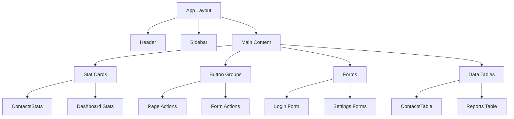

# Design Document: Mobile Responsiveness Fix

## Overview

Este documento descreve a arquitetura e estratégia de implementação para corrigir problemas de responsividade mobile no WUZAPI Manager. O sistema atualmente apresenta overflow horizontal e conteúdo cortado em dispositivos móveis (< 768px). A solução utiliza padrões CSS mobile-first com Tailwind CSS, mantendo a compatibilidade total com o layout desktop existente.

### Design Goals

1. **Zero horizontal overflow** em todas as páginas no mobile
2. **Preservação do layout desktop** - nenhuma mudança visual em telas >= 768px
3. **Padrões reutilizáveis** - classes utilitárias consistentes para futuros componentes
4. **Acessibilidade** - touch targets mínimos de 44x44px

## Architecture

### Responsive Strategy

```
┌─────────────────────────────────────────────────────────────┐
│                    Viewport Width                            │
├─────────────────────────────────────────────────────────────┤
│  < 768px (Mobile)          │  >= 768px (Desktop)            │
├─────────────────────────────────────────────────────────────┤
│  - Single column layouts   │  - Multi-column grids          │
│  - Stacked buttons         │  - Horizontal button groups    │
│  - Full-width inputs       │  - Inline form layouts         │
│  - Scrollable tables       │  - Full table display          │
│  - Collapsed sidebar       │  - Expanded sidebar            │
└─────────────────────────────────────────────────────────────┘
```

### Breakpoint System

O projeto já utiliza Tailwind CSS com os seguintes breakpoints:

| Breakpoint | Width | Usage |
|------------|-------|-------|
| `xs` | 475px | Extra small devices (custom) |
| `sm` | 640px | Small devices |
| `md` | 768px | **Mobile/Desktop threshold** |
| `lg` | 1024px | Large devices |
| `xl` | 1280px | Extra large devices |
| `2xl` | 1400px | Container max-width |

O hook `useIsMobile()` já existe em `src/hooks/use-mobile.tsx` e usa 768px como breakpoint, alinhado com `md` do Tailwind.

## Components and Interfaces

### Affected Components



### Responsive Utility Classes

Novas classes utilitárias a serem aplicadas consistentemente:

```typescript
// Container base para páginas
const pageContainerClasses = "w-full max-w-full overflow-x-hidden px-4 md:px-6"

// Grid responsivo para stat cards
const statsGridClasses = "grid gap-4 grid-cols-1 md:grid-cols-2 lg:grid-cols-4"

// Button group responsivo
const buttonGroupClasses = "flex flex-col sm:flex-row flex-wrap gap-2"

// Table container com scroll horizontal
const tableContainerClasses = "w-full overflow-x-auto"

// Form input full-width no mobile
const formInputClasses = "w-full"

// Touch target mínimo
const touchTargetClasses = "min-h-[44px] min-w-[44px]"
```

### Component Modifications

#### 1. ContactsStats (`src/components/contacts/ContactsStats.tsx`)

**Current:**
```tsx
<div className="grid gap-4 md:grid-cols-2 lg:grid-cols-4">
```

**Updated:**
```tsx
<div className="grid gap-4 grid-cols-1 md:grid-cols-2 lg:grid-cols-4">
```

**Rationale:** Adicionar `grid-cols-1` explícito garante single-column no mobile.

#### 2. Page Headers with Actions

**Pattern:**
```tsx
<div className="flex flex-col sm:flex-row flex-wrap items-start sm:items-center justify-between gap-4">
  <div>{/* Title and description */}</div>
  <div className="flex flex-col sm:flex-row flex-wrap gap-2 w-full sm:w-auto">
    {/* Action buttons */}
  </div>
</div>
```

#### 3. Data Tables

**Pattern:**
```tsx
<div className="w-full overflow-x-auto -mx-4 px-4 md:mx-0 md:px-0">
  <Table className="min-w-[600px]">
    {/* Table content */}
  </Table>
</div>
```

**Rationale:** Negative margin + padding permite scroll edge-to-edge no mobile enquanto mantém padding visual.

#### 4. Form Layouts

**Pattern:**
```tsx
<div className="space-y-4">
  <div className="flex flex-col gap-2">
    <Label htmlFor="field">Label</Label>
    <Input id="field" className="w-full" />
  </div>
</div>
```

#### 5. Data Tables with Column Priority

**Pattern:**
```tsx
<div className="w-full overflow-x-auto -mx-4 px-4 md:mx-0 md:px-0">
  <Table className="min-w-[600px]">
    <TableHeader>
      <TableRow>
        {/* Essential columns first - always visible initially */}
        <TableHead className="sticky left-0 bg-background">Name</TableHead>
        <TableHead>Status</TableHead>
        {/* Secondary columns - require scroll */}
        <TableHead>Created</TableHead>
        <TableHead>Actions</TableHead>
      </TableRow>
    </TableHeader>
    {/* Table body */}
  </Table>
</div>
```

**Rationale:** Essential columns (identifiers, status) are positioned first so they're visible without scrolling. The first column can optionally use `sticky left-0` to remain visible during horizontal scroll.

### Developer Patterns for Consistent Responsiveness

Para garantir que futuros componentes sigam automaticamente o design mobile-first (Requirement 7):

#### Page Container Pattern

**SEMPRE aplicar em containers de página:**
```tsx
// ✅ Correto
<div className="w-full max-w-full overflow-x-hidden px-4 md:px-6">
  {/* Page content */}
</div>

// ❌ Evitar
<div className="px-6">  {/* Missing overflow control */}
  {/* Page content */}
</div>
```

#### Flex Layout Pattern

**SEMPRE incluir flex-wrap em grupos de elementos:**
```tsx
// ✅ Correto - button groups
<div className="flex flex-col sm:flex-row flex-wrap gap-2">
  <Button>Action 1</Button>
  <Button>Action 2</Button>
</div>

// ✅ Correto - card grids
<div className="grid gap-4 grid-cols-1 md:grid-cols-2 lg:grid-cols-4">
  {cards}
</div>

// ❌ Evitar
<div className="flex gap-2">  {/* Missing flex-wrap, will overflow */}
  <Button>Action 1</Button>
  <Button>Action 2</Button>
</div>
```

#### Width Definition Pattern

**PREFERIR unidades relativas:**
```tsx
// ✅ Correto
<Input className="w-full" />
<Card className="w-full md:w-1/2" />

// ❌ Evitar em mobile
<Input className="w-[400px]" />  {/* Fixed width causes overflow */}
```

#### Tailwind Breakpoint Consistency

**SEMPRE usar breakpoints do Tailwind consistentemente:**
```tsx
// ✅ Correto - mobile-first approach
className="flex-col md:flex-row"      // Stack on mobile, row on desktop
className="grid-cols-1 md:grid-cols-2" // Single column mobile, 2 on desktop
className="px-4 md:px-6"              // Less padding mobile, more desktop

// ❌ Evitar - desktop-first (inverted logic)
className="flex-row md:flex-col"      // Confusing, breaks convention
```

## Data Models

Não há mudanças em modelos de dados. Esta feature é puramente de apresentação/CSS.

## Correctness Properties

*A property is a characteristic or behavior that should hold true across all valid executions of a system-essentially, a formal statement about what the system should do. Properties serve as the bridge between human-readable specifications and machine-verifiable correctness guarantees.*

### Property 1: No Horizontal Page Overflow in Mobile View

*For any* page rendered at viewport width < 768px, the document's scrollWidth SHALL equal its clientWidth (no horizontal scrollbar).

**Validates: Requirements 1.1, 1.2, 6.1, 6.3**

### Property 2: Desktop Layout Regression

*For any* page rendered at viewport width >= 768px, the visual layout SHALL match the baseline layout captured before mobile fixes were applied.

**Validates: Requirements 1.4, 2.4, 3.4, 4.4, 5.4, 6.4**

### Property 3: Button Groups Wrap in Mobile

*For any* button group container in mobile view, all buttons SHALL be positioned within the viewport width, either stacked vertically or wrapped to new lines.

**Validates: Requirements 2.1, 2.2**

### Property 4: Button Text Visibility

*For any* button element in mobile view, the full text content SHALL be visible without truncation (element's scrollWidth equals its clientWidth).

**Validates: Requirements 2.3**

### Property 5: Stat Cards Single Column in Mobile

*For any* stat card grid in mobile view, cards SHALL be arranged in a single column (each card's left edge aligns with container's left edge).

**Validates: Requirements 3.1, 3.2**

### Property 6: Minimum Edge Padding

*For any* content container in mobile view, the horizontal padding from viewport edges SHALL be at least 16px.

**Validates: Requirements 3.3**

### Property 7: Header Viewport Fit

*For any* header element in mobile view, its total width (including children) SHALL not exceed the viewport width.

**Validates: Requirements 4.1**

### Property 8: Main Content Expansion

*For any* page with collapsed sidebar in mobile view, the main content area SHALL expand to use the full available viewport width minus padding.

**Validates: Requirements 4.2**

### Property 9: Touch Target Minimum Size

*For any* interactive element (button, link, input) in mobile view, the element's clickable area SHALL be at least 44x44 pixels.

**Validates: Requirements 4.3, 5.3**

### Property 10: Form Inputs Full Width

*For any* form input in mobile view, the input's width SHALL equal its container's width minus horizontal padding.

**Validates: Requirements 5.1**

### Property 11: Form Labels Stack Above Inputs

*For any* form field with a label in mobile view, the label's bottom edge SHALL be above the input's top edge (vertical stacking).

**Validates: Requirements 5.2**

### Property 12: Content Vertical Wrapping

*For any* flex container with content exceeding available width in mobile view, child elements SHALL wrap to new lines rather than overflow horizontally.

**Validates: Requirements 1.3**

### Property 13: Table Essential Columns Visibility

*For any* data table in mobile view, the first column (essential identifier) SHALL be visible without horizontal scrolling (column's left edge >= 0 relative to viewport).

**Validates: Requirements 6.2**

### Property 14: Responsive Class Consistency

*For any* page container component, the element SHALL have both `max-w-full` and `overflow-x-hidden` classes applied (or equivalent Tailwind utilities).

**Validates: Requirements 7.2**

### Property 15: Flex Wrap Application

*For any* flex container used for button groups or card layouts, the element SHALL have `flex-wrap` class applied.

**Validates: Requirements 7.3**

## Error Handling

### CSS Fallbacks

Para browsers que não suportam certas propriedades CSS modernas:

```css
/* Fallback para overflow-x-hidden */
.page-container {
  overflow: hidden; /* Fallback */
  overflow-x: hidden; /* Modern */
}

/* Fallback para min() */
.responsive-width {
  width: 100%;
  max-width: 100vw;
}
```

### Edge Cases

1. **Conteúdo muito longo sem quebra:** Aplicar `break-words` ou `overflow-wrap: break-word`
2. **Imagens grandes:** Usar `max-w-full` em todas as imagens
3. **Tabelas com muitas colunas:** Scroll horizontal contido no container da tabela

## Testing Strategy

### Dual Testing Approach

Esta feature requer tanto testes unitários quanto property-based tests para garantir cobertura completa.

### Unit Tests

Testes específicos para verificar comportamentos concretos:

1. **Viewport resize behavior:** Verificar que `useIsMobile()` retorna valores corretos
2. **CSS class application:** Verificar que classes responsivas são aplicadas corretamente
3. **Component rendering:** Verificar que componentes renderizam sem erros em diferentes viewports

### Property-Based Tests

Utilizando **Vitest** com **fast-check** para property-based testing.

**Configuração:**
```typescript
import * as fc from 'fast-check'
import { describe, it, expect } from 'vitest'
```

**Estratégia de Geração:**

1. **Viewport widths:** Gerar larguras entre 320px e 1920px
2. **Content variations:** Gerar diferentes quantidades de botões, cards, e itens de tabela
3. **Text lengths:** Gerar textos de diferentes tamanhos para testar truncation

**Propriedades a Testar:**

1. **No overflow property:** Para qualquer viewport < 768px, scrollWidth === clientWidth
2. **Touch target property:** Para qualquer elemento interativo, width >= 44 && height >= 44
3. **Single column property:** Para qualquer grid de stats em mobile, todos os cards têm mesmo X offset

### Test Implementation Notes

- Property-based tests DEVEM rodar no mínimo 100 iterações
- Cada property-based test DEVE ser anotado com: `**Feature: mobile-responsiveness-fix, Property {number}: {property_text}**`
- Testes visuais podem usar Cypress para verificar layouts em diferentes viewports
- Testes de regressão desktop devem comparar screenshots antes/depois

### Test Files Structure

```
src/
├── components/
│   └── contacts/
│       └── ContactsStats.test.tsx  # Unit tests
├── test/
│   └── responsive/
│       ├── overflow.property.test.tsx        # Property 1
│       ├── touch-targets.property.test.tsx   # Property 9
│       ├── layout.property.test.tsx          # Properties 3, 5, 11, 12
│       ├── tables.property.test.tsx          # Property 13
│       └── patterns.property.test.tsx        # Properties 14, 15
cypress/
└── e2e/
    └── mobile-responsiveness.cy.ts           # Visual regression tests (Property 2)
```

### Cypress E2E Tests

Para testes de regressão visual (Property 2 - Desktop Layout Regression):

```typescript
// cypress/e2e/mobile-responsiveness.cy.ts
describe('Mobile Responsiveness', () => {
  const mobileViewport = { width: 375, height: 667 }  // iPhone SE
  const desktopViewport = { width: 1280, height: 720 }

  beforeEach(() => {
    cy.login() // Use existing auth command
  })

  it('should have no horizontal overflow on mobile', () => {
    cy.viewport(mobileViewport.width, mobileViewport.height)
    cy.visit('/dashboard')
    cy.window().then((win) => {
      expect(win.document.documentElement.scrollWidth)
        .to.equal(win.document.documentElement.clientWidth)
    })
  })

  it('should maintain desktop layout', () => {
    cy.viewport(desktopViewport.width, desktopViewport.height)
    cy.visit('/dashboard')
    // Visual regression with Percy or similar
    cy.percySnapshot('Dashboard - Desktop')
  })
})
```

### Property Test Example

```typescript
// src/test/responsive/overflow.property.test.tsx
import * as fc from 'fast-check'
import { describe, it, expect } from 'vitest'
import { render } from '@testing-library/react'

/**
 * **Feature: mobile-responsiveness-fix, Property 1: No Horizontal Page Overflow in Mobile View**
 * **Validates: Requirements 1.1, 1.2, 6.1, 6.3**
 */
describe('Property 1: No Horizontal Page Overflow', () => {
  it('should have no horizontal overflow for any mobile viewport width', () => {
    fc.assert(
      fc.property(
        fc.integer({ min: 320, max: 767 }), // Mobile viewport range
        (viewportWidth) => {
          // Set viewport width
          window.innerWidth = viewportWidth
          
          // Render component
          const { container } = render(<PageContainer />)
          
          // Assert no overflow
          const scrollWidth = container.scrollWidth
          const clientWidth = container.clientWidth
          
          return scrollWidth <= clientWidth
        }
      ),
      { numRuns: 100 }
    )
  })
})
```