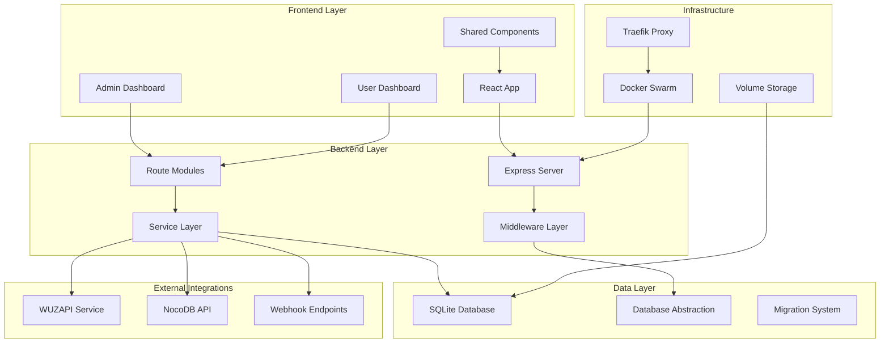

# Design de Arquitetura e Organização do Projeto WUZAPI Manager

## Overview

O WUZAPI Manager segue uma arquitetura em camadas bem definida, com separação clara de responsabilidades entre frontend, backend e integrações externas. O sistema é projetado para ser modular, escalável e fácil de manter, permitindo que desenvolvedores implementem novas funcionalidades seguindo padrões consistentes.

## Arquitetura Geral

### Diagrama de Arquitetura



## Componentes e Interfaces

### 1. Frontend Architecture (React/TypeScript)

#### Estrutura de Diretórios
```
src/
├── components/           # Componentes organizados por domínio
│   ├── admin/           # Componentes específicos do admin
│   ├── user/            # Componentes específicos do usuário
│   ├── ui/              # Componentes base (shadcn/ui)
│   ├── ui-custom/       # Componentes customizados
│   └── shared/          # Componentes compartilhados
├── contexts/            # Contextos React para estado global
├── hooks/               # Custom hooks reutilizáveis
├── lib/                 # Utilitários e configurações
├── pages/               # Páginas principais da aplicação
├── services/            # Clientes de API e serviços
└── types/               # Definições de tipos TypeScript
```

#### Padrões de Componentes
- **Atomic Design**: Componentes organizados em átomos, moléculas e organismos
- **Domain-Driven**: Agrupamento por domínio funcional (admin, user)
- **Composition Pattern**: Uso de composição para flexibilidade
- **Custom Hooks**: Lógica reutilizável extraída em hooks

#### Gerenciamento de Estado
- **React Context**: Para estado global (Auth, Branding)
- **React Query**: Para cache e sincronização de dados da API
- **Local State**: Para estado específico de componentes

### 2. Backend Architecture (Node.js/Express)

#### Estrutura Modular
```
server/
├── index.js             # Servidor principal e configuração
├── database.js          # Camada de abstração do banco
├── config/              # Configurações (SQLite, etc.)
├── middleware/          # Middlewares reutilizáveis
│   ├── corsHandler.js   # Configuração CORS
│   └── errorHandler.js  # Tratamento de erros
├── routes/              # Rotas organizadas por domínio
│   ├── adminRoutes.js   # Rotas administrativas
│   ├── sessionRoutes.js # Rotas de sessão/usuário
│   └── brandingRoutes.js# Rotas de branding
├── validators/          # Validadores de dados
├── utils/               # Utilitários e helpers
└── tests/               # Testes automatizados
```

#### Padrões de API
- **RESTful Design**: Endpoints seguem convenções REST
- **Middleware Chain**: Validação → Autenticação → Lógica → Resposta
- **Error Handling**: Tratamento centralizado de erros
- **Logging**: Logging estruturado com contexto

#### Camada de Dados
- **Database Class**: Abstração para operações SQLite
- **Migration System**: Versionamento e evolução do schema
- **Connection Pooling**: Gerenciamento eficiente de conexões
- **Backup Strategy**: Backup automático e manual

### 3. Integration Layer

#### WUZAPI Client
```typescript
class WuzAPIClient {
  // Métodos para gerenciar usuários
  async listUsers(): Promise<WuzAPIResponse<User[]>>
  async createUser(userData: CreateUserPayload): Promise<WuzAPIResponse<User>>
  async deleteUser(userId: string): Promise<WuzAPIResponse>
  
  // Métodos para mensagens
  async sendTextMessage(payload: SendTextPayload, userToken: string): Promise<WuzAPIResponse>
  async sendMediaMessage(payload: SendMediaPayload, userToken: string): Promise<WuzAPIResponse>
  
  // Métodos para webhook
  async setWebhook(config: WebhookConfig, userToken: string): Promise<WuzAPIResponse>
  async getWebhook(userToken: string): Promise<WuzAPIResponse<WebhookConfig>>
}
```

#### NocoDB Integration
```typescript
interface NocoDBConnection {
  host: string;
  token: string;
  projectId: string;
  tableId: string;
  userLinkField?: string;
}

class NocoDBService {
  async testConnection(connection: NocoDBConnection): Promise<boolean>
  async fetchTableData(connection: NocoDBConnection): Promise<any[]>
  async createRecord(connection: NocoDBConnection, data: any): Promise<any>
  async updateRecord(connection: NocoDBConnection, recordId: string, data: any): Promise<any>
}
```

## Data Models

### Core Entities

#### User Management
```sql
-- Usuários são gerenciados via WUZAPI, mas conexões de banco são locais
CREATE TABLE database_connections (
  id INTEGER PRIMARY KEY AUTOINCREMENT,
  name TEXT NOT NULL,
  type TEXT NOT NULL CHECK(type IN ('POSTGRES', 'MYSQL', 'NOCODB', 'API', 'SQLITE')),
  host TEXT NOT NULL,
  port INTEGER DEFAULT 5432,
  database_name TEXT,
  username TEXT,
  password TEXT,
  table_name TEXT,
  status TEXT DEFAULT 'disconnected',
  assigned_users TEXT DEFAULT '[]', -- JSON array de user tokens
  nocodb_token TEXT,
  nocodb_project_id TEXT,
  nocodb_table_id TEXT,
  user_link_field TEXT,
  field_mappings TEXT DEFAULT '[]', -- JSON array de mapeamentos
  created_at DATETIME DEFAULT CURRENT_TIMESTAMP,
  updated_at DATETIME DEFAULT CURRENT_TIMESTAMP
);
```

#### Branding Configuration
```sql
CREATE TABLE branding_config (
  id INTEGER PRIMARY KEY AUTOINCREMENT,
  app_name VARCHAR(50) NOT NULL DEFAULT 'WUZAPI',
  logo_url TEXT,
  primary_color VARCHAR(7),
  secondary_color VARCHAR(7),
  created_at DATETIME DEFAULT CURRENT_TIMESTAMP,
  updated_at DATETIME DEFAULT CURRENT_TIMESTAMP
);
```

#### System Metadata
```sql
CREATE TABLE system_metadata (
  key TEXT PRIMARY KEY,
  value TEXT NOT NULL,
  created_at DATETIME DEFAULT CURRENT_TIMESTAMP,
  updated_at DATETIME DEFAULT CURRENT_TIMESTAMP
);
```

## Error Handling

### Frontend Error Handling
```typescript
// Interceptor global para tratamento de erros
axios.interceptors.response.use(
  (response) => response,
  (error) => {
    const message = getErrorMessage(error);
    toast.error('Erro', { description: message });
    return Promise.reject(error);
  }
);

// Hook para tratamento de erros em componentes
const useErrorHandler = () => {
  const handleError = useCallback((error: Error, context?: string) => {
    console.error(`Error in ${context}:`, error);
    toast.error('Erro', { description: error.message });
  }, []);
  
  return { handleError };
};
```

### Backend Error Handling
```javascript
// Middleware centralizado de tratamento de erros
class ErrorHandler {
  handleError(error, req, res, next) {
    const statusCode = this.getStatusCode(error);
    const message = this.getErrorMessage(error);
    
    logger.error('API Error', {
      url: req.url,
      method: req.method,
      error: error.message,
      stack: error.stack,
      user_agent: req.get('User-Agent'),
      ip: req.ip
    });
    
    res.status(statusCode).json({
      success: false,
      error: message,
      code: statusCode,
      timestamp: new Date().toISOString()
    });
  }
}
```

## Testing Strategy

### Frontend Testing
- **Unit Tests**: Jest + React Testing Library para componentes
- **Integration Tests**: Cypress para fluxos end-to-end
- **Component Tests**: Storybook para documentação visual
- **Type Safety**: TypeScript para validação em tempo de compilação

### Backend Testing
- **Unit Tests**: Node.js test runner para funções individuais
- **Integration Tests**: Testes de API com banco de dados em memória
- **Database Tests**: Testes de migração e integridade
- **External API Tests**: Mocks para WUZAPI e NocoDB

### Test Structure
```
tests/
├── unit/                # Testes unitários
├── integration/         # Testes de integração
├── e2e/                 # Testes end-to-end
├── fixtures/            # Dados de teste
└── helpers/             # Utilitários de teste
```

## Security Considerations

### Authentication & Authorization
- **Token-based Auth**: Tokens WUZAPI para autenticação
- **Role-based Access**: Admin vs User permissions
- **Token Validation**: Validação via WUZAPI service
- **Session Management**: Tokens armazenados de forma segura

### Data Protection
- **Input Validation**: Validação rigorosa de entrada
- **SQL Injection Prevention**: Prepared statements
- **CORS Configuration**: Configuração restritiva de CORS
- **Environment Variables**: Credenciais em variáveis de ambiente

### API Security
```javascript
// Middleware de validação de token
const validateToken = async (req, res, next) => {
  const token = req.headers.authorization || req.headers.token;
  
  if (!token) {
    return res.status(401).json({ error: 'Token required' });
  }
  
  try {
    const validation = await wuzapiClient.validateToken(token);
    if (!validation.isValid) {
      return res.status(401).json({ error: 'Invalid token' });
    }
    
    req.userToken = token;
    next();
  } catch (error) {
    return res.status(500).json({ error: 'Token validation failed' });
  }
};
```

## Performance Optimization

### Frontend Performance
- **Code Splitting**: Lazy loading de rotas e componentes
- **Bundle Optimization**: Tree shaking e minificação
- **Caching Strategy**: React Query para cache de dados
- **Image Optimization**: Lazy loading e compressão

### Backend Performance
- **Database Optimization**: Índices e queries otimizadas
- **Connection Pooling**: Reutilização de conexões
- **Caching**: Cache em memória para dados frequentes
- **Request Optimization**: Debouncing e throttling

### SQLite Optimization
```javascript
// Configurações otimizadas para produção
const sqliteConfig = {
  WAL_MODE: true,           // Write-Ahead Logging
  CACHE_SIZE: 4000,         // 4MB cache
  SYNCHRONOUS: 'NORMAL',    // Balanceamento performance/segurança
  FOREIGN_KEYS: true,       // Integridade referencial
  TIMEOUT: 5000            // 5s timeout
};
```

## Deployment Architecture

### Docker Swarm Configuration
```yaml
version: '3.8'
services:
  wuzapi-manager:
    image: wuzapi-manager:latest
    deploy:
      replicas: 1
      placement:
        constraints:
          - node.role == manager
      resources:
        limits:
          cpus: '1.0'
          memory: 512M
    volumes:
      - wuzapi-data:/app/data
    environment:
      - NODE_ENV=production
      - SQLITE_DB_PATH=/app/data/wuzapi.db
    networks:
      - network_public
    labels:
      - traefik.enable=true
      - traefik.http.routers.wuzapi-manager.rule=Host(`your-domain.com`)
      - traefik.http.services.wuzapi-manager.loadbalancer.server.port=3001
```

### Infrastructure Components
- **Traefik**: Reverse proxy com SSL automático
- **Docker Swarm**: Orquestração e alta disponibilidade
- **Volume Persistence**: Dados persistentes via Docker volumes
- **Health Checks**: Monitoramento automático de saúde

## Monitoring and Logging

### Structured Logging
```javascript
const logger = {
  info: (message, context = {}) => {
    console.log(JSON.stringify({
      level: 'info',
      message,
      timestamp: new Date().toISOString(),
      ...context
    }));
  },
  
  error: (message, context = {}) => {
    console.error(JSON.stringify({
      level: 'error',
      message,
      timestamp: new Date().toISOString(),
      ...context
    }));
  }
};
```

### Health Monitoring
- **Health Endpoints**: `/health` para verificação de status
- **Database Health**: Verificação de conectividade SQLite
- **External Services**: Monitoramento de WUZAPI e NocoDB
- **Performance Metrics**: Tempo de resposta e uso de recursos

## Development Workflow

### Code Organization Patterns
1. **Feature-First**: Organizar código por funcionalidade
2. **Separation of Concerns**: Cada módulo tem responsabilidade única
3. **Dependency Injection**: Facilitar testes e manutenção
4. **Configuration Management**: Centralizar configurações

### Development Guidelines
1. **TypeScript First**: Tipagem forte em todo o frontend
2. **ESLint + Prettier**: Formatação e qualidade de código consistente
3. **Conventional Commits**: Padronização de mensagens de commit
4. **Pull Request Reviews**: Revisão obrigatória de código

### Environment Management
```bash
# Desenvolvimento
npm run dev:full          # Frontend + Backend
npm run server:dev        # Apenas backend
npm run dev              # Apenas frontend

# Produção
npm run build:production  # Build otimizado
npm run deploy:build     # Build + preparação para deploy
./deploy-swarm.sh all    # Deploy completo
```