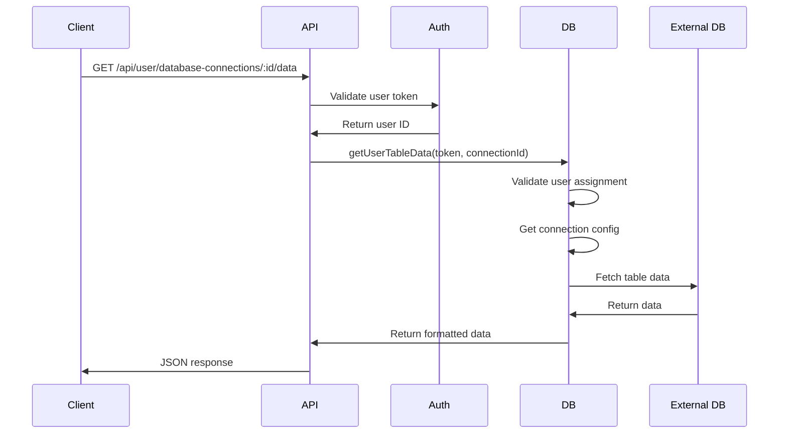

# Design Document

## Overview

The user table data access feature implements a secure data retrieval system that allows authenticated users to fetch data from their assigned database connections. The design follows the existing architecture patterns in the WUZApi Manager system, extending the Database class with new functionality and maintaining consistency with current authentication and error handling approaches.

## Architecture

The implementation follows a layered architecture:

1. **API Layer**: Express.js endpoint that handles HTTP requests and responses
2. **Authentication Layer**: Token validation through WuzAPI integration
3. **Permission Layer**: User-connection assignment validation
4. **Data Access Layer**: Database-specific data retrieval logic
5. **Response Layer**: Consistent JSON formatting and error handling



## Components and Interfaces

### Database Class Extension

The `getUserTableData` method will be added to the existing Database class:

```javascript
async getUserTableData(userToken, connectionId) {
  // 1. Validate user and get user ID from WuzAPI
  // 2. Get connection configuration
  // 3. Validate user assignment to connection
  // 4. Retrieve data based on connection type
  // 5. Format and return data
}
```

### Connection Type Handlers

Each database type requires specific handling:

- **SQLite**: Direct SQL queries using existing db connection
- **NocoDB**: HTTP requests to NocoDB API with token authentication
- **MySQL/PostgreSQL**: New connection establishment with provided credentials
- **API**: HTTP requests to external API endpoints

### User Validation Service

Reuse existing WuzAPI integration pattern:

```javascript
async validateUserAndGetId(userToken) {
  // Make request to WuzAPI /session/status endpoint
  // Extract user ID from response
  // Handle authentication errors
}
```

## Data Models

### Input Parameters
```typescript
interface GetUserTableDataParams {
  userToken: string;    // JWT token from WuzAPI
  connectionId: number; // Database connection ID
}
```

### Response Format
```typescript
interface TableDataResponse {
  success: boolean;
  data: Array<Record<string, any>>;
  metadata?: {
    totalRecords: number;
    connectionType: string;
    tableName: string;
  };
}
```

### Error Response Format
```typescript
interface ErrorResponse {
  success: false;
  error: string;
  message: string;
  details?: any;
}
```

## Error Handling

### Error Types and HTTP Status Codes

1. **Authentication Errors (401)**
   - Invalid or expired token
   - WuzAPI service unavailable

2. **Authorization Errors (403)**
   - User not assigned to connection
   - Insufficient permissions

3. **Not Found Errors (404)**
   - Connection ID does not exist
   - Table not found in database

4. **Server Errors (500)**
   - Database connection failures
   - Query execution errors
   - Unexpected system errors

### Error Logging Strategy

- Log all data access attempts with user ID and connection ID
- Log detailed error information for debugging
- Sanitize sensitive information in client responses
- Use existing logger utility for consistency

## Testing Strategy

### Unit Tests
- Test getUserTableData method with various input scenarios
- Mock WuzAPI responses for user validation
- Test each database type handler independently
- Verify error handling for all error conditions

### Integration Tests
- Test complete API endpoint flow
- Verify authentication integration with WuzAPI
- Test database connections for each supported type
- Validate response formatting and error handling

### Security Tests
- Verify unauthorized access is properly blocked
- Test token validation edge cases
- Ensure no data leakage between users
- Validate SQL injection protection

## Implementation Details

### Database Connection Management

For external databases (MySQL/PostgreSQL), implement connection pooling:

```javascript
async connectToExternalDatabase(connection) {
  // Create connection pool if not exists
  // Validate connection parameters
  // Test connection before use
  // Handle connection errors gracefully
}
```

### Data Formatting

Standardize data format across all database types:

```javascript
formatTableData(rawData, connectionType) {
  // Convert database-specific formats to standard JSON
  // Handle null values consistently
  // Apply data type conversions if needed
  // Add metadata information
}
```

### Performance Considerations

- Implement query result limiting (default 100 records)
- Add pagination support for large datasets
- Cache connection configurations to reduce database queries
- Use connection pooling for external databases

### Security Measures

- Validate all input parameters
- Sanitize SQL queries to prevent injection
- Use parameterized queries where possible
- Implement rate limiting for data access endpoints
- Log all access attempts for audit trails

## Configuration

### Environment Variables

```bash
# External database connection timeouts
DB_CONNECTION_TIMEOUT=10000

# Data retrieval limits
MAX_RECORDS_PER_REQUEST=1000
DEFAULT_RECORDS_LIMIT=100

# WuzAPI integration
WUZAPI_BASE_URL=https://wzapi.wasend.com.br
WUZAPI_TIMEOUT=5000
```

### Database Schema Updates

No schema changes required - the feature uses existing tables:
- `database_connections`: Connection configurations
- `system_metadata`: System settings (if needed for limits)

## Migration Strategy

### Deployment Steps

1. Add new `getUserTableData` method to Database class
2. Update API endpoint to use async/await pattern
3. Test with existing connections
4. Deploy with feature flag if needed
5. Monitor performance and error rates

### Rollback Plan

- The new functionality is additive and doesn't modify existing code
- Can be disabled by reverting the API endpoint changes
- No database migrations required for rollback

## Monitoring and Observability

### Metrics to Track

- Data retrieval request volume by user and connection
- Response times by database type
- Error rates and types
- Authentication failure rates

### Logging Requirements

- Log all data access requests with user context
- Track query performance for optimization
- Monitor external database connection health
- Alert on authentication service failures