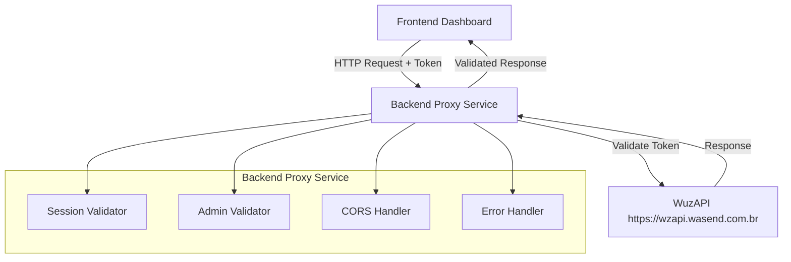

# Design Document

## Overview

O sistema de validação de usuários via API externa implementa um padrão de proxy que encaminha todas as validações de autenticação para a WuzAPI, garantindo que o dashboard não armazene dados sensíveis localmente e sempre tenha informações atualizadas sobre usuários válidos.

A arquitetura segue o princípio de "single source of truth", onde a WuzAPI é a única fonte confiável de dados de usuários, e o dashboard atua apenas como um intermediário que facilita o acesso às funcionalidades.

## Architecture



### Fluxo de Validação

1. **Frontend** envia requisição com token no header `Authorization`
2. **Proxy Service** intercepta a requisição e extrai o token
3. **Session Validator** ou **Admin Validator** faz requisição para WuzAPI
4. **WuzAPI** valida o token e retorna status + dados
5. **Proxy Service** repassa a resposta para o frontend
6. **Error Handler** trata erros e timeouts apropriadamente

## Components and Interfaces

### 1. Session Validator

**Responsabilidade:** Validar tokens de usuários comuns

```typescript
interface SessionValidator {
  validateUserToken(token: string): Promise<SessionValidationResult>
}

interface SessionValidationResult {
  isValid: boolean
  userData?: {
    connected: boolean
    loggedIn: boolean
    jid?: string
  }
  error?: string
}
```

**Endpoint WuzAPI:** `GET /session/status`
- Headers: `Authorization: {token}`
- Timeout: 10 segundos
- Retorna: Status da sessão do usuário

### 2. Admin Validator

**Responsabilidade:** Validar tokens administrativos

```typescript
interface AdminValidator {
  validateAdminToken(token: string): Promise<AdminValidationResult>
}

interface AdminValidationResult {
  isValid: boolean
  users?: Array<WuzAPIUser>
  error?: string
}

interface WuzAPIUser {
  id: string
  name: string
  token: string
  connected: boolean
  loggedIn: boolean
  jid: string
}
```

**Endpoint WuzAPI:** `GET /admin/users`
- Headers: `Authorization: {token}`
- Timeout: 10 segundos
- Retorna: Lista de usuários (confirma permissão admin)

### 3. Proxy Service Routes

**Rota de Validação de Usuário:**
```
GET /api/session/status
Headers: Authorization: {user_token}
```

**Rota de Validação Admin:**
```
GET /api/admin/users  
Headers: Authorization: {admin_token}
```

### 4. CORS Handler

**Configuração de Desenvolvimento:**
```javascript
const corsOptions = {
  origin: ['http://localhost:3000', 'http://localhost:4173'],
  methods: ['GET', 'POST', 'PUT', 'DELETE', 'OPTIONS'],
  allowedHeaders: ['Content-Type', 'Authorization'],
  credentials: true
}
```

**Configuração de Produção:**
```javascript
const corsOptions = {
  origin: process.env.ALLOWED_ORIGINS?.split(',') || false,
  methods: ['GET', 'POST', 'PUT', 'DELETE'],
  allowedHeaders: ['Content-Type', 'Authorization'],
  credentials: true
}
```

## Data Models

### Request Models

```typescript
// Headers de requisição
interface AuthHeaders {
  authorization: string
  'content-type'?: string
}

// Configuração de requisição para WuzAPI
interface WuzAPIRequest {
  url: string
  method: 'GET' | 'POST'
  headers: AuthHeaders
  timeout: number
}
```

### Response Models

```typescript
// Resposta padrão da WuzAPI
interface WuzAPIResponse<T> {
  code: number
  success: boolean
  data?: T
  error?: string
}

// Resposta de status de sessão
interface SessionStatusData {
  Connected: boolean
  LoggedIn: boolean
}

// Resposta de usuários admin
interface AdminUsersData {
  id: string
  name: string
  token: string
  connected: boolean
  loggedIn: boolean
  jid: string
  webhook?: string
  events?: string
}[]
```

### Error Models

```typescript
interface ValidationError {
  code: number
  message: string
  details?: string
  timestamp: string
}

// Tipos de erro
enum ErrorTypes {
  INVALID_TOKEN = 'INVALID_TOKEN',
  SERVICE_UNAVAILABLE = 'SERVICE_UNAVAILABLE', 
  MISSING_TOKEN = 'MISSING_TOKEN',
  TIMEOUT = 'TIMEOUT',
  NETWORK_ERROR = 'NETWORK_ERROR'
}
```

## Error Handling

### 1. Tratamento de Erros da WuzAPI

```typescript
const handleWuzAPIError = (error: AxiosError): ValidationError => {
  if (error.response?.status === 401) {
    return {
      code: 401,
      message: 'Token inválido ou expirado',
      details: 'O token fornecido não é válido na WuzAPI',
      timestamp: new Date().toISOString()
    }
  }
  
  if (error.code === 'ECONNABORTED') {
    return {
      code: 504,
      message: 'Timeout na validação',
      details: 'WuzAPI não respondeu dentro do tempo limite',
      timestamp: new Date().toISOString()
    }
  }
  
  return {
    code: 500,
    message: 'Serviço de validação temporariamente indisponível',
    details: 'Erro ao conectar com a WuzAPI',
    timestamp: new Date().toISOString()
  }
}
```

### 2. Logging de Erros

```typescript
interface LogEntry {
  timestamp: string
  level: 'INFO' | 'WARN' | 'ERROR'
  action: string
  token_prefix: string // Apenas primeiros 8 caracteres
  status_code?: number
  error_message?: string
  response_time_ms: number
}
```

### 3. Códigos de Status HTTP

- **200**: Token válido, dados retornados
- **401**: Token inválido ou expirado
- **400**: Token não fornecido ou formato inválido
- **504**: Timeout na WuzAPI
- **500**: Erro interno ou WuzAPI indisponível

## Testing Strategy

### 1. Testes de Integração

**Cenários de Teste:**
- Token de usuário válido → Deve retornar dados da sessão
- Token de admin válido → Deve retornar lista de usuários
- Token inválido → Deve retornar erro 401
- Token não fornecido → Deve retornar erro 400
- WuzAPI indisponível → Deve retornar erro 500
- Timeout da WuzAPI → Deve retornar erro 504

### 2. Testes de CORS

**Cenários de Teste:**
- Requisição OPTIONS → Deve retornar headers CORS corretos
- Requisição de origem permitida → Deve aceitar
- Requisição de origem não permitida → Deve rejeitar (produção)

### 3. Testes de Performance

**Métricas:**
- Tempo de resposta < 2 segundos (incluindo WuzAPI)
- Timeout configurado em 10 segundos
- Logs de performance para monitoramento

### 4. Testes de Segurança

**Validações:**
- Headers de autorização são obrigatórios
- Tokens não são expostos em logs (apenas prefixo)
- Respostas de erro não vazam informações sensíveis
- CORS configurado adequadamente por ambiente

## Implementation Notes

### 1. Configuração de Ambiente

```bash
# .env.development
WUZAPI_BASE_URL=https://wzapi.wasend.com.br
CORS_ORIGINS=http://localhost:3000,http://localhost:4173
REQUEST_TIMEOUT=10000

# .env.production  
WUZAPI_BASE_URL=https://wzapi.wasend.com.br
CORS_ORIGINS=https://dashboard.exemplo.com
REQUEST_TIMEOUT=10000
```

### 2. Dependências Necessárias

- `axios` - Para requisições HTTP à WuzAPI
- `cors` - Para configuração de CORS
- `express` - Framework web (já existente)

### 3. Estrutura de Arquivos

```
server/
├── validators/
│   ├── sessionValidator.js
│   └── adminValidator.js
├── middleware/
│   ├── corsHandler.js
│   └── errorHandler.js
├── routes/
│   ├── sessionRoutes.js
│   └── adminRoutes.js
└── utils/
    ├── wuzapiClient.js
    └── logger.js
```

### 4. Monitoramento e Observabilidade

- Logs estruturados para todas as validações
- Métricas de tempo de resposta da WuzAPI
- Alertas para alta taxa de erros 401 (possível ataque)
- Dashboard de saúde do serviço de validação