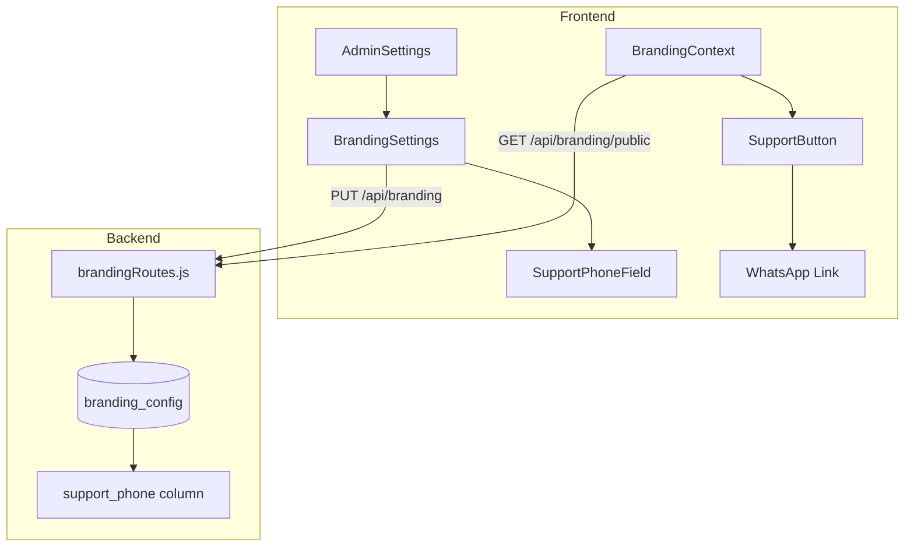

# Design Document: WhatsApp Support Button

## Overview

Este documento descreve o design técnico para implementação de um botão de suporte via WhatsApp no WUZAPI Manager. A funcionalidade permite que administradores configurem um número de telefone de suporte, que será exibido como um botão flutuante em todas as páginas da aplicação.

O botão seguirá o estilo visual da imagem de referência: fundo verde (#25D366 - cor oficial do WhatsApp), ícone do WhatsApp, texto "Suporte", posicionado no canto inferior direito da tela.

## Architecture



A arquitetura segue o padrão existente de branding:
1. **Backend**: Nova coluna `support_phone` na tabela `branding_config`
2. **API**: Endpoints existentes de branding incluem o novo campo
3. **Frontend**: Campo de configuração em BrandingSettings + componente SupportButton global

## Components and Interfaces

### Backend

#### Database Migration
```javascript
// server/migrations/018_add_support_phone.js
// Adiciona coluna support_phone à tabela branding_config
ALTER TABLE branding_config ADD COLUMN support_phone TEXT DEFAULT NULL;
```

#### API Response (updated)
```typescript
interface BrandingConfig {
  id: number;
  appName: string;
  logoUrl: string | null;
  primaryColor: string | null;
  secondaryColor: string | null;
  customHomeHtml: string | null;
  supportPhone: string | null;  // NEW
  createdAt: string;
  updatedAt: string;
}
```

### Frontend

#### SupportButton Component
```typescript
// src/components/shared/SupportButton.tsx
interface SupportButtonProps {
  phoneNumber: string;
}

// Renders a fixed-position button in bottom-right corner
// Opens https://wa.me/{phoneNumber} in new tab on click
```

#### BrandingSettings Update
```typescript
// Add supportPhone field to existing form
interface FormData {
  // ... existing fields
  supportPhone: string;  // NEW
}
```

## Data Models

### Database Schema Update
```sql
-- branding_config table (existing)
ALTER TABLE branding_config 
ADD COLUMN support_phone TEXT DEFAULT NULL;
```

### TypeScript Types
```typescript
// src/types/branding.ts (update)
export interface BrandingConfig {
  // ... existing fields
  supportPhone: string | null;
}

export interface BrandingConfigUpdate {
  // ... existing fields
  supportPhone?: string | null;
}
```

## Correctness Properties

*A property is a characteristic or behavior that should hold true across all valid executions of a system-essentially, a formal statement about what the system should do. Properties serve as the bridge between human-readable specifications and machine-verifiable correctness guarantees.*

### Property 1: Phone number validation accepts only valid formats
*For any* input string, the phone validation function SHALL return true if and only if the string contains only digits and has length between 10 and 15 characters (inclusive).

**Validates: Requirements 1.2, 1.5**

### Property 2: Support phone persistence round-trip
*For any* valid phone number, saving it via the branding API and then retrieving it SHALL return the exact same phone number value.

**Validates: Requirements 1.3**

### Property 3: WhatsApp URL generation
*For any* valid phone number, the generated WhatsApp URL SHALL be exactly `https://wa.me/{phoneNumber}` where phoneNumber is the input with no modifications.

**Validates: Requirements 2.2**

## Error Handling

### Validation Errors
- **Invalid phone format**: Display inline error "Número deve conter apenas dígitos (10-15 caracteres com código do país)"
- **Empty field**: Allow empty/null to disable the support button

### API Errors
- **Network error**: Toast notification with retry option
- **Server error (500)**: Toast notification "Erro ao salvar configurações"

### Edge Cases
- Phone number with spaces/dashes: Strip non-digits before validation
- Phone number too short/long: Reject with specific error message
- Null/undefined phone: Hide support button (valid state)

## Testing Strategy

### Property-Based Testing
- **Framework**: Vitest with fast-check
- **Minimum iterations**: 100 per property

Property tests will verify:
1. Phone validation function correctness across random inputs
2. Round-trip persistence of phone numbers
3. URL generation correctness

### Unit Testing
- BrandingSettings form validation
- SupportButton conditional rendering
- API endpoint response structure

### Integration Testing
- Full flow: Admin saves phone → Button appears → Click opens correct URL
- Clear phone → Button disappears
