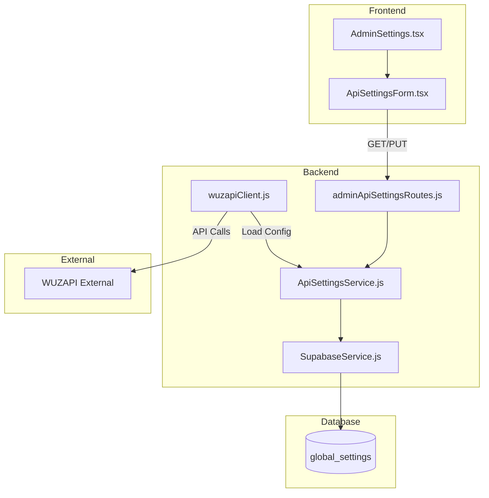

# Design Document: Admin API Settings

## Overview

Este documento descreve o design para tornar as configurações da API WUZAPI editáveis através do painel de administração. A solução utiliza a tabela `global_settings` existente para persistir as configurações, com um serviço dedicado (`ApiSettingsService`) que gerencia o carregamento, validação e criptografia das configurações. O `WuzAPIClient` será modificado para carregar configurações dinamicamente do banco de dados, com fallback para variáveis de ambiente.

## Architecture



## Components and Interfaces

### Backend Components

#### 1. ApiSettingsService (`server/services/ApiSettingsService.js`)

Serviço responsável por gerenciar as configurações da API.

```javascript
class ApiSettingsService {
  // Chaves de configuração na tabela global_settings
  static KEYS = {
    WUZAPI_BASE_URL: 'api.wuzapi.baseUrl',
    WUZAPI_ADMIN_TOKEN: 'api.wuzapi.adminToken',
    WUZAPI_TIMEOUT: 'api.wuzapi.timeout'
  };

  // Obtém todas as configurações da API
  async getApiSettings(): Promise<ApiSettings>
  
  // Atualiza configurações da API
  async updateApiSettings(settings: Partial<ApiSettings>): Promise<ApiSettings>
  
  // Obtém uma configuração específica com fallback para env
  async getSetting(key: string, envFallback: string): Promise<{value: string, source: 'database' | 'environment'}>
  
  // Testa conexão com a API usando configurações atuais
  async testConnection(): Promise<{success: boolean, details: string}>
  
  // Criptografa valor sensível
  encryptValue(value: string): string
  
  // Descriptografa valor sensível
  decryptValue(encryptedValue: string): string
  
  // Invalida cache para forçar reload
  invalidateCache(): void
}
```

#### 2. Admin Routes (`server/routes/adminApiSettingsRoutes.js`)

```javascript
// GET /api/admin/api-settings - Obtém configurações atuais
// PUT /api/admin/api-settings - Atualiza configurações
// POST /api/admin/api-settings/test - Testa conexão
```

#### 3. WuzAPIClient Modifications

O `wuzapiClient.js` será modificado para:
- Carregar configurações do `ApiSettingsService` em vez de apenas `process.env`
- Suportar reload dinâmico de configurações
- Manter cache com TTL para evitar queries excessivas

### Frontend Components

#### 1. ApiSettingsForm (`src/components/admin/ApiSettingsForm.tsx`)

```typescript
interface ApiSettingsFormProps {
  onSave?: () => void;
}

interface ApiSettingsFormData {
  wuzapiBaseUrl: string;
  wuzapiAdminToken: string;
  wuzapiTimeout: number;
}

interface SettingSource {
  value: string;
  source: 'database' | 'environment';
}
```

## Data Models

### API Settings Structure

```typescript
interface ApiSettings {
  wuzapiBaseUrl: SettingWithSource;
  wuzapiAdminToken: SettingWithSource;
  wuzapiTimeout: SettingWithSource;
}

interface SettingWithSource {
  value: string;
  source: 'database' | 'environment';
  masked?: boolean; // Para tokens
}
```

### Database Schema (global_settings)

A tabela `global_settings` já existe. Usaremos as seguintes chaves:

| Key | Value Type | Description |
|-----|------------|-------------|
| `api.wuzapi.baseUrl` | string | URL base da API WUZAPI |
| `api.wuzapi.adminToken` | string (encrypted) | Token admin criptografado |
| `api.wuzapi.timeout` | number | Timeout em milissegundos |

### Encryption

Para o token da API, usaremos criptografia AES-256-GCM:
- Chave derivada de `SESSION_SECRET` via PBKDF2
- IV único por valor criptografado
- Formato armazenado: `iv:authTag:ciphertext` (base64)

## Correctness Properties

*A property is a characteristic or behavior that should hold true across all valid executions of a system-essentially, a formal statement about what the system should do. Properties serve as the bridge between human-readable specifications and machine-verifiable correctness guarantees.*

### Property 1: Settings Validation
*For any* input string for WUZAPI_BASE_URL, the validation function SHALL accept only valid HTTP/HTTPS URLs and reject all other formats including empty strings, malformed URLs, and non-URL strings.
**Validates: Requirements 1.2**

### Property 2: Settings Persistence Round-Trip
*For any* valid API settings object, saving to the database and then retrieving SHALL return equivalent values (with token decrypted correctly).
**Validates: Requirements 1.3, 3.3, 3.4**

### Property 3: Configuration Precedence
*For any* setting key, when both database and environment values exist, the loaded configuration SHALL return the database value; when only environment exists, SHALL return the environment value.
**Validates: Requirements 1.4, 4.1**

### Property 4: Source Indication Accuracy
*For any* loaded setting, the source indicator SHALL correctly reflect whether the value came from database or environment fallback.
**Validates: Requirements 5.1**

### Property 5: Token Encryption Security
*For any* token value stored in the database, the stored value SHALL NOT contain the original plaintext token (must be encrypted).
**Validates: Requirements 3.3**

## Error Handling

### Validation Errors
- URL inválida: "URL inválida. Use formato http:// ou https://"
- Token vazio: "Token de administrador é obrigatório"
- Timeout inválido: "Timeout deve ser um número entre 1000 e 120000 ms"

### Connection Test Errors
- Timeout: "Timeout: A API não respondeu em {timeout}ms"
- Connection refused: "Conexão recusada: Verifique se a URL está correta"
- Invalid token: "Token inválido: A API rejeitou a autenticação"
- Network error: "Erro de rede: Não foi possível conectar à API"

### Database Errors
- Save failed: "Erro ao salvar configurações. Tente novamente."
- Load failed: Fallback silencioso para variáveis de ambiente com log de warning

## Testing Strategy

### Unit Tests

1. **ApiSettingsService**
   - Validação de URL (válidas e inválidas)
   - Criptografia/descriptografia de tokens
   - Merge de configurações com fallback

2. **Validation Functions**
   - Casos de borda para URLs
   - Valores de timeout válidos/inválidos

### Property-Based Tests

Usaremos **fast-check** como biblioteca de property-based testing.

Cada teste de propriedade DEVE:
- Executar no mínimo 100 iterações
- Ser anotado com referência à propriedade do design: `**Feature: admin-api-settings, Property {number}: {property_text}**`
- Ser implementado em um único teste por propriedade

**Testes de Propriedade:**

1. **Property 1**: Gerar URLs aleatórias (válidas e inválidas) e verificar que a validação aceita apenas URLs HTTP/HTTPS válidas
2. **Property 2**: Gerar configurações aleatórias, salvar, recuperar e verificar equivalência
3. **Property 3**: Gerar combinações de valores (db/env/ambos/nenhum) e verificar precedência
4. **Property 4**: Para cada configuração carregada, verificar que source indica corretamente a origem
5. **Property 5**: Gerar tokens aleatórios, criptografar e verificar que o valor armazenado não contém o plaintext

### Integration Tests

1. **API Endpoints**
   - GET /api/admin/api-settings retorna configurações
   - PUT /api/admin/api-settings atualiza configurações
   - POST /api/admin/api-settings/test testa conexão

2. **WuzAPIClient Integration**
   - Verifica que cliente usa configurações do banco
   - Verifica fallback para env quando banco vazio

