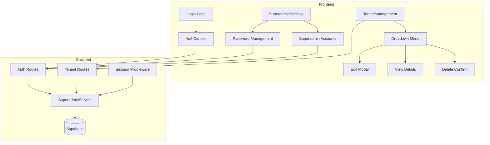

# Design Document: Admin Authentication Refactor

## Overview

Este documento descreve o design para refatorar o sistema de autenticação administrativa do WUZAPI Manager, migrando de autenticação baseada em token para autenticação baseada em credenciais (email/senha), e adicionando funcionalidades completas de gerenciamento de tenants incluindo edição.

O sistema já possui uma estrutura parcial de autenticação por email/senha para superadmins (tabela `superadmins`, `SuperadminService.js`), mas o frontend ainda depende de `VITE_ADMIN_TOKEN` em alguns lugares. Além disso, o botão "Manage" na lista de tenants atualmente apenas faz impersonation, sem opção de editar os dados do tenant.

## Architecture



## Components and Interfaces

### 1. Frontend Components

#### 1.1 TenantManagement - Dropdown Menu Enhancement

```typescript
// Novo componente de dropdown para ações do tenant
interface TenantActionsDropdownProps {
  tenant: Tenant;
  onEdit: (tenant: Tenant) => void;
  onView: (tenantId: string) => void;
  onDelete: (tenantId: string) => void;
  onImpersonate: (tenantId: string) => void;
}

// Substituir botões individuais por dropdown
<DropdownMenu>
  <DropdownMenuTrigger asChild>
    <Button variant="outline" size="sm">
      <Settings className="h-4 w-4 mr-1" />
      Manage
      <ChevronDown className="h-4 w-4 ml-1" />
    </Button>
  </DropdownMenuTrigger>
  <DropdownMenuContent>
    <DropdownMenuItem onClick={() => onEdit(tenant)}>
      <Pencil className="h-4 w-4 mr-2" />
      Edit
    </DropdownMenuItem>
    <DropdownMenuItem onClick={() => onView(tenant.id)}>
      <Eye className="h-4 w-4 mr-2" />
      View Details
    </DropdownMenuItem>
    <DropdownMenuItem onClick={() => onImpersonate(tenant.id)}>
      <UserCog className="h-4 w-4 mr-2" />
      Impersonate
    </DropdownMenuItem>
    <DropdownMenuSeparator />
    <DropdownMenuItem onClick={() => onDelete(tenant.id)} className="text-destructive">
      <Trash2 className="h-4 w-4 mr-2" />
      Delete
    </DropdownMenuItem>
  </DropdownMenuContent>
</DropdownMenu>
```

#### 1.2 TenantEditModal Component

```typescript
interface TenantEditModalProps {
  tenant: Tenant | null;
  open: boolean;
  onOpenChange: (open: boolean) => void;
  onSave: (tenantId: string, data: TenantUpdateData) => Promise<void>;
}

interface TenantUpdateData {
  name: string;
  status: 'active' | 'inactive' | 'suspended';
  settings: Record<string, any>;
}
```

#### 1.3 SuperadminSettings Enhancement

```typescript
// Seções do SuperadminSettings
interface SettingsSections {
  passwordChange: {
    currentPassword: string;
    newPassword: string;
    confirmPassword: string;
  };
  superadminAccounts: {
    list: SuperadminAccount[];
    createForm: {
      email: string;
      name: string;
      temporaryPassword: string;
    };
  };
}

interface SuperadminAccount {
  id: string;
  email: string;
  name: string;
  status: 'active' | 'inactive';
  lastLoginAt: string | null;
  createdAt: string;
  requiresPasswordChange: boolean;
}
```

### 2. Backend Routes

#### 2.1 Tenant Update Route

```javascript
// PUT /api/superadmin/tenants/:id
router.put('/:id', superadminAuth, async (req, res) => {
  const { id } = req.params;
  const { name, status, settings } = req.body;
  const superadminId = req.session.superadminData.id;
  
  const tenant = await SuperadminService.updateTenant(id, { name, status, settings }, superadminId);
  res.json({ success: true, data: tenant });
});
```

#### 2.2 Password Change Route

```javascript
// POST /api/superadmin/change-password
router.post('/change-password', superadminAuth, async (req, res) => {
  const { currentPassword, newPassword } = req.body;
  const superadminId = req.session.superadminData.id;
  
  await SuperadminService.changePassword(superadminId, currentPassword, newPassword);
  res.json({ success: true, message: 'Password changed successfully' });
});
```

#### 2.3 Superadmin Account Management Routes

```javascript
// GET /api/superadmin/accounts - List all superadmin accounts
// POST /api/superadmin/accounts - Create new superadmin account
// DELETE /api/superadmin/accounts/:id - Delete superadmin account
```

### 3. Service Layer

#### 3.1 SuperadminService Extensions

```javascript
class SuperadminService {
  // Existing methods...
  
  /**
   * Change superadmin password
   * @param {string} superadminId - Superadmin UUID
   * @param {string} currentPassword - Current password for verification
   * @param {string} newPassword - New password to set
   * @returns {Promise<void>}
   */
  async changePassword(superadminId, currentPassword, newPassword) {
    // 1. Get superadmin
    // 2. Verify current password
    // 3. Validate new password complexity
    // 4. Hash new password with bcrypt (cost 12)
    // 5. Update password_hash
    // 6. Invalidate all other sessions
    // 7. Log audit action
  }
  
  /**
   * List all superadmin accounts
   * @returns {Promise<SuperadminAccount[]>}
   */
  async listSuperadmins() {
    // Return all superadmins without password_hash
  }
  
  /**
   * Delete superadmin account
   * @param {string} targetId - ID of superadmin to delete
   * @param {string} requesterId - ID of superadmin making the request
   * @returns {Promise<void>}
   */
  async deleteSuperadmin(targetId, requesterId) {
    // 1. Prevent self-deletion
    // 2. Delete superadmin
    // 3. Log audit action
  }
}
```

## Data Models

### 1. Superadmins Table (Existing)

```sql
CREATE TABLE superadmins (
  id UUID PRIMARY KEY DEFAULT gen_random_uuid(),
  email TEXT UNIQUE NOT NULL,
  password_hash TEXT NOT NULL,
  name TEXT NOT NULL,
  status TEXT DEFAULT 'active' CHECK (status IN ('active', 'inactive')),
  requires_password_change BOOLEAN DEFAULT false,  -- NEW FIELD
  last_login_at TIMESTAMPTZ,
  created_at TIMESTAMPTZ DEFAULT now(),
  updated_at TIMESTAMPTZ DEFAULT now()
);
```

### 2. Password Complexity Requirements

```typescript
interface PasswordRequirements {
  minLength: 8;
  requireUppercase: true;
  requireLowercase: true;
  requireNumber: true;
  requireSpecialChar: true;
}
```

## Correctness Properties

*A property is a characteristic or behavior that should hold true across all valid executions of a system-essentially, a formal statement about what the system should do. Properties serve as the bridge between human-readable specifications and machine-verifiable correctness guarantees.*

### Property 1: Authentication Error Message Consistency
*For any* failed authentication attempt (wrong email, wrong password, or inactive account), the system should return the same generic error message "Invalid credentials" without revealing which field was incorrect.
**Validates: Requirements 1.4**

### Property 2: Password Hash Security
*For any* superadmin account creation or password change, the stored password_hash should be a valid bcrypt hash with cost factor 12, and should never equal the plaintext password.
**Validates: Requirements 4.1**

### Property 3: Rate Limiting Enforcement
*For any* sequence of 5 failed login attempts from the same IP within 15 minutes, the 6th attempt should be blocked regardless of whether credentials are valid.
**Validates: Requirements 4.4**

### Property 4: Password Change Validation
*For any* password change request, if the current password is incorrect, the password_hash in the database should remain unchanged after the operation.
**Validates: Requirements 2.4**

### Property 5: Password Complexity Validation
*For any* password that does not meet complexity requirements (min 8 chars, uppercase, lowercase, number, special char), the system should reject it with specific validation errors.
**Validates: Requirements 2.5**

### Property 6: Self-Deletion Prevention
*For any* superadmin attempting to delete their own account, the system should reject the request and return an error.
**Validates: Requirements 5.5**

### Property 7: Tenant Edit Persistence
*For any* valid tenant update (name, status, settings), after saving, querying the tenant should return the updated values.
**Validates: Requirements 3.3**

### Property 8: Form Data Preservation on Error
*For any* tenant update that fails due to server error, the form should retain all entered data without clearing.
**Validates: Requirements 3.5**

### Property 9: Session Invalidation on Password Change
*For any* successful password change, all existing sessions for that superadmin (except the current one) should be invalidated.
**Validates: Requirements 2.3**

### Property 10: First Login Password Change Requirement
*For any* newly created superadmin account with `requires_password_change: true`, attempting to access any route other than password change should redirect to the password change form.
**Validates: Requirements 5.3**

## Error Handling

### Authentication Errors

| Error Code | Message | HTTP Status |
|------------|---------|-------------|
| AUTH_INVALID_CREDENTIALS | Invalid credentials | 401 |
| AUTH_ACCOUNT_INACTIVE | Account is inactive | 403 |
| AUTH_RATE_LIMITED | Too many login attempts. Try again in X minutes | 429 |
| AUTH_SESSION_EXPIRED | Session expired. Please login again | 401 |

### Password Change Errors

| Error Code | Message | HTTP Status |
|------------|---------|-------------|
| PWD_CURRENT_INVALID | Current password is incorrect | 400 |
| PWD_COMPLEXITY_FAILED | Password does not meet requirements | 400 |
| PWD_SAME_AS_CURRENT | New password must be different from current | 400 |

### Tenant Management Errors

| Error Code | Message | HTTP Status |
|------------|---------|-------------|
| TENANT_NOT_FOUND | Tenant not found | 404 |
| TENANT_UPDATE_FAILED | Failed to update tenant | 500 |
| TENANT_SUBDOMAIN_EXISTS | Subdomain already exists | 409 |

## Testing Strategy

### Unit Testing

- Test password hashing with bcrypt cost factor 12
- Test password complexity validation rules
- Test rate limiting counter logic
- Test session invalidation logic

### Property-Based Testing

The following property-based tests will be implemented using **fast-check** library:

1. **Authentication Error Consistency Test**
   - Generate random invalid credentials (wrong email, wrong password, inactive account)
   - Verify all return the same error message

2. **Password Hash Security Test**
   - Generate random valid passwords
   - Verify hash is valid bcrypt with cost 12
   - Verify hash !== plaintext

3. **Rate Limiting Test**
   - Generate sequences of login attempts
   - Verify blocking after 5 failures

4. **Password Complexity Test**
   - Generate passwords missing various requirements
   - Verify appropriate validation errors

5. **Self-Deletion Prevention Test**
   - Generate delete requests where targetId === requesterId
   - Verify all are rejected

6. **Tenant Edit Round-Trip Test**
   - Generate random tenant updates
   - Verify data persists correctly

Each property-based test MUST:
- Run a minimum of 100 iterations
- Be tagged with format: `**Feature: admin-authentication-refactor, Property {number}: {property_text}**`
- Reference the correctness property from this design document

### Integration Testing

- Test complete login flow (form → API → session → redirect)
- Test password change flow with session invalidation
- Test tenant edit modal flow (open → edit → save → refresh)
- Test dropdown menu interactions

