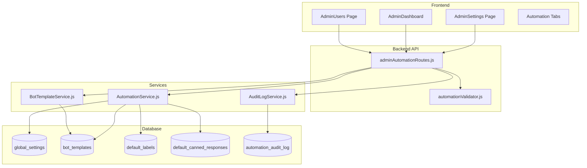
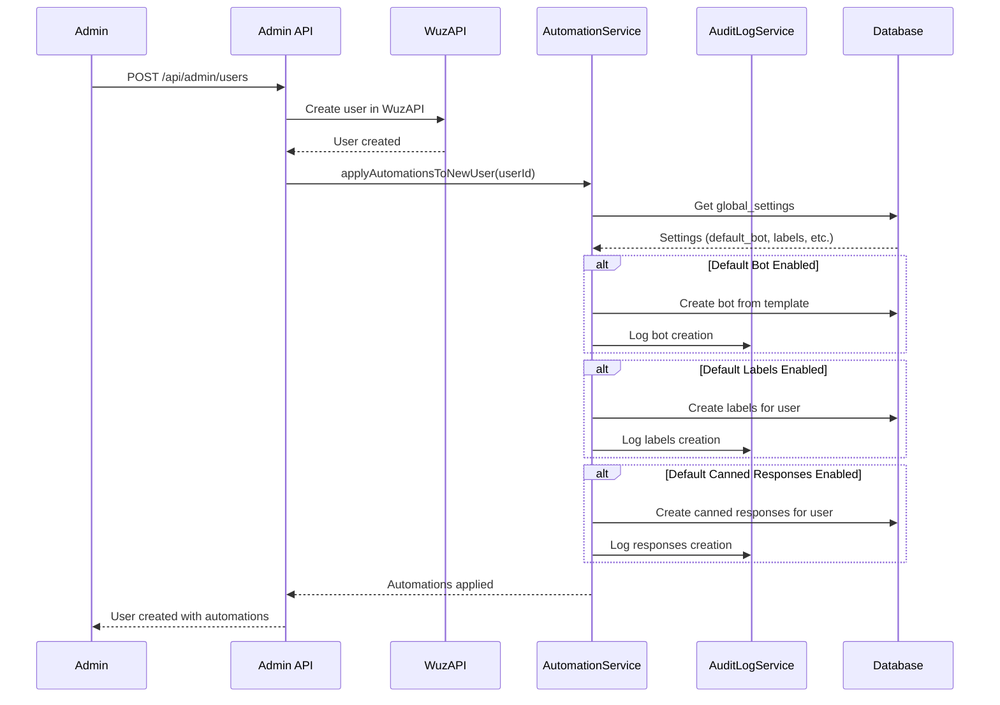

# Design Document: Admin Automation Tools

## Overview

Este documento descreve o design técnico para as ferramentas de automação administrativa do WUZAPI Manager. O sistema permitirá que administradores configurem padrões globais que são automaticamente aplicados a novos usuários, além de fornecer ferramentas para gerenciamento em massa e monitoramento de automações.

A arquitetura segue o padrão existente do projeto: backend Node.js/Express com SQLite, frontend React/TypeScript com shadcn/ui, e comunicação via API REST.

## Architecture



### Data Flow for New User Creation



## Components and Interfaces

### Backend Components

#### 1. AutomationService (`server/services/AutomationService.js`)

```javascript
class AutomationService {
  constructor(db) { this.db = db; }
  
  // Global Settings Management
  async getGlobalSettings(): Promise<GlobalSettings>
  async updateGlobalSettings(settings: Partial<GlobalSettings>): Promise<GlobalSettings>
  
  // Automation Application
  async applyAutomationsToNewUser(userId: string): Promise<AutomationResult>
  async applyAutomationsToExistingUsers(userIds: string[], automationTypes: string[]): Promise<BulkResult>
  
  // Bot Templates
  async getBotTemplates(): Promise<BotTemplate[]>
  async createBotTemplate(template: BotTemplateInput): Promise<BotTemplate>
  async updateBotTemplate(id: number, template: Partial<BotTemplateInput>): Promise<BotTemplate>
  async deleteBotTemplate(id: number): Promise<void>
  async setDefaultBotTemplate(id: number): Promise<void>
  
  // Default Labels
  async getDefaultLabels(): Promise<DefaultLabel[]>
  async createDefaultLabel(label: LabelInput): Promise<DefaultLabel>
  async updateDefaultLabel(id: number, label: Partial<LabelInput>): Promise<DefaultLabel>
  async deleteDefaultLabel(id: number): Promise<void>
  
  // Default Canned Responses
  async getDefaultCannedResponses(): Promise<DefaultCannedResponse[]>
  async createDefaultCannedResponse(response: CannedResponseInput): Promise<DefaultCannedResponse>
  async updateDefaultCannedResponse(id: number, response: Partial<CannedResponseInput>): Promise<DefaultCannedResponse>
  async deleteDefaultCannedResponse(id: number): Promise<void>
  
  // Export/Import
  async exportConfiguration(): Promise<ConfigurationExport>
  async importConfiguration(config: ConfigurationExport): Promise<ImportResult>
  async validateConfiguration(config: unknown): Promise<ValidationResult>
}
```

#### 2. AuditLogService (`server/services/AuditLogService.js`)

```javascript
class AuditLogService {
  constructor(db) { this.db = db; }
  
  async logAutomation(entry: AuditLogEntry): Promise<void>
  async getAuditLog(filters: AuditLogFilters, pagination: Pagination): Promise<PaginatedAuditLog>
  async getStatistics(dateRange: DateRange): Promise<AutomationStatistics>
  async archiveOldEntries(retentionDays: number): Promise<number>
}
```

#### 3. Routes (`server/routes/adminAutomationRoutes.js`)

```javascript
// Global Settings
GET    /api/admin/automation/settings
PUT    /api/admin/automation/settings

// Bot Templates
GET    /api/admin/automation/bot-templates
POST   /api/admin/automation/bot-templates
PUT    /api/admin/automation/bot-templates/:id
DELETE /api/admin/automation/bot-templates/:id
POST   /api/admin/automation/bot-templates/:id/set-default

// Default Labels
GET    /api/admin/automation/default-labels
POST   /api/admin/automation/default-labels
PUT    /api/admin/automation/default-labels/:id
DELETE /api/admin/automation/default-labels/:id

// Default Canned Responses
GET    /api/admin/automation/default-canned-responses
POST   /api/admin/automation/default-canned-responses
PUT    /api/admin/automation/default-canned-responses/:id
DELETE /api/admin/automation/default-canned-responses/:id

// Bulk Actions
POST   /api/admin/automation/bulk-apply

// Audit Log
GET    /api/admin/automation/audit-log
GET    /api/admin/automation/statistics

// Export/Import
GET    /api/admin/automation/export
POST   /api/admin/automation/import
POST   /api/admin/automation/validate-import
```

### Frontend Components

#### 1. AdminAutomationSettings (`src/components/admin/AdminAutomationSettings.tsx`)

Main container component with tabs for different automation categories:
- Bot Templates Tab
- Default Labels Tab
- Default Canned Responses Tab
- Webhook Settings Tab
- Database Settings Tab
- Quotas Tab
- Export/Import Tab

#### 2. BotTemplateManager (`src/components/admin/BotTemplateManager.tsx`)

CRUD interface for bot templates with:
- List of templates with default indicator
- Create/Edit dialog
- Delete confirmation
- Set as default action

#### 3. DefaultLabelsManager (`src/components/admin/DefaultLabelsManager.tsx`)

CRUD interface for default labels with:
- Color picker
- Preview of label appearance
- Drag-and-drop reordering

#### 4. AutomationAuditLog (`src/components/admin/AutomationAuditLog.tsx`)

Paginated table with:
- Date range filter
- Automation type filter
- User filter
- Export to CSV

#### 5. AutomationStatisticsCards (`src/components/admin/AutomationStatisticsCards.tsx`)

Dashboard cards showing:
- Total automations (7 days)
- Success rate
- Most used automation type
- Recent failures

## Data Models

### Database Schema

```sql
-- Global automation settings
CREATE TABLE global_settings (
  id INTEGER PRIMARY KEY AUTOINCREMENT,
  key TEXT UNIQUE NOT NULL,
  value TEXT NOT NULL,
  updated_at DATETIME DEFAULT CURRENT_TIMESTAMP
);

-- Bot templates for automation
CREATE TABLE bot_templates (
  id INTEGER PRIMARY KEY AUTOINCREMENT,
  name TEXT NOT NULL,
  description TEXT,
  outgoing_url TEXT NOT NULL,
  include_history INTEGER DEFAULT 0,
  is_default INTEGER DEFAULT 0,
  created_at DATETIME DEFAULT CURRENT_TIMESTAMP,
  updated_at DATETIME DEFAULT CURRENT_TIMESTAMP
);

-- Default labels for new users
CREATE TABLE default_labels (
  id INTEGER PRIMARY KEY AUTOINCREMENT,
  name TEXT NOT NULL,
  color TEXT NOT NULL,
  sort_order INTEGER DEFAULT 0,
  created_at DATETIME DEFAULT CURRENT_TIMESTAMP,
  updated_at DATETIME DEFAULT CURRENT_TIMESTAMP
);

-- Default canned responses for new users
CREATE TABLE default_canned_responses (
  id INTEGER PRIMARY KEY AUTOINCREMENT,
  shortcut TEXT NOT NULL,
  content TEXT NOT NULL,
  sort_order INTEGER DEFAULT 0,
  created_at DATETIME DEFAULT CURRENT_TIMESTAMP,
  updated_at DATETIME DEFAULT CURRENT_TIMESTAMP
);

-- Automation audit log
CREATE TABLE automation_audit_log (
  id INTEGER PRIMARY KEY AUTOINCREMENT,
  user_id TEXT NOT NULL,
  automation_type TEXT NOT NULL,
  details TEXT,
  status TEXT NOT NULL CHECK(status IN ('success', 'failed')),
  error_message TEXT,
  created_at DATETIME DEFAULT CURRENT_TIMESTAMP
);

-- Indexes
CREATE INDEX idx_global_settings_key ON global_settings(key);
CREATE INDEX idx_bot_templates_default ON bot_templates(is_default);
CREATE INDEX idx_audit_log_user ON automation_audit_log(user_id);
CREATE INDEX idx_audit_log_type ON automation_audit_log(automation_type);
CREATE INDEX idx_audit_log_created ON automation_audit_log(created_at DESC);
```

### TypeScript Interfaces

```typescript
// Global Settings
interface GlobalSettings {
  defaultBotTemplateId: number | null;
  defaultWebhookEvents: string[];
  defaultNocodbBaseUrl: string | null;
  defaultFieldMappings: FieldMapping[];
  automationsEnabled: {
    bot: boolean;
    labels: boolean;
    cannedResponses: boolean;
    webhooks: boolean;
  };
  quotas: {
    messagesPerDay: number;
    botsPerUser: number;
    campaignsPerMonth: number;
  };
  auditLogRetentionDays: number;
}

// Bot Template
interface BotTemplate {
  id: number;
  name: string;
  description: string | null;
  outgoingUrl: string;
  includeHistory: boolean;
  isDefault: boolean;
  createdAt: string;
  updatedAt: string;
}

interface BotTemplateInput {
  name: string;
  description?: string;
  outgoingUrl: string;
  includeHistory?: boolean;
}

// Default Label
interface DefaultLabel {
  id: number;
  name: string;
  color: string;
  sortOrder: number;
  createdAt: string;
  updatedAt: string;
}

// Default Canned Response
interface DefaultCannedResponse {
  id: number;
  shortcut: string;
  content: string;
  sortOrder: number;
  createdAt: string;
  updatedAt: string;
}

// Audit Log
interface AuditLogEntry {
  id: number;
  userId: string;
  automationType: 'bot' | 'labels' | 'canned_responses' | 'webhooks' | 'quotas';
  details: Record<string, unknown>;
  status: 'success' | 'failed';
  errorMessage: string | null;
  createdAt: string;
}

// Statistics
interface AutomationStatistics {
  totalAutomations: number;
  successCount: number;
  failureCount: number;
  byType: Record<string, { success: number; failed: number }>;
  recentFailures: AuditLogEntry[];
}

// Configuration Export
interface ConfigurationExport {
  version: string;
  exportedAt: string;
  globalSettings: GlobalSettings;
  botTemplates: BotTemplate[];
  defaultLabels: DefaultLabel[];
  defaultCannedResponses: DefaultCannedResponse[];
}

// Bulk Action Result
interface BulkResult {
  totalUsers: number;
  successCount: number;
  failureCount: number;
  failures: Array<{ userId: string; error: string }>;
}
```

## Correctness Properties

*A property is a characteristic or behavior that should hold true across all valid executions of a system-essentially, a formal statement about what the system should do. Properties serve as the bridge between human-readable specifications and machine-verifiable correctness guarantees.*

Based on the prework analysis, the following consolidated correctness properties have been identified:

### Property 1: New User Automation Application
*For any* new user creation with automations enabled, all configured default resources (bot, labels, canned responses) SHALL be created for that user, and each creation SHALL be logged in the audit log.
**Validates: Requirements 1.3, 5.3, 6.3, 9.2**

### Property 2: Temporal Isolation of Template Updates
*For any* automation template update (bot template, labels, canned responses), only users created after the update SHALL receive the new configuration; existing users SHALL retain their original configuration.
**Validates: Requirements 1.4, 3.5**

### Property 3: Template-Instance Isolation
*For any* template edit (bot template, default label, default canned response), existing user instances created from that template SHALL remain unchanged.
**Validates: Requirements 2.3, 5.4, 6.4**

### Property 4: Required Field Validation
*For any* bot template creation, the system SHALL reject templates missing required fields (name, outgoingUrl) and return appropriate validation errors.
**Validates: Requirements 2.2, 6.2**

### Property 5: Default Template Deletion Prevention
*For any* bot template marked as default, deletion attempts SHALL be rejected with an appropriate error message.
**Validates: Requirements 2.4**

### Property 6: Bulk Action Completeness
*For any* bulk action applied to a set of users, the system SHALL attempt the action for all selected users and return accurate counts of successes and failures.
**Validates: Requirements 8.3, 8.4**

### Property 7: Audit Log Completeness
*For any* automation execution (new user, bulk action, scheduled task), an audit log entry SHALL be created with timestamp, user ID, automation type, and result status.
**Validates: Requirements 9.2, 14.3**

### Property 8: Statistics Accuracy
*For any* time period, automation statistics (total count, success rate, failure rate) SHALL accurately reflect the data in the audit log for that period.
**Validates: Requirements 10.2, 10.3**

### Property 9: Configuration Export/Import Round-Trip
*For any* valid configuration, exporting then importing SHALL produce equivalent settings (excluding auto-generated fields like IDs and timestamps).
**Validates: Requirements 13.2, 13.3**

### Property 10: Global Template Visibility
*For any* user accessing message templates, the system SHALL return both personal templates and all global templates, with global templates marked as read-only.
**Validates: Requirements 11.3, 11.4**

### Property 11: Quota Override Precedence
*For any* user with custom quota overrides, the system SHALL use the override values instead of default quotas.
**Validates: Requirements 12.4**

### Property 12: URL Validation
*For any* URL input (NocoDB base URL, bot outgoing URL), the system SHALL validate the URL format and reject invalid URLs before saving.
**Validates: Requirements 7.2**

### Property 13: Settings Persistence
*For any* global setting modification, the change SHALL be persisted to the database and retrievable on subsequent page loads.
**Validates: Requirements 1.2, 4.2**

## Error Handling

### Backend Error Handling

```javascript
// Standard error response format
{
  success: false,
  error: string,
  code: string,
  details?: Record<string, string[]>,
  timestamp: string
}

// Error codes
const ErrorCodes = {
  VALIDATION_ERROR: 'VALIDATION_ERROR',
  NOT_FOUND: 'NOT_FOUND',
  CONFLICT: 'CONFLICT',
  CANNOT_DELETE_DEFAULT: 'CANNOT_DELETE_DEFAULT',
  BULK_PARTIAL_FAILURE: 'BULK_PARTIAL_FAILURE',
  IMPORT_VALIDATION_FAILED: 'IMPORT_VALIDATION_FAILED',
  AUTOMATION_FAILED: 'AUTOMATION_FAILED'
};
```

### Error Scenarios

| Scenario | HTTP Status | Error Code | User Message |
|----------|-------------|------------|--------------|
| Missing required field | 400 | VALIDATION_ERROR | "Campo obrigatório: {field}" |
| Bot template not found | 404 | NOT_FOUND | "Template de bot não encontrado" |
| Delete default template | 409 | CANNOT_DELETE_DEFAULT | "Não é possível excluir o template padrão" |
| Invalid URL format | 400 | VALIDATION_ERROR | "Formato de URL inválido" |
| Bulk action partial failure | 207 | BULK_PARTIAL_FAILURE | "Ação concluída com {n} falhas" |
| Import validation failed | 400 | IMPORT_VALIDATION_FAILED | "Configuração inválida: {details}" |

### Frontend Error Handling

- Display toast notifications for transient errors
- Show inline validation errors for form fields
- Display error alerts for critical failures
- Provide retry options for recoverable errors

## Testing Strategy

### Property-Based Testing

The project uses **fast-check** for property-based testing, following the existing pattern in the codebase.

Each correctness property will be implemented as a property-based test with a minimum of 100 iterations.

```javascript
// Example: Property 1 - New User Automation Application
describe('AutomationService', () => {
  describe('applyAutomationsToNewUser', () => {
    it('should create all configured default resources for new user', async () => {
      // **Feature: admin-automation-tools, Property 1: New User Automation Application**
      // **Validates: Requirements 1.3, 5.3, 6.3, 9.2**
      await fc.assert(
        fc.asyncProperty(
          fc.record({
            userId: fc.string({ minLength: 1 }),
            enableBot: fc.boolean(),
            enableLabels: fc.boolean(),
            enableCannedResponses: fc.boolean()
          }),
          async ({ userId, enableBot, enableLabels, enableCannedResponses }) => {
            // Setup: Configure automations
            // Act: Create user and apply automations
            // Assert: Verify resources created and audit logged
          }
        ),
        { numRuns: 100 }
      );
    });
  });
});
```

### Unit Tests

Unit tests will cover:
- Individual service methods
- Validation functions
- Data transformation utilities
- Error handling paths

### Integration Tests

Integration tests will verify:
- API endpoint behavior
- Database operations
- Service interactions
- Authentication/authorization

### Test File Organization

```
server/
├── services/
│   ├── AutomationService.js
│   ├── AutomationService.test.js        # Unit tests
│   ├── AutomationService.property.test.js # Property tests
│   ├── AuditLogService.js
│   └── AuditLogService.test.js
├── routes/
│   ├── adminAutomationRoutes.js
│   └── adminAutomationRoutes.test.js
└── validators/
    ├── automationValidator.js
    └── automationValidator.test.js
```
