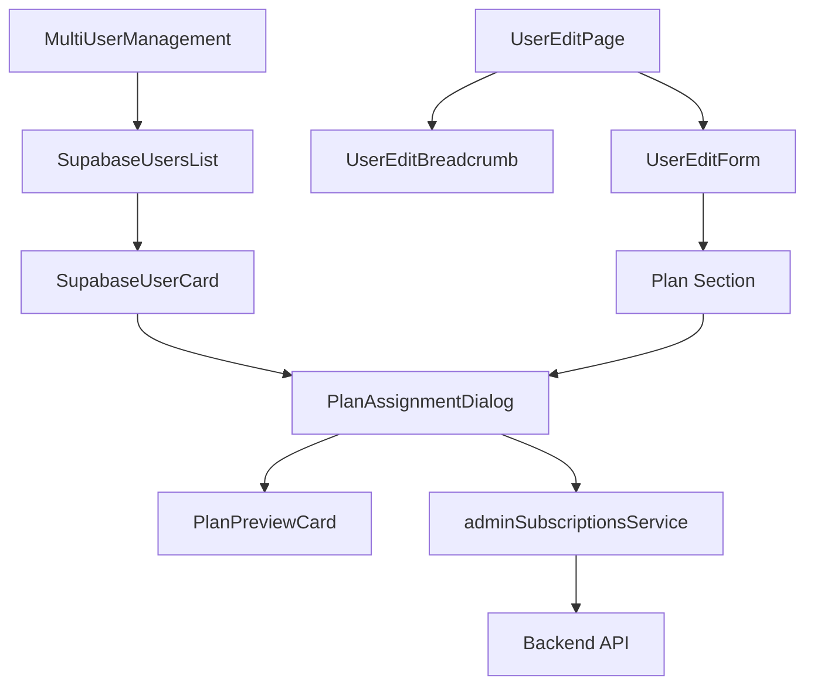

# Design Document: Admin User Edit UX Improvements

## Overview

Este documento descreve o design técnico para melhorar a experiência do usuário na gestão de usuários do sistema admin, focando na página de edição de usuário e na lista de usuários Supabase na página multi-user. As melhorias incluem visualização de planos na lista, ações rápidas, navegação contextual e responsividade.

## Architecture

### Component Structure

```
src/components/admin/
├── SupabaseUsersList.tsx          # Lista de usuários (será refatorado)
├── SupabaseUserCard.tsx           # NOVO: Card individual de usuário
├── PlanAssignmentDialog.tsx       # NOVO: Dialog para atribuir plano
├── PlanPreviewCard.tsx            # NOVO: Preview de features do plano
├── UserEditForm.tsx               # Formulário de edição (será melhorado)
└── UserEditBreadcrumb.tsx         # NOVO: Breadcrumb de navegação

src/pages/admin/
├── MultiUserManagement.tsx        # Página multi-user (ajustes menores)
└── UserEditPage.tsx               # NOVO: Página wrapper para edição
```

### Data Flow



## Components and Interfaces

### SupabaseUserCard Component

```typescript
interface SupabaseUserCardProps {
  user: SupabaseUser
  subscription?: UserSubscription | null
  onEdit: (userId: string) => void
  onAssignPlan: (userId: string) => void
  onDelete: (userId: string) => void
}

// Exibe informações do usuário em formato de card
// Inclui: email, role, status do plano, ações rápidas
```

### PlanAssignmentDialog Component

```typescript
interface PlanAssignmentDialogProps {
  open: boolean
  onOpenChange: (open: boolean) => void
  userId: string
  currentPlanId?: string
  onSuccess: () => void
}

// Dialog modal para seleção e atribuição de plano
// Inclui: lista de planos, preview de features, confirmação
```

### PlanPreviewCard Component

```typescript
interface PlanPreviewCardProps {
  plan: Plan
  selected: boolean
  onSelect: (planId: string) => void
}

// Card que exibe preview do plano com features e preço
// Destaque visual quando selecionado
```

### UserEditBreadcrumb Component

```typescript
interface UserEditBreadcrumbProps {
  userName: string
  userId: string
}

// Breadcrumb: Admin > Multi-Usuário > Editar [userName]
```

## Data Models

### Extended SupabaseUser (com subscription)

```typescript
interface SupabaseUserWithSubscription extends SupabaseUser {
  subscription?: {
    id: string
    planId: string
    planName: string
    status: 'trial' | 'active' | 'past_due' | 'canceled' | 'expired' | 'suspended'
    currentPeriodEnd?: string
  } | null
}
```

### Plan with Features

```typescript
interface PlanWithFeatures extends Plan {
  features: {
    name: string
    included: boolean
    limit?: number
  }[]
}
```

## Correctness Properties

*A property is a characteristic or behavior that should hold true across all valid executions of a system-essentially, a formal statement about what the system should do. Properties serve as the bridge between human-readable specifications and machine-verifiable correctness guarantees.*

### Property 1: User plan status display consistency

*For any* user in the list, the displayed plan status must accurately reflect the user's actual subscription state - showing "Sem plano" badge for users without subscription, and showing plan name with status badge for users with subscription.

**Validates: Requirements 1.1, 1.2, 1.3**

### Property 2: Plan assignment CTA visibility

*For any* user without an assigned plan, both the user list and the edit page must display a prominent call-to-action button to assign a plan.

**Validates: Requirements 2.1, 3.2, 3.3**

### Property 3: Plan preview completeness

*For any* plan selected in the assignment dialog, the preview must display all plan features and the correctly formatted price with billing cycle.

**Validates: Requirements 4.1, 4.2**

### Property 4: Plan history display

*For any* user with subscription history, the edit page must display a summary of plan changes when the history data is available.

**Validates: Requirements 3.4**

## Error Handling

### API Errors

- **Plan assignment failure**: Display toast error with specific message, maintain previous state
- **User data fetch failure**: Display error state with retry button
- **Subscription data unavailable**: Show "Carregando..." skeleton, fallback to "Sem plano" after timeout

### Validation Errors

- **No plan selected**: Disable confirm button, show helper text
- **Invalid user ID**: Redirect to list with error toast

### Network Errors

- **Timeout**: Show retry option with exponential backoff
- **Offline**: Display offline indicator, disable mutations

## Testing Strategy

### Unit Tests

- Test SupabaseUserCard renders correctly with different user states
- Test PlanAssignmentDialog opens/closes correctly
- Test PlanPreviewCard selection state
- Test price formatting function
- Test breadcrumb path generation

### Property-Based Tests

Using Vitest with fast-check for property-based testing:

- **Property 1**: Generate random users with/without subscriptions, verify correct badge display
- **Property 2**: Generate users without plans, verify CTA button presence
- **Property 3**: Generate plans with various features/prices, verify preview completeness
- **Property 4**: Generate users with subscription history, verify history display

### Integration Tests

- Test plan assignment flow end-to-end
- Test navigation between list and edit page
- Test state persistence on navigation

### E2E Tests (Cypress)

- Test complete user management flow
- Test responsive layout on different viewports
- Test error handling scenarios

