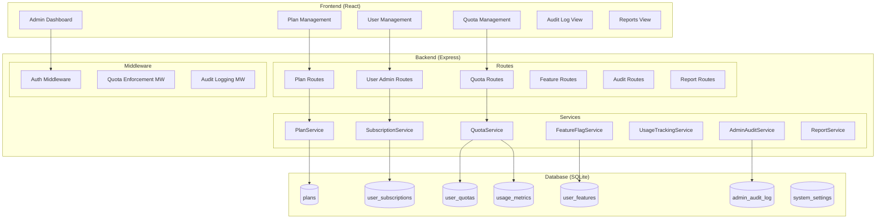
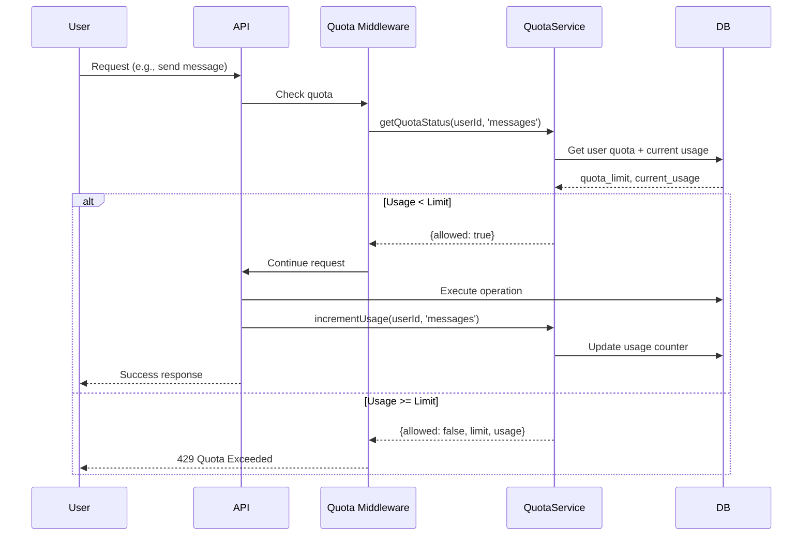

# Design Document: Admin User Management System

## Overview

Este documento descreve o design técnico para implementação de um sistema completo de gestão administrativa de usuários no WUZAPI Manager. O sistema permite que administradores gerenciem usuários, planos, quotas, feature flags e monitorem o uso do sistema de forma centralizada.

### Objetivos Principais
1. Criar sistema de planos com limites e funcionalidades configuráveis
2. Implementar controle de quotas com enforcement em tempo real
3. Gerenciar feature flags por usuário e por plano
4. Fornecer dashboard administrativo com métricas avançadas
5. Manter auditoria completa de todas as ações administrativas

## Architecture

### Diagrama de Arquitetura



### Fluxo de Verificação de Quota



## Components and Interfaces

### Backend Services

#### PlanService
```javascript
class PlanService {
  // Criar novo plano
  async createPlan(data) // { name, description, price_cents, billing_cycle, quotas, features }
  
  // Listar todos os planos
  async listPlans() // Returns Plan[] with subscriber counts
  
  // Obter plano por ID
  async getPlanById(planId)
  
  // Atualizar plano
  async updatePlan(planId, data, effectiveDate)
  
  // Deletar plano (requer migração de usuários)
  async deletePlan(planId, migrateToPlanId)
  
  // Obter plano padrão
  async getDefaultPlan()
}
```

#### SubscriptionService
```javascript
class SubscriptionService {
  // Atribuir plano a usuário
  async assignPlan(userId, planId, adminId)
  
  // Obter assinatura do usuário
  async getUserSubscription(userId)
  
  // Atualizar status da assinatura
  async updateSubscriptionStatus(userId, status, reason)
  
  // Calcular proration
  async calculateProration(userId, newPlanId)
  
  // Processar ciclo de billing
  async processBillingCycle(userId)
  
  // Verificar se usuário está ativo
  async isUserActive(userId)
}
```

#### QuotaService
```javascript
class QuotaService {
  // Obter quotas do usuário (plano + overrides)
  async getUserQuotas(userId)
  
  // Verificar se operação é permitida
  async checkQuota(userId, quotaType, amount = 1)
  
  // Incrementar uso
  async incrementUsage(userId, quotaType, amount = 1)
  
  // Obter uso atual
  async getCurrentUsage(userId, quotaType)
  
  // Definir override de quota
  async setQuotaOverride(userId, quotaType, limit, adminId, reason)
  
  // Remover override
  async removeQuotaOverride(userId, quotaType, adminId)
  
  // Resetar contadores de ciclo
  async resetCycleCounters(userId)
  
  // Verificar threshold de alerta (80%)
  async checkAlertThreshold(userId, quotaType)
}
```

#### FeatureFlagService
```javascript
class FeatureFlagService {
  // Obter features do usuário
  async getUserFeatures(userId)
  
  // Verificar se feature está habilitada
  async isFeatureEnabled(userId, featureName)
  
  // Definir override de feature
  async setFeatureOverride(userId, featureName, enabled, adminId)
  
  // Remover override
  async removeFeatureOverride(userId, featureName, adminId)
  
  // Propagar mudança de plano para usuários
  async propagatePlanFeatureChange(planId, featureName, enabled)
  
  // Listar todas as features disponíveis
  async listAvailableFeatures()
}
```

#### UsageTrackingService
```javascript
class UsageTrackingService {
  // Registrar evento de uso
  async trackUsage(userId, metricType, amount, metadata)
  
  // Obter métricas de uso
  async getUsageMetrics(userId, period)
  
  // Obter métricas agregadas
  async getAggregatedMetrics(filters)
  
  // Calcular custo por usuário
  async calculateCostPerUser(userId, period)
  
  // Exportar dados de uso
  async exportUsageData(userId, dateRange, format)
}
```

#### AdminAuditService
```javascript
class AdminAuditService {
  // Registrar ação administrativa
  async logAction(adminId, actionType, targetUserId, details, ipAddress)
  
  // Listar logs com filtros
  async listAuditLogs(filters, pagination)
  
  // Exportar logs
  async exportAuditLogs(filters, format)
  
  // Obter ações de um admin
  async getAdminActions(adminId, dateRange)
  
  // Obter ações sobre um usuário
  async getUserAuditHistory(userId)
}
```

### API Endpoints

#### Plans
- `GET /api/admin/plans` - Listar planos
- `POST /api/admin/plans` - Criar plano
- `GET /api/admin/plans/:id` - Obter plano
- `PUT /api/admin/plans/:id` - Atualizar plano
- `DELETE /api/admin/plans/:id` - Deletar plano

#### User Subscriptions
- `GET /api/admin/users/:userId/subscription` - Obter assinatura
- `PUT /api/admin/users/:userId/subscription` - Atualizar assinatura
- `POST /api/admin/users/:userId/subscription/assign-plan` - Atribuir plano

#### Quotas
- `GET /api/admin/users/:userId/quotas` - Obter quotas do usuário
- `PUT /api/admin/users/:userId/quotas/:quotaType` - Override de quota
- `DELETE /api/admin/users/:userId/quotas/:quotaType/override` - Remover override
- `POST /api/admin/users/:userId/quotas/reset` - Resetar contadores

#### Features
- `GET /api/admin/users/:userId/features` - Obter features do usuário
- `PUT /api/admin/users/:userId/features/:featureName` - Override de feature
- `DELETE /api/admin/users/:userId/features/:featureName/override` - Remover override

#### User Actions
- `POST /api/admin/users/:userId/suspend` - Suspender usuário
- `POST /api/admin/users/:userId/reactivate` - Reativar usuário
- `POST /api/admin/users/:userId/reset-password` - Resetar senha
- `DELETE /api/admin/users/:userId` - Deletar usuário
- `GET /api/admin/users/:userId/export` - Exportar dados
- `POST /api/admin/users/:userId/notify` - Enviar notificação

#### Bulk Actions
- `POST /api/admin/users/bulk/assign-plan` - Atribuir plano em massa
- `POST /api/admin/users/bulk/suspend` - Suspender em massa
- `POST /api/admin/users/bulk/notify` - Notificar em massa

#### Dashboard & Reports
- `GET /api/admin/dashboard/stats` - Estatísticas do dashboard
- `GET /api/admin/dashboard/alerts` - Alertas ativos
- `GET /api/admin/reports/usage` - Relatório de uso
- `GET /api/admin/reports/revenue` - Relatório de receita
- `GET /api/admin/reports/growth` - Relatório de crescimento

#### Audit
- `GET /api/admin/audit` - Listar logs de auditoria
- `GET /api/admin/audit/export` - Exportar logs

## Data Models

### Database Schema

```sql
-- Tabela de Planos
CREATE TABLE plans (
  id TEXT PRIMARY KEY,
  name TEXT NOT NULL UNIQUE,
  description TEXT,
  price_cents INTEGER NOT NULL DEFAULT 0,
  billing_cycle TEXT NOT NULL DEFAULT 'monthly' CHECK(billing_cycle IN ('monthly', 'yearly', 'lifetime')),
  status TEXT NOT NULL DEFAULT 'active' CHECK(status IN ('active', 'inactive', 'deprecated')),
  is_default INTEGER DEFAULT 0,
  trial_days INTEGER DEFAULT 0,
  -- Quotas
  max_agents INTEGER DEFAULT 1,
  max_connections INTEGER DEFAULT 1,
  max_messages_per_day INTEGER DEFAULT 100,
  max_messages_per_month INTEGER DEFAULT 3000,
  max_inboxes INTEGER DEFAULT 1,
  max_teams INTEGER DEFAULT 1,
  max_webhooks INTEGER DEFAULT 5,
  max_campaigns INTEGER DEFAULT 1,
  max_storage_mb INTEGER DEFAULT 100,
  -- Feature flags (JSON)
  features TEXT DEFAULT '{}',
  created_at DATETIME DEFAULT CURRENT_TIMESTAMP,
  updated_at DATETIME DEFAULT CURRENT_TIMESTAMP
);

-- Tabela de Assinaturas de Usuários
CREATE TABLE user_subscriptions (
  id TEXT PRIMARY KEY,
  user_id TEXT NOT NULL UNIQUE,
  plan_id TEXT NOT NULL REFERENCES plans(id),
  status TEXT NOT NULL DEFAULT 'active' CHECK(status IN ('trial', 'active', 'past_due', 'canceled', 'expired', 'suspended')),
  started_at DATETIME NOT NULL DEFAULT CURRENT_TIMESTAMP,
  trial_ends_at DATETIME,
  current_period_start DATETIME,
  current_period_end DATETIME,
  canceled_at DATETIME,
  suspension_reason TEXT,
  created_at DATETIME DEFAULT CURRENT_TIMESTAMP,
  updated_at DATETIME DEFAULT CURRENT_TIMESTAMP
);

-- Tabela de Overrides de Quotas
CREATE TABLE user_quota_overrides (
  id TEXT PRIMARY KEY,
  user_id TEXT NOT NULL,
  quota_type TEXT NOT NULL,
  limit_value INTEGER NOT NULL,
  reason TEXT,
  set_by TEXT NOT NULL,
  created_at DATETIME DEFAULT CURRENT_TIMESTAMP,
  updated_at DATETIME DEFAULT CURRENT_TIMESTAMP,
  UNIQUE(user_id, quota_type)
);

-- Tabela de Uso de Quotas
CREATE TABLE user_quota_usage (
  id TEXT PRIMARY KEY,
  user_id TEXT NOT NULL,
  quota_type TEXT NOT NULL,
  period_start DATETIME NOT NULL,
  period_end DATETIME NOT NULL,
  current_usage INTEGER DEFAULT 0,
  created_at DATETIME DEFAULT CURRENT_TIMESTAMP,
  updated_at DATETIME DEFAULT CURRENT_TIMESTAMP,
  UNIQUE(user_id, quota_type, period_start)
);

-- Tabela de Overrides de Features
CREATE TABLE user_feature_overrides (
  id TEXT PRIMARY KEY,
  user_id TEXT NOT NULL,
  feature_name TEXT NOT NULL,
  enabled INTEGER NOT NULL,
  set_by TEXT NOT NULL,
  created_at DATETIME DEFAULT CURRENT_TIMESTAMP,
  updated_at DATETIME DEFAULT CURRENT_TIMESTAMP,
  UNIQUE(user_id, feature_name)
);

-- Tabela de Métricas de Uso
CREATE TABLE usage_metrics (
  id TEXT PRIMARY KEY,
  user_id TEXT NOT NULL,
  metric_type TEXT NOT NULL,
  amount INTEGER NOT NULL DEFAULT 1,
  metadata TEXT DEFAULT '{}',
  recorded_at DATETIME DEFAULT CURRENT_TIMESTAMP
);

-- Tabela de Audit Log Administrativo
CREATE TABLE admin_audit_log (
  id TEXT PRIMARY KEY,
  admin_id TEXT NOT NULL,
  action_type TEXT NOT NULL,
  target_user_id TEXT,
  target_resource_type TEXT,
  target_resource_id TEXT,
  details TEXT DEFAULT '{}',
  ip_address TEXT,
  user_agent TEXT,
  created_at DATETIME DEFAULT CURRENT_TIMESTAMP
);

-- Tabela de Configurações do Sistema
CREATE TABLE system_settings (
  key TEXT PRIMARY KEY,
  value TEXT NOT NULL,
  description TEXT,
  updated_by TEXT,
  updated_at DATETIME DEFAULT CURRENT_TIMESTAMP
);

-- Tabela de Notificações
CREATE TABLE admin_notifications (
  id TEXT PRIMARY KEY,
  user_id TEXT NOT NULL,
  type TEXT NOT NULL,
  title TEXT NOT NULL,
  message TEXT NOT NULL,
  read_at DATETIME,
  created_at DATETIME DEFAULT CURRENT_TIMESTAMP
);

-- Índices para performance
CREATE INDEX idx_user_subscriptions_user_id ON user_subscriptions(user_id);
CREATE INDEX idx_user_subscriptions_plan_id ON user_subscriptions(plan_id);
CREATE INDEX idx_user_subscriptions_status ON user_subscriptions(status);
CREATE INDEX idx_user_quota_usage_user_period ON user_quota_usage(user_id, period_start);
CREATE INDEX idx_usage_metrics_user_type ON usage_metrics(user_id, metric_type);
CREATE INDEX idx_usage_metrics_recorded_at ON usage_metrics(recorded_at);
CREATE INDEX idx_admin_audit_log_admin_id ON admin_audit_log(admin_id);
CREATE INDEX idx_admin_audit_log_target_user ON admin_audit_log(target_user_id);
CREATE INDEX idx_admin_audit_log_created_at ON admin_audit_log(created_at);
```

### TypeScript Interfaces

```typescript
// Plan
interface Plan {
  id: string
  name: string
  description?: string
  priceCents: number
  billingCycle: 'monthly' | 'yearly' | 'lifetime'
  status: 'active' | 'inactive' | 'deprecated'
  isDefault: boolean
  trialDays: number
  quotas: PlanQuotas
  features: PlanFeatures
  subscriberCount?: number
  createdAt: Date
  updatedAt: Date
}

interface PlanQuotas {
  maxAgents: number
  maxConnections: number
  maxMessagesPerDay: number
  maxMessagesPerMonth: number
  maxInboxes: number
  maxTeams: number
  maxWebhooks: number
  maxCampaigns: number
  maxStorageMb: number
}

interface PlanFeatures {
  pageBuilder: boolean
  bulkCampaigns: boolean
  nocodbIntegration: boolean
  chatwootIntegration: boolean
  typebotIntegration: boolean
  botAutomation: boolean
  advancedReports: boolean
  apiAccess: boolean
  webhooks: boolean
  scheduledMessages: boolean
  mediaStorage: boolean
  customBranding: boolean
}

// Subscription
interface UserSubscription {
  id: string
  userId: string
  planId: string
  plan?: Plan
  status: SubscriptionStatus
  startedAt: Date
  trialEndsAt?: Date
  currentPeriodStart?: Date
  currentPeriodEnd?: Date
  canceledAt?: Date
  suspensionReason?: string
  createdAt: Date
  updatedAt: Date
}

type SubscriptionStatus = 'trial' | 'active' | 'past_due' | 'canceled' | 'expired' | 'suspended'

// Quota
interface UserQuota {
  quotaType: QuotaType
  limit: number
  currentUsage: number
  percentage: number
  source: 'plan' | 'override'
  overrideReason?: string
}

type QuotaType = 
  | 'max_agents'
  | 'max_connections'
  | 'max_messages_per_day'
  | 'max_messages_per_month'
  | 'max_inboxes'
  | 'max_teams'
  | 'max_webhooks'
  | 'max_campaigns'
  | 'max_storage_mb'

// Feature
interface UserFeature {
  featureName: FeatureName
  enabled: boolean
  source: 'plan' | 'override'
}

type FeatureName = 
  | 'page_builder'
  | 'bulk_campaigns'
  | 'nocodb_integration'
  | 'chatwoot_integration'
  | 'typebot_integration'
  | 'bot_automation'
  | 'advanced_reports'
  | 'api_access'
  | 'webhooks'
  | 'scheduled_messages'
  | 'media_storage'
  | 'custom_branding'

// Audit Log
interface AdminAuditLog {
  id: string
  adminId: string
  actionType: AdminActionType
  targetUserId?: string
  targetResourceType?: string
  targetResourceId?: string
  details: Record<string, any>
  ipAddress?: string
  userAgent?: string
  createdAt: Date
}

type AdminActionType = 
  | 'plan_created'
  | 'plan_updated'
  | 'plan_deleted'
  | 'user_plan_assigned'
  | 'user_suspended'
  | 'user_reactivated'
  | 'user_deleted'
  | 'user_password_reset'
  | 'quota_override_set'
  | 'quota_override_removed'
  | 'feature_override_set'
  | 'feature_override_removed'
  | 'bulk_action_executed'
  | 'user_impersonated'
  | 'setting_changed'

// Dashboard Stats
interface DashboardStats {
  users: {
    total: number
    active: number
    trial: number
    suspended: number
    byPlan: Record<string, number>
    growthLast30Days: number
  }
  usage: {
    messagesToday: number
    messagesThisWeek: number
    messagesThisMonth: number
    activeConnections: number
    totalStorageMb: number
  }
  revenue: {
    mrr: number
    arr: number
    churnRate: number
    avgRevenuePerUser: number
  }
  alerts: DashboardAlert[]
}

interface DashboardAlert {
  id: string
  type: 'quota_warning' | 'payment_failed' | 'connection_error' | 'security_event'
  severity: 'info' | 'warning' | 'error'
  userId?: string
  message: string
  createdAt: Date
}
```

## Correctness Properties

*A property is a characteristic or behavior that should hold true across all valid executions of a system-essentially, a formal statement about what the system should do. Properties serve as the bridge between human-readable specifications and machine-verifiable correctness guarantees.*

### Property 1: Plan Creation Stores All Required Fields
*For any* valid plan creation request, the system SHALL store the plan with all required fields (name, price_cents, billing_cycle, quotas, features) and generate a unique ID.
**Validates: Requirements 1.1, 1.2, 1.3**

### Property 2: Plan Subscriber Count Accuracy
*For any* plan, the subscriber count returned SHALL equal the actual count of users with active subscriptions to that plan.
**Validates: Requirements 1.4**

### Property 3: Plan Update Propagation
*For any* plan update, all users on that plan without custom overrides SHALL have their effective quotas and features updated to match the new plan values.
**Validates: Requirements 1.5, 4.5**

### Property 4: Plan Deletion Constraint
*For any* plan with active subscribers, deletion attempts SHALL be rejected until all users are migrated to another plan.
**Validates: Requirements 1.6**

### Property 5: Plan Assignment Updates User Quotas
*For any* plan assignment to a user, the user's effective quotas and features SHALL immediately reflect the new plan's values (unless overridden).
**Validates: Requirements 2.1**

### Property 6: Subscription Status Restricts Access
*For any* user with subscription status 'expired' or 'suspended', write operations SHALL be rejected while read operations remain available.
**Validates: Requirements 2.5**

### Property 7: Quota Override Takes Precedence
*For any* user with a quota override, the effective quota limit SHALL be the override value, not the plan's default value.
**Validates: Requirements 2.6**

### Property 8: Quota Enforcement Rejects Excess
*For any* operation that would exceed a user's quota limit, the system SHALL reject the operation and return a 429 status with quota information.
**Validates: Requirements 3.1, 3.2**

### Property 9: Quota Usage Tracking Accuracy
*For any* quota-consuming operation, the usage counter SHALL be incremented by the correct amount, and the percentage calculation SHALL be accurate.
**Validates: Requirements 3.4**

### Property 10: Quota Override Audit Trail
*For any* quota override operation, an audit log entry SHALL be created with admin_id, user_id, quota_type, old_value, new_value, and reason.
**Validates: Requirements 3.5**

### Property 11: Cycle Reset Clears Counters
*For any* billing cycle reset, all cycle-based quota counters (messages_per_month) SHALL be reset to zero while preserving non-cycle quotas.
**Validates: Requirements 3.6**

### Property 12: Feature Flag Enforcement
*For any* disabled feature, user access attempts SHALL be rejected with a clear message indicating the feature is not available.
**Validates: Requirements 4.3**

### Property 13: Feature Source Tracking
*For any* user feature query, the response SHALL correctly identify whether each feature's value comes from the plan default or a custom override.
**Validates: Requirements 4.4**

### Property 14: User Suspension Blocks Access
*For any* suspended user, all authentication attempts SHALL be rejected and the suspension reason SHALL be logged.
**Validates: Requirements 7.1**

### Property 15: User Reactivation Restores Access
*For any* reactivated user, access SHALL be restored according to their subscription plan and an audit entry SHALL be created.
**Validates: Requirements 7.2**

### Property 16: User Deletion Cascades
*For any* user deletion, all related data (subscriptions, quotas, features, usage, audit entries referencing the user) SHALL be deleted.
**Validates: Requirements 7.4**

### Property 17: Data Export Completeness
*For any* user data export, the export SHALL include all user data: profile, subscription, quotas, features, usage history, and related records.
**Validates: Requirements 7.5**

### Property 18: Bulk Action Partial Failure Handling
*For any* bulk action where some operations fail, successful operations SHALL be committed and a detailed report of failures SHALL be returned.
**Validates: Requirements 8.6**

### Property 19: Audit Log Completeness
*For any* administrative action, an audit log entry SHALL be created with timestamp, admin_id, action_type, target details, and IP address.
**Validates: Requirements 9.1**

### Property 20: Usage Metrics Tenant Isolation
*For any* usage query, the system SHALL return only metrics belonging to the specified user, never cross-user data.
**Validates: Requirements 10.5**

## Error Handling

### Quota Errors
- `QUOTA_EXCEEDED` (429): User has exceeded their quota limit
- `QUOTA_NOT_FOUND` (404): Specified quota type does not exist
- `INVALID_QUOTA_VALUE` (400): Quota value is invalid (negative, etc.)

### Subscription Errors
- `SUBSCRIPTION_NOT_FOUND` (404): User has no subscription
- `SUBSCRIPTION_EXPIRED` (403): Subscription has expired
- `SUBSCRIPTION_SUSPENDED` (403): Subscription is suspended
- `PLAN_NOT_FOUND` (404): Specified plan does not exist
- `PLAN_HAS_SUBSCRIBERS` (409): Cannot delete plan with active subscribers

### Feature Errors
- `FEATURE_DISABLED` (403): Feature is not enabled for this user
- `FEATURE_NOT_FOUND` (404): Specified feature does not exist

### Admin Errors
- `ADMIN_REQUIRED` (403): Operation requires admin privileges
- `INVALID_BULK_ACTION` (400): Bulk action parameters are invalid
- `PARTIAL_BULK_FAILURE` (207): Some bulk operations failed

## Testing Strategy

### Dual Testing Approach

O sistema utilizará tanto testes unitários quanto testes baseados em propriedades para garantir correção.

#### Unit Tests
- Testes específicos para cada endpoint da API
- Testes de validação de entrada
- Testes de casos de erro específicos
- Testes de integração entre serviços

#### Property-Based Tests

A biblioteca **fast-check** será utilizada para testes baseados em propriedades.

Cada teste de propriedade deve:
1. Ser configurado para executar no mínimo 100 iterações
2. Incluir um comentário referenciando a propriedade do design document
3. Usar geradores inteligentes que constrainem o espaço de entrada

Formato do comentário:
```javascript
// **Feature: admin-user-management, Property 1: Plan Creation Stores All Required Fields**
```

### Test Categories

1. **Plan Management Tests**
   - Plan CRUD operations
   - Subscriber count accuracy
   - Plan update propagation

2. **Quota Tests**
   - Quota enforcement
   - Usage tracking accuracy
   - Override precedence
   - Cycle reset

3. **Feature Flag Tests**
   - Feature enforcement
   - Source tracking
   - Propagation

4. **Subscription Tests**
   - Status transitions
   - Access restrictions
   - Plan assignment

5. **Audit Tests**
   - Log completeness
   - Action tracking
   - Export functionality

