# Diagnostic Summary: Agent Contact Import & Message Deletion Issues

## Issues Identified

### 1. Message Deletion Error (Critical)
**Error:** `chatHandler.broadcastMessageDeleted is not a function`
**Location:** `server/routes/chatInboxRoutes.js:1594`
**Root Cause:** Calling non-existent WebSocket method

### 2. Agent Contact Import Missing (High Priority)
**Issue:** Agents cannot import contacts like users can
**Location:** `src/components/agent/AgentContactsPage.tsx`
**Root Cause:** Missing import functionality in agent interface

## Diagnostic Flow

```mermaid
flowchart TD
    A[User Deletes Message] --> B[DELETE /api/chat/inbox/messages/:id]
    B --> C[Verify Message Ownership]
    C --> D[Delete from Database]
    D --> E[Attempt WebSocket Broadcast]
    E --> F{chatHandler exists?}
    F -->|No| G[Skip broadcast - Success]
    F -->|Yes| H[Call broadcastMessageDeleted]
    H --> I[❌ ERROR: Method not found]
    
    I --> J[Log Error & Return 500]
    
    K[SOLUTION: Use broadcastMessageUpdate] --> L[✅ Success]
    
    style I fill:#ff6b6b
    style J fill:#ff6b6b
    style K fill:#51cf66
    style L fill:#51cf66
```



## Root Cause Analysis

### Message Deletion Issue
1. **Expected Method:** `chatHandler.broadcastMessageDeleted()`
2. **Actual Method:** `chatHandler.broadcastMessageUpdate()`
3. **Fix:** Update method call and parameters

### Agent Contact Import Issue
1. **User Flow:** Has ContactImportButton → contactImportService → /api/import/wuzapi
2. **Agent Flow:** Missing import functionality entirely
3. **Fix:** Create agent-specific import components and routes

## Solution Implementation

### Immediate Fix (Message Deletion)
```javascript
// Before (Broken)
chatHandler.broadcastMessageDeleted(conversationId, messageId);

// After (Fixed)
chatHandler.broadcastMessageUpdate(conversationId, {
  id: messageId,
  content: '🚫 Esta mensagem foi apagada',
  is_edited: false,
  is_deleted: true
});
```

### Agent Contact Import Implementation
1. **Backend:** Create agent-specific import routes in `agentDataRoutes.js`
2. **Frontend:** Create `AgentContactImportButton` component
3. **Service:** Create `AgentContactImportService` for API calls
4. **Integration:** Add import functionality to `AgentContactsPage`

## Testing Strategy

### Message Deletion Testing
- ✅ Test DELETE endpoint without WebSocket errors
- ✅ Verify WebSocket broadcasts use correct method
- ✅ Test graceful degradation when WebSocket unavailable

### Agent Import Testing  
- ✅ Test WUZAPI import with agent authentication
- ✅ Test CSV upload and validation
- ✅ Test inbox scoping for imported contacts
- ✅ Verify UI parity with user import functionality

## Expected Outcomes

1. **Message deletion works without errors**
2. **Agents can import contacts using all methods available to users**
3. **WebSocket operations degrade gracefully**
4. **Consistent user experience across user types**

## Implementation Priority

1. **Critical:** Fix WebSocket method call (5 minutes)
2. **High:** Implement agent contact import backend (2-3 hours)
3. **Medium:** Create agent import UI components (2-3 hours)
4. **Low:** Add comprehensive testing and error handling (1-2 hours)

## Files to Modify

### Immediate Fix
- `server/routes/chatInboxRoutes.js` (Line ~1594)

### Agent Import Implementation
- `server/routes/agentDataRoutes.js` (New routes)
- `src/components/agent/AgentContactImportButton.tsx` (New component)
- `src/services/agentContactImportService.ts` (New service)
- `src/components/agent/AgentContactsPage.tsx` (Integration)

## Verification Steps

1. **Test message deletion:** DELETE request should succeed without WebSocket errors
2. **Test agent import:** Agent should be able to import contacts from WUZAPI
3. **Test UI consistency:** Agent import UI should match user import UI
4. **Test error handling:** Operations should degrade gracefully on failures