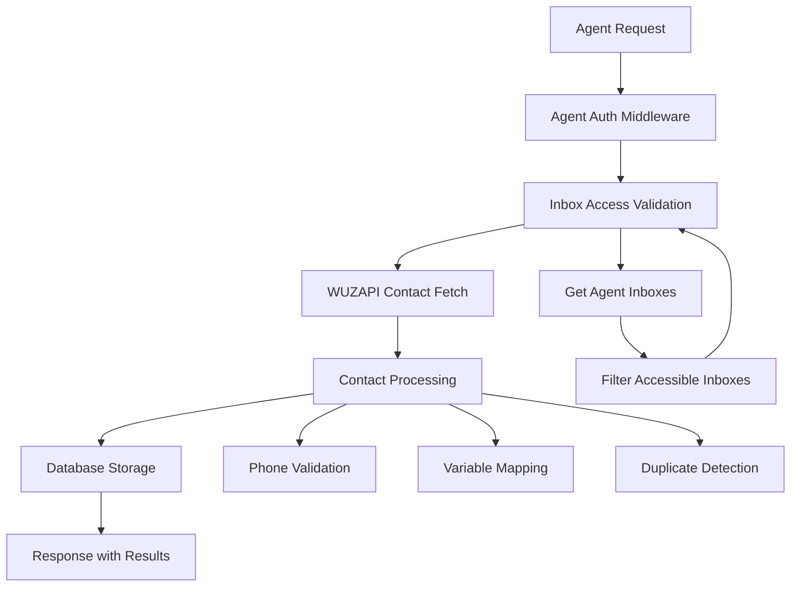
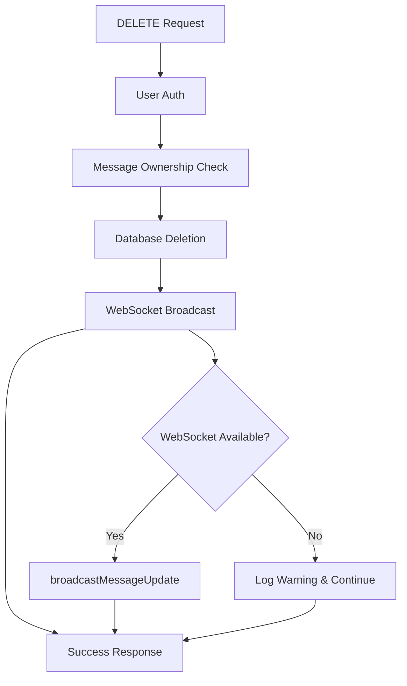

# Design Document

## Overview

This design addresses two critical issues in the WUZAPI Manager system:

1. **Agent Contact Import Parity**: Agents currently lack the same contact import functionality available to users, creating an inconsistent user experience and limiting agent productivity.

2. **Message Deletion WebSocket Error**: The DELETE endpoint for chat messages fails due to calling a non-existent WebSocket method (`broadcastMessageDeleted` instead of `broadcastMessageUpdate`).

The solution involves creating agent-specific contact import routes and components that mirror user functionality, while fixing the WebSocket method call in the message deletion endpoint.

## Architecture

### Current State Analysis

**User Contact Import Flow:**
```
User → ContactImportButton → contactImportService → /api/import/wuzapi → WUZAPI API
```

**Agent Contact Import Flow (Missing):**
```
Agent → AgentContactsPage → [NO IMPORT FUNCTIONALITY] → ❌
```

**Message Deletion Flow (Broken):**
```
DELETE /api/chat/inbox/messages/:id → chatHandler.broadcastMessageDeleted() → ❌ Method not found
```

### Target Architecture

**Enhanced Agent Contact Import Flow:**
```
Agent → AgentContactsPage → AgentContactImportButton → agentContactService → /api/agent/contacts/import → WUZAPI API
```

**Fixed Message Deletion Flow:**
```
DELETE /api/chat/inbox/messages/:id → chatHandler.broadcastMessageUpdate() → ✅ WebSocket broadcast
```

## Components and Interfaces

### 1. Agent Contact Import Components

#### AgentContactImportButton Component
```typescript
interface AgentContactImportButtonProps {
  inboxId?: string;
  agentToken: string;
  onImportComplete?: (contacts: Contact[], total: number) => void;
  disabled?: boolean;
  variant?: 'default' | 'outline' | 'ghost';
  size?: 'default' | 'sm' | 'lg' | 'icon';
  className?: string;
  maxRetries?: number;
}
```

**Key Features:**
- Reuses existing ContactImportButton logic
- Adapts to agent authentication context
- Supports inbox-scoped imports
- Maintains same retry and error handling patterns

#### AgentContactImportService
```typescript
interface AgentContactImportService {
  importFromWuzapi(agentToken: string, inboxId?: string): Promise<ImportResult>;
  validateCSV(file: File): Promise<ValidationResult>;
  importFromCSV(contacts: Contact[], agentToken: string, inboxId?: string): Promise<ImportResult>;
}

interface ImportResult {
  success: boolean;
  contacts: Contact[];
  total: number;
  errors?: ImportError[];
  warning?: string;
}
```

### 2. Backend Agent Contact Routes

#### Agent Contact Import Endpoint
```javascript
// POST /api/agent/contacts/import/wuzapi
router.post('/contacts/import/wuzapi', requireAgentAuth(null), async (req, res) => {
  // Implementation details in tasks
});

// POST /api/agent/contacts/import/csv
router.post('/contacts/import/csv', requireAgentAuth(null), upload.single('file'), async (req, res) => {
  // Implementation details in tasks
});
```

### 3. WebSocket Handler Fix

#### Current Broken Implementation
```javascript
// ❌ BROKEN: Method doesn't exist
chatHandler.broadcastMessageDeleted(conversationId, messageId);
```

#### Fixed Implementation
```javascript
// ✅ FIXED: Use existing method with proper parameters
chatHandler.broadcastMessageUpdate(conversationId, {
  id: messageId,
  content: '🚫 Esta mensagem foi apagada',
  is_edited: false,
  is_deleted: true
});
```

## Data Models

### Agent Contact Import Data Flow



### Message Deletion WebSocket Flow



## Correctness Properties

*A property is a characteristic or behavior that should hold true across all valid executions of a system-essentially, a formal statement about what the system should do. Properties serve as the bridge between human-readable specifications and machine-verifiable correctness guarantees.*

### Property Reflection

After analyzing the prework, I identified several redundant properties that can be consolidated:

- Properties 1.2, 1.3, 1.4, and 1.5 all relate to agent import functionality and can be combined into comprehensive properties
- Properties 2.1, 2.2, and 2.4 all relate to message deletion behavior and can be consolidated
- Properties 3.2 and 3.3 overlap in testing WebSocket method consistency
- Properties 4.1, 4.2, and 4.3 all test error handling patterns and can be combined

### Core Properties

**Property 1: Agent Import Functionality Parity**
*For any* agent with valid authentication and inbox access, all contact import methods (WUZAPI, CSV, manual) should work identically to user import methods with proper inbox scoping
**Validates: Requirements 1.2, 1.3, 1.4, 1.5**

**Property 2: Message Deletion Completeness**
*For any* valid message deletion request, the system should successfully remove the message from the database and broadcast the update via WebSocket using the correct method
**Validates: Requirements 2.1, 2.2, 2.4**

**Property 3: WebSocket Graceful Degradation**
*For any* operation that includes WebSocket broadcasting, if the WebSocket handler is unavailable or methods are missing, the primary operation should still complete successfully
**Validates: Requirements 2.3, 3.4, 3.5**

**Property 4: WebSocket Method Consistency**
*For any* message update operation (edit or delete), the system should use the same WebSocket method (broadcastMessageUpdate) with appropriate parameters
**Validates: Requirements 3.2, 3.3**

**Property 5: Comprehensive Error Handling**
*For any* failed operation (import or deletion), the system should log detailed error information with context while continuing to function properly
**Validates: Requirements 4.1, 4.2, 4.3, 4.5**

## Error Handling

### Agent Import Error Scenarios

1. **Authentication Failures**
   - Invalid agent token → 401 Unauthorized
   - Expired token → 401 Unauthorized with refresh prompt

2. **Authorization Failures**
   - No inbox access → 403 Forbidden
   - Inbox not found → 404 Not Found

3. **WUZAPI Integration Errors**
   - Service unavailable → 503 Service Unavailable with retry
   - Rate limiting → 429 Too Many Requests with backoff
   - Invalid response → 502 Bad Gateway

4. **Data Processing Errors**
   - Invalid CSV format → 400 Bad Request with details
   - Phone validation failures → Partial success with error list
   - Database errors → 500 Internal Server Error

### Message Deletion Error Scenarios

1. **Authentication/Authorization**
   - Invalid user token → 401 Unauthorized
   - Message not owned by user → 403 Forbidden

2. **Data Integrity**
   - Message not found → 404 Not Found
   - Database deletion failure → 500 Internal Server Error

3. **WebSocket Failures**
   - Handler unavailable → Log warning, continue operation
   - Method not found → Log error, continue operation
   - Broadcast failure → Log error, continue operation

## Testing Strategy

### Unit Testing Approach

**Agent Import Components:**
- Test component rendering with different props
- Test error states and loading states
- Test callback invocation on success/failure
- Mock service calls and verify parameters

**Backend Route Testing:**
- Test authentication and authorization middleware
- Test WUZAPI integration with mocked responses
- Test CSV processing with various file formats
- Test database operations with mocked data

**WebSocket Handler Testing:**
- Test method existence validation
- Test graceful fallback behavior
- Test parameter transformation for message updates

### Property-Based Testing Configuration

- **Framework**: Use Vitest with fast-check for property-based testing
- **Iterations**: Minimum 100 iterations per property test
- **Test Environment**: Node.js test runner for backend, Vitest for frontend
- **Generators**: Custom generators for agent tokens, inbox configurations, contact data, and message objects

**Property Test Examples:**

```typescript
// Property 1: Agent Import Functionality Parity
test('Agent import methods work identically to user methods', async () => {
  await fc.assert(fc.asyncProperty(
    fc.record({
      agentToken: fc.string({ minLength: 10 }),
      inboxIds: fc.array(fc.string(), { minLength: 1 }),
      contacts: fc.array(contactGenerator())
    }),
    async ({ agentToken, inboxIds, contacts }) => {
      // Test that agent import produces same results as user import
      // with proper inbox scoping
    }
  ), { numRuns: 100 });
});

// Property 2: Message Deletion Completeness  
test('Message deletion removes from DB and broadcasts via WebSocket', async () => {
  await fc.assert(fc.asyncProperty(
    fc.record({
      messageId: fc.string(),
      conversationId: fc.string(),
      userToken: fc.string()
    }),
    async ({ messageId, conversationId, userToken }) => {
      // Test that deletion removes from DB and calls broadcastMessageUpdate
    }
  ), { numRuns: 100 });
});
```

### Integration Testing

**End-to-End Agent Import Flow:**
1. Agent authentication
2. Inbox access validation  
3. WUZAPI contact fetching
4. Contact processing and storage
5. UI update with results

**End-to-End Message Deletion Flow:**
1. User authentication
2. Message ownership validation
3. Database deletion
4. WebSocket broadcast
5. UI update

### Manual Testing Scenarios

**Agent Contact Import:**
- Test with different agent roles and inbox assignments
- Test with various WUZAPI response formats
- Test CSV uploads with different formats and sizes
- Test error scenarios (network failures, invalid data)

**Message Deletion:**
- Test deletion from different conversation types
- Test with WebSocket connected and disconnected
- Test concurrent deletions
- Test deletion of different message types (text, media, system)