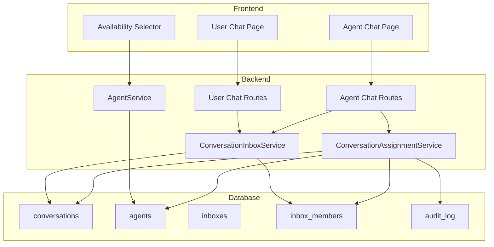

# Design Document: Agent Conversation Assignment

## Overview

Este documento descreve o design do sistema de atribuição automática de conversas para agentes. O sistema distribui automaticamente novas conversas entre agentes online usando round-robin, permite que agentes vejam apenas conversas atribuídas a eles ou disponíveis, e mantém visibilidade total para usuários/owners.

## Architecture



## Components and Interfaces

### 1. ConversationAssignmentService (New)

Serviço responsável pela lógica de atribuição de conversas.

```javascript
class ConversationAssignmentService {
  /**
   * Auto-assign a new conversation to an available agent
   * @param {string} inboxId - Inbox ID
   * @param {number} conversationId - Conversation ID
   * @returns {Promise<string|null>} Assigned agent ID or null
   */
  async autoAssign(inboxId, conversationId)
  
  /**
   * Get next agent for round-robin assignment
   * @param {string} inboxId - Inbox ID
   * @returns {Promise<string|null>} Agent ID or null
   */
  async getNextAvailableAgent(inboxId)
  
  /**
   * Transfer conversation to another agent
   * @param {number} conversationId - Conversation ID
   * @param {string} targetAgentId - Target agent ID
   * @param {string} sourceAgentId - Source agent ID (for audit)
   */
  async transferConversation(conversationId, targetAgentId, sourceAgentId)
  
  /**
   * Release conversation back to pool
   * @param {number} conversationId - Conversation ID
   * @param {string} agentId - Agent releasing (for audit)
   */
  async releaseConversation(conversationId, agentId)
  
  /**
   * Assign conversation when agent picks it up
   * @param {number} conversationId - Conversation ID
   * @param {string} agentId - Agent picking up
   */
  async pickupConversation(conversationId, agentId)
  
  /**
   * Get count of active conversations for an agent
   * @param {string} agentId - Agent ID
   * @returns {Promise<number>} Count of assigned conversations
   */
  async getAgentConversationCount(agentId)
}
```

### 2. Modified Agent Chat Routes

Atualização das rotas para filtrar por atribuição:

```javascript
// GET /api/agent/chat/conversations
// Filters: assignedToMe, unassigned, all (for inbox members)

// POST /api/agent/chat/conversations/:id/pickup
// Assigns unassigned conversation to current agent

// POST /api/agent/chat/conversations/:id/transfer
// Transfers conversation to another agent

// POST /api/agent/chat/conversations/:id/release
// Releases conversation back to pool
```

### 3. Modified Inbox Configuration

Adicionar configurações de auto-atribuição:

```javascript
// inboxes table additions:
// - auto_assignment_enabled BOOLEAN DEFAULT true
// - max_conversations_per_agent INTEGER DEFAULT NULL
// - last_assigned_agent_id TEXT (for round-robin tracking)
```

## Data Models

### Conversation (Updated)

```sql
-- Existing fields used:
-- assigned_agent_id TEXT REFERENCES agents(id) ON DELETE SET NULL

-- No new fields needed, just proper usage of existing field
```

### Inbox (Updated)

```sql
ALTER TABLE inboxes ADD COLUMN auto_assignment_enabled BOOLEAN DEFAULT 1;
ALTER TABLE inboxes ADD COLUMN max_conversations_per_agent INTEGER DEFAULT NULL;
ALTER TABLE inboxes ADD COLUMN last_assigned_agent_id TEXT;
```

### Agent Availability States

```
online   - Available for new assignments
offline  - Not available, excluded from pool
busy     - Not available for new assignments, keeps existing
away     - Not available for new assignments, keeps existing
```

## Correctness Properties

*A property is a characteristic or behavior that should hold true across all valid executions of a system-essentially, a formal statement about what the system should do. Properties serve as the bridge between human-readable specifications and machine-verifiable correctness guarantees.*

### Property 1: Auto-assignment targets online agents only
*For any* new conversation in an inbox with auto-assignment enabled, if assigned, the assigned agent SHALL be online and a member of that inbox.
**Validates: Requirements 1.1, 4.1, 4.2**

### Property 2: Round-robin distribution balance
*For any* sequence of N new conversations assigned to an inbox with K online agents, the difference in assignment count between any two agents SHALL be at most 1.
**Validates: Requirements 1.2**

### Property 3: No assignment when no agents online
*For any* new conversation in an inbox where no agents are online, the assigned_agent_id SHALL be NULL.
**Validates: Requirements 1.3**

### Property 4: Agent visibility filter
*For any* agent viewing conversations, the returned list SHALL contain only conversations where assigned_agent_id equals the agent's ID OR assigned_agent_id is NULL, AND the conversation is in an inbox the agent is a member of.
**Validates: Requirements 2.1, 2.4**

### Property 5: Pickup assigns to requesting agent
*For any* unassigned conversation that an agent picks up, the assigned_agent_id SHALL be set to that agent's ID.
**Validates: Requirements 2.3**

### Property 6: Owner sees all conversations
*For any* user/owner viewing conversations, the returned list SHALL contain all conversations regardless of assigned_agent_id value.
**Validates: Requirements 3.1, 3.4**

### Property 7: Transfer updates assignment
*For any* conversation transfer from agent A to agent B, the assigned_agent_id SHALL change from A to B.
**Validates: Requirements 5.1, 5.2, 5.3**

### Property 8: Release clears assignment
*For any* conversation release, the assigned_agent_id SHALL be set to NULL.
**Validates: Requirements 6.1, 6.2**

### Property 9: Release does not trigger auto-assignment
*For any* conversation release, the conversation SHALL remain unassigned (assigned_agent_id = NULL) immediately after release.
**Validates: Requirements 6.3**

### Property 10: Disabled auto-assignment leaves conversations unassigned
*For any* new conversation in an inbox with auto_assignment_enabled = false, the assigned_agent_id SHALL be NULL.
**Validates: Requirements 7.2**

### Property 11: Max conversations limit respected
*For any* agent with N assigned conversations where N equals the inbox's max_conversations_per_agent, that agent SHALL NOT receive new auto-assignments.
**Validates: Requirements 7.4**

### Property 12: Logout sets offline
*For any* agent logout event, the agent's availability SHALL be set to 'offline'.
**Validates: Requirements 4.5**

## Error Handling

### Assignment Errors
- If auto-assignment fails, log error and leave conversation unassigned
- If transfer target agent doesn't exist, return 404 error
- If agent tries to pickup already-assigned conversation, return 409 conflict

### Concurrency Handling
- Use database transactions for assignment operations
- Implement optimistic locking for pickup operations to prevent race conditions
- If two agents try to pickup same conversation, first one wins

### Validation Errors
- Validate agent is member of inbox before allowing pickup
- Validate target agent is member of inbox before allowing transfer
- Validate conversation exists before any operation

## Testing Strategy

### Dual Testing Approach

This feature requires both unit tests and property-based tests:

**Unit Tests:**
- Test individual service methods with specific inputs
- Test edge cases (empty inbox, single agent, etc.)
- Test error conditions (invalid IDs, permission denied)

**Property-Based Tests:**
- Use `fast-check` library for JavaScript property-based testing
- Generate random inboxes, agents, and conversations
- Verify properties hold across all generated inputs
- Minimum 100 iterations per property test

### Test File Structure

```
server/services/ConversationAssignmentService.test.js      # Unit tests
server/services/ConversationAssignmentService.property.test.js  # Property tests
```

### Property Test Annotations

Each property-based test MUST include a comment referencing the correctness property:
```javascript
// **Feature: agent-conversation-assignment, Property 1: Auto-assignment targets online agents only**
// **Validates: Requirements 1.1, 4.1, 4.2**
```

