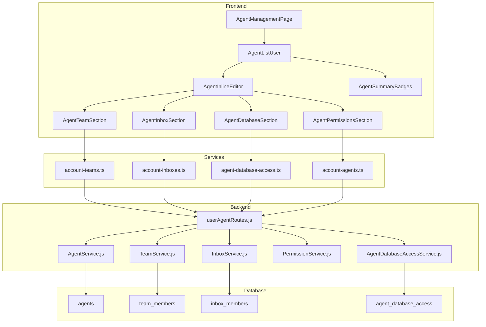

# Design Document: Agent Permissions Management

## Overview

Este documento descreve o design para o sistema de gerenciamento avançado de permissões de agentes. A solução transforma a interface atual de edição via dialog para uma experiência inline na tabela, permitindo configuração granular de times, inboxes, databases e permissões do sistema.

## Architecture



## Components and Interfaces

### Frontend Components

#### AgentInlineEditor
Componente principal de edição inline que expande abaixo da linha do agente.

```typescript
interface AgentInlineEditorProps {
  agent: Agent
  teams: Team[]
  inboxes: Inbox[]
  databaseConnections: DatabaseConnection[]
  customRoles: CustomRole[]
  onSave: (updates: AgentUpdates) => Promise<void>
  onCancel: () => void
  isExpanded: boolean
}

interface AgentUpdates {
  name?: string
  avatarUrl?: string
  availability?: AvailabilityStatus
  role?: AgentRole
  customRoleId?: string | null
  teamIds?: string[]
  inboxIds?: string[]
  databaseAccess?: DatabaseAccessConfig[]
  permissions?: string[]
}
```

#### AgentTeamSection
Seção para gerenciar atribuição de times.

```typescript
interface AgentTeamSectionProps {
  agentId: string
  currentTeamIds: string[]
  availableTeams: Team[]
  onChange: (teamIds: string[]) => void
  disabled?: boolean
}
```

#### AgentInboxSection
Seção para gerenciar atribuição de inboxes.

```typescript
interface AgentInboxSectionProps {
  agentId: string
  currentInboxIds: string[]
  availableInboxes: Inbox[]
  onChange: (inboxIds: string[]) => void
  disabled?: boolean
}
```

#### AgentDatabaseSection
Seção para gerenciar acesso a databases.

```typescript
interface AgentDatabaseSectionProps {
  agentId: string
  currentAccess: DatabaseAccessConfig[]
  availableConnections: DatabaseConnection[]
  onChange: (access: DatabaseAccessConfig[]) => void
  disabled?: boolean
}

interface DatabaseAccessConfig {
  connectionId: string
  accessLevel: 'none' | 'view' | 'full'
}
```

#### AgentPermissionsSection
Seção para gerenciar permissões granulares.

```typescript
interface AgentPermissionsSectionProps {
  agentId: string
  currentRole: AgentRole
  currentPermissions: string[]
  customRoleId?: string | null
  availableRoles: CustomRole[]
  allPermissions: string[]
  onChange: (role: AgentRole, permissions: string[], customRoleId?: string) => void
  disabled?: boolean
}
```

#### AgentSummaryBadges
Componente para exibir resumo de configurações na lista.

```typescript
interface AgentSummaryBadgesProps {
  agent: AgentWithDetails
  onTeamClick?: () => void
  onInboxClick?: () => void
  onDatabaseClick?: () => void
}

interface AgentWithDetails extends Agent {
  teams: Team[]
  inboxes: Inbox[]
  databaseAccessCount: number
  hasCustomPermissions: boolean
}
```

### Backend Services

#### AgentDatabaseAccessService
Novo serviço para gerenciar acesso de agentes a databases.

```javascript
class AgentDatabaseAccessService {
  constructor(db) {}
  
  // Get database access for an agent
  async getAgentDatabaseAccess(agentId: string): Promise<DatabaseAccessConfig[]>
  
  // Set database access for an agent
  async setAgentDatabaseAccess(agentId: string, access: DatabaseAccessConfig[]): Promise<void>
  
  // Check if agent has access to a database
  async checkDatabaseAccess(agentId: string, connectionId: string): Promise<AccessLevel>
  
  // Get accessible databases for an agent
  async getAccessibleDatabases(agentId: string): Promise<DatabaseConnection[]>
}
```

### API Endpoints

#### GET /api/user/agents/:agentId/details
Retorna detalhes completos do agente incluindo teams, inboxes e database access.

```typescript
interface AgentDetailsResponse {
  agent: Agent
  teams: Team[]
  inboxes: Inbox[]
  databaseAccess: DatabaseAccessConfig[]
  permissions: string[]
}
```

#### PUT /api/user/agents/:agentId/teams
Atualiza atribuição de times do agente.

```typescript
interface UpdateTeamsRequest {
  teamIds: string[]
}
```

#### PUT /api/user/agents/:agentId/inboxes
Atualiza atribuição de inboxes do agente.

```typescript
interface UpdateInboxesRequest {
  inboxIds: string[]
}
```

#### PUT /api/user/agents/:agentId/database-access
Atualiza configuração de acesso a databases.

```typescript
interface UpdateDatabaseAccessRequest {
  access: DatabaseAccessConfig[]
}
```

#### PUT /api/user/agents/:agentId/permissions
Atualiza permissões do agente.

```typescript
interface UpdatePermissionsRequest {
  role?: AgentRole
  customRoleId?: string | null
  permissions?: string[]
}
```

#### POST /api/user/agents/bulk
Aplica ações em massa em múltiplos agentes.

```typescript
interface BulkActionRequest {
  agentIds: string[]
  action: 'addTeams' | 'removeTeams' | 'addInboxes' | 'removeInboxes' | 'setRole' | 'setDatabaseAccess'
  data: any
}
```

## Data Models

### agent_database_access (Nova Tabela)

```sql
CREATE TABLE agent_database_access (
  id TEXT PRIMARY KEY,
  agent_id TEXT NOT NULL,
  connection_id TEXT NOT NULL,
  access_level TEXT DEFAULT 'none' CHECK(access_level IN ('none', 'view', 'full')),
  created_at DATETIME DEFAULT CURRENT_TIMESTAMP,
  updated_at DATETIME DEFAULT CURRENT_TIMESTAMP,
  FOREIGN KEY (agent_id) REFERENCES agents(id) ON DELETE CASCADE,
  FOREIGN KEY (connection_id) REFERENCES database_connections(id) ON DELETE CASCADE,
  UNIQUE(agent_id, connection_id)
);

CREATE INDEX idx_agent_database_access_agent ON agent_database_access(agent_id);
CREATE INDEX idx_agent_database_access_connection ON agent_database_access(connection_id);
```

### Extensão do Agent Type

```typescript
interface AgentWithAccess extends Agent {
  teams: Team[]
  inboxes: Inbox[]
  databaseAccess: DatabaseAccessConfig[]
  effectivePermissions: string[]
}
```

## Correctness Properties

*A property is a characteristic or behavior that should hold true across all valid executions of a system-essentially, a formal statement about what the system should do. Properties serve as the bridge between human-readable specifications and machine-verifiable correctness guarantees.*

### Property 1: Inline Editor State Consistency
*For any* agent and expansion state change, when the inline editor is expanded, all configurable sections (teams, inboxes, databases, permissions) SHALL be rendered with the agent's current configuration data.
**Validates: Requirements 1.1, 1.2**

### Property 2: Dirty State Tracking
*For any* form field change in the inline editor, the isDirty state SHALL become true, and the original values SHALL be preserved for potential reset.
**Validates: Requirements 1.3, 1.5**

### Property 3: Team Membership Consistency
*For any* agent and team assignment operation, the agent's team memberships SHALL exactly match the selected team IDs after save, and the team_members table SHALL reflect this state.
**Validates: Requirements 2.2, 2.4**

### Property 4: Inbox Access Consistency
*For any* agent and inbox assignment operation, the agent's inbox access SHALL exactly match the selected inbox IDs after save, and the inbox_members table SHALL reflect this state.
**Validates: Requirements 3.2, 3.4**

### Property 5: Database Access Level Enforcement
*For any* agent with a specific database access level, the system SHALL enforce that access level: 'none' hides the database, 'view' allows only read operations, 'full' allows all CRUD operations.
**Validates: Requirements 4.3, 4.4, 4.5**

### Property 6: Role-Permission Mapping
*For any* predefined role selection, the agent's effective permissions SHALL exactly match the DEFAULT_ROLE_PERMISSIONS for that role, unless custom permissions are explicitly set.
**Validates: Requirements 5.2, 5.4**

### Property 7: Permission Escalation Prevention
*For any* permission grant operation, the granting user SHALL NOT be able to grant permissions they themselves do not possess.
**Validates: Requirements 8.2**

### Property 8: Self-Demotion Prevention
*For any* owner attempting to change their own role, the system SHALL prevent the operation and maintain the owner role.
**Validates: Requirements 8.1**

### Property 9: Bulk Operation Atomicity
*For any* bulk operation on a set of agents, either all agents SHALL be updated successfully, or none SHALL be updated (transaction rollback).
**Validates: Requirements 7.2, 7.3, 7.4**

### Property 10: Summary Badge Accuracy
*For any* agent displayed in the list, the summary badges SHALL accurately reflect the current count of teams, inboxes, and database access configurations.
**Validates: Requirements 6.1, 6.2, 6.3**

## Error Handling

### Frontend Errors

| Error | Handling |
|-------|----------|
| Network failure during save | Show toast error, keep editor open with unsaved changes |
| Validation error | Highlight invalid fields, show inline error messages |
| Permission denied | Show toast error, disable save button |
| Concurrent modification | Show conflict dialog, offer to reload or force save |

### Backend Errors

| Error | HTTP Status | Response |
|-------|-------------|----------|
| Agent not found | 404 | `{ error: 'AGENT_NOT_FOUND' }` |
| Permission denied | 403 | `{ error: 'PERMISSION_DENIED' }` |
| Invalid team/inbox ID | 400 | `{ error: 'INVALID_RESOURCE_ID' }` |
| Self-demotion attempt | 400 | `{ error: 'CANNOT_DEMOTE_SELF' }` |
| Permission escalation | 403 | `{ error: 'CANNOT_GRANT_PERMISSION' }` |
| Quota exceeded | 403 | `{ error: 'QUOTA_EXCEEDED' }` |

## Testing Strategy

### Unit Testing

- Test AgentInlineEditor component rendering with various agent configurations
- Test form validation for all editable fields
- Test dirty state tracking and reset functionality
- Test permission validation logic
- Test database access level enforcement

### Property-Based Testing

A biblioteca **fast-check** será utilizada para testes de propriedade no frontend (TypeScript/Vitest).

Para o backend (Node.js), será utilizado o **node:test** runner com **fast-check** para property-based testing.

Cada teste de propriedade DEVE:
1. Ser configurado para executar no mínimo 100 iterações
2. Incluir um comentário referenciando a propriedade do design: `**Feature: agent-permissions-management, Property {number}: {property_text}**`
3. Usar geradores inteligentes que constrainem o espaço de entrada de forma apropriada

### Integration Testing

- Test full flow: expand editor → make changes → save → verify persistence
- Test team assignment flow with TeamService
- Test inbox assignment flow with InboxService
- Test database access configuration with AgentDatabaseAccessService
- Test bulk operations with multiple agents

### E2E Testing (Cypress)

- Test inline editor expansion and collapse
- Test tab navigation within editor
- Test save and cancel flows
- Test bulk selection and actions
- Test permission enforcement in UI

