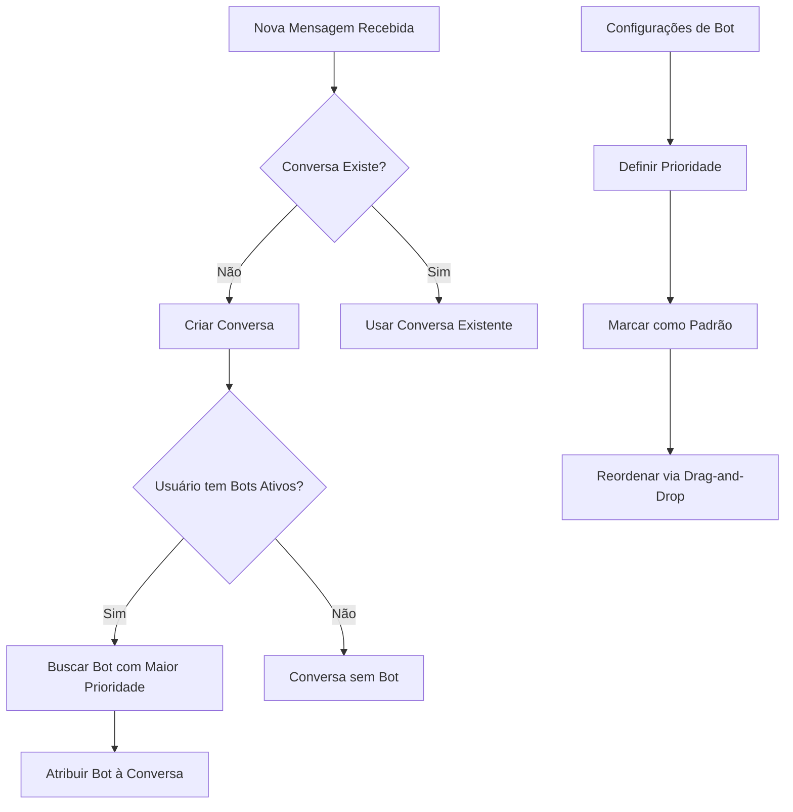

# Design Document: Bot Auto-Assignment

## Overview

Esta funcionalidade permite que novas conversas sejam automaticamente atribuídas ao bot padrão do usuário. Usuários podem definir a ordem de prioridade dos bots, e o sistema seleciona automaticamente o bot ativo com maior prioridade para novas conversas.

## Architecture



## Components and Interfaces

### Backend

#### Database Schema Changes

Adicionar coluna `priority` na tabela `agent_bots`:

```sql
ALTER TABLE agent_bots ADD COLUMN priority INTEGER DEFAULT 999;
ALTER TABLE agent_bots ADD COLUMN is_default BOOLEAN DEFAULT 0;
```

#### BotService Updates

```javascript
// Novos métodos no BotService
class BotService {
  // Buscar bot padrão ativo do usuário
  async getDefaultBot(userId) { }
  
  // Definir bot como padrão
  async setDefaultBot(botId, userId) { }
  
  // Atualizar prioridades após reordenação
  async updatePriorities(userId, botPriorities) { }
  
  // Buscar bot ativo com maior prioridade
  async getHighestPriorityActiveBot(userId) { }
}
```

#### ChatService Updates

```javascript
// Modificar getOrCreateConversation para atribuir bot automaticamente
async getOrCreateConversation(userId, contactJid, contactInfo = {}) {
  // ... código existente ...
  
  // Após criar nova conversa, atribuir bot padrão
  const defaultBot = await botService.getHighestPriorityActiveBot(userId);
  if (defaultBot) {
    await this.assignBotToConversation(conversationId, defaultBot.id);
  }
}
```

### Frontend

#### BotSettings Component Updates

- Adicionar indicador visual de prioridade
- Adicionar botão "Definir como Padrão"
- Implementar drag-and-drop para reordenação
- Destacar bot padrão visualmente

#### API Service Updates

```typescript
// Novos endpoints
async function setDefaultBot(botId: number): Promise<AgentBot>
async function updateBotPriorities(priorities: { id: number; priority: number }[]): Promise<void>
```

## Data Models

### AgentBot (Updated)

```typescript
interface AgentBot {
  id: number
  userId: string
  name: string
  description: string | null
  avatarUrl: string | null
  outgoingUrl: string
  accessToken: string
  status: 'active' | 'paused'
  priority: number        // NEW: Ordem de prioridade (1 = maior)
  isDefault: boolean      // NEW: Se é o bot padrão
  createdAt: string
  updatedAt: string
  assignedConversations?: number
}
```

### UpdateBotPrioritiesRequest

```typescript
interface UpdateBotPrioritiesRequest {
  priorities: Array<{
    id: number
    priority: number
  }>
}
```

## Correctness Properties

*A property is a characteristic or behavior that should hold true across all valid executions of a system-essentially, a formal statement about what the system should do. Properties serve as the bridge between human-readable specifications and machine-verifiable correctness guarantees.*

### Property 1: Auto-assignment selects highest priority active bot
*For any* new conversation created for a user with active bots, the assigned bot SHALL be the active bot with the lowest priority number (highest priority).
**Validates: Requirements 1.1, 1.3**

### Property 2: Priority persistence round-trip
*For any* bot priority update, reading the priority immediately after writing SHALL return the same value that was written.
**Validates: Requirements 2.2**

### Property 3: New bots get lowest priority
*For any* newly created bot, its priority SHALL be greater than or equal to all existing bots' priorities for that user.
**Validates: Requirements 2.3**

### Property 4: Default bot uniqueness
*For any* user, at most one bot SHALL have isDefault=true at any given time.
**Validates: Requirements 3.1, 3.2**

### Property 5: Default bot has priority 1
*For any* bot marked as default, its priority SHALL be 1.
**Validates: Requirements 3.1**

### Property 6: Reorder preserves all bots
*For any* reorder operation, the set of bot IDs before and after reordering SHALL be identical.
**Validates: Requirements 4.1**

### Property 7: First position becomes default
*For any* bot moved to priority 1 via reordering, that bot SHALL become the default bot.
**Validates: Requirements 4.2**

## Error Handling

| Scenario | Handling |
|----------|----------|
| No active bots | Conversa criada sem bot atribuído |
| Bot padrão pausado | Próximo bot ativo na ordem é selecionado |
| Todos bots pausados | Conversa criada sem bot atribuído |
| Erro ao salvar prioridades | Reverter UI, exibir toast de erro |
| Bot padrão excluído | Próximo bot na ordem promovido automaticamente |

## Testing Strategy

### Unit Tests

- Testar `getHighestPriorityActiveBot` com diferentes cenários de bots
- Testar `setDefaultBot` garante unicidade
- Testar `updatePriorities` mantém consistência

### Property-Based Tests

Usar fast-check para gerar cenários aleatórios:

1. **Property 1**: Gerar lista de bots com prioridades e status aleatórios, verificar seleção correta
2. **Property 2**: Gerar prioridades aleatórias, verificar round-trip
3. **Property 3**: Criar bots em sequência, verificar prioridades crescentes
4. **Property 4**: Marcar bots como padrão em sequência, verificar unicidade
5. **Property 5**: Marcar bot como padrão, verificar prioridade = 1
6. **Property 6**: Reordenar bots, verificar preservação de IDs
7. **Property 7**: Mover bot para primeira posição, verificar isDefault

### Integration Tests

- Testar fluxo completo de criação de conversa com atribuição automática
- Testar reordenação via API
- Testar exclusão de bot padrão e promoção automática
