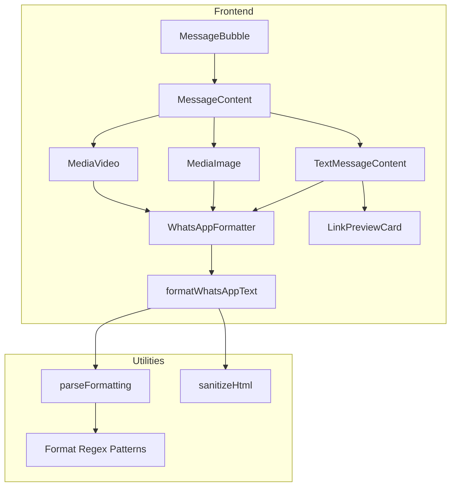

# Design Document: Chat Message Formatting

## Overview

Este documento descreve o design para modernizar a formatação de mensagens no chat do WUZAPI Manager. A solução implementa um parser de formatação WhatsApp, melhora a renderização de captions em mídias, e aprimora os link previews para redes sociais.

## Architecture



## Components and Interfaces

### 1. WhatsAppFormatter Utility

Utilitário responsável por converter texto com formatação WhatsApp em React nodes.

```typescript
// src/lib/whatsapp-formatter.ts

interface FormattedSegment {
  type: 'text' | 'bold' | 'italic' | 'strikethrough' | 'monospace'
  content: string
  children?: FormattedSegment[]
}

interface FormatOptions {
  linkify?: boolean
  preserveLineBreaks?: boolean
  sanitize?: boolean
}

/**
 * Converte texto com formatação WhatsApp em React nodes
 */
function formatWhatsAppText(
  text: string, 
  options?: FormatOptions
): React.ReactNode

/**
 * Remove formatação e retorna texto puro
 */
function stripWhatsAppFormatting(text: string): string

/**
 * Verifica se o texto contém formatação WhatsApp
 */
function hasWhatsAppFormatting(text: string): boolean
```

### 2. Format Patterns

Padrões regex para detectar formatação WhatsApp:

```typescript
// Padrões de formatação WhatsApp
const WHATSAPP_PATTERNS = {
  // *bold* - não pode ter espaço após * inicial ou antes do * final
  bold: /\*([^\s*](?:[^*]*[^\s*])?)\*/g,
  
  // _italic_ - não pode ter espaço após _ inicial ou antes do _ final
  italic: /_([^\s_](?:[^_]*[^\s_])?)_/g,
  
  // ~strikethrough~ - não pode ter espaço após ~ inicial ou antes do ~ final
  strikethrough: /~([^\s~](?:[^~]*[^\s~])?)~/g,
  
  // ```monospace``` - pode ter qualquer conteúdo
  monospace: /```([^`]+)```/g,
}
```

### 3. Enhanced LinkPreviewCard

Componente aprimorado para previews de links com suporte a redes sociais:

```typescript
// src/components/features/chat/LinkPreviewCard.tsx

interface LinkPreviewData {
  url: string
  domain: string
  title: string
  description?: string
  image?: string
  favicon?: string
  platform?: 'instagram' | 'youtube' | 'tiktok' | 'twitter' | 'facebook' | 'linkedin' | 'generic'
}

interface LinkPreviewCardProps {
  url: string
  preview: LinkPreviewData | null
  isLoading: boolean
}
```

### 4. Platform Detection

Mapeamento de domínios para plataformas:

```typescript
const PLATFORM_PATTERNS: Record<string, { 
  platform: string
  icon: string
  color: string
  getTitle: (url: URL) => string 
}> = {
  'instagram.com': {
    platform: 'instagram',
    icon: 'Instagram',
    color: '#E4405F',
    getTitle: (url) => {
      if (url.pathname.includes('/p/')) return 'Post do Instagram'
      if (url.pathname.includes('/reel/')) return 'Reel do Instagram'
      if (url.pathname.includes('/stories/')) return 'Story do Instagram'
      return 'Instagram'
    }
  },
  'youtube.com': {
    platform: 'youtube',
    icon: 'Youtube',
    color: '#FF0000',
    getTitle: () => 'Vídeo do YouTube'
  },
  'youtu.be': {
    platform: 'youtube',
    icon: 'Youtube', 
    color: '#FF0000',
    getTitle: () => 'Vídeo do YouTube'
  },
  // ... outros
}
```

## Data Models

### FormattedMessage

```typescript
interface FormattedMessage {
  // Conteúdo original
  raw: string
  
  // Conteúdo formatado como React nodes
  formatted: React.ReactNode
  
  // URLs extraídas para preview
  urls: string[]
  
  // Indica se tem formatação
  hasFormatting: boolean
}
```

### MessageRenderContext

```typescript
interface MessageRenderContext {
  // Tipo de mensagem (text, image, video, etc)
  messageType: string
  
  // Se é caption de mídia
  isCaption: boolean
  
  // Query de busca para highlight
  searchQuery?: string
  
  // Se deve mostrar link preview
  showLinkPreview: boolean
}
```


## Correctness Properties

*A property is a characteristic or behavior that should hold true across all valid executions of a system-essentially, a formal statement about what the system should do. Properties serve as the bridge between human-readable specifications and machine-verifiable correctness guarantees.*

Based on the acceptance criteria analysis, the following correctness properties must be verified:

### Property 1: Formatting markers produce styled output

*For any* string containing valid WhatsApp formatting markers (`*text*`, `_text_`, `~text~`, ` ```text``` `), when processed by the formatter, the output SHALL contain the corresponding styled elements (bold, italic, strikethrough, monospace) with the inner text preserved.

**Validates: Requirements 1.1, 1.2, 1.3, 1.4**

### Property 2: Nested formatting applies all styles

*For any* string containing nested WhatsApp formatting (e.g., `*_text_*`), when processed by the formatter, the output SHALL contain all applicable styles applied to the inner text.

**Validates: Requirements 1.5**

### Property 3: Line breaks are preserved

*For any* string containing newline characters (`\n`), when processed by the formatter, the output SHALL contain the same number of line break elements as the input.

**Validates: Requirements 2.1**

### Property 4: Platform detection is accurate

*For any* URL from a known social media platform (Instagram, YouTube, TikTok, Twitter/X, Facebook, LinkedIn), the platform detector SHALL return the correct platform identifier.

**Validates: Requirements 3.1**

### Property 5: Parser is deterministic

*For any* input string, calling the formatter multiple times with the same input SHALL produce identical output.

**Validates: Requirements 5.2**

### Property 6: HTML is sanitized

*For any* string containing HTML tags or script elements, when processed by the formatter, the output SHALL NOT contain executable HTML or script content.

**Validates: Requirements 5.4**

## Error Handling

### Formatting Errors

- **Unmatched markers**: Display as plain text without breaking the message
- **Empty content between markers**: Display markers as plain text (e.g., `**` stays as `**`)
- **Malformed nested formatting**: Apply outer formatting only

### Link Preview Errors

- **Invalid URL**: Display URL as clickable text without preview card
- **Network timeout**: Show basic preview with domain only
- **Missing metadata**: Show domain and URL without additional info

### Edge Cases

- Empty strings: Return empty React fragment
- Whitespace-only strings: Preserve whitespace
- Very long messages: No truncation, allow natural text wrapping
- Unicode/emoji: Pass through unchanged

## Testing Strategy

### Dual Testing Approach

This feature requires both unit tests and property-based tests:

1. **Unit tests**: Verify specific formatting examples and edge cases
2. **Property-based tests**: Verify universal properties across random inputs

### Property-Based Testing Framework

**Framework**: fast-check (TypeScript property-based testing library)

**Configuration**: Minimum 100 iterations per property test

### Test Structure

```typescript
// Property test example
import fc from 'fast-check'

describe('WhatsAppFormatter', () => {
  // Property 1: Formatting markers produce styled output
  it('should apply bold styling to asterisk-wrapped text', () => {
    fc.assert(
      fc.property(
        fc.string({ minLength: 1 }).filter(s => !s.includes('*')),
        (text) => {
          const input = `*${text}*`
          const output = formatWhatsAppText(input)
          // Verify output contains bold element with text
          return containsBoldElement(output, text)
        }
      ),
      { numRuns: 100 }
    )
  })
})
```

### Unit Test Cases

1. **Basic formatting**:
   - `*bold*` → `<strong>bold</strong>`
   - `_italic_` → `<em>italic</em>`
   - `~strike~` → `<del>strike</del>`
   - ` ```code``` ` → `<code>code</code>`

2. **Nested formatting**:
   - `*_bold italic_*` → `<strong><em>bold italic</em></strong>`

3. **Edge cases**:
   - `* not bold *` → `* not bold *` (spaces after/before markers)
   - `**` → `**` (empty content)
   - `*unclosed` → `*unclosed` (unmatched marker)

4. **Mixed content**:
   - `Hello *world* and _universe_` → mixed formatted output
   - `Check this: https://example.com` → text with clickable link

### Test File Locations

- `src/lib/whatsapp-formatter.test.ts` - Unit tests
- `src/lib/whatsapp-formatter.property.test.ts` - Property-based tests
- `src/components/features/chat/LinkPreviewCard.test.tsx` - Component tests

## Implementation Notes

### Performance Considerations

- Regex patterns are compiled once and reused
- Link preview fetching is debounced
- Large messages are processed incrementally

### Security Considerations

- All user input is sanitized using DOMPurify before rendering
- URLs are validated before fetching previews
- No `dangerouslySetInnerHTML` without sanitization

### Browser Compatibility

- Uses native CSS for text styling (no polyfills needed)
- Emoji rendering relies on system fonts
- Link previews work in all modern browsers
