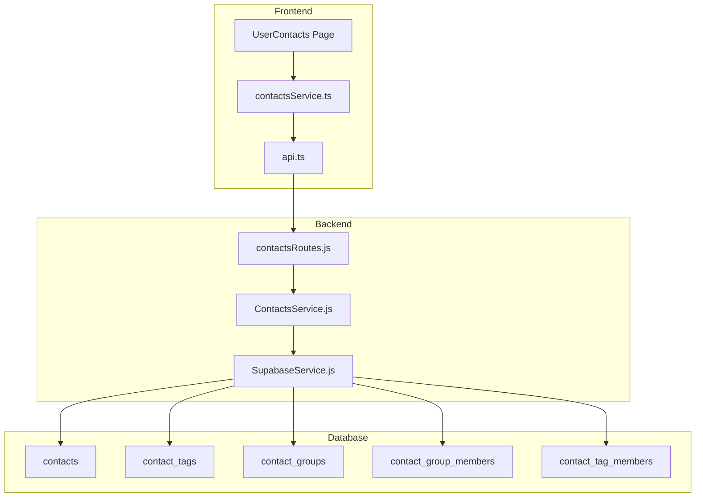
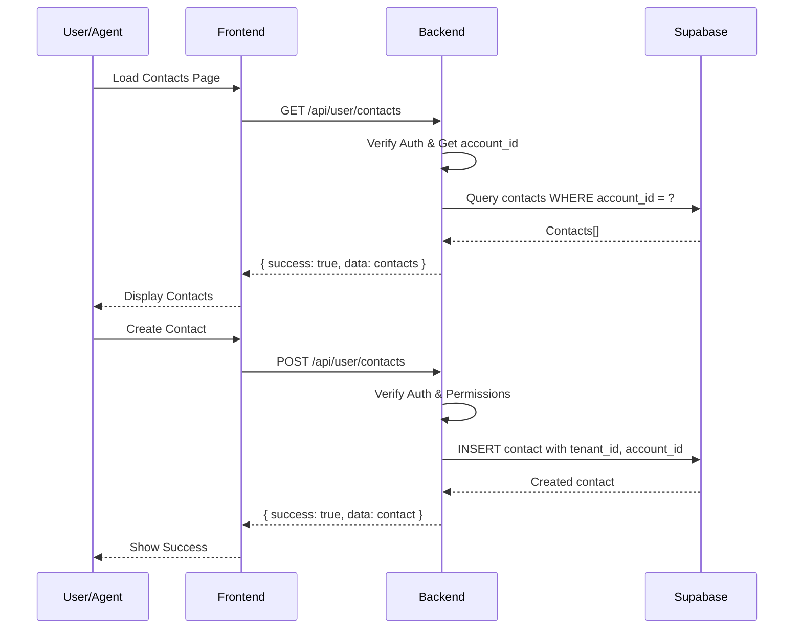

# Design Document: Contacts Database Migration

## Overview

Este documento descreve a arquitetura e implementação para migrar o sistema de contatos do localStorage para o Supabase, implementando isolamento multi-tenant adequado com hierarquia User → Agents → Teams.

A solução envolve:
1. Criação de novas tabelas no Supabase com RLS
2. Novo serviço backend para operações CRUD
3. Migração do frontend para usar API em vez de localStorage
4. Sistema de migração de dados existentes
5. Controle de permissões para agentes

## Architecture



### Data Flow



## Components and Interfaces

### Database Tables

#### contacts
```sql
CREATE TABLE contacts (
    id UUID PRIMARY KEY DEFAULT gen_random_uuid(),
    tenant_id UUID NOT NULL REFERENCES tenants(id),
    account_id UUID NOT NULL REFERENCES accounts(id),
    phone VARCHAR(20) NOT NULL,
    name VARCHAR(255),
    avatar_url TEXT,
    whatsapp_jid TEXT,
    source VARCHAR(50) DEFAULT 'manual', -- 'whatsapp', 'manual', 'import'
    linked_user_id UUID REFERENCES users(id),
    metadata JSONB DEFAULT '{}',
    last_import_at TIMESTAMPTZ,
    created_by UUID, -- account_id or agent_id
    created_by_type VARCHAR(20) DEFAULT 'account', -- 'account', 'agent'
    updated_by UUID,
    updated_by_type VARCHAR(20),
    created_at TIMESTAMPTZ DEFAULT now(),
    updated_at TIMESTAMPTZ DEFAULT now(),
    UNIQUE(account_id, phone)
);

-- RLS Policy
ALTER TABLE contacts ENABLE ROW LEVEL SECURITY;

CREATE POLICY contacts_tenant_isolation ON contacts
    USING (tenant_id = current_setting('app.tenant_id')::uuid);

CREATE POLICY contacts_account_access ON contacts
    USING (account_id = current_setting('app.account_id')::uuid);
```

#### contact_tags
```sql
CREATE TABLE contact_tags (
    id UUID PRIMARY KEY DEFAULT gen_random_uuid(),
    tenant_id UUID NOT NULL REFERENCES tenants(id),
    account_id UUID NOT NULL REFERENCES accounts(id),
    name VARCHAR(100) NOT NULL,
    color VARCHAR(7) DEFAULT '#1f93ff',
    created_at TIMESTAMPTZ DEFAULT now(),
    updated_at TIMESTAMPTZ DEFAULT now(),
    UNIQUE(account_id, name)
);

ALTER TABLE contact_tags ENABLE ROW LEVEL SECURITY;

CREATE POLICY contact_tags_account_access ON contact_tags
    USING (account_id = current_setting('app.account_id')::uuid);
```

#### contact_tag_members
```sql
CREATE TABLE contact_tag_members (
    id UUID PRIMARY KEY DEFAULT gen_random_uuid(),
    contact_id UUID NOT NULL REFERENCES contacts(id) ON DELETE CASCADE,
    tag_id UUID NOT NULL REFERENCES contact_tags(id) ON DELETE CASCADE,
    created_at TIMESTAMPTZ DEFAULT now(),
    UNIQUE(contact_id, tag_id)
);

ALTER TABLE contact_tag_members ENABLE ROW LEVEL SECURITY;
```

#### contact_groups
```sql
CREATE TABLE contact_groups (
    id UUID PRIMARY KEY DEFAULT gen_random_uuid(),
    tenant_id UUID NOT NULL REFERENCES tenants(id),
    account_id UUID NOT NULL REFERENCES accounts(id),
    name VARCHAR(100) NOT NULL,
    description TEXT,
    created_at TIMESTAMPTZ DEFAULT now(),
    updated_at TIMESTAMPTZ DEFAULT now(),
    UNIQUE(account_id, name)
);

ALTER TABLE contact_groups ENABLE ROW LEVEL SECURITY;

CREATE POLICY contact_groups_account_access ON contact_groups
    USING (account_id = current_setting('app.account_id')::uuid);
```

#### contact_group_members
```sql
CREATE TABLE contact_group_members (
    id UUID PRIMARY KEY DEFAULT gen_random_uuid(),
    group_id UUID NOT NULL REFERENCES contact_groups(id) ON DELETE CASCADE,
    contact_id UUID NOT NULL REFERENCES contacts(id) ON DELETE CASCADE,
    created_at TIMESTAMPTZ DEFAULT now(),
    UNIQUE(group_id, contact_id)
);

ALTER TABLE contact_group_members ENABLE ROW LEVEL SECURITY;
```

### Backend Service Interface

```javascript
// server/services/ContactsService.js

class ContactsService {
    // Contacts CRUD
    async getContacts(accountId, options = {}) {}
    async getContactById(accountId, contactId) {}
    async createContact(accountId, tenantId, contactData, createdBy) {}
    async updateContact(accountId, contactId, updates, updatedBy) {}
    async deleteContacts(accountId, contactIds) {}
    
    // Import from WhatsApp
    async importFromWhatsApp(accountId, tenantId, contacts, createdBy) {}
    async mergeContacts(accountId, newContacts, existingContacts) {}
    
    // Tags
    async getTags(accountId) {}
    async createTag(accountId, tenantId, tagData) {}
    async deleteTag(accountId, tagId) {}
    async addTagsToContacts(accountId, contactIds, tagIds) {}
    async removeTagsFromContacts(accountId, contactIds, tagIds) {}
    
    // Groups
    async getGroups(accountId) {}
    async createGroup(accountId, tenantId, groupData) {}
    async updateGroup(accountId, groupId, updates) {}
    async deleteGroup(accountId, groupId) {}
    async addContactsToGroup(accountId, groupId, contactIds) {}
    async removeContactsFromGroup(accountId, groupId, contactIds) {}
    
    // Migration
    async migrateFromLocalStorage(accountId, tenantId, localStorageData) {}
    
    // User creation from contact
    async createUserFromContact(accountId, contactId, userData) {}
}
```

### Frontend Service Interface

```typescript
// src/services/contactsApiService.ts

interface ContactsApiService {
    // Contacts
    getContacts(options?: ContactsQueryOptions): Promise<PaginatedResponse<Contact>>;
    getContactById(id: string): Promise<Contact>;
    createContact(data: CreateContactData): Promise<Contact>;
    updateContact(id: string, data: UpdateContactData): Promise<Contact>;
    deleteContacts(ids: string[]): Promise<void>;
    
    // Import
    importFromWhatsApp(instance: string): Promise<ImportResult>;
    
    // Tags
    getTags(): Promise<Tag[]>;
    createTag(data: CreateTagData): Promise<Tag>;
    deleteTag(id: string): Promise<void>;
    addTagsToContacts(contactIds: string[], tagIds: string[]): Promise<void>;
    removeTagsFromContacts(contactIds: string[], tagIds: string[]): Promise<void>;
    
    // Groups
    getGroups(): Promise<ContactGroup[]>;
    createGroup(data: CreateGroupData): Promise<ContactGroup>;
    updateGroup(id: string, data: UpdateGroupData): Promise<ContactGroup>;
    deleteGroup(id: string): Promise<void>;
    addContactsToGroup(groupId: string, contactIds: string[]): Promise<void>;
    removeContactsFromGroup(groupId: string, contactIds: string[]): Promise<void>;
    
    // Migration
    migrateFromLocalStorage(data: LocalStorageData): Promise<MigrationResult>;
    
    // User creation
    createUserFromContact(contactId: string, userData: CreateUserData): Promise<User>;
}
```

### API Routes

```
GET    /api/user/contacts              - List contacts with pagination/filters
GET    /api/user/contacts/:id          - Get single contact
POST   /api/user/contacts              - Create contact
PUT    /api/user/contacts/:id          - Update contact
DELETE /api/user/contacts              - Delete multiple contacts

POST   /api/user/contacts/import       - Import from WhatsApp
POST   /api/user/contacts/migrate      - Migrate from localStorage

GET    /api/user/contacts/tags         - List tags
POST   /api/user/contacts/tags         - Create tag
DELETE /api/user/contacts/tags/:id     - Delete tag
POST   /api/user/contacts/tags/assign  - Assign tags to contacts
POST   /api/user/contacts/tags/remove  - Remove tags from contacts

GET    /api/user/contacts/groups       - List groups
POST   /api/user/contacts/groups       - Create group
PUT    /api/user/contacts/groups/:id   - Update group
DELETE /api/user/contacts/groups/:id   - Delete group
POST   /api/user/contacts/groups/:id/members     - Add contacts to group
DELETE /api/user/contacts/groups/:id/members     - Remove contacts from group

POST   /api/user/contacts/:id/create-user        - Create user from contact
```

## Data Models

### Contact
```typescript
interface Contact {
    id: string;
    tenant_id: string;
    account_id: string;
    phone: string;
    name: string | null;
    avatar_url: string | null;
    whatsapp_jid: string | null;
    source: 'whatsapp' | 'manual' | 'import';
    linked_user_id: string | null;
    metadata: Record<string, any>;
    last_import_at: string | null;
    created_by: string;
    created_by_type: 'account' | 'agent';
    updated_by: string | null;
    updated_by_type: 'account' | 'agent' | null;
    created_at: string;
    updated_at: string;
    // Joined data
    tags?: Tag[];
    groups?: ContactGroup[];
}
```

### Tag
```typescript
interface Tag {
    id: string;
    tenant_id: string;
    account_id: string;
    name: string;
    color: string;
    created_at: string;
    updated_at: string;
}
```

### ContactGroup
```typescript
interface ContactGroup {
    id: string;
    tenant_id: string;
    account_id: string;
    name: string;
    description: string | null;
    created_at: string;
    updated_at: string;
    // Computed
    contact_count?: number;
}
```

### Query Options
```typescript
interface ContactsQueryOptions {
    page?: number;
    pageSize?: number;
    search?: string;
    tagIds?: string[];
    groupId?: string;
    hasName?: boolean;
    sortBy?: 'name' | 'phone' | 'created_at' | 'updated_at';
    sortOrder?: 'asc' | 'desc';
}
```

## Correctness Properties

*A property is a characteristic or behavior that should hold true across all valid executions of a system-essentially, a formal statement about what the system should do. Properties serve as the bridge between human-readable specifications and machine-verifiable correctness guarantees.*

### Property 1: Contact CRUD Round-Trip

*For any* valid contact data, creating a contact and then fetching it by ID should return an equivalent contact with the same phone, name, and metadata.

**Validates: Requirements 1.1, 1.2, 1.3, 1.4**

### Property 2: Account Isolation

*For any* two different accounts within the same tenant, contacts created by one account should never be visible to the other account when querying contacts.

**Validates: Requirements 2.2, 2.3, 2.5, 5.1, 5.2**

### Property 3: Tenant Isolation

*For any* two different tenants, contacts from one tenant should never be accessible by users or agents from another tenant, regardless of account_id.

**Validates: Requirements 2.1, 5.5**

### Property 4: Automatic ID Assignment

*For any* contact created by an authenticated user, the contact should automatically have tenant_id and account_id matching the authenticated user's context.

**Validates: Requirements 2.4, 5.3**

### Property 5: Tag CRUD Consistency

*For any* tag created, assigned to contacts, and then deleted, the tag should be removed from all contacts and the tag record should no longer exist in the database.

**Validates: Requirements 3.1, 3.2, 3.3, 3.4**

### Property 6: Group CRUD Consistency

*For any* group created, populated with contacts, and then deleted, the group should be removed along with all membership records, but the contacts themselves should remain.

**Validates: Requirements 4.1, 4.2, 4.3, 4.4**

### Property 7: Import Merge Preservation

*For any* contact that exists in the database with tags and group memberships, re-importing from WhatsApp should preserve those tags and groups while updating the contact name if newer.

**Validates: Requirements 9.1, 9.2, 9.3, 9.4**

### Property 8: Migration Completeness

*For any* set of contacts in localStorage, after successful migration, all contacts should exist in the database with equivalent data, and localStorage should be empty.

**Validates: Requirements 6.2, 6.3**

### Property 9: Agent Permission Enforcement

*For any* agent with read-only permission, attempting to create, update, or delete contacts should be rejected. Agents with write permission should be able to modify but not delete. Agents with delete permission should be able to perform all operations.

**Validates: Requirements 5.4, 11.2, 11.3, 11.4, 11.5**

### Property 10: Audit Trail Completeness

*For any* contact operation (create, update, delete), the operation should record the actor (account_id or agent_id), actor type, and timestamp.

**Validates: Requirements 10.1, 10.2, 10.3, 10.4**

### Property 11: User-Contact Linking

*For any* contact converted to a user, the contact should have a linked_user_id pointing to the created user, and the user should be queryable within the same tenant.

**Validates: Requirements 7.2, 7.3**

### Property 12: Pagination Consistency

*For any* paginated query, the total count should equal the sum of items across all pages, and no item should appear in multiple pages.

**Validates: Requirements 8.1, 8.2**

## Error Handling

### Database Errors
- **Duplicate phone**: Return 409 Conflict with message "Contact with this phone already exists"
- **Foreign key violation**: Return 400 Bad Request with specific field error
- **RLS violation**: Return 403 Forbidden (should not happen with proper auth)

### Validation Errors
- **Invalid phone format**: Return 400 Bad Request with validation details
- **Missing required fields**: Return 400 Bad Request with field list
- **Invalid tag/group ID**: Return 404 Not Found

### Permission Errors
- **Agent without permission**: Return 403 Forbidden with "Insufficient permissions"
- **Cross-account access**: Return 404 Not Found (hide existence)

### Migration Errors
- **Partial failure**: Return 207 Multi-Status with success/failure details
- **Complete failure**: Return 500 with error details, preserve localStorage

## Testing Strategy

### Unit Tests
- ContactsService methods with mocked database
- Validation functions for phone, name, etc.
- Permission checking logic
- Merge algorithm for imports

### Property-Based Tests (using fast-check)
- Contact CRUD round-trip
- Account and tenant isolation
- Tag and group cascading deletes
- Import merge preservation
- Permission enforcement

### Integration Tests
- Full API flow with real database
- Migration from localStorage
- WhatsApp import flow
- Agent permission scenarios

### Test Configuration
- Minimum 100 iterations per property test
- Use fast-check for TypeScript property-based testing
- Tag format: **Feature: contacts-database-migration, Property N: [property_text]**
