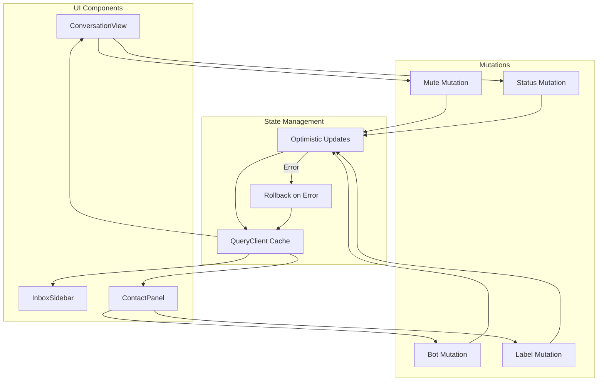

# Design Document: Conversation State Feedback

## Overview

Este documento descreve o design para implementar feedback visual imediato e sincronização de estado na interface de chat. O problema atual é que quando o usuário executa ações (mute, status, bot, labels), a UI não reflete imediatamente as mudanças - os botões não mudam, os ícones não aparecem e os indicadores visuais não são atualizados até que o cache seja invalidado.

A solução utiliza **atualizações otimistas** com TanStack Query para atualizar a UI imediatamente antes da confirmação do servidor, revertendo automaticamente em caso de erro.

## Architecture



## Components and Interfaces

### 1. Optimistic Update Hook

Criar um hook customizado para gerenciar atualizações otimistas de conversas:

```typescript
// src/hooks/useOptimisticConversation.ts
interface UseOptimisticConversationOptions {
  conversationId: number
  onSuccess?: () => void
  onError?: (error: Error) => void
}

interface OptimisticUpdateResult {
  updateMuted: (muted: boolean) => Promise<void>
  updateStatus: (status: ConversationStatus) => Promise<void>
  updateBot: (botId: number | null) => Promise<void>
  addLabel: (labelId: number) => Promise<void>
  removeLabel: (labelId: number) => Promise<void>
  isPending: boolean
  pendingAction: string | null
}
```

### 2. Updated ConversationView Component

Modificar o componente para usar atualizações otimistas:

```typescript
// Mutation with optimistic update
const muteMutation = useMutation({
  mutationFn: (muted: boolean) => muteConversation(conversation.id, muted),
  onMutate: async (muted) => {
    // Cancel outgoing refetches
    await queryClient.cancelQueries({ queryKey: ['conversations'] })
    
    // Snapshot previous value
    const previousConversations = queryClient.getQueryData(['conversations'])
    
    // Optimistically update
    queryClient.setQueryData(['conversations'], (old) => 
      updateConversationInCache(old, conversation.id, { isMuted: muted })
    )
    
    return { previousConversations }
  },
  onError: (err, variables, context) => {
    // Rollback on error
    queryClient.setQueryData(['conversations'], context?.previousConversations)
    toast.error('Erro ao atualizar conversa')
  },
  onSuccess: (_, muted) => {
    toast.success(muted ? 'Conversa silenciada' : 'Notificações ativadas')
  },
  onSettled: () => {
    queryClient.invalidateQueries({ queryKey: ['conversations'] })
  }
})
```

### 3. Conversation Cache Update Utility

```typescript
// src/lib/conversation-cache.ts
export function updateConversationInCache(
  data: ConversationsResponse | undefined,
  conversationId: number,
  updates: Partial<Conversation>
): ConversationsResponse | undefined {
  if (!data) return data
  
  return {
    ...data,
    conversations: data.conversations.map(conv =>
      conv.id === conversationId ? { ...conv, ...updates } : conv
    )
  }
}
```

### 4. Visual Indicators

#### Header Indicators (ConversationView)
- BellOff icon quando `isMuted === true`
- Status badge com cores consistentes
- Bot indicator quando `assignedBotId !== null`

#### List Indicators (InboxSidebar)
- BellOff icon no ConversationItem quando `isMuted === true`
- Status styling baseado em `conversation.status`
- Bot indicator quando bot está atribuído

## Data Models

### Conversation State Updates

```typescript
interface ConversationStateUpdate {
  isMuted?: boolean
  status?: ConversationStatus
  assignedBotId?: number | null
  labels?: Label[]
}

interface OptimisticContext {
  previousConversations: ConversationsResponse | undefined
  previousConversation: Conversation | undefined
}
```

## Correctness Properties

*A property is a characteristic or behavior that should hold true across all valid executions of a system-essentially, a formal statement about what the system should do. Properties serve as the bridge between human-readable specifications and machine-verifiable correctness guarantees.*

### Property Reflection

After analyzing the prework, the following redundancies were identified:
- Properties 1.2 and 1.3 (mute/unmute icon) can be combined into a single property
- Properties 2.2-2.5 (status badge colors) are specific cases of 2.1
- Properties 3.1 and 3.2 (bot indicator) can be combined
- Properties 4.1 and 4.2 (label add/remove) can be combined
- Properties 5.2-5.4 are already covered by 1.4, 2.6, 3.4
- Properties 7.3 and 7.4 (loading state clear) can be combined

### Final Properties

**Property 1: Mute indicator consistency**
*For any* conversation with a given `isMuted` value, the BellOff icon SHALL be rendered in both ConversationHeader and ConversationItem if and only if `isMuted === true`
**Validates: Requirements 1.2, 1.3, 1.4**

**Property 2: Status badge rendering**
*For any* conversation with a given `status` value, the status badge SHALL be rendered with the correct color (green for resolved, yellow for pending, blue for snoozed) if status is not 'open', and SHALL not be rendered if status is 'open'
**Validates: Requirements 2.1, 2.2, 2.3, 2.4, 2.5, 2.6**

**Property 3: Bot indicator consistency**
*For any* conversation with a given `assignedBotId` value, the bot indicator SHALL be rendered in ConversationHeader, ContactPanel, and ConversationItem if and only if `assignedBotId !== null`
**Validates: Requirements 3.1, 3.2, 3.3, 3.4**

**Property 4: Label rendering consistency**
*For any* conversation with a given `labels` array, all labels SHALL be rendered in ContactPanel and ConversationItem, and the rendered labels SHALL match the labels array exactly
**Validates: Requirements 4.1, 4.2, 4.3**

**Property 5: Optimistic update rollback**
*For any* mutation that fails, the conversation state SHALL be reverted to its previous value and an error toast SHALL be displayed
**Validates: Requirements 1.5, 2.7, 3.5, 4.4**

**Property 6: Filter counts synchronization**
*For any* conversation state change, the filter counts (unread, status) SHALL be updated to reflect the new state
**Validates: Requirements 5.5**

**Property 7: Loading state management**
*For any* mutation in progress, the action button SHALL be disabled and display a loading indicator, and when the mutation completes (success or error), the loading indicator SHALL be removed
**Validates: Requirements 7.1, 7.2, 7.3, 7.4**

**Property 8: Dropdown menu state synchronization**
*For any* conversation with `isMuted === true`, the dropdown menu SHALL display "Ativar notificações", and for `isMuted === false`, it SHALL display "Silenciar conversa"
**Validates: Requirements 1.1**

## Error Handling

### Optimistic Update Rollback

1. **onMutate**: Salva o estado anterior antes da atualização otimista
2. **onError**: Reverte para o estado anterior e exibe toast de erro
3. **onSettled**: Invalida o cache para garantir sincronização com servidor

### Error Messages

| Operação | Mensagem de Erro |
|----------|------------------|
| Mute | "Erro ao silenciar conversa" |
| Status | "Erro ao atualizar status" |
| Bot | "Erro ao atribuir bot" |
| Label | "Erro ao atualizar etiquetas" |

## Testing Strategy

### Property-Based Testing

Utilizaremos **fast-check** como biblioteca de property-based testing para TypeScript/JavaScript.

Cada propriedade de correção será implementada como um teste de propriedade separado, com mínimo de 100 iterações.

### Unit Tests

- Testar funções de atualização de cache
- Testar renderização condicional de indicadores
- Testar estados de loading

### Integration Tests

- Testar fluxo completo de mute/unmute
- Testar fluxo de mudança de status
- Testar rollback em caso de erro

### Test Annotations

Todos os testes de propriedade devem incluir:
```typescript
// **Feature: conversation-state-feedback, Property {number}: {property_text}**
// **Validates: Requirements X.Y**
```
