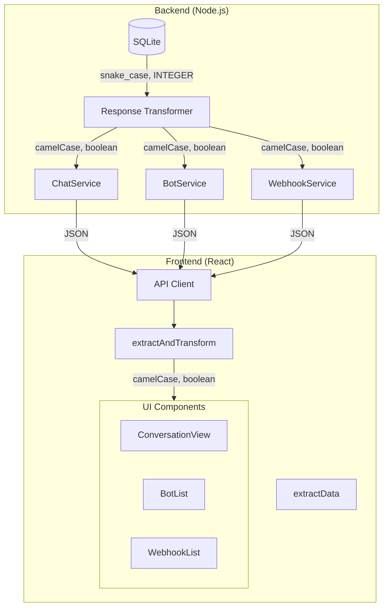

# Design Document: Data Transformation Consistency

## Overview

Este documento descreve o design para resolver problemas sistêmicos de inconsistência na transformação de dados entre backend e frontend. Os problemas identificados são:

1. **Duplicação de código**: `ChatService.getConversations` tem duas implementações com comportamentos diferentes
2. **Transformação inconsistente**: Frontend usa `extractData` em vez de `extractAndTransform` em alguns endpoints
3. **Conversão de tipos SQLite**: Campos booleanos (0/1) não são consistentemente convertidos para boolean

A solução cria uma camada de transformação centralizada no backend e padroniza o uso de funções de extração no frontend.

## Architecture



## Components and Interfaces

### 1. Backend Response Transformer Utility

Criar um utilitário centralizado para transformação de dados no backend:

```javascript
// server/utils/responseTransformer.js

/**
 * Convert SQLite boolean (0/1) to JavaScript boolean
 * Handles edge cases: null, undefined, "0", "1", 0, 1
 */
function toBoolean(value) {
  if (value === null || value === undefined) return false;
  if (typeof value === 'boolean') return value;
  if (typeof value === 'number') return value === 1;
  if (typeof value === 'string') return value === '1' || value.toLowerCase() === 'true';
  return Boolean(value);
}

/**
 * Convert snake_case to camelCase
 */
function snakeToCamel(str) {
  return str.replace(/_([a-z])/g, (_, letter) => letter.toUpperCase());
}

/**
 * Transform object keys from snake_case to camelCase
 * and convert boolean fields
 */
function transformKeys(obj, booleanFields = []) {
  if (obj === null || obj === undefined) return obj;
  if (Array.isArray(obj)) {
    return obj.map(item => transformKeys(item, booleanFields));
  }
  if (typeof obj === 'object') {
    const transformed = {};
    for (const key in obj) {
      if (Object.prototype.hasOwnProperty.call(obj, key)) {
        const camelKey = snakeToCamel(key);
        let value = obj[key];
        
        // Convert boolean fields
        if (booleanFields.includes(camelKey) || booleanFields.includes(key)) {
          value = toBoolean(value);
        } else if (typeof value === 'object') {
          value = transformKeys(value, booleanFields);
        }
        
        transformed[camelKey] = value;
      }
    }
    return transformed;
  }
  return obj;
}

/**
 * Transform conversation data
 */
function transformConversation(conv) {
  return transformKeys(conv, ['isMuted', 'isActive']);
}

/**
 * Transform bot data
 */
function transformBot(bot) {
  return transformKeys(bot, ['isDefault', 'includeHistory', 'isActive']);
}

/**
 * Transform webhook data
 */
function transformWebhook(webhook) {
  return transformKeys(webhook, ['isActive']);
}

module.exports = {
  toBoolean,
  snakeToCamel,
  transformKeys,
  transformConversation,
  transformBot,
  transformWebhook
};
```

### 2. Consolidated ChatService.getConversations

Consolidar as duas implementações em uma única:

```javascript
// server/services/ChatService.js

async getConversations(userId, filters = {}, pagination = {}) {
  const { limit = 50, offset = 0 } = pagination;
  const { status, hasUnread, assignedBotId, labelId, search } = filters;

  // Build query with all filter options
  let sql = `
    SELECT 
      c.id,
      c.user_id,
      c.contact_jid,
      c.contact_name,
      c.contact_avatar_url,
      c.last_message_at,
      c.last_message_preview,
      c.unread_count,
      c.assigned_bot_id,
      c.status,
      c.is_muted,
      c.created_at,
      c.updated_at,
      ab.name as bot_name,
      ab.avatar_url as bot_avatar_url
    FROM conversations c
    LEFT JOIN agent_bots ab ON c.assigned_bot_id = ab.id
    WHERE c.user_id = ?
  `;
  
  const params = [userId];

  // Apply filters...
  
  const { rows } = await this.db.query(sql, params);

  // Transform all conversations consistently
  const conversationsWithLabels = await Promise.all(
    rows.map(async (conv) => {
      const labels = await this.getConversationLabels(conv.id);
      return {
        id: conv.id,
        userId: conv.user_id,
        contactJid: conv.contact_jid,
        contactName: conv.contact_name,
        contactAvatarUrl: conv.contact_avatar_url,
        lastMessageAt: conv.last_message_at,
        lastMessagePreview: conv.last_message_preview,
        unreadCount: conv.unread_count,
        assignedBotId: conv.assigned_bot_id,
        status: conv.status,
        isMuted: toBoolean(conv.is_muted), // Always use toBoolean
        createdAt: conv.created_at,
        updatedAt: conv.updated_at,
        labels,
        assignedBot: conv.assigned_bot_id ? {
          id: conv.assigned_bot_id,
          name: conv.bot_name,
          avatarUrl: conv.bot_avatar_url
        } : null
      };
    })
  );

  return {
    conversations: conversationsWithLabels,
    pagination: { total, limit, offset, hasMore }
  };
}
```

### 3. Frontend API Client Updates

Atualizar o chat service para usar `extractAndTransform` consistentemente:

```typescript
// src/services/chat.ts

// Use extractAndTransform for all endpoints that return snake_case data
export async function searchConversations(query: string, limit = 20): Promise<Conversation[]> {
  const response = await backendApi.get(
    `${BASE_URL}/conversations/search?q=${encodeURIComponent(query)}&limit=${limit}`
  )
  return extractAndTransform<Conversation[]>(response) // Changed from extractData
}

export async function assignBot(
  conversationId: number,
  botId: number | null
): Promise<Conversation> {
  const response = await backendApi.post(
    `${BASE_URL}/conversations/${conversationId}/assign-bot`,
    { botId }
  )
  return extractAndTransform<Conversation>(response) // Changed from extractData
}
```

## Data Models

### Conversation (Backend → Frontend)

```typescript
// Backend (SQLite)
interface ConversationRow {
  id: number;
  user_id: string;
  contact_jid: string;
  contact_name: string | null;
  contact_avatar_url: string | null;
  last_message_at: string | null;
  last_message_preview: string | null;
  unread_count: number;
  assigned_bot_id: number | null;
  status: string;
  is_muted: number; // 0 or 1
  created_at: string;
  updated_at: string;
}

// Frontend (TypeScript)
interface Conversation {
  id: number;
  userId: string;
  contactJid: string;
  contactName: string | null;
  contactAvatarUrl: string | null;
  lastMessageAt: string | null;
  lastMessagePreview: string | null;
  unreadCount: number;
  assignedBotId: number | null;
  status: string;
  isMuted: boolean; // true or false
  createdAt: string;
  updatedAt: string;
  labels: Label[];
  assignedBot: AssignedBot | null;
}
```

### AgentBot (Backend → Frontend)

```typescript
// Backend (SQLite)
interface AgentBotRow {
  id: number;
  user_id: string;
  name: string;
  description: string | null;
  avatar_url: string | null;
  outgoing_url: string;
  access_token: string;
  status: string;
  priority: number;
  is_default: number; // 0 or 1
  include_history: number; // 0 or 1
  created_at: string;
  updated_at: string;
}

// Frontend (TypeScript)
interface AgentBot {
  id: number;
  userId: string;
  name: string;
  description: string | null;
  avatarUrl: string | null;
  outgoingUrl: string;
  accessToken: string;
  status: string;
  priority: number;
  isDefault: boolean; // true or false
  includeHistory: boolean; // true or false
  createdAt: string;
  updatedAt: string;
}
```

### OutgoingWebhook (Backend → Frontend)

```typescript
// Backend (SQLite)
interface OutgoingWebhookRow {
  id: number;
  user_id: string;
  url: string;
  events: string; // JSON string
  secret: string | null;
  is_active: number; // 0 or 1
  success_count: number;
  failure_count: number;
  last_delivery_at: string | null;
  last_error: string | null;
  created_at: string;
  updated_at: string;
}

// Frontend (TypeScript)
interface OutgoingWebhook {
  id: number;
  userId: string;
  url: string;
  events: string[];
  secret: string | null;
  isActive: boolean; // true or false
  successCount: number;
  failureCount: number;
  lastDeliveryAt: string | null;
  lastError: string | null;
  createdAt: string;
  updatedAt: string;
}
```

## Correctness Properties

*A property is a characteristic or behavior that should hold true across all valid executions of a system-essentially, a formal statement about what the system should do. Properties serve as the bridge between human-readable specifications and machine-verifiable correctness guarantees.*

### Property Reflection

After analyzing the prework, the following redundancies were identified:
- Properties 1.2, 1.3, 1.4, 2.2, 2.3, 2.4, 7.1, 7.2, 7.3 all test boolean conversion - consolidated into Property 2
- Properties 3.4 and 7.4 both test null/undefined handling - consolidated into Property 3
- Properties 3.5 and 7.5 both test edge cases - consolidated into Property 4
- Properties 4.2, 4.3, 4.4, 5.4, 5.5 all test output format consistency - consolidated into Property 5
- Properties 6.1 and 6.2 both test backward compatibility - consolidated into Property 6

### Final Properties

**Property 1: Snake to camelCase transformation**
*For any* object with snake_case keys, the `transformKeys` function SHALL return an object with all keys converted to camelCase, preserving the values
**Validates: Requirements 1.1**

**Property 2: SQLite boolean to JavaScript boolean conversion**
*For any* SQLite boolean value (0, 1, null, undefined, "0", "1", true, false), the `toBoolean` function SHALL return a JavaScript boolean (true or false)
**Validates: Requirements 1.2, 1.3, 1.4, 2.2, 2.3, 2.4**

**Property 3: Null/undefined graceful handling**
*For any* input including null, undefined, or objects with null/undefined values, the transformation functions SHALL not throw and SHALL return appropriate values (null for null input, object with transformed values for objects)
**Validates: Requirements 3.4**

**Property 4: Boolean edge case handling**
*For any* edge case input (empty string, "0", "1", "true", "false", 0, 1), the `toBoolean` function SHALL return the correct boolean value according to the mapping: 0/"0"/"false"/""→false, 1/"1"/"true"→true
**Validates: Requirements 3.5**

**Property 5: Output format consistency**
*For any* conversation, bot, or webhook data returned by the backend, the transformed output SHALL have camelCase keys and boolean fields SHALL be JavaScript booleans (typeof === 'boolean')
**Validates: Requirements 4.2, 4.3, 5.4**

**Property 6: Transformation round-trip consistency**
*For any* valid frontend object, converting to snake_case and back to camelCase SHALL produce an equivalent object (keys match, values match)
**Validates: Requirements 6.1**

## Error Handling

### Transformation Errors

1. **Null/undefined input**: Return null/undefined without throwing
2. **Invalid object**: Return the input unchanged
3. **Circular references**: Not supported, will cause stack overflow (acceptable limitation)

### Type Coercion Errors

1. **Non-boolean to boolean**: Use explicit conversion rules, never throw
2. **Invalid date strings**: Pass through unchanged, let frontend handle

## Testing Strategy

### Property-Based Testing

Utilizaremos **fast-check** como biblioteca de property-based testing para JavaScript/TypeScript.

Cada propriedade de correção será implementada como um teste de propriedade separado, com mínimo de 100 iterações.

### Test File Structure

```
server/utils/responseTransformer.test.js     # Backend transformer tests
server/utils/responseTransformer.property.test.js  # Property-based tests
src/services/chat.test.ts                    # Frontend service tests
```

### Test Annotations

Todos os testes de propriedade devem incluir:
```javascript
// **Feature: data-transformation-consistency, Property {number}: {property_text}**
// **Validates: Requirements X.Y**
```

### Unit Tests

- Test `toBoolean` with all edge cases
- Test `snakeToCamel` with various inputs
- Test `transformKeys` with nested objects
- Test `transformConversation`, `transformBot`, `transformWebhook` with real data shapes

### Integration Tests

- Test full flow from database query to API response
- Test frontend receives correctly transformed data
- Test backward compatibility with existing code
