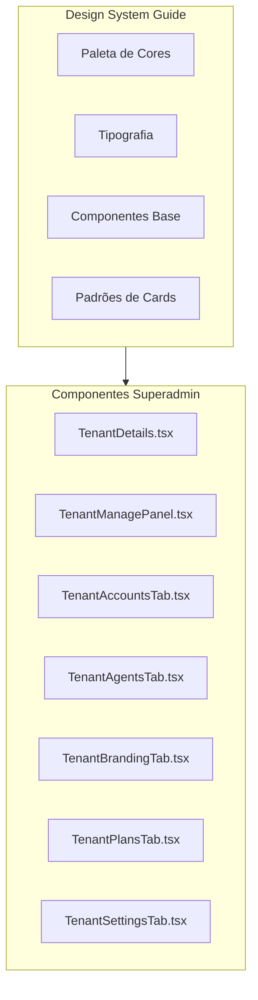

# Design Document: Design System Consistency

## Overview

Este documento descreve o design para aplicar o Design System Guide de forma consistente em todo o painel de Superadmin. A solução envolve atualizar os componentes existentes para seguir os padrões visuais definidos em `docs/DESIGN_SYSTEM_GUIDE.md`, garantindo uma experiência de usuário coesa.

## Architecture



## Components and Interfaces

### 1. Stats Card Pattern

Padrão para cards de métricas com gradiente:

```typescript
// Cores disponíveis para stats cards
const GRADIENT_CLASSES = {
  blue: {
    card: 'from-blue-500/10 to-blue-500/5',
    icon: 'bg-blue-500/20 text-blue-500',
  },
  green: {
    card: 'from-green-500/10 to-green-500/5',
    icon: 'bg-green-500/20 text-green-500',
  },
  orange: {
    card: 'from-orange-500/10 to-orange-500/5',
    icon: 'bg-orange-500/20 text-orange-500',
  },
  purple: {
    card: 'from-purple-500/10 to-purple-500/5',
    icon: 'bg-purple-500/20 text-purple-500',
  },
  red: {
    card: 'from-red-500/10 to-red-500/5',
    icon: 'bg-red-500/20 text-red-500',
  },
};

// Exemplo de uso
<Card className="relative overflow-hidden border-0 bg-gradient-to-br from-blue-500/10 to-blue-500/5">
  <CardContent className="p-5">
    <div className="flex items-center justify-between">
      <div className="space-y-1">
        <p className="text-sm text-muted-foreground">Label</p>
        <p className="text-2xl font-bold text-foreground">Value</p>
      </div>
      <div className="p-3 rounded-xl bg-blue-500/20">
        <Icon className="w-5 h-5 text-blue-500" />
      </div>
    </div>
  </CardContent>
</Card>
```

### 2. Header Pattern

Padrão para headers com ícone e gradiente:

```typescript
// Header com ícone laranja
<div className="flex items-center gap-4">
  <div className="p-3 rounded-xl bg-gradient-to-br from-orange-500 to-orange-600 shadow-lg shadow-orange-500/20">
    <Building2 className="h-5 w-5 text-white" />
  </div>
  <div>
    <h1 className="text-2xl font-bold text-foreground">Title</h1>
    <p className="text-sm text-muted-foreground">Subtitle</p>
  </div>
</div>
```

### 3. Tabs Pattern

Padrão para tabs com estilo orange accent:

```typescript
<Tabs value={activeTab} onValueChange={setActiveTab}>
  <TabsList className="grid w-full grid-cols-5 bg-muted/50 p-1 rounded-xl">
    <TabsTrigger 
      value="tab1" 
      className="flex items-center gap-2 rounded-lg data-[state=active]:bg-orange-500 data-[state=active]:text-white data-[state=active]:shadow-sm transition-all"
    >
      <Icon className="h-4 w-4" />
      <span className="hidden sm:inline">Label</span>
    </TabsTrigger>
  </TabsList>
</Tabs>
```

### 4. Button Patterns

Padrões para botões:

```typescript
// Primary action (orange)
<Button className="bg-orange-500 hover:bg-orange-600 text-white">
  <Icon className="h-4 w-4 mr-2" />
  Action
</Button>

// Secondary action
<Button variant="outline">
  <Icon className="h-4 w-4 mr-2" />
  Action
</Button>

// Destructive action
<Button variant="destructive">
  <Trash2 className="h-4 w-4 mr-2" />
  Delete
</Button>
```

### 5. Empty State Pattern

Padrão para estados vazios:

```typescript
<div className="flex flex-col items-center justify-center py-12 text-muted-foreground">
  <div className="p-4 rounded-full bg-muted/50 mb-3">
    <Icon className="w-8 h-8 opacity-40" />
  </div>
  <p className="text-sm font-medium">No items found</p>
  <p className="text-xs mt-1">Description text here</p>
</div>
```

### 6. Loading Skeleton Pattern

Padrão para estados de carregamento:

```typescript
<div className="space-y-3">
  {[...Array(3)].map((_, i) => (
    <div key={i} className="flex items-center gap-4 p-4 rounded-xl bg-muted/30 animate-pulse">
      <div className="w-10 h-10 rounded-xl bg-muted" />
      <div className="flex-1 space-y-2">
        <div className="h-4 w-3/4 bg-muted rounded" />
        <div className="h-3 w-1/2 bg-muted rounded" />
      </div>
      <div className="h-5 w-20 bg-muted rounded" />
    </div>
  ))}
</div>
```

### 7. Status Badge Pattern

Padrão para badges de status:

```typescript
const getStatusColor = (status: string) => {
  switch (status) {
    case 'active':
      return 'bg-green-500 text-white border-0';
    case 'inactive':
      return 'bg-yellow-500 text-white border-0';
    case 'suspended':
      return 'bg-red-500 text-white border-0';
    default:
      return '';
  }
};

<Badge className={getStatusColor(status)}>{status}</Badge>
```

### 8. Alert Card Pattern

Padrão para cards de alerta:

```typescript
// Card com borda colorida para alertas
<Card className="border-red-500/30 bg-red-500/5">
  <CardHeader className="flex flex-row items-center gap-3 pb-2">
    <div className="p-2 rounded-lg bg-red-500/20">
      <AlertTriangle className="w-4 h-4 text-red-500" />
    </div>
    <div>
      <CardTitle className="text-sm font-medium">Alert Title</CardTitle>
      <p className="text-xs text-muted-foreground">Description</p>
    </div>
  </CardHeader>
</Card>
```

## Data Models

Não há novos modelos de dados. Esta feature é puramente visual/UI.

## Correctness Properties

*A property is a characteristic or behavior that should hold true across all valid executions of a system-essentially, a formal statement about what the system should do. Properties serve as the bridge between human-readable specifications and machine-verifiable correctness guarantees.*

### Property 1: Stats cards follow gradient pattern
*For any* stats card component, the card SHALL have `border-0` class and a gradient background class matching the pattern `from-{color}-500/10 to-{color}-500/5`.
**Validates: Requirements 1.1, 1.2**

### Property 2: Icon containers follow design pattern
*For any* icon container in stats cards or headers, the container SHALL have classes matching `p-3 rounded-xl bg-{color}-500/20` or gradient classes for headers.
**Validates: Requirements 1.3, 1.4**

### Property 3: Primary action buttons use orange accent
*For any* primary action button, the button SHALL have classes `bg-orange-500 hover:bg-orange-600 text-white`.
**Validates: Requirements 1.5, 4.2**

### Property 4: Active tabs display with orange background
*For any* active tab trigger, the element SHALL have `data-[state=active]:bg-orange-500 data-[state=active]:text-white` classes.
**Validates: Requirements 2.1, 2.2**

### Property 5: Status badges use semantic colors
*For any* status value, the badge SHALL display with the correct semantic color: green for active, yellow for inactive, red for suspended.
**Validates: Requirements 5.1**

### Property 6: Empty states follow centered pattern
*For any* empty state, the component SHALL display a centered container with muted icon, title text, and description text.
**Validates: Requirements 3.2**

### Property 7: Loading skeletons use animate-pulse
*For any* loading skeleton, the element SHALL have `animate-pulse` and `bg-muted` classes.
**Validates: Requirements 3.3**

### Property 8: Page sections use consistent spacing
*For any* page with multiple sections, the container SHALL use `space-y-6` class for vertical spacing.
**Validates: Requirements 6.1**

## Error Handling

Esta feature não introduz novos fluxos de erro. Os padrões de erro existentes (toasts, alerts) serão mantidos e estilizados de acordo com o design system.

## Testing Strategy

### Unit Tests

Testes unitários verificarão:
1. Componentes renderizam com as classes CSS corretas
2. Status badges exibem cores corretas para cada status
3. Empty states contêm elementos necessários

### Visual Regression Tests

Recomenda-se adicionar testes de regressão visual com ferramentas como:
- Chromatic (Storybook)
- Percy
- Playwright visual comparisons

### Manual Testing Checklist

- [ ] Stats cards exibem gradientes corretos
- [ ] Tabs ativas têm fundo laranja
- [ ] Botões primários são laranja
- [ ] Empty states estão centralizados
- [ ] Loading skeletons animam corretamente
- [ ] Status badges têm cores semânticas
- [ ] Espaçamento entre seções é consistente
- [ ] Dark mode funciona corretamente
