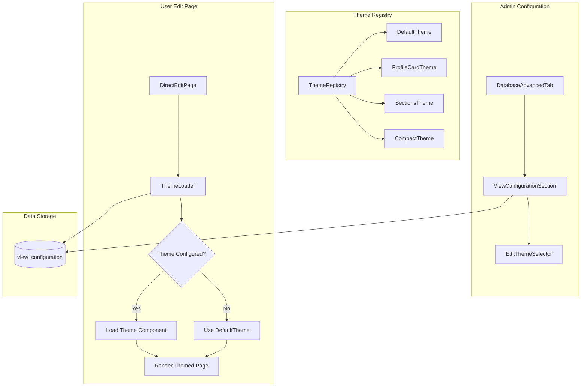

# Design Document: Edit Page Themes System

## Overview

O sistema de Temas de Edição permite que administradores configurem diferentes layouts para a página de edição de registros. Os temas são isolados do sistema principal através de um **Theme Registry** que gerencia o carregamento e renderização dinâmica de componentes de tema.

A arquitetura segue o princípio de **composição sobre herança**, onde cada tema é um componente React independente que recebe props padronizadas e pode renderizar a interface de edição de forma completamente customizada.

## Architecture



## Components and Interfaces

### 1. EditTheme Interface

```typescript
// src/types/edit-themes.ts

export interface EditThemeProps {
  connection: DatabaseConnection;
  record: Record<string, any>;
  formData: Record<string, any>;
  fieldMetadata: FieldMetadata[];
  onRecordChange: (updatedRecord: Record<string, any>) => void;
  onSave: () => Promise<void>;
  onBack: () => void;
  saving: boolean;
  disabled: boolean;
  hasChanges: boolean;
}

export interface EditTheme {
  id: string;
  name: string;
  description: string;
  preview: string; // URL or base64 of preview image
  component: React.ComponentType<EditThemeProps>;
}

export interface EditThemeConfig {
  enabled: boolean;
  themeId: string;
  options?: Record<string, any>; // Theme-specific options
}
```

### 2. ThemeRegistry

```typescript
// src/components/features/edit-themes/ThemeRegistry.ts

class ThemeRegistry {
  private themes: Map<string, EditTheme>;
  private defaultThemeId: string;
  
  register(theme: EditTheme): void;
  unregister(themeId: string): void;
  get(themeId: string): EditTheme | undefined;
  getDefault(): EditTheme;
  list(): EditTheme[];
  has(themeId: string): boolean;
}

export const themeRegistry = new ThemeRegistry();
```

### 3. Component Hierarchy

```
src/components/features/edit-themes/
├── ThemeRegistry.ts           # Singleton registry
├── ThemeLoader.tsx            # Dynamic theme loader
├── EditThemeSelector.tsx      # Admin theme selection UI
├── themes/
│   ├── index.ts               # Theme exports and registration
│   ├── DefaultTheme.tsx       # Current edit page as theme
│   ├── ProfileCardTheme.tsx   # Card-based profile layout
│   ├── SectionsTheme.tsx      # Grouped sections layout
│   └── CompactTheme.tsx       # Minimal compact layout
└── previews/
    ├── default-preview.png
    ├── profile-card-preview.png
    ├── sections-preview.png
    └── compact-preview.png
```

### 4. Extended ViewConfiguration

```typescript
// Updated ViewConfiguration interface
export interface ViewConfiguration {
  calendar?: CalendarViewConfig;
  kanban?: KanbanViewConfig;
  editTheme?: EditThemeConfig;  // NEW
}
```

## Data Models

### ViewConfiguration JSON Structure

```json
{
  "calendar": {
    "enabled": true,
    "dateField": "created_at"
  },
  "kanban": {
    "enabled": false,
    "statusField": null
  },
  "editTheme": {
    "enabled": true,
    "themeId": "profile-card",
    "options": {
      "showAvatar": true,
      "avatarField": "avatar"
    }
  }
}
```

### Theme Metadata

| Field | Type | Description |
|-------|------|-------------|
| id | string | Unique theme identifier (kebab-case) |
| name | string | Display name for admin UI |
| description | string | Brief description of the theme |
| preview | string | Preview image URL or base64 |
| component | React.ComponentType | The theme component |

## Correctness Properties

*A property is a characteristic or behavior that should hold true across all valid executions of a system-essentially, a formal statement about what the system should do. Properties serve as the bridge between human-readable specifications and machine-verifiable correctness guarantees.*

### Property 1: Theme Registry Consistency
*For any* theme registered in the ThemeRegistry, calling `get(themeId)` SHALL return the same theme instance that was registered, and calling `has(themeId)` SHALL return true.
**Validates: Requirements 2.1, 2.2**

### Property 2: Default Theme Fallback
*For any* theme request where the themeId does not exist in the registry OR the theme fails to load, the ThemeRegistry SHALL return the DefaultTheme instead of undefined or throwing an error.
**Validates: Requirements 1.3, 2.3, 3.3, 3.4**

### Property 3: Theme Interface Validation
*For any* object passed to `themeRegistry.register()`, the registry SHALL only accept objects that implement the EditTheme interface with valid id, name, description, and component properties.
**Validates: Requirements 2.2, 4.1, 4.3**

### Property 4: Theme Props Completeness
*For any* theme component rendered by ThemeLoader, the props passed SHALL include all required EditThemeProps fields (connection, record, formData, fieldMetadata, onRecordChange, onSave, onBack, saving, disabled, hasChanges).
**Validates: Requirements 4.2**

### Property 5: Configuration Persistence Round-Trip
*For any* EditThemeConfig saved to view_configuration, reading the configuration back SHALL produce an equivalent EditThemeConfig object, and other view configurations (calendar, kanban) SHALL remain unchanged.
**Validates: Requirements 1.2, 1.4**

### Property 6: Theme List Completeness
*For any* call to `themeRegistry.list()`, the returned array SHALL contain all registered themes including the DefaultTheme, and each theme SHALL have valid id, name, description, preview, and component properties.
**Validates: Requirements 2.4, 5.1**

### Property 7: Save Logic Consistency
*For any* themed edit page, calling onSave SHALL invoke the same save logic as the DefaultTheme, ensuring data is persisted identically regardless of the active theme.
**Validates: Requirements 6.1, 6.2**

## Error Handling

### Theme Loading Errors

| Error Scenario | Handling Strategy |
|----------------|-------------------|
| Theme not found in registry | Fallback to DefaultTheme, log warning |
| Theme component throws during render | Error boundary catches, shows DefaultTheme |
| Invalid theme configuration | Use DefaultTheme, log validation error |
| Network error loading preview | Show placeholder image |

### Error Boundary

```typescript
// ThemeErrorBoundary wraps theme components
class ThemeErrorBoundary extends React.Component {
  componentDidCatch(error: Error) {
    logger.error('Theme render failed', { error, themeId });
    // Fallback to DefaultTheme
  }
}
```

## Testing Strategy

### Dual Testing Approach

This system requires both unit tests and property-based tests:

1. **Unit Tests**: Verify specific examples, edge cases, and integration points
2. **Property-Based Tests**: Verify universal properties that should hold across all inputs

### Property-Based Testing

**Library**: fast-check (already available in the project via vitest)

**Test Configuration**: Minimum 100 iterations per property test

**Property Tests to Implement**:

1. **Theme Registry Round-Trip** (Property 1)
   - Generate random valid theme objects
   - Register and retrieve, verify equality
   - Verify `has()` returns true for registered themes

2. **Default Fallback** (Property 2)
   - Generate random non-existent themeIds
   - Verify DefaultTheme is always returned
   - Test with null, undefined, empty string, and random strings

3. **Theme Interface Validation** (Property 3)
   - Generate random objects (some valid, some missing required fields)
   - Verify only valid themes are accepted
   - Verify invalid themes throw validation errors

4. **Props Completeness** (Property 4)
   - Generate random connection/record combinations
   - Verify all required props are present in rendered theme
   - Verify props types match expected interfaces

5. **Configuration Persistence** (Property 5)
   - Generate random EditThemeConfig objects with various options
   - Serialize to JSON, deserialize, verify equality
   - Verify other view configurations remain unchanged

6. **Theme List Completeness** (Property 6)
   - Register random number of themes
   - Verify list contains all registered themes
   - Verify each theme has required metadata fields

7. **Save Logic Consistency** (Property 7)
   - Generate random form data changes
   - Verify save function is called with same parameters across themes
   - Verify save result is consistent

### Unit Tests

1. **ThemeRegistry**
   - Register/unregister themes
   - Get existing/non-existing themes
   - List all themes

2. **ThemeLoader**
   - Load configured theme
   - Fallback to default
   - Handle loading states

3. **EditThemeSelector**
   - Display available themes
   - Select theme
   - Preview on hover

4. **Theme Components**
   - Render with valid props
   - Handle field changes
   - Trigger save action

### Test File Naming

```
src/components/features/edit-themes/
├── ThemeRegistry.test.ts
├── ThemeRegistry.property.test.ts
├── ThemeLoader.test.tsx
├── EditThemeSelector.test.tsx
└── themes/
    └── DefaultTheme.test.tsx
```

