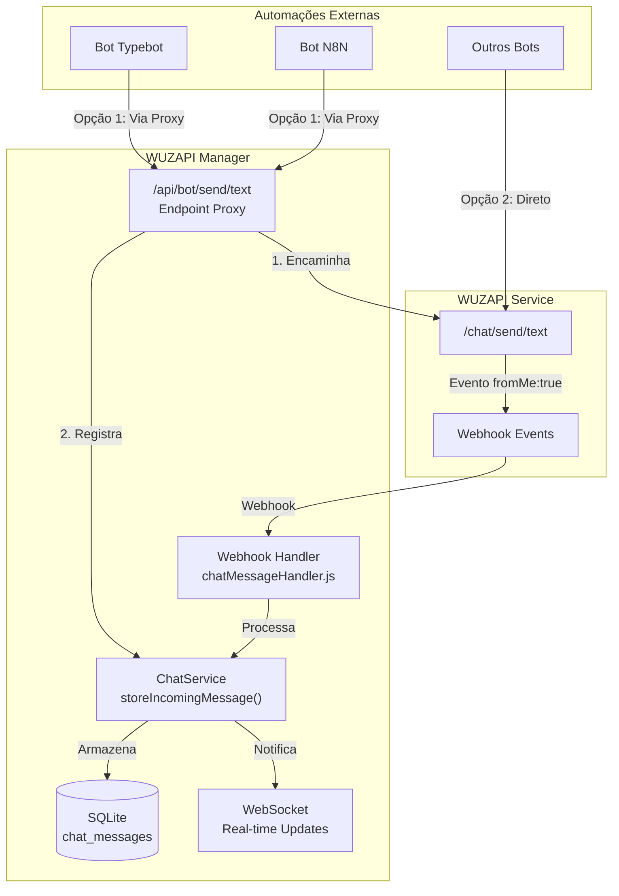

# Design Document: External Bot Message Sync

## Overview

Este documento descreve o design para sincronização de mensagens enviadas por automações externas (bots) no histórico de conversas do sistema WUZAPI Manager.

O problema atual é que mensagens enviadas diretamente via API WUZAPI por automações externas não aparecem no histórico do sistema. Isso cria uma lacuna quando o atendente humano assume a conversa, pois ele não tem visibilidade das mensagens enviadas pelo bot.

A solução envolve duas abordagens complementares:
1. **Captura via Webhook**: Processar corretamente mensagens `fromMe: true` recebidas via webhook
2. **Endpoint Proxy**: Criar endpoint `/api/bot/send/text` para automações enviarem pelo sistema

## Architecture



## Components and Interfaces

### 1. Bot Proxy Routes (`server/routes/botProxyRoutes.js`)

Novo arquivo de rotas para endpoint proxy de bots.

```javascript
// Interface
POST /api/bot/send/text
Headers:
  - token: string (required) - User token for WUZAPI
  - bot-id: string (optional) - Bot identifier for tracking

Body:
{
  Phone: string,           // Número do destinatário
  Body: string,            // Conteúdo da mensagem
  skip_webhook?: boolean,  // Se true, não dispara webhooks de saída
  bot_name?: string        // Nome do bot para exibição
}

Response:
{
  success: boolean,
  data: {
    messageId: string,     // ID da mensagem no WUZAPI
    localId: number,       // ID da mensagem no sistema local
    conversationId: number
  }
}
```

### 2. ChatService Enhancements (`server/services/ChatService.js`)

Modificações no método `storeIncomingMessage()` para suportar mensagens de bot.

```javascript
// Novo método para armazenar mensagem de bot
async storeBotMessage(conversationId, messageData) {
  // Similar a storeIncomingMessage mas com sender_type = 'bot'
  // Não incrementa unread_count
  // Emite evento WebSocket
}

// Método para verificar duplicação
async messageExists(conversationId, messageId) {
  // Retorna true se mensagem já existe
}
```

### 3. Webhook Handler Enhancements (`server/webhooks/chatMessageHandler.js`)

Modificações para identificar e processar mensagens de bot corretamente.

```javascript
// Lógica de identificação de sender_type
function determineSenderType(messageInfo, conversation) {
  if (messageInfo.fromMe) {
    // Se a mensagem foi enviada pelo sistema, é 'user'
    // Se foi enviada externamente, é 'bot'
    return isFromSystem(messageInfo) ? 'user' : 'bot';
  }
  return 'contact';
}
```

### 4. Database Schema

Campos existentes na tabela `chat_messages` que serão utilizados:
- `sender_type`: enum ('user', 'bot', 'contact', 'system')
- `sender_bot_id`: integer (FK para agent_bots, nullable)

Não são necessárias migrações, os campos já existem.

## Data Models

### Message with Bot Info

```typescript
interface ChatMessage {
  id: number;
  conversation_id: number;
  message_id: string;          // WUZAPI message ID
  direction: 'incoming' | 'outgoing';
  message_type: string;
  content: string | null;
  media_url: string | null;
  sender_type: 'user' | 'bot' | 'contact' | 'system';
  sender_bot_id: number | null;
  status: 'pending' | 'sent' | 'delivered' | 'read' | 'failed';
  timestamp: string;
  created_at: string;
}
```

### Bot Proxy Request

```typescript
interface BotProxyRequest {
  Phone: string;
  Body: string;
  skip_webhook?: boolean;
  bot_name?: string;
}
```

### Bot Proxy Response

```typescript
interface BotProxyResponse {
  success: boolean;
  data: {
    messageId: string;
    localId: number;
    conversationId: number;
  };
  error?: string;
}
```

## Correctness Properties

*A property is a characteristic or behavior that should hold true across all valid executions of a system-essentially, a formal statement about what the system should do. Properties serve as the bridge between human-readable specifications and machine-verifiable correctness guarantees.*

### Property 1: Outgoing message direction consistency
*For any* message received via webhook with `fromMe: true`, the stored message SHALL have `direction: 'outgoing'`
**Validates: Requirements 1.1**

### Property 2: Unread count invariant for outgoing messages
*For any* conversation, storing an outgoing message SHALL NOT change the `unread_count` value
**Validates: Requirements 1.3**

### Property 3: Last message preview update
*For any* message stored (incoming or outgoing), the conversation's `last_message_preview` SHALL be updated to reflect the message content
**Validates: Requirements 1.4**

### Property 4: Bot proxy message registration
*For any* message sent via bot proxy endpoint, the message SHALL be stored locally with `sender_type: 'bot'`
**Validates: Requirements 2.1, 2.3**

### Property 5: Message deduplication idempotence
*For any* message_id, attempting to store the same message twice SHALL result in exactly one record in the database
**Validates: Requirements 4.1, 4.2**

### Property 6: Sender type validity
*For any* stored message, the `sender_type` SHALL be one of: 'user', 'bot', 'contact', 'system'
**Validates: Requirements 3.1**

### Property 7: WebSocket event emission for outgoing messages
*For any* outgoing message stored, a WebSocket event SHALL be emitted containing the message data with `sender_type`
**Validates: Requirements 5.1, 5.2**

## Error Handling

### Bot Proxy Endpoint Errors

| Error Code | Condition | Response |
|------------|-----------|----------|
| 400 | Phone ou Body ausente | `{ success: false, error: 'Phone and Body are required' }` |
| 401 | Token inválido ou ausente | `{ success: false, error: 'Unauthorized' }` |
| 400 | Número de telefone inválido | `{ success: false, error: 'Invalid phone number' }` |
| 500 | Erro ao enviar via WUZAPI | `{ success: false, error: 'Failed to send message' }` |
| 500 | Erro ao armazenar localmente | `{ success: false, error: 'Failed to store message' }` |

### Webhook Processing Errors

- Mensagens duplicadas são silenciosamente ignoradas (não geram erro)
- Falhas ao emitir WebSocket são logadas mas não interrompem o processamento
- Falhas ao atualizar conversa são logadas mas não interrompem o armazenamento da mensagem

## Testing Strategy

### Dual Testing Approach

O projeto utiliza duas abordagens complementares de teste:

1. **Unit Tests**: Verificam comportamentos específicos e edge cases
2. **Property-Based Tests**: Verificam propriedades universais que devem valer para todas as entradas

### Property-Based Testing Framework

- **Framework**: fast-check (já utilizado no projeto)
- **Configuração**: Mínimo de 100 iterações por propriedade
- **Localização**: `server/services/ChatService.property.test.js` (existente, será estendido)

### Test Cases

#### Unit Tests

1. **Bot Proxy Endpoint**
   - Deve rejeitar requisições sem token
   - Deve rejeitar requisições sem Phone ou Body
   - Deve encaminhar para WUZAPI e registrar localmente
   - Deve respeitar flag skip_webhook

2. **Webhook Handler**
   - Deve identificar mensagens fromMe como outgoing
   - Deve não incrementar unread_count para outgoing
   - Deve detectar e ignorar duplicatas

3. **ChatService**
   - Deve armazenar mensagem de bot com sender_type correto
   - Deve emitir evento WebSocket

#### Property-Based Tests

Cada propriedade definida na seção "Correctness Properties" será implementada como um teste property-based, seguindo o formato:

```javascript
// **Feature: external-bot-message-sync, Property 1: Outgoing message direction consistency**
// **Validates: Requirements 1.1**
test.prop([fc.record({...})])('outgoing messages have correct direction', async (messageData) => {
  // Arrange: Create message with fromMe: true
  // Act: Process via webhook handler
  // Assert: Stored message has direction: 'outgoing'
});
```

