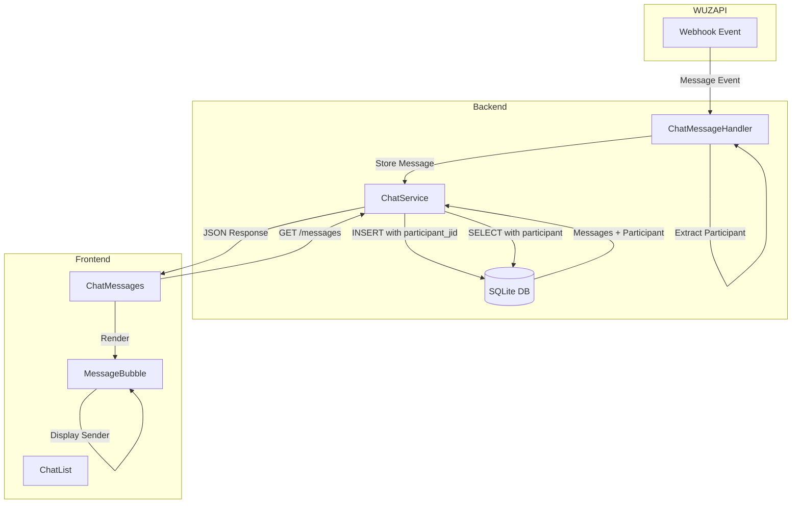

# Design Document: Group Message Sender Identification

## Overview

Este documento descreve o design para identificação de remetentes individuais em mensagens de grupos do WhatsApp. O sistema atual não exibe qual participante específico enviou cada mensagem em conversas de grupo, dificultando o acompanhamento das conversas.

A solução envolve:
1. Extrair o campo `Participant` dos webhooks da WUZAPI para mensagens de grupo
2. Armazenar o JID do participante e seu pushName no banco de dados
3. Exibir o nome/telefone do remetente na interface de chat
4. Agrupar visualmente mensagens consecutivas do mesmo participante

## Architecture



## Components and Interfaces

### 1. Backend: ChatMessageHandler (Modificação)

**Arquivo:** `server/webhooks/chatMessageHandler.js`

**Modificações:**
- Extrair campo `Participant` do payload de mensagens de grupo
- Extrair `PushName` do participante quando disponível
- Detectar se a mensagem é de grupo verificando se o JID termina em `@g.us`

```javascript
// Estrutura do payload WUZAPI para mensagens de grupo
{
  Info: {
    Id: "message_id",
    Chat: "120363023605733675@g.us",  // JID do grupo (termina em @g.us)
    Participant: "5547924166626@s.whatsapp.net",  // JID do remetente
    PushName: "streaming play",  // Nome do remetente
    FromMe: false,
    // ...
  },
  Message: { /* conteúdo da mensagem */ }
}
```

**Interface:**
```typescript
interface GroupMessageInfo {
  participantJid: string | null;  // JID do participante (ex: "5547924166626@s.whatsapp.net")
  participantName: string | null; // PushName ou telefone formatado
  isGroupMessage: boolean;        // true se Chat termina em @g.us
}
```

### 2. Backend: ChatService (Modificação)

**Arquivo:** `server/services/ChatService.js`

**Modificações:**
- Método `storeIncomingMessage` aceita dados do participante
- Método `getMessages` retorna informações do participante
- Novo método `formatParticipantDisplay` para formatar nome de exibição

### 3. Database: Migration (Nova)

**Arquivo:** `server/migrations/034_add_participant_fields.js`

**Novas colunas na tabela `chat_messages`:**
```sql
ALTER TABLE chat_messages ADD COLUMN participant_jid TEXT;
ALTER TABLE chat_messages ADD COLUMN participant_name TEXT;
```

### 4. Frontend: MessageBubble (Modificação)

**Arquivo:** `src/components/features/chat/MessageBubble.tsx`

**Modificações:**
- Exibir nome do participante acima de mensagens de grupo
- Agrupar mensagens consecutivas do mesmo participante
- Estilização distinta para o nome do remetente

### 5. Frontend: Types (Modificação)

**Arquivo:** `src/types/chat.ts`

```typescript
interface ChatMessage {
  // campos existentes...
  participantJid?: string;
  participantName?: string;
  isGroupMessage?: boolean;
}
```

## Data Models

### chat_messages (Modificação)

| Column | Type | Description |
|--------|------|-------------|
| participant_jid | TEXT | JID do participante que enviou a mensagem (null para chats individuais) |
| participant_name | TEXT | Nome de exibição do participante (PushName ou telefone) |

### API Response: GET /api/user/chat/conversations/:id/messages

```json
{
  "messages": [
    {
      "id": 123,
      "conversationId": 1,
      "messageId": "ABC123",
      "direction": "incoming",
      "messageType": "text",
      "content": "Olá pessoal!",
      "participantJid": "5547924166626@s.whatsapp.net",
      "participantName": "streaming play",
      "isGroupMessage": true,
      "timestamp": "2025-12-05T10:30:00Z"
    }
  ]
}
```

## Correctness Properties

*A property is a characteristic or behavior that should hold true across all valid executions of a system-essentially, a formal statement about what the system should do. Properties serve as the bridge between human-readable specifications and machine-verifiable correctness guarantees.*

### Property 1: Participant extraction from group messages
*For any* webhook payload where the Chat JID ends in `@g.us`, the system SHALL extract and store the Participant field as participant_jid in the database.
**Validates: Requirements 1.1, 3.1, 3.2**

### Property 2: Participant display name resolution
*For any* group message, if the participant has a PushName, the system SHALL use it as the display name; otherwise, the system SHALL extract and format the phone number from the participant JID.
**Validates: Requirements 1.2, 1.3, 1.4, 3.3, 3.4**

### Property 3: Participant data round-trip
*For any* group message stored in the database, querying that message SHALL return the same participant_jid and participant_name that were extracted from the original webhook payload.
**Validates: Requirements 3.2, 3.3, 3.5**

### Property 4: Message grouping by sender
*For any* sequence of group messages, consecutive messages from the same participant_jid SHALL be grouped together, and a change in participant_jid SHALL result in a new group with the sender identifier displayed.
**Validates: Requirements 2.2, 2.3**

### Property 5: Sender identification across message types
*For any* group message regardless of type (text, audio, image, video, document), the system SHALL include participant information in the stored and returned message data.
**Validates: Requirements 4.1, 4.2, 4.3, 4.4, 4.5**

### Property 6: Reply message sender attribution
*For any* reply/quoted message in a group, the system SHALL preserve and display both the sender of the reply AND the sender of the original quoted message.
**Validates: Requirements 4.6**

## Error Handling

| Scenario | Handling |
|----------|----------|
| Participant field missing in group message | Store null for participant_jid, display "Participante desconhecido" |
| PushName missing | Extract phone from JID and format as "+55 47 92416-6626" |
| Invalid participant JID format | Log warning, store raw value, display as-is |
| Database migration failure | Rollback, log error, system continues without new fields |

## Testing Strategy

### Unit Tests
- `ChatMessageHandler.extractParticipantInfo()` - Extração de dados do participante
- `ChatService.formatParticipantDisplay()` - Formatação do nome de exibição
- `MessageBubble` - Renderização do nome do participante

### Property-Based Tests (fast-check)
- **Property 1:** Gerar payloads de webhook com JIDs de grupo e verificar extração do participante
- **Property 2:** Gerar mensagens com/sem PushName e verificar resolução do nome de exibição
- **Property 3:** Gerar mensagens, armazenar e recuperar, verificar igualdade dos dados do participante
- **Property 4:** Gerar sequências de mensagens e verificar agrupamento correto
- **Property 5:** Gerar mensagens de diferentes tipos e verificar presença de dados do participante
- **Property 6:** Gerar mensagens de resposta e verificar atribuição de ambos os remetentes

### Integration Tests
- Webhook completo de mensagem de grupo → armazenamento → API → frontend
- Verificar que mensagens de chat individual não têm dados de participante

### Test Framework
- Backend: Node.js test runner com fast-check para property-based testing
- Frontend: Vitest com fast-check
- Configuração: Mínimo de 100 iterações por property test
