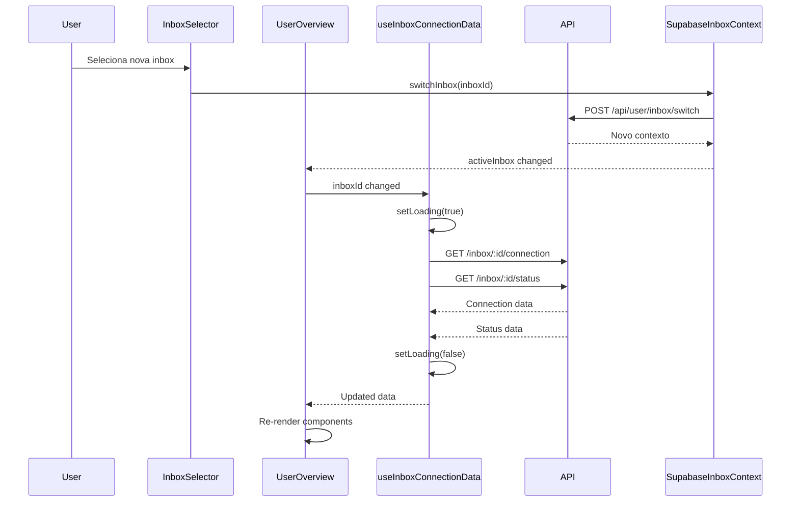

# Design Document: Inbox Connection Sync

## Overview

Este documento descreve o design para sincronização dos dados de conexão quando o usuário altera a caixa de entrada (inbox) selecionada. O problema atual é que ao mudar a inbox no seletor, os dados exibidos na aba "Conexão" (UserInfoCard, ConnectionControlCard, status, token) não são atualizados para refletir a inbox correspondente.

A solução envolve:
1. Integrar o `SupabaseInboxContext` com o componente `UserOverview`
2. Carregar dados específicos da inbox selecionada via API
3. Atualizar os componentes de exibição quando a inbox mudar
4. Garantir que as ações de controle operem na inbox correta

## Architecture

```mermaid
flowchart TD
    subgraph Context["SupabaseInboxContext"]
        A[activeInbox] --> B[inboxId]
        A --> C[wuzapiToken]
        A --> D[instance]
        E[switchInbox] --> F[API Call]
    end
    
    subgraph UserOverview["UserOverview Component"]
        G[InboxSelector] -->|onChange| H[handleInboxChange]
        H --> I[fetchInboxConnectionData]
        I --> J[Update State]
        J --> K[UserInfoCardModern]
        J --> L[ConnectionControlCardModern]
        J --> M[WebhookConfigCardModern]
    end
    
    subgraph API["Backend API"]
        N[/api/user/inbox/:id/connection]
        O[/api/user/inbox/:id/status]
        P[/api/user/inbox/:id/webhook]
    end
    
    Context --> UserOverview
    I --> N
    I --> O
    I --> P
```

## Components and Interfaces

### Modified Components

#### UserOverview.tsx

O componente principal será modificado para:
1. Usar o `SupabaseInboxContext` para obter a inbox ativa
2. Reagir a mudanças na inbox selecionada
3. Carregar dados específicos da inbox via API

```typescript
interface InboxConnectionData {
  inboxId: string
  inboxName: string
  phoneNumber: string
  wuzapiToken: string
  instance: string
  sessionStatus: SessionStatus | null
  userProfile: UserProfile
  webhookConfig: WebhookConfig
  isLoading: boolean
  error: string | null
}
```

#### useInboxConnectionData Hook (Novo)

Hook customizado para gerenciar o carregamento de dados de conexão por inbox:

```typescript
interface UseInboxConnectionDataOptions {
  inboxId: string | null
  enabled?: boolean
}

interface UseInboxConnectionDataReturn {
  data: InboxConnectionData | null
  isLoading: boolean
  error: string | null
  refetch: () => Promise<void>
  sessionStatus: SessionStatus | null
  userProfile: UserProfile
  webhookConfig: WebhookConfig
}

function useInboxConnectionData(options: UseInboxConnectionDataOptions): UseInboxConnectionDataReturn
```

### API Endpoints

#### GET /api/user/inbox/:inboxId/connection

Retorna dados de conexão para uma inbox específica:

```typescript
// Response
{
  success: true,
  data: {
    inboxId: string
    inboxName: string
    phoneNumber: string
    wuzapiToken: string
    instance: string
    jid: string | null
    profilePicture: string | null
  }
}
```

#### GET /api/user/inbox/:inboxId/status

Retorna status da sessão WhatsApp para uma inbox:

```typescript
// Response
{
  success: true,
  data: {
    connected: boolean
    loggedIn: boolean
    qrCode: string | null
  }
}
```

### Component Props Updates

#### UserInfoCardModern

Adicionar prop para identificar a inbox:

```typescript
interface UserInfoCardModernProps {
  user: {
    id: string
    name: string
    email?: string
    phone?: string
    jid?: string
    token: string
    profilePicture?: string
  }
  sessionStatus: SessionStatus | null
  inboxId?: string  // Nova prop
  inboxName?: string  // Nova prop
  onRefreshAvatar?: () => void
  isLoadingAvatar?: boolean
}
```

#### ConnectionControlCardModern

Adicionar prop para identificar a inbox nas ações:

```typescript
interface ConnectionControlCardModernProps {
  sessionStatus: SessionStatus | null
  inboxId?: string  // Nova prop - usado nas ações
  onConnect: () => Promise<void>
  onDisconnect: () => Promise<void>
  onLogout: () => Promise<void>
  onRefreshStatus: () => Promise<void>
  isConnecting?: boolean
}
```

## Data Models

### InboxConnectionState

Estado local para dados de conexão por inbox:

```typescript
interface InboxConnectionState {
  // Identificação
  inboxId: string
  inboxName: string
  
  // Dados de conexão
  wuzapiToken: string
  instance: string
  phoneNumber: string
  
  // Status da sessão
  sessionStatus: SessionStatus | null
  qrCode: string
  
  // Perfil do usuário WhatsApp
  userProfile: {
    jid?: string
    name?: string
    profilePicture?: string
    phone?: string
  }
  
  // Webhook
  webhookConfig: WebhookConfig
  
  // Estado de carregamento
  isLoading: boolean
  error: string | null
}
```

### Fluxo de Dados



## Correctness Properties

*A property is a characteristic or behavior that should hold true across all valid executions of a system-essentially, a formal statement about what the system should do. Properties serve as the bridge between human-readable specifications and machine-verifiable correctness guarantees.*

### Property 1: Dados sincronizados com inbox selecionada

*For any* inbox selecionada no InboxSelector, os dados exibidos no Connection_Panel (nome, foto, ID, token, status de conexão) SHALL corresponder exatamente aos dados da inbox selecionada.

**Validates: Requirements 1.1, 1.2, 1.3, 1.4**

### Property 2: Persistência de seleção entre navegações

*For any* sequência de navegações entre as abas Dashboard e Conexão, a inbox selecionada SHALL permanecer a mesma após cada navegação.

**Validates: Requirements 3.1, 3.2**

### Property 3: Persistência de seleção após reload

*For any* inbox selecionada, após recarregar a página, o InboxSelector SHALL restaurar a mesma inbox que estava selecionada anteriormente.

**Validates: Requirements 3.3**

### Property 4: Ações executadas na inbox correta

*For any* ação de controle (Atualizar Status, Desconectar, Logout), a ação SHALL ser executada na inbox atualmente selecionada no InboxSelector, e não em outra inbox.

**Validates: Requirements 4.1, 4.2, 4.3, 4.4, 1.5**

## Error Handling

### Cenários de Erro

1. **Falha ao carregar dados da inbox**
   - Exibir mensagem de erro no painel
   - Manter dados anteriores visíveis (se disponíveis)
   - Oferecer botão de retry

2. **Inbox não encontrada**
   - Redirecionar para primeira inbox disponível
   - Exibir toast informativo

3. **Perda de conexão durante carregamento**
   - Timeout de 10 segundos
   - Exibir estado de erro com opção de retry

4. **Token inválido ou expirado**
   - Redirecionar para re-autenticação
   - Limpar dados locais

### Tratamento de Estados

```typescript
// Estados possíveis do painel de conexão
type ConnectionPanelState = 
  | { status: 'loading' }
  | { status: 'success'; data: InboxConnectionData }
  | { status: 'error'; error: string; retry: () => void }
  | { status: 'empty'; message: string }
```

## Testing Strategy

### Unit Tests

1. **useInboxConnectionData hook**
   - Testa carregamento inicial
   - Testa mudança de inbox
   - Testa tratamento de erros
   - Testa refetch

2. **UserOverview component**
   - Testa renderização com diferentes estados
   - Testa integração com InboxSelector
   - Testa navegação entre abas

### Property-Based Tests

Usar Vitest com fast-check para testes de propriedade:

1. **Property 1**: Gerar inboxes aleatórias, selecionar, verificar correspondência de dados
2. **Property 2**: Gerar sequências de navegação, verificar persistência
3. **Property 3**: Simular reload, verificar restauração
4. **Property 4**: Gerar ações aleatórias, verificar inbox alvo

### Integration Tests

1. **Fluxo completo de mudança de inbox**
   - Selecionar inbox → Loading → Dados atualizados
   
2. **Ações de controle**
   - Selecionar inbox → Executar ação → Verificar inbox afetada

### Test Configuration

```typescript
// vitest.config.ts
export default {
  test: {
    // Mínimo 100 iterações para property tests
    fuzz: {
      iterations: 100
    }
  }
}
```
