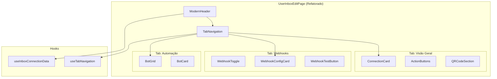
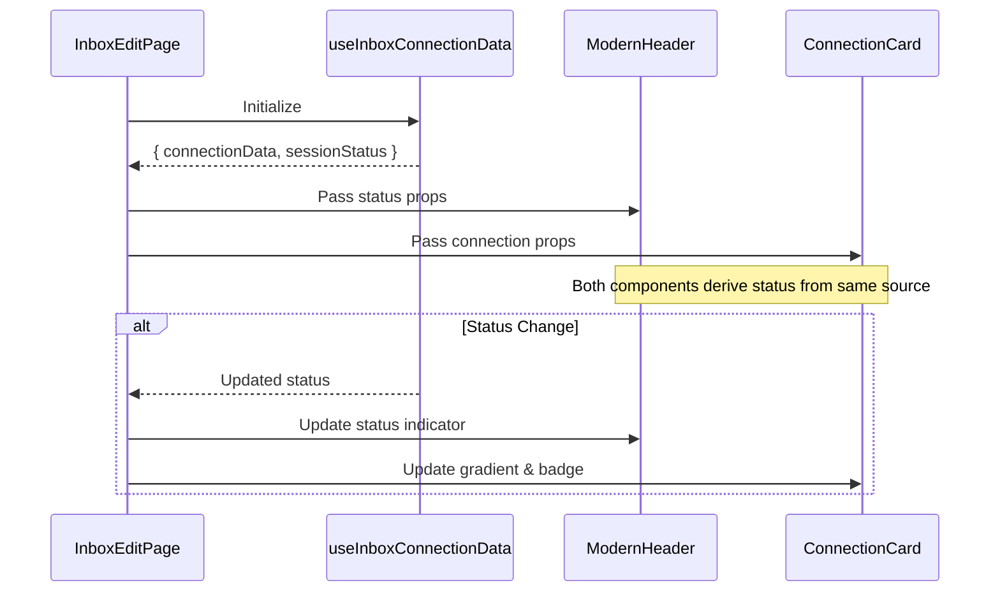

# Design Document: Inbox Edit UX Modernization

## Overview

Este documento descreve o design técnico para modernizar a página de edição de caixa de entrada (`UserInboxEditPage.tsx`). A modernização foca em três pilares principais:

1. **Organização por Tabs** - Separar conteúdo em seções navegáveis
2. **Visual Moderno** - Gradientes, animações sutis, hierarquia clara
3. **Feedback Aprimorado** - Estados de loading, transições, micro-interações

A implementação reutiliza componentes shadcn/ui existentes (Tabs, Card, Badge, Avatar) e adiciona estilos customizados via Tailwind CSS.

## Architecture



## Components and Interfaces

### TabNavigation Component

Novo componente para gerenciar navegação por tabs com persistência na URL.

```typescript
interface TabNavigationProps {
  tabs: Array<{
    id: string
    label: string
    icon?: React.ReactNode
  }>
  defaultTab?: string
  onTabChange?: (tabId: string) => void
}

// Hook para gerenciar estado das tabs
function useTabNavigation(defaultTab: string = 'overview') {
  const [searchParams, setSearchParams] = useSearchParams()
  const activeTab = searchParams.get('tab') || defaultTab
  
  const setActiveTab = useCallback((tabId: string) => {
    setSearchParams(prev => {
      prev.set('tab', tabId)
      return prev
    })
  }, [setSearchParams])
  
  return { activeTab, setActiveTab }
}
```

### ModernHeader Component

Header modernizado com status em tempo real e ações rápidas.

```typescript
interface ModernHeaderProps {
  inboxName: string
  phoneNumber?: string
  avatarUrl?: string
  connectionStatus: 'logged_in' | 'connected' | 'offline'
  onBack: () => void
  onRefresh: () => void
  onGenerateQR: () => void
  isRefreshing?: boolean
  isGeneratingQR?: boolean
}

// Status indicator com animação pulse
const StatusIndicator = ({ status }: { status: string }) => {
  const statusConfig = {
    logged_in: { color: 'bg-green-500', pulse: true, label: 'Logado' },
    connected: { color: 'bg-yellow-500', pulse: false, label: 'Conectado' },
    offline: { color: 'bg-gray-400', pulse: false, label: 'Offline' }
  }
  
  const config = statusConfig[status]
  
  return (
    <div className="flex items-center gap-2">
      <span className={cn(
        "h-2.5 w-2.5 rounded-full",
        config.color,
        config.pulse && "animate-pulse"
      )} />
      <span className="text-sm font-medium">{config.label}</span>
    </div>
  )
}
```

### ConnectionCard Component

Card de conexão com design moderno e seção expansível.

```typescript
interface ConnectionCardProps {
  inbox: {
    id: string
    name: string
    phoneNumber?: string
    jid?: string
    token: string
    isConnected: boolean
    isLoggedIn: boolean
  }
  avatarUrl?: string
  onCopy: (text: string, field: string) => void
  copiedField?: string | null
}

// Gradiente baseado no status
const getStatusGradient = (isLoggedIn: boolean, isConnected: boolean) => {
  if (isLoggedIn) return 'from-green-50 to-emerald-50 dark:from-green-950/20 dark:to-emerald-950/20'
  if (isConnected) return 'from-yellow-50 to-amber-50 dark:from-yellow-950/20 dark:to-amber-950/20'
  return 'from-gray-50 to-slate-50 dark:from-gray-950/20 dark:to-slate-950/20'
}
```

### BotCard Component

Card visual para seleção de bot.

```typescript
interface BotCardProps {
  bot: {
    id: string
    name: string
    description?: string
    botType?: string
    status?: 'active' | 'paused'
    avatarUrl?: string
  }
  isSelected: boolean
  onSelect: () => void
  isLoading?: boolean
}

// Card com highlight quando selecionado
const BotCard = ({ bot, isSelected, onSelect, isLoading }: BotCardProps) => (
  <Card 
    className={cn(
      "cursor-pointer transition-all duration-200 hover:shadow-md",
      isSelected && "ring-2 ring-primary border-primary",
      isLoading && "opacity-50 pointer-events-none"
    )}
    onClick={onSelect}
  >
    <CardContent className="p-4">
      <div className="flex items-start gap-3">
        <Avatar className="h-10 w-10">
          <AvatarImage src={bot.avatarUrl} />
          <AvatarFallback><Bot className="h-5 w-5" /></AvatarFallback>
        </Avatar>
        <div className="flex-1 min-w-0">
          <div className="flex items-center gap-2">
            <span className="font-medium truncate">{bot.name}</span>
            {isSelected && (
              <Badge variant="default" className="text-xs">Ativo</Badge>
            )}
            {bot.status === 'paused' && (
              <Badge variant="secondary" className="text-xs">Pausado</Badge>
            )}
          </div>
          <p className="text-xs text-muted-foreground mt-0.5">
            {bot.botType || 'webhook'}
          </p>
        </div>
        {isSelected && (
          <Check className="h-5 w-5 text-primary flex-shrink-0" />
        )}
      </div>
    </CardContent>
  </Card>
)
```

### WebhookToggle Component

Toggle global para habilitar/desabilitar webhooks.

```typescript
interface WebhookToggleProps {
  enabled: boolean
  onChange: (enabled: boolean) => void
  eventCount: number
}

const WebhookToggle = ({ enabled, onChange, eventCount }: WebhookToggleProps) => (
  <div className="flex items-center justify-between p-4 bg-muted/30 rounded-lg">
    <div className="space-y-0.5">
      <Label className="text-base font-medium">Webhooks</Label>
      <p className="text-sm text-muted-foreground">
        {enabled 
          ? `${eventCount} eventos selecionados`
          : 'Desativado - nenhum evento será enviado'
        }
      </p>
    </div>
    <Switch checked={enabled} onCheckedChange={onChange} />
  </div>
)
```

## Data Models

### Tab State Management

```mermaid
stateDiagram-v2
    [*] --> Overview: default
    Overview --> Webhooks: click tab
    Overview --> Automation: click tab
    Webhooks --> Overview: click tab
    Webhooks --> Automation: click tab
    Automation --> Overview: click tab
    Automation --> Webhooks: click tab
    
    note right of Overview: URL: ?tab=overview
    note right of Webhooks: URL: ?tab=webhooks
    note right of Automation: URL: ?tab=automation
```

### Connection Status Flow



## Correctness Properties

*A property is a characteristic or behavior that should hold true across all valid executions of a system-essentially, a formal statement about what the system should do. Properties serve as the bridge between human-readable specifications and machine-verifiable correctness guarantees.*

### Property 1: Tab Navigation State Persistence

*For any* tab selection, the URL query parameter should reflect the active tab, and loading the page with that URL should restore the same tab state.

**Validates: Requirements 1.2, 1.3, 1.4**

### Property 2: Connection Status Display Consistency

*For any* connection state (logged_in, connected, offline), the status indicator color and phone number visibility should be consistent across all components (header, card, badge).

**Validates: Requirements 2.3, 2.6**

### Property 3: Action State Management

*For any* action in progress, other action buttons should be disabled, and upon completion (success or failure), appropriate feedback should be displayed.

**Validates: Requirements 4.1, 4.3, 4.6**

### Property 4: Webhook Configuration State

*For any* webhook toggle state, the configuration section visibility should match (collapsed when disabled), and the event count badge should accurately reflect selected events.

**Validates: Requirements 5.2, 5.4, 5.5, 5.7**

### Property 5: Bot Assignment State

*For any* bot assignment, exactly one bot card (or "none" card) should be highlighted as selected, and the assignment should persist after page reload.

**Validates: Requirements 6.2, 6.3, 6.6**

## Error Handling

### Tab Navigation Errors

```typescript
// Handle invalid tab parameter
const useTabNavigation = (defaultTab: string, validTabs: string[]) => {
  const [searchParams, setSearchParams] = useSearchParams()
  const tabParam = searchParams.get('tab')
  
  // Fallback to default if invalid
  const activeTab = validTabs.includes(tabParam || '') 
    ? tabParam! 
    : defaultTab
  
  // Clean up invalid param
  useEffect(() => {
    if (tabParam && !validTabs.includes(tabParam)) {
      setSearchParams(prev => {
        prev.delete('tab')
        return prev
      })
    }
  }, [tabParam, validTabs, setSearchParams])
  
  return { activeTab, setActiveTab }
}
```

### Action Error Handling

```typescript
const handleAction = async (action: () => Promise<void>, actionName: string) => {
  setLoadingAction(actionName)
  setError(null)
  
  try {
    await action()
    // Show success animation
    setSuccessAction(actionName)
    setTimeout(() => setSuccessAction(null), 2000)
  } catch (error) {
    setError({
      action: actionName,
      message: error instanceof Error ? error.message : 'Erro desconhecido',
      retry: () => handleAction(action, actionName)
    })
  } finally {
    setLoadingAction(null)
  }
}
```

### Webhook Validation

```typescript
const validateWebhookUrl = (url: string): string | null => {
  if (!url) return null // Empty is valid (disabled)
  
  try {
    const parsed = new URL(url)
    if (!['http:', 'https:'].includes(parsed.protocol)) {
      return 'URL deve começar com http:// ou https://'
    }
    return null
  } catch {
    return 'URL inválida'
  }
}
```

## Testing Strategy

### Unit Tests

Unit tests should verify specific examples and edge cases:

1. **Tab rendering** - Verify all tabs render with correct labels
2. **Status indicator colors** - Verify correct color for each status
3. **Copy functionality** - Verify clipboard API is called correctly
4. **Empty states** - Verify empty state renders when no bots available

### Property-Based Tests

Property-based tests should verify universal properties using fast-check:

1. **Property 1: Tab State Persistence** - Generate random tab selections, verify URL updates and restoration
2. **Property 2: Status Display** - Generate all connection state combinations, verify consistent display
3. **Property 3: Action State** - Generate action sequences, verify button states and feedback
4. **Property 4: Webhook State** - Generate toggle/event combinations, verify UI state
5. **Property 5: Bot Assignment** - Generate bot selections, verify single selection invariant

### Testing Framework

- **Unit tests**: Vitest with React Testing Library
- **Property tests**: fast-check with Vitest
- **Minimum iterations**: 100 per property test
- **Tag format**: `Feature: inbox-edit-ux-modernization, Property N: [property_text]`

## Implementation Notes

### CSS Classes for Animations

```css
/* Pulse animation for status indicator */
.animate-pulse-subtle {
  animation: pulse-subtle 2s cubic-bezier(0.4, 0, 0.6, 1) infinite;
}

@keyframes pulse-subtle {
  0%, 100% { opacity: 1; }
  50% { opacity: 0.6; }
}

/* Smooth height transition for collapsible sections */
.transition-height {
  transition: max-height 0.3s ease-in-out, opacity 0.2s ease-in-out;
}

/* Card hover effect */
.card-hover {
  transition: transform 0.2s ease, box-shadow 0.2s ease;
}
.card-hover:hover {
  transform: translateY(-2px);
  box-shadow: 0 4px 12px rgba(0, 0, 0, 0.1);
}
```

### Responsive Breakpoints

```typescript
// Tailwind breakpoints used
// sm: 640px - Quick actions collapse to icons
// md: 768px - Cards stack vertically
// lg: 1024px - Full layout

// Example responsive classes
const quickActionClasses = cn(
  "gap-2",
  "sm:gap-1", // Tighter on mobile
  "flex-wrap sm:flex-nowrap"
)

const cardGridClasses = cn(
  "grid gap-4",
  "grid-cols-1", // Mobile: single column
  "md:grid-cols-2", // Tablet: 2 columns
  "lg:grid-cols-3" // Desktop: 3 columns
)
```

