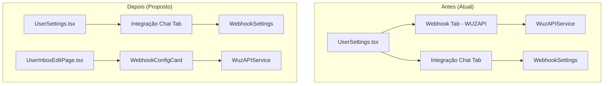
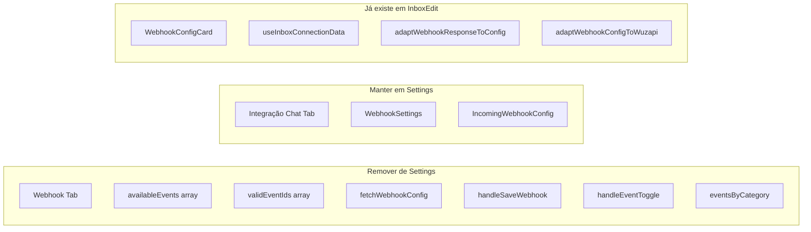
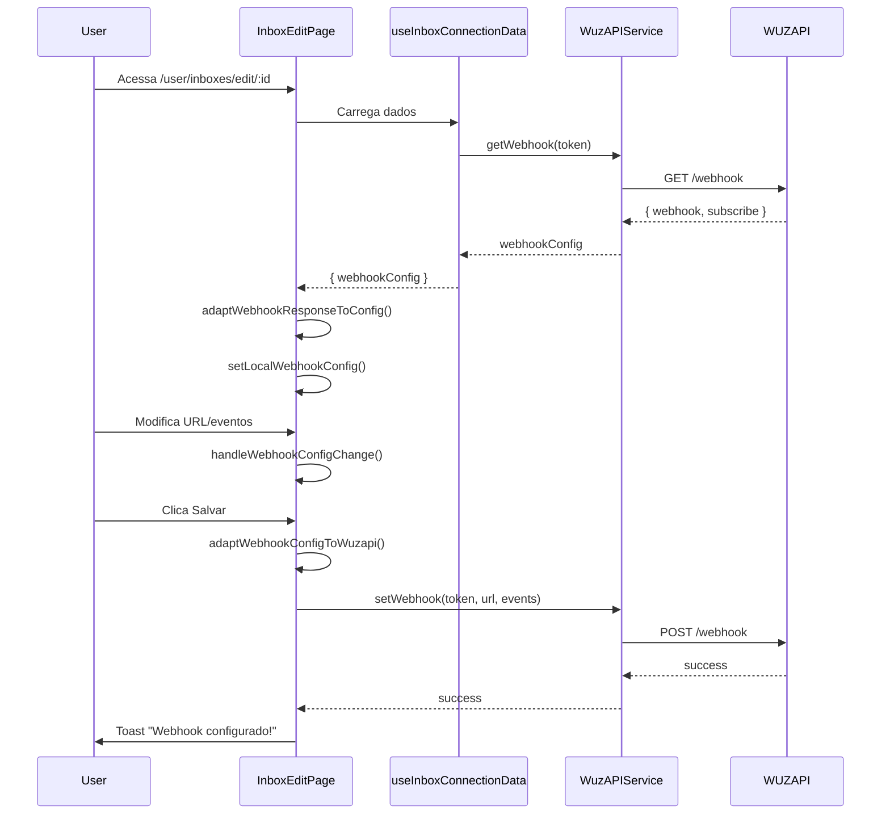

# Design Document: Inbox Webhook Migration

## Overview

Este documento descreve o design para migrar a configuração de webhooks WUZAPI da página de Settings para a página de edição de inbox. A mudança garante que cada inbox tenha sua própria configuração de webhook independente, refletindo a arquitetura onde cada inbox representa uma conexão WhatsApp separada com seu próprio token WUZAPI.

## Architecture



## Components and Interfaces

### Componentes Afetados



### UserSettings.tsx - Mudanças

**Remover:**
- Tab "webhook" do TabsList
- TabsContent value="webhook" e todo seu conteúdo
- Estados: webhookUrl, selectedEvents
- Funções: fetchWebhookConfig, handleSaveWebhook, handleEventToggle
- Arrays: availableEvents, validEventIds, eventsByCategory
- useEffect que chama fetchWebhookConfig

**Manter:**
- Tab "webhooks-chat" (Integração Chat)
- WebhookSettings component
- InboxProvider wrapper

### UserInboxEditPage.tsx - Já Implementado

O componente já possui:
- WebhookConfigCard integrado
- useInboxConnectionData hook para carregar dados
- localWebhookConfig state
- handleWebhookConfigChange e handleSaveWebhook handlers
- Adapters para transformação de dados

### Estrutura de Tabs Após Migração

```typescript
// UserSettings.tsx - Nova estrutura de tabs
const tabs = [
  { value: 'account', label: 'Conta', icon: UserIcon },
  { value: 'subscription', label: 'Assinatura', icon: CreditCard },
  { value: 'notifications', label: 'Notificações', icon: Bell },
  { value: 'bots', label: 'Bots', icon: Bot },
  { value: 'webhooks-chat', label: 'Integração Chat', icon: Webhook },
  { value: 'labels', label: 'Etiquetas', icon: Tags },
  { value: 'canned', label: 'Respostas', icon: MessageSquareText }
]
// Total: 7 tabs (removido: webhook)
```

## Data Models

### WebhookConfigData (Existente)

```typescript
interface WebhookConfigData {
  webhookUrl: string
  events: string[]  // ['All'] ou lista de eventos específicos
}
```

### AvailableEvent (Existente)

```typescript
interface AvailableEvent {
  value: string      // ID do evento WUZAPI (ex: 'Message')
  label: string      // Label para exibição (ex: 'Mensagens')
  category: string   // Categoria (ex: 'Mensagens', 'Grupos', 'Conexão')
}
```

### Fluxo de Dados



## Correctness Properties

*A property is a characteristic or behavior that should hold true across all valid executions of a system-essentially, a formal statement about what the system should do. Properties serve as the bridge between human-readable specifications and machine-verifiable correctness guarantees.*

### Property 1: Event Selection Badge Accuracy

*For any* selection state (All selected or specific events), the badge SHALL display the correct count: total available events when "All" is selected, or the count of specifically selected events otherwise.

**Validates: Requirements 1.5, 1.6**

### Property 2: Inbox Webhook Isolation

*For any* two distinct inboxes A and B, configuring the webhook for inbox A SHALL NOT modify the webhook configuration of inbox B, and each inbox SHALL use its own WUZAPI token for API calls.

**Validates: Requirements 4.1, 4.2, 4.3, 4.4, 4.5**

### Property 3: URL Validation

*For any* string input as webhook URL, the system SHALL only allow save when the URL is empty (disabled) or starts with "http://" or "https://".

**Validates: Requirements 5.4**

### Property 4: Save Feedback

*For any* save operation, the system SHALL display a success toast when the operation succeeds, or an error toast with the error message when it fails.

**Validates: Requirements 5.6, 5.7**

### Property 5: Webhook Config Round-Trip

*For any* valid WebhookConfigData, transforming it to WUZAPI format and back SHALL produce an equivalent configuration (webhookUrl and events match).

**Validates: Requirements 7.2, 7.3**

### Property 6: Settings Tab Count

*For any* render of UserSettings page, the TabsList SHALL contain exactly 7 tabs and SHALL NOT contain a tab with value "webhook".

**Validates: Requirements 2.1, 2.3**

## Error Handling

### Cenários de Erro

| Cenário | Tratamento | Feedback ao Usuário |
|---------|------------|---------------------|
| Token WUZAPI inválido | Catch no handleSaveWebhook | Toast error "Token WUZAPI inválido" |
| URL inválida | Validação no WebhookConfigCard | Mensagem inline "URL inválida" |
| Falha de rede | Catch no WuzAPIService | Toast error com mensagem do erro |
| Inbox não encontrada | Error state no hook | Card de erro com botão "Tentar Novamente" |

### Validação de URL

```typescript
function isValidUrl(url: string): boolean {
  if (!url || typeof url !== 'string') return true // Empty is valid (disabled)
  const trimmed = url.trim()
  if (!trimmed) return true
  try {
    const urlObj = new URL(trimmed)
    return ['http:', 'https:'].includes(urlObj.protocol)
  } catch {
    return false
  }
}
```

## Testing Strategy

### Abordagem Dual de Testes

- **Unit tests**: Verificar exemplos específicos e edge cases
- **Property tests**: Verificar propriedades universais com inputs gerados

### Unit Tests

1. **UserSettings Tab Removal**
   - Verificar que a tab "webhook" não existe
   - Verificar que existem exatamente 7 tabs
   - Verificar que "Integração Chat" ainda existe

2. **WebhookConfigCard Integration**
   - Verificar que o componente renderiza na InboxEditPage
   - Verificar que eventos são agrupados por categoria
   - Verificar que o ícone Globe está presente

3. **URL Validation**
   - URL vazia → válida
   - URL com http:// → válida
   - URL com https:// → válida
   - URL sem protocolo → inválida
   - URL com ftp:// → inválida

### Property Tests

Usar **fast-check** para property-based testing:

```typescript
// Property 1: Badge count accuracy
fc.property(
  fc.array(fc.string()),
  fc.boolean(),
  (events, isAllSelected) => {
    const config = { events: isAllSelected ? ['All'] : events }
    const count = calculateBadgeCount(config, availableEvents)
    if (isAllSelected) {
      expect(count).toBe(availableEvents.length)
    } else {
      expect(count).toBe(events.length)
    }
  }
)

// Property 5: Round-trip transformation
fc.property(
  fc.record({
    webhookUrl: fc.webUrl(),
    events: fc.array(fc.constantFrom(...validEventIds))
  }),
  (config) => {
    const wuzapiFormat = adaptWebhookConfigToWuzapi(config)
    const roundTrip = adaptWebhookResponseToConfig(wuzapiFormat.webhook, wuzapiFormat.events)
    expect(roundTrip.webhookUrl).toBe(config.webhookUrl)
    expect(roundTrip.events.sort()).toEqual(config.events.sort())
  }
)
```

### Configuração de Testes

- Mínimo 100 iterações por property test
- Tag format: **Feature: inbox-webhook-migration, Property N: description**
- Framework: Vitest + fast-check
