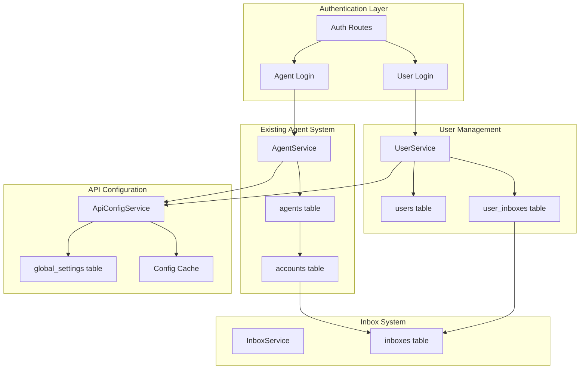

# Design Document: Independent User Accounts

## Overview

Este documento descreve o design para implementação de contas de usuário independentes no WUZAPI Manager. O objetivo é permitir que usuários tenham contas próprias que não dependam de token WUZAPI ou configuração de inbox, enquanto mantém compatibilidade com o sistema existente de Agents (Proprietário/Agente).

A arquitetura proposta introduz uma nova entidade `User` separada de `Agent`, com autenticação própria e vinculação opcional a Inboxes. Além disso, a configuração da API WUZAPI será movida de variáveis de ambiente para o banco de dados, permitindo gerenciamento dinâmico.

## Architecture



## Components and Interfaces

### 1. UserService (New)

Serviço responsável pelo gerenciamento de usuários independentes.

```javascript
// server/services/UserService.js

class UserService {
  /**
   * Create a new independent user
   * @param {string} tenantId - Tenant UUID
   * @param {Object} data - User data
   * @returns {Promise<Object>} Created user
   */
  async createUser(tenantId, data) {}
  
  /**
   * Get user by ID
   * @param {string} userId - User UUID
   * @param {string} [tenantId] - Optional tenant validation
   * @returns {Promise<Object|null>} User or null
   */
  async getUserById(userId, tenantId = null) {}
  
  /**
   * Get user by email within tenant
   * @param {string} email - User email
   * @param {string} tenantId - Tenant UUID
   * @returns {Promise<Object|null>} User with password hash or null
   */
  async getUserByEmail(email, tenantId) {}
  
  /**
   * Authenticate user with email/password
   * @param {string} email - User email
   * @param {string} password - Plain password
   * @param {string} tenantId - Tenant UUID
   * @returns {Promise<Object>} Auth result with user data
   */
  async authenticateUser(email, password, tenantId) {}
  
  /**
   * Link user to inbox
   * @param {string} userId - User UUID
   * @param {string} inboxId - Inbox UUID
   * @returns {Promise<void>}
   */
  async linkInbox(userId, inboxId) {}
  
  /**
   * Unlink user from inbox
   * @param {string} userId - User UUID
   * @param {string} inboxId - Inbox UUID
   * @returns {Promise<void>}
   */
  async unlinkInbox(userId, inboxId) {}
  
  /**
   * Get user's linked inboxes
   * @param {string} userId - User UUID
   * @returns {Promise<Object[]>} List of inboxes
   */
  async getUserInboxes(userId) {}
  
  /**
   * Update user permissions
   * @param {string} userId - User UUID
   * @param {string[]} permissions - Permission list
   * @returns {Promise<Object>} Updated user
   */
  async updatePermissions(userId, permissions) {}
  
  /**
   * Deactivate user and invalidate sessions
   * @param {string} userId - User UUID
   * @returns {Promise<void>}
   */
  async deactivateUser(userId) {}
}
```

### 2. ApiConfigService (New)

Serviço para gerenciamento de configuração da API WUZAPI.

```javascript
// server/services/ApiConfigService.js

class ApiConfigService {
  // Configuration keys
  static KEYS = {
    WUZAPI_BASE_URL: 'api.wuzapi.baseUrl',
    WUZAPI_ADMIN_TOKEN: 'api.wuzapi.adminToken',
    WUZAPI_TIMEOUT: 'api.wuzapi.timeout'
  };
  
  /**
   * Get API configuration with fallback to env vars
   * @returns {Promise<Object>} API configuration
   */
  async getConfig() {}
  
  /**
   * Update API configuration
   * @param {Object} config - New configuration
   * @returns {Promise<void>}
   */
  async updateConfig(config) {}
  
  /**
   * Validate configuration before saving
   * @param {Object} config - Configuration to validate
   * @returns {Object} Validation result
   */
  validateConfig(config) {}
  
  /**
   * Invalidate configuration cache
   */
  invalidateCache() {}
  
  /**
   * Test API connection with current config
   * @returns {Promise<Object>} Connection test result
   */
  async testConnection() {}
}
```

### 3. User Authentication Routes (New)

```javascript
// server/routes/userAuthRoutes.js

/**
 * POST /api/auth/user-login
 * Login de usuário independente via email/senha
 */
router.post('/user-login', async (req, res) => {});

/**
 * POST /api/auth/user-register
 * Registro de novo usuário (se permitido pelo tenant)
 */
router.post('/user-register', async (req, res) => {});

/**
 * POST /api/auth/user-logout
 * Logout de usuário
 */
router.post('/user-logout', async (req, res) => {});
```

### 4. User Management Routes (Admin)

```javascript
// server/routes/adminUserManagementRoutes.js

/**
 * GET /api/admin/independent-users
 * Lista todos os usuários independentes do tenant
 */
router.get('/independent-users', requireAdmin, async (req, res) => {});

/**
 * POST /api/admin/independent-users
 * Cria novo usuário independente
 */
router.post('/independent-users', requireAdmin, async (req, res) => {});

/**
 * PUT /api/admin/independent-users/:userId
 * Atualiza usuário independente
 */
router.put('/independent-users/:userId', requireAdmin, async (req, res) => {});

/**
 * DELETE /api/admin/independent-users/:userId
 * Desativa usuário independente
 */
router.delete('/independent-users/:userId', requireAdmin, async (req, res) => {});

/**
 * POST /api/admin/independent-users/:userId/reset-password
 * Reset de senha do usuário
 */
router.post('/independent-users/:userId/reset-password', requireAdmin, async (req, res) => {});

/**
 * POST /api/admin/independent-users/:userId/link-inbox
 * Vincula inbox ao usuário
 */
router.post('/independent-users/:userId/link-inbox', requireAdmin, async (req, res) => {});

/**
 * DELETE /api/admin/independent-users/:userId/unlink-inbox/:inboxId
 * Desvincula inbox do usuário
 */
router.delete('/independent-users/:userId/unlink-inbox/:inboxId', requireAdmin, async (req, res) => {});
```

## Data Models

### Users Table (New)

```sql
CREATE TABLE users (
  id UUID PRIMARY KEY DEFAULT gen_random_uuid(),
  tenant_id UUID NOT NULL REFERENCES tenants(id) ON DELETE CASCADE,
  email VARCHAR(255) NOT NULL,
  password_hash VARCHAR(255) NOT NULL,
  name VARCHAR(255) NOT NULL,
  avatar_url TEXT,
  status VARCHAR(20) DEFAULT 'active' CHECK (status IN ('active', 'inactive', 'pending')),
  permissions JSONB DEFAULT '[]'::jsonb,
  failed_login_attempts INTEGER DEFAULT 0,
  locked_until TIMESTAMP WITH TIME ZONE,
  last_login_at TIMESTAMP WITH TIME ZONE,
  created_at TIMESTAMP WITH TIME ZONE DEFAULT NOW(),
  updated_at TIMESTAMP WITH TIME ZONE DEFAULT NOW(),
  
  UNIQUE(tenant_id, email)
);

CREATE INDEX idx_users_tenant_id ON users(tenant_id);
CREATE INDEX idx_users_email ON users(email);
CREATE INDEX idx_users_status ON users(status);
```

### User Inboxes Table (New)

```sql
CREATE TABLE user_inboxes (
  id UUID PRIMARY KEY DEFAULT gen_random_uuid(),
  user_id UUID NOT NULL REFERENCES users(id) ON DELETE CASCADE,
  inbox_id UUID NOT NULL REFERENCES inboxes(id) ON DELETE CASCADE,
  is_primary BOOLEAN DEFAULT false,
  created_at TIMESTAMP WITH TIME ZONE DEFAULT NOW(),
  
  UNIQUE(user_id, inbox_id)
);

CREATE INDEX idx_user_inboxes_user_id ON user_inboxes(user_id);
CREATE INDEX idx_user_inboxes_inbox_id ON user_inboxes(inbox_id);
```

### User Sessions Table (New)

```sql
CREATE TABLE user_sessions (
  id UUID PRIMARY KEY DEFAULT gen_random_uuid(),
  user_id UUID NOT NULL REFERENCES users(id) ON DELETE CASCADE,
  session_token VARCHAR(255) NOT NULL UNIQUE,
  ip_address VARCHAR(45),
  user_agent TEXT,
  expires_at TIMESTAMP WITH TIME ZONE NOT NULL,
  created_at TIMESTAMP WITH TIME ZONE DEFAULT NOW(),
  last_activity_at TIMESTAMP WITH TIME ZONE DEFAULT NOW()
);

CREATE INDEX idx_user_sessions_user_id ON user_sessions(user_id);
CREATE INDEX idx_user_sessions_token ON user_sessions(session_token);
CREATE INDEX idx_user_sessions_expires ON user_sessions(expires_at);
```

### Global Settings Table (Existing - Extended)

```sql
-- Já existe, apenas documentando as chaves usadas
-- api.wuzapi.baseUrl - URL base da API WUZAPI
-- api.wuzapi.adminToken - Token admin da API WUZAPI
-- api.wuzapi.timeout - Timeout em ms para requisições
```

## Correctness Properties

*A property is a characteristic or behavior that should hold true across all valid executions of a system-essentially, a formal statement about what the system should do. Properties serve as the bridge between human-readable specifications and machine-verifiable correctness guarantees.*

### Property 1: User Creation Without WUZAPI Dependencies

*For any* valid user data (email, password, name) and tenant context, creating a user SHALL succeed without requiring WUZAPI token or inbox configuration.

**Validates: Requirements 1.2, 1.3**

### Property 2: Password Hashing Round-Trip

*For any* plain text password, hashing and then verifying with the same password SHALL return true, and verifying with a different password SHALL return false.

**Validates: Requirements 1.4**

### Property 3: Email Uniqueness Per Tenant

*For any* two users with the same email, if they belong to the same tenant, the second creation SHALL fail. If they belong to different tenants, both creations SHALL succeed.

**Validates: Requirements 1.6**

### Property 4: Valid Credentials Create Session

*For any* user with valid email and password, authentication SHALL succeed and return a session with userId, role='user', and tenantId set.

**Validates: Requirements 2.1, 2.4**

### Property 5: Invalid Credentials Return Error

*For any* authentication attempt with invalid credentials (wrong password or non-existent email), the system SHALL return an authentication error without creating a session.

**Validates: Requirements 2.2**

### Property 6: Session Independence From WUZAPI

*For any* existing user session, changing WUZAPI configuration SHALL NOT invalidate the session.

**Validates: Requirements 5.2**

### Property 7: Inbox Linking Tenant Validation

*For any* inbox linking attempt, if the inbox belongs to a different tenant than the user, the operation SHALL fail with a validation error.

**Validates: Requirements 3.2**

### Property 8: Inbox State Affects Messaging Availability

*For any* user without linked inbox, messaging-related API calls SHALL return a "feature unavailable" error. *For any* user with linked inbox, messaging-related API calls SHALL be processed normally.

**Validates: Requirements 3.3, 3.4**

### Property 9: User Data Preserved On Inbox Unlink

*For any* user with linked inbox, after unlinking the inbox, all user data (profile, permissions, settings) SHALL remain unchanged.

**Validates: Requirements 3.6**

### Property 10: Permission Changes Apply Immediately

*For any* permission update, subsequent permission checks SHALL reflect the new permissions without requiring re-authentication.

**Validates: Requirements 4.4**

### Property 11: Permission Changes Logged

*For any* permission change operation, an audit log entry SHALL be created with the change details.

**Validates: Requirements 4.5**

### Property 12: Config Validation Before Save

*For any* invalid API configuration (malformed URL, empty token), the save operation SHALL fail with a validation error.

**Validates: Requirements 5.6**

### Property 13: User Role In Session

*For any* successful user login, the session role SHALL be set to 'user'.

**Validates: Requirements 6.2**

### Property 14: Agent Role In Session

*For any* successful agent login, the session role SHALL be set to 'admin'.

**Validates: Requirements 6.3**

### Property 15: Session Invalidation On Deactivation

*For any* user deactivation, all active sessions for that user SHALL be invalidated immediately.

**Validates: Requirements 7.6**

### Property 16: Config Priority DB Over Env

*For any* configuration key, if a value exists in the database, it SHALL be used instead of the environment variable value.

**Validates: Requirements 8.3, 8.4**

### Property 17: Config Cache Invalidation

*For any* configuration update, subsequent configuration reads SHALL return the new value (cache invalidated).

**Validates: Requirements 8.6**

## Error Handling

### Authentication Errors

| Error Code | HTTP Status | Description |
|------------|-------------|-------------|
| `INVALID_CREDENTIALS` | 401 | Email ou senha inválidos |
| `USER_NOT_FOUND` | 401 | Usuário não encontrado |
| `USER_INACTIVE` | 403 | Conta de usuário desativada |
| `USER_LOCKED` | 403 | Conta bloqueada por tentativas excessivas |
| `TENANT_MISMATCH` | 403 | Usuário não pertence ao tenant |

### User Management Errors

| Error Code | HTTP Status | Description |
|------------|-------------|-------------|
| `EMAIL_ALREADY_EXISTS` | 409 | Email já cadastrado no tenant |
| `INVALID_EMAIL_FORMAT` | 400 | Formato de email inválido |
| `WEAK_PASSWORD` | 400 | Senha não atende requisitos mínimos |
| `USER_NOT_FOUND` | 404 | Usuário não encontrado |

### Inbox Linking Errors

| Error Code | HTTP Status | Description |
|------------|-------------|-------------|
| `INBOX_NOT_FOUND` | 404 | Inbox não encontrada |
| `INBOX_TENANT_MISMATCH` | 403 | Inbox pertence a outro tenant |
| `INBOX_ALREADY_LINKED` | 409 | Inbox já vinculada ao usuário |
| `NO_INBOX_LINKED` | 400 | Nenhuma inbox vinculada (para operações de messaging) |

### API Configuration Errors

| Error Code | HTTP Status | Description |
|------------|-------------|-------------|
| `INVALID_URL_FORMAT` | 400 | URL da API em formato inválido |
| `INVALID_TOKEN_FORMAT` | 400 | Token em formato inválido |
| `CONNECTION_TEST_FAILED` | 503 | Teste de conexão com API falhou |

## Testing Strategy

### Unit Tests

- **UserService**: Testes para criação, autenticação, gerenciamento de permissões
- **ApiConfigService**: Testes para leitura, escrita, validação e cache de configuração
- **Password hashing**: Testes para hash e verificação de senhas

### Property-Based Tests

Utilizando a biblioteca `fast-check` para TypeScript/JavaScript:

- **Property 1-3**: Testes de criação de usuário com dados gerados
- **Property 4-5**: Testes de autenticação com credenciais válidas/inválidas
- **Property 7**: Testes de vinculação de inbox com validação de tenant
- **Property 12**: Testes de validação de configuração com URLs/tokens inválidos
- **Property 16-17**: Testes de prioridade e cache de configuração

### Integration Tests

- Fluxo completo de registro → login → uso de features
- Fluxo de vinculação/desvinculação de inbox
- Fluxo de alteração de configuração de API
- Compatibilidade com sistema existente de Agents

### E2E Tests (Cypress)

- Login de usuário independente
- Gerenciamento de usuários pelo admin
- Vinculação de inbox via UI
- Configuração de API via admin panel
