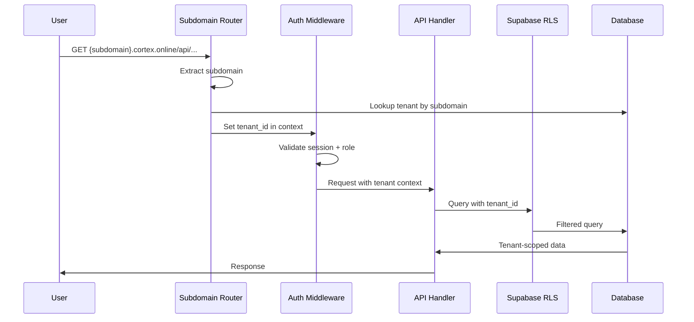

# Design Document: Multi-Tenant Architecture

## Overview

This design transforms WUZAPI Manager from a single-tenant to a multi-tenant architecture with a four-level hierarchy: Superadmin → Tenant → Account → Agent. Each tenant operates independently with its own subdomain, branding, plans, and isolated data, while the superadmin has platform-wide visibility and control.

## Architecture

### System Architecture Diagram

```mermaid
flowchart TB
    subgraph "Frontend Layer"
        FE_SA[Superadmin Dashboard<br/>superadmin.cortex.online]
        FE_TA[Tenant Admin Panel<br/>{subdomain}.cortex.online/admin]
        FE_USER[User Interface<br/>{subdomain}.cortex.online]
    end

    subgraph "API Gateway"
        ROUTER[Subdomain Router<br/>Middleware]
        AUTH[Auth Middleware<br/>Role-based]
    end

    subgraph "Backend Services"
        SA_SVC[SuperadminService]
        TENANT_SVC[TenantService]
        ACCOUNT_SVC[AccountService]
        AGENT_SVC[AgentService]
        PLAN_SVC[PlanService]
        QUOTA_SVC[QuotaService]
        BRANDING_SVC[BrandingService]
    end

    subgraph "Database Layer"
        SUPABASE[(Supabase PostgreSQL<br/>with RLS)]
    end

    subgraph "External Services"
        STRIPE[Stripe Connect]
        WUZAPI[WUZAPI<br/>WhatsApp API]
    end

    FE_SA --> ROUTER
    FE_TA --> ROUTER
    FE_USER --> ROUTER
    
    ROUTER --> AUTH
    AUTH --> SA_SVC
    AUTH --> TENANT_SVC
    AUTH --> ACCOUNT_SVC
    AUTH --> AGENT_SVC
    
    SA_SVC --> SUPABASE
    TENANT_SVC --> SUPABASE
    ACCOUNT_SVC --> SUPABASE
    AGENT_SVC --> SUPABASE
    PLAN_SVC --> SUPABASE
    QUOTA_SVC --> SUPABASE
    BRANDING_SVC --> SUPABASE
    
    PLAN_SVC --> STRIPE
    ACCOUNT_SVC --> WUZAPI
```

### Request Flow



## Components and Interfaces

### New Services

#### SuperadminService
```javascript
class SuperadminService {
  // Authentication
  async authenticate(email, password): Promise<SuperadminSession>
  async createSession(superadminId): Promise<SessionToken>
  async invalidateSessions(superadminId): Promise<void>
  
  // Tenant Management
  async createTenant(data: TenantCreateData): Promise<Tenant>
  async updateTenant(tenantId, data): Promise<Tenant>
  async deactivateTenant(tenantId): Promise<void>
  async deleteTenant(tenantId): Promise<void>
  async listTenants(filters): Promise<Tenant[]>
  
  // Impersonation
  async impersonateTenant(superadminId, tenantId): Promise<ImpersonationSession>
  async endImpersonation(sessionId): Promise<void>
  
  // Metrics
  async getDashboardMetrics(): Promise<DashboardMetrics>
  async getTenantMetrics(tenantId): Promise<TenantMetrics>
  async exportMetrics(filters): Promise<CSVBuffer>
}
```

#### TenantService
```javascript
class TenantService {
  // CRUD
  async getById(tenantId): Promise<Tenant>
  async getBySubdomain(subdomain): Promise<Tenant>
  async validateSubdomain(subdomain): Promise<boolean>
  
  // Branding
  async getBranding(tenantId): Promise<TenantBranding>
  async updateBranding(tenantId, data): Promise<TenantBranding>
  
  // Plans
  async createPlan(tenantId, data): Promise<TenantPlan>
  async updatePlan(planId, data): Promise<TenantPlan>
  async deletePlan(planId, migrateToPlanId?): Promise<void>
  async listPlans(tenantId): Promise<TenantPlan[]>
  
  // Accounts
  async listAccounts(tenantId, filters): Promise<Account[]>
  async getAccountStats(tenantId): Promise<AccountStats>
}
```

### Modified Services

#### AccountService (Modified)
```javascript
// Add tenant_id to all operations
async createAccount(tenantId, data): Promise<Account>
async getAccountById(accountId, tenantId): Promise<Account>
async listAccounts(tenantId, filters): Promise<Account[]>
```

#### PlanService (Modified)
```javascript
// Scope plans to tenant
async createPlan(tenantId, data): Promise<Plan>
async getPlanById(planId, tenantId): Promise<Plan>
async listPlans(tenantId): Promise<Plan[]>
async validateQuotasAgainstGlobal(quotas): Promise<ValidationResult>
```

### New Middleware

#### SubdomainRouter
```javascript
async function subdomainRouter(req, res, next) {
  const subdomain = extractSubdomain(req.hostname)
  
  if (subdomain === 'superadmin') {
    req.context = { role: 'superadmin' }
    return next()
  }
  
  const tenant = await TenantService.getBySubdomain(subdomain)
  if (!tenant) {
    return res.status(404).render('tenant-not-found')
  }
  
  if (tenant.status !== 'active') {
    return res.status(403).json({ error: 'Tenant inactive' })
  }
  
  req.context = { tenantId: tenant.id, tenant }
  next()
}
```

#### TenantAuthMiddleware
```javascript
async function requireTenantAdmin(req, res, next) {
  if (!req.session?.userId || req.session.role !== 'tenant_admin') {
    return res.status(401).json({ error: 'Tenant admin required' })
  }
  
  if (req.session.tenantId !== req.context.tenantId) {
    return res.status(403).json({ error: 'Cross-tenant access denied' })
  }
  
  next()
}
```

## Data Models

### New Tables

#### superadmins
```sql
CREATE TABLE superadmins (
  id UUID PRIMARY KEY DEFAULT gen_random_uuid(),
  email TEXT UNIQUE NOT NULL,
  password_hash TEXT NOT NULL,
  name TEXT NOT NULL,
  status TEXT DEFAULT 'active' CHECK (status IN ('active', 'inactive')),
  last_login_at TIMESTAMPTZ,
  created_at TIMESTAMPTZ DEFAULT now(),
  updated_at TIMESTAMPTZ DEFAULT now()
);
```

#### tenants
```sql
CREATE TABLE tenants (
  id UUID PRIMARY KEY DEFAULT gen_random_uuid(),
  subdomain TEXT UNIQUE NOT NULL,
  name TEXT NOT NULL,
  owner_superadmin_id UUID REFERENCES superadmins(id),
  status TEXT DEFAULT 'active' CHECK (status IN ('active', 'inactive', 'suspended')),
  settings JSONB DEFAULT '{}',
  stripe_connect_id TEXT,
  created_at TIMESTAMPTZ DEFAULT now(),
  updated_at TIMESTAMPTZ DEFAULT now()
);

CREATE INDEX idx_tenants_subdomain ON tenants(subdomain);
CREATE INDEX idx_tenants_status ON tenants(status);
```

#### tenant_branding
```sql
CREATE TABLE tenant_branding (
  id UUID PRIMARY KEY DEFAULT gen_random_uuid(),
  tenant_id UUID UNIQUE REFERENCES tenants(id) ON DELETE CASCADE,
  app_name TEXT DEFAULT 'WUZAPI',
  logo_url TEXT,
  primary_color TEXT,
  secondary_color TEXT,
  primary_foreground TEXT,
  secondary_foreground TEXT,
  custom_home_html TEXT,
  support_phone TEXT,
  og_image_url TEXT,
  created_at TIMESTAMPTZ DEFAULT now(),
  updated_at TIMESTAMPTZ DEFAULT now()
);
```

#### tenant_plans
```sql
CREATE TABLE tenant_plans (
  id UUID PRIMARY KEY DEFAULT gen_random_uuid(),
  tenant_id UUID REFERENCES tenants(id) ON DELETE CASCADE,
  name TEXT NOT NULL,
  description TEXT,
  price_cents INTEGER DEFAULT 0,
  billing_cycle TEXT DEFAULT 'monthly',
  status TEXT DEFAULT 'active',
  is_default BOOLEAN DEFAULT false,
  trial_days INTEGER DEFAULT 0,
  quotas JSONB DEFAULT '{}',
  features JSONB DEFAULT '{}',
  stripe_product_id TEXT,
  stripe_price_id TEXT,
  created_at TIMESTAMPTZ DEFAULT now(),
  updated_at TIMESTAMPTZ DEFAULT now(),
  UNIQUE(tenant_id, name)
);

CREATE INDEX idx_tenant_plans_tenant ON tenant_plans(tenant_id);
```

#### superadmin_audit_log
```sql
CREATE TABLE superadmin_audit_log (
  id UUID PRIMARY KEY DEFAULT gen_random_uuid(),
  superadmin_id UUID REFERENCES superadmins(id),
  action TEXT NOT NULL,
  resource_type TEXT NOT NULL,
  resource_id TEXT,
  tenant_id UUID REFERENCES tenants(id),
  details JSONB,
  ip_address TEXT,
  created_at TIMESTAMPTZ DEFAULT now()
);

CREATE INDEX idx_superadmin_audit_tenant ON superadmin_audit_log(tenant_id);
CREATE INDEX idx_superadmin_audit_created ON superadmin_audit_log(created_at);
```

### Modified Tables

#### accounts (add tenant_id)
```sql
ALTER TABLE accounts ADD COLUMN tenant_id UUID REFERENCES tenants(id);
CREATE INDEX idx_accounts_tenant ON accounts(tenant_id);
```

#### user_subscriptions (reference tenant_plans)
```sql
-- plan_id now references tenant_plans instead of global plans
ALTER TABLE user_subscriptions 
  DROP CONSTRAINT user_subscriptions_plan_id_fkey,
  ADD CONSTRAINT user_subscriptions_plan_id_fkey 
    FOREIGN KEY (plan_id) REFERENCES tenant_plans(id);
```

### RLS Policies

```sql
-- Enable RLS on tenant-scoped tables
ALTER TABLE accounts ENABLE ROW LEVEL SECURITY;
ALTER TABLE agents ENABLE ROW LEVEL SECURITY;
ALTER TABLE inboxes ENABLE ROW LEVEL SECURITY;
ALTER TABLE conversations ENABLE ROW LEVEL SECURITY;

-- Account policy: users can only see accounts in their tenant
CREATE POLICY accounts_tenant_isolation ON accounts
  FOR ALL
  USING (tenant_id = current_setting('app.tenant_id')::uuid);

-- Agents policy: via account's tenant
CREATE POLICY agents_tenant_isolation ON agents
  FOR ALL
  USING (
    account_id IN (
      SELECT id FROM accounts 
      WHERE tenant_id = current_setting('app.tenant_id')::uuid
    )
  );

-- Similar policies for inboxes, conversations, etc.
```

## Correctness Properties

*A property is a characteristic or behavior that should hold true across all valid executions of a system-essentially, a formal statement about what the system should do. Properties serve as the bridge between human-readable specifications and machine-verifiable correctness guarantees.*

### Property 1: Subdomain Uniqueness
*For any* two tenants T1 and T2, if T1.subdomain equals T2.subdomain, then T1.id must equal T2.id (subdomains are unique identifiers)
**Validates: Requirements 2.1**

### Property 2: Tenant Creation Side Effects
*For any* newly created tenant, there must exist exactly one tenant_branding record and at least one tenant_plan record with matching tenant_id
**Validates: Requirements 2.2**

### Property 3: Tenant Deactivation Cascades
*For any* tenant with status 'inactive', all accounts within that tenant must fail authentication attempts
**Validates: Requirements 2.3**

### Property 4: Cascade Delete Completeness
*For any* deleted tenant, there must be zero records in accounts, agents, inboxes, conversations, and subscriptions referencing that tenant_id
**Validates: Requirements 2.4, 9.4**

### Property 5: MRR Calculation Accuracy
*For any* superadmin dashboard, the displayed total MRR must equal the sum of (plan.price_cents * active_subscription_count) across all active tenants
**Validates: Requirements 3.1**

### Property 6: Impersonation Audit Trail
*For any* impersonation session, there must exist a corresponding record in superadmin_audit_log with action='impersonate', superadmin_id, and tenant_id
**Validates: Requirements 4.2**

### Property 7: Tenant Data Isolation
*For any* API request with tenant context, all returned data must have tenant_id matching the request's tenant context (no cross-tenant data leakage)
**Validates: Requirements 5.1, 5.5, 9.1**

### Property 8: Account-Tenant Association
*For any* account created by a tenant admin, the account.tenant_id must equal the admin's session.tenant_id
**Validates: Requirements 5.2**

### Property 9: Plan Quota Validation
*For any* tenant plan, all quota values must be less than or equal to corresponding global platform limits
**Validates: Requirements 6.2, 11.2**

### Property 10: Subscription Plan Reference
*For any* user_subscription, the plan_id must reference a tenant_plan belonging to the same tenant as the account
**Validates: Requirements 6.5**

### Property 11: Agent Invitation Scoping
*For any* agent_invitation, the account_id must belong to the same tenant as the inviting user's session
**Validates: Requirements 7.2**

### Property 12: Subdomain Resolution Consistency
*For any* subdomain S, calling TenantService.getBySubdomain(S) must return the same tenant_id on every invocation (deterministic resolution)
**Validates: Requirements 8.1**

### Property 13: Cross-Tenant Authentication Denial
*For any* login attempt with valid credentials for tenant T1 made via subdomain of tenant T2 (where T1 ≠ T2), authentication must fail
**Validates: Requirements 8.2, 8.3**

### Property 14: Quota Enforcement
*For any* account at quota limit L for quota type Q, attempting to increment usage must fail and return quota exceeded error
**Validates: Requirements 11.1**

### Property 15: Quota Reset on Cycle
*For any* account with cycle-based quota (messages_per_day, messages_per_month), usage must reset to zero at period boundary
**Validates: Requirements 11.4**

### Property 16: Inbox Token Scoping
*For any* inbox, the wuzapi_token must be unique and the inbox.account_id must belong to the tenant context
**Validates: Requirements 12.1**

### Property 17: Webhook Routing Accuracy
*For any* webhook received with wuzapi_token T, the event must be routed to the account whose inbox has wuzapi_token = T
**Validates: Requirements 12.3**

### Property 18: Message Quota Tracking
*For any* message sent via inbox I, the account's message quota usage must increment by exactly 1
**Validates: Requirements 12.4**

### Property 19: Global Limit Enforcement
*For any* tenant plan quota update, if new_value > global_limit, the update must be rejected
**Validates: Requirements 13.2**

## Error Handling

### Tenant Resolution Errors
- **TENANT_NOT_FOUND**: Subdomain does not exist → 404 with platform branding
- **TENANT_INACTIVE**: Tenant is deactivated → 403 with message
- **TENANT_SUSPENDED**: Tenant is suspended → 403 with contact support message

### Authentication Errors
- **SUPERADMIN_INVALID_CREDENTIALS**: Wrong email/password → 401
- **TENANT_ADMIN_INVALID_CREDENTIALS**: Wrong credentials → 401
- **CROSS_TENANT_ACCESS**: Attempt to access another tenant → 403 + audit log

### Quota Errors
- **QUOTA_EXCEEDED**: Operation would exceed quota → 429 with usage details
- **QUOTA_INVALID**: Quota exceeds global limit → 400 with limit info

### Data Isolation Errors
- **RLS_VIOLATION**: Query returned cross-tenant data → 500 + alert

## Testing Strategy

### Property-Based Testing Library
Use **fast-check** for JavaScript property-based testing.

### Unit Tests
- SuperadminService authentication flow
- TenantService CRUD operations
- Subdomain validation regex
- Quota calculation functions

### Property-Based Tests
Each correctness property (1-19) will have a corresponding property-based test that:
1. Generates random valid inputs
2. Executes the operation
3. Verifies the property holds
4. Runs minimum 100 iterations

Test annotations format:
```javascript
// **Feature: multi-tenant-architecture, Property 7: Tenant Data Isolation**
```

### Integration Tests
- End-to-end tenant creation flow
- Impersonation session lifecycle
- Cross-tenant access denial
- Cascade delete verification

### RLS Policy Tests
- Verify RLS blocks cross-tenant queries
- Verify superadmin bypass works correctly
- Verify tenant admin sees only their data
