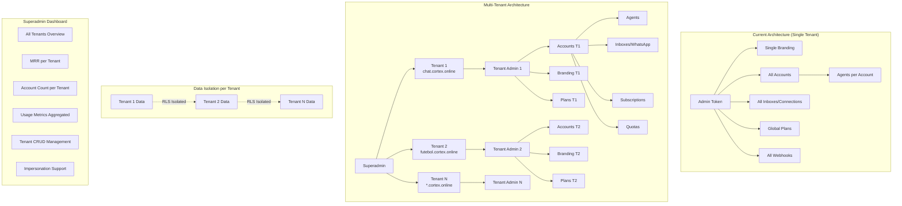

# Requirements Document

## Introduction

Este documento especifica os requisitos para transformar o WUZAPI Manager em uma plataforma multi-tenant com hierarquia de quatro níveis: Superadmin → Tenant (Admin) → Account (User) → Agent. Cada tenant opera de forma independente com seu próprio subdomínio, branding, planos, usuários (accounts) e conexões WhatsApp, enquanto o superadmin tem visibilidade e controle sobre todos os tenants.

## Glossary

- **Superadmin**: Administrador global da plataforma com acesso a todos os tenants e métricas consolidadas
- **Tenant**: Uma instância isolada da plataforma, identificada por um subdomínio único (ex: chat.cortex.online)
- **Tenant Admin**: Administrador de um tenant específico, gerencia accounts, planos, branding e configurações do tenant
- **Account**: Conta de usuário dentro de um tenant, possui wuzapi_token, subscription, quotas e pode ter múltiplos agents
- **Agent**: Sub-usuário dentro de uma account, com credenciais próprias e permissões configuráveis (owner, administrator, agent, viewer)
- **Subdomínio**: Identificador único do tenant na URL (ex: chat.cortex.online, futebol.cortex.online)
- **Branding**: Configurações visuais personalizadas (logo, cores, nome) de cada tenant
- **Plan**: Plano de assinatura com quotas (max_agents, max_inboxes, max_messages, etc.) e features
- **Quota**: Limites de recursos por account (mensagens/dia, bots, inboxes, agents, etc.)
- **Inbox**: Canal de comunicação WhatsApp com wuzapi_token próprio
- **Isolamento de Dados**: Garantia de que dados de um tenant não são acessíveis por outro tenant
- **MRR (Monthly Recurring Revenue)**: Receita mensal recorrente de um tenant

## Architecture Analysis Diagram



## Complete Database Impact Analysis

```mermaid
erDiagram
    SUPERADMINS ||--o{ TENANTS : manages
    SUPERADMINS {
        uuid id PK
        string email UK
        string password_hash
        string name
        string status
        timestamp last_login_at
        timestamp created_at
    }
    
    TENANTS ||--o{ ACCOUNTS : has
    TENANTS ||--|| TENANT_BRANDING : has
    TENANTS ||--o{ TENANT_PLANS : has
    TENANTS {
        uuid id PK
        string subdomain UK
        string name
        uuid owner_superadmin_id FK
        string status
        jsonb settings
        string stripe_connect_id
        timestamp created_at
    }
    
    TENANT_BRANDING {
        uuid id PK
        uuid tenant_id FK_UK
        string app_name
        string logo_url
        string primary_color
        string secondary_color
        text custom_home_html
    }
    
    TENANT_PLANS ||--o{ USER_SUBSCRIPTIONS : subscribed
    TENANT_PLANS {
        uuid id PK
        uuid tenant_id FK
        string name
        integer price_cents
        jsonb quotas
        jsonb features
        string stripe_price_id
    }
    
    ACCOUNTS ||--o{ AGENTS : has
    ACCOUNTS ||--o{ INBOXES : has
    ACCOUNTS ||--|| USER_SUBSCRIPTIONS : has
    ACCOUNTS ||--o{ USER_QUOTA_USAGE : tracks
    ACCOUNTS {
        uuid id PK
        uuid tenant_id FK
        string name
        string wuzapi_token UK
        uuid owner_user_id
        string stripe_customer_id
        string status
    }
    
    AGENTS ||--o{ CONVERSATIONS : assigned
    AGENTS ||--o{ AGENT_SESSIONS : has
    AGENTS {
        uuid id PK
        uuid account_id FK
        string email
        string password_hash
        string role
        string availability
    }
    
    INBOXES ||--o{ CONVERSATIONS : receives
    INBOXES {
        uuid id PK
        uuid account_id FK
        string wuzapi_token
        string phone_number
        boolean wuzapi_connected
    }
    
    USER_SUBSCRIPTIONS {
        uuid id PK
        uuid account_id FK_UK
        uuid plan_id FK
        string status
        string stripe_subscription_id
    }
    
    USER_QUOTA_USAGE {
        uuid id PK
        uuid account_id FK
        string quota_key
        integer used_value
        timestamp period_start
    }
```

## Hierarchy Summary

```
Superadmin (Platform Owner)
└── Tenant (Subdomain Instance)
    ├── Tenant Branding (logo, colors, custom HTML)
    ├── Tenant Plans (quotas, features, pricing)
    └── Accounts (End Users with wuzapi_token)
        ├── Subscription (linked to Tenant Plan)
        ├── Quota Usage (messages, bots, storage)
        ├── Agents (sub-users with roles)
        │   └── Sessions, Permissions
        ├── Inboxes (WhatsApp connections)
        │   └── Conversations, Messages
        ├── Teams, Labels, Webhooks
        └── Bots, Campaigns, Templates
```

## Requirements

### Requirement 1: Superadmin Authentication

**User Story:** As a Superadmin, I want to authenticate with elevated privileges, so that I can access superadmin-only features.

#### Acceptance Criteria

1. WHEN a superadmin logs in THEN the system SHALL verify credentials against the superadmins table and create a session with role 'superadmin'
2. WHEN a non-superadmin attempts to access superadmin routes THEN the system SHALL return 403 Forbidden
3. WHEN a superadmin session expires THEN the system SHALL require re-authentication
4. WHEN a superadmin changes password THEN the system SHALL invalidate all existing sessions for that superadmin

### Requirement 2: Tenant CRUD Management

**User Story:** As a Superadmin, I want to create and manage tenants, so that I can onboard new customers to the platform.

#### Acceptance Criteria

1. WHEN a superadmin creates a new tenant with a subdomain THEN the system SHALL validate subdomain uniqueness and format (lowercase alphanumeric with hyphens)
2. WHEN a tenant is created THEN the system SHALL create tenant_branding record with default values and copy default plans to tenant_plans
3. WHEN a superadmin deactivates a tenant THEN the system SHALL set tenant status to 'inactive' and prevent all accounts from logging in
4. WHEN a superadmin deletes a tenant THEN the system SHALL cascade delete all related data (accounts, agents, inboxes, conversations, subscriptions) after confirmation
5. WHEN a superadmin updates tenant settings THEN the system SHALL persist changes to the tenants table

### Requirement 3: Superadmin Dashboard Metrics

**User Story:** As a Superadmin, I want to view consolidated metrics across all tenants, so that I can monitor platform health and revenue.

#### Acceptance Criteria

1. WHEN a superadmin accesses the dashboard THEN the system SHALL display total MRR calculated from sum of all active tenant subscriptions
2. WHEN a superadmin views tenant list THEN the system SHALL show account count, active subscriptions, MRR, and status for each tenant
3. WHEN a superadmin requests usage metrics THEN the system SHALL aggregate message counts, active inboxes, agent count, and storage usage per tenant
4. WHEN a superadmin filters metrics by date range THEN the system SHALL return data only within the specified period
5. WHEN a superadmin exports metrics THEN the system SHALL generate a CSV file with tenant data including subdomain, account count, MRR, and usage

### Requirement 4: Tenant Impersonation

**User Story:** As a Superadmin, I want to access any tenant's admin panel, so that I can provide support and troubleshoot issues.

#### Acceptance Criteria

1. WHEN a superadmin impersonates a tenant admin THEN the system SHALL create a temporary session with tenant admin privileges scoped to that tenant
2. WHEN a superadmin impersonates a tenant THEN the system SHALL log the action in admin_audit_log with superadmin_id, tenant_id, and timestamp
3. WHEN a superadmin ends impersonation THEN the system SHALL destroy the impersonation session and return to the superadmin dashboard
4. WHILE impersonating THEN the system SHALL display a visual banner showing "Impersonating: {tenant_name}" with an exit button

### Requirement 5: Tenant Admin Independence

**User Story:** As a Tenant Admin, I want to manage my tenant independently, so that I can operate my business without interference from other tenants.

#### Acceptance Criteria

1. WHEN a tenant admin logs in THEN the system SHALL only show accounts, agents, inboxes, and data belonging to their tenant_id
2. WHEN a tenant admin creates an account THEN the system SHALL associate the account with the tenant_id automatically
3. WHEN a tenant admin configures branding THEN the system SHALL update tenant_branding for their tenant only
4. WHEN a tenant admin manages plans THEN the system SHALL CRUD tenant_plans scoped to their tenant_id only
5. WHEN a tenant admin views inboxes THEN the system SHALL show only inboxes belonging to accounts within their tenant

### Requirement 6: Tenant Plan Management

**User Story:** As a Tenant Admin, I want to create and manage subscription plans for my accounts, so that I can monetize my tenant.

#### Acceptance Criteria

1. WHEN a tenant admin creates a plan THEN the system SHALL store it in tenant_plans with tenant_id and quotas (max_agents, max_inboxes, max_messages_per_day, max_bots, etc.)
2. WHEN a tenant admin updates plan quotas THEN the system SHALL validate quotas do not exceed global platform limits
3. WHEN a tenant admin syncs a plan to Stripe THEN the system SHALL create Stripe Product and Price linked to tenant's Stripe Connect account
4. WHEN a tenant admin deletes a plan with active subscribers THEN the system SHALL require migration to another plan before deletion
5. WHEN an account subscribes to a tenant plan THEN the system SHALL create user_subscription linking account_id to tenant_plan_id

### Requirement 7: Account and Agent Hierarchy

**User Story:** As a Tenant Admin, I want to manage accounts and their agents, so that I can control access within my tenant.

#### Acceptance Criteria

1. WHEN a tenant admin creates an account THEN the system SHALL generate a unique wuzapi_token and associate with tenant_id
2. WHEN an account owner invites an agent THEN the system SHALL create agent_invitation scoped to the account_id
3. WHEN an agent accepts invitation THEN the system SHALL create agent record with account_id, role (owner/administrator/agent/viewer), and credentials
4. WHEN a tenant admin views accounts THEN the system SHALL show account name, subscription status, agent count, and inbox count
5. WHEN a tenant admin deactivates an account THEN the system SHALL set account status to 'inactive' and invalidate all agent sessions

### Requirement 8: Subdomain Routing and Branding

**User Story:** As an Account User, I want to access my tenant's platform via subdomain, so that I can use the customized experience.

#### Acceptance Criteria

1. WHEN a user accesses a subdomain THEN the system SHALL resolve tenant_id from subdomain and load tenant_branding (logo, colors, app_name)
2. WHEN a user logs in via subdomain THEN the system SHALL validate credentials against accounts and agents within that tenant only
3. WHEN a user attempts to access another tenant's subdomain THEN the system SHALL deny access with "Invalid credentials" error
4. IF a subdomain does not exist THEN the system SHALL display a "Tenant not found" error page with platform branding

### Requirement 9: Data Isolation via RLS

**User Story:** As a system, I want to enforce data isolation between tenants, so that security and privacy are maintained.

#### Acceptance Criteria

1. WHEN any database query executes for tenant-scoped tables THEN the system SHALL include tenant_id filter automatically via Supabase RLS policies
2. WHEN an API request is made THEN the system SHALL extract tenant_id from session and validate resource ownership
3. WHEN a user attempts cross-tenant data access THEN the system SHALL log the attempt in audit_log and return 403 Forbidden
4. WHEN a tenant is deleted THEN the system SHALL cascade delete all related data from accounts, agents, inboxes, conversations, subscriptions, and usage tables

### Requirement 10: Tenant Billing and Revenue

**User Story:** As a Superadmin, I want to track billing and revenue per tenant, so that I can manage platform finances.

#### Acceptance Criteria

1. WHEN a superadmin views tenant billing THEN the system SHALL display total MRR, active subscriptions count, and payment status
2. WHEN a tenant has Stripe Connect configured THEN the system SHALL route subscription payments through tenant's Stripe account with platform fee
3. WHEN a subscription payment fails THEN the system SHALL notify tenant admin and apply grace period rules from tenant settings
4. WHEN a superadmin exports revenue report THEN the system SHALL generate CSV with tenant subdomain, MRR, account count, and payment status

### Requirement 11: Quota Enforcement per Tenant

**User Story:** As a system, I want to enforce quotas at both tenant and account level, so that resource usage is controlled.

#### Acceptance Criteria

1. WHEN an account attempts to exceed plan quota THEN the system SHALL deny the operation and return quota exceeded error with current usage and limit
2. WHEN a tenant admin sets plan quotas THEN the system SHALL validate they do not exceed global platform limits defined by superadmin
3. WHEN quota usage is tracked THEN the system SHALL update user_quota_usage with account_id, quota_key, and period timestamps
4. WHEN a billing cycle resets THEN the system SHALL reset cycle-based quotas (messages_per_day, messages_per_month, bot_calls) to zero

### Requirement 12: Inbox and WhatsApp Isolation

**User Story:** As a Tenant Admin, I want each account to have independent WhatsApp connections, so that messaging is isolated.

#### Acceptance Criteria

1. WHEN an account creates an inbox THEN the system SHALL store wuzapi_token scoped to account_id within tenant
2. WHEN an inbox connects to WhatsApp THEN the system SHALL update wuzapi_connected status for that inbox only
3. WHEN webhooks are received from WUZAPI THEN the system SHALL route events to the correct account based on wuzapi_token mapping
4. WHEN a message is sent THEN the system SHALL use the inbox's wuzapi_token and increment account's message quota usage

### Requirement 13: Global Platform Settings

**User Story:** As a Superadmin, I want to configure global platform settings, so that I can control default behaviors across all tenants.

#### Acceptance Criteria

1. WHEN a superadmin sets default plan templates THEN the system SHALL store them in global_settings and copy to new tenants on creation
2. WHEN a superadmin configures global rate limits THEN the system SHALL enforce them as maximum values that tenant plans cannot exceed
3. WHEN a superadmin updates platform branding THEN the system SHALL apply it to superadmin dashboard and "tenant not found" pages
4. WHEN a superadmin enables a feature flag THEN the system SHALL make the feature available to all tenants unless explicitly disabled

