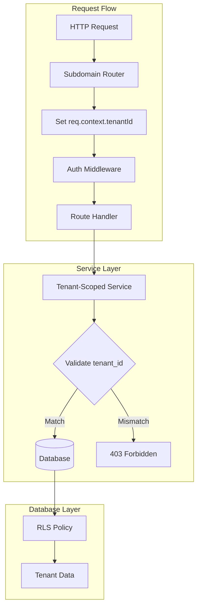

# Design Document: Multi-Tenant Isolation Fixes

## Overview

Este documento descreve as soluções de design para corrigir todos os problemas de isolamento multi-tenant identificados na auditoria.

## Architecture

### Padrão de Isolamento por Tenant



### Padrão de Validação de Tenant

```javascript
// Padrão obrigatório para todas as rotas admin
async function validateTenantAccess(req, resourceId, resourceTable) {
  const tenantId = req.context?.tenantId;
  if (!tenantId) {
    throw new Error('Tenant context required');
  }
  
  const resource = await SupabaseService.getById(resourceTable, resourceId);
  if (!resource) {
    throw new Error('Resource not found');
  }
  
  // Para recursos diretos com tenant_id
  if (resource.tenant_id && resource.tenant_id !== tenantId) {
    logger.warn('Cross-tenant access attempt', {
      tenantId,
      resourceTenantId: resource.tenant_id,
      resourceId,
      resourceTable
    });
    throw new Error('Cross-tenant access denied');
  }
  
  // Para recursos via account
  if (resource.account_id) {
    const account = await SupabaseService.getById('accounts', resource.account_id);
    if (account.tenant_id !== tenantId) {
      throw new Error('Cross-tenant access denied');
    }
  }
  
  return resource;
}
```

## Component Solutions

### Solution 1: TenantPlanService

Substituir `PlanService` por `TenantPlanService` para operações de admin de tenant.

```javascript
// server/services/TenantPlanService.js
class TenantPlanService {
  async createPlan(tenantId, data) {
    // Validar quotas contra limites globais
    await QuotaService.validateAgainstGlobalLimits(data.quotas);
    
    return SupabaseService.insert('tenant_plans', {
      ...data,
      tenant_id: tenantId
    });
  }
  
  async getPlanById(planId, tenantId) {
    const plan = await SupabaseService.getById('tenant_plans', planId);
    if (plan.tenant_id !== tenantId) {
      throw new Error('Plan not found');
    }
    return plan;
  }
  
  async listPlans(tenantId) {
    return SupabaseService.getMany('tenant_plans', { tenant_id: tenantId });
  }
  
  async updatePlan(planId, tenantId, data) {
    await this.getPlanById(planId, tenantId); // Valida acesso
    return SupabaseService.update('tenant_plans', planId, data);
  }
  
  async deletePlan(planId, tenantId) {
    await this.getPlanById(planId, tenantId); // Valida acesso
    return SupabaseService.delete('tenant_plans', planId);
  }
}
```

### Solution 2: SubscriptionService Tenant Validation

Adicionar validação de tenant em `assignPlan`.

```javascript
// Modificação em SubscriptionService.assignPlan
async assignPlan(userId, planId, adminId) {
  // ... código existente ...
  
  // NOVA VALIDAÇÃO: Verificar que o plano pertence ao tenant do account
  const { data: plan } = await SupabaseService.getById('tenant_plans', planId);
  if (!plan) {
    throw new Error('Plan not found');
  }
  
  const { data: account } = await SupabaseService.getById('accounts', accountId);
  if (plan.tenant_id !== account.tenant_id) {
    throw new Error('Plan does not belong to account tenant');
  }
  
  // ... resto do código ...
}
```

### Solution 3: TenantSettingsService

Nova tabela e serviço para configurações por tenant.

```sql
-- Migration: create_tenant_settings
CREATE TABLE tenant_settings (
  id UUID PRIMARY KEY DEFAULT gen_random_uuid(),
  tenant_id UUID UNIQUE REFERENCES tenants(id) ON DELETE CASCADE,
  settings JSONB DEFAULT '{}',
  created_at TIMESTAMPTZ DEFAULT now(),
  updated_at TIMESTAMPTZ DEFAULT now()
);
```

```javascript
// server/services/TenantSettingsService.js
class TenantSettingsService {
  async getSettings(tenantId) {
    const { data } = await SupabaseService.getMany('tenant_settings', { tenant_id: tenantId });
    return data[0]?.settings || this.getDefaultSettings();
  }
  
  async updateSettings(tenantId, settings) {
    const existing = await this.getSettings(tenantId);
    return SupabaseService.upsert('tenant_settings', {
      tenant_id: tenantId,
      settings: { ...existing, ...settings },
      updated_at: new Date().toISOString()
    });
  }
  
  getDefaultSettings() {
    return {
      timezone: 'America/Sao_Paulo',
      locale: 'pt-BR',
      features: {}
    };
  }
}
```

### Solution 4: Dashboard Tenant Filtering

Modificar queries do dashboard para filtrar por tenant.

```javascript
// server/routes/adminDashboardRoutes.js
router.get('/stats', authenticate, requireTenantAdmin, async (req, res) => {
  const tenantId = req.context.tenantId;
  
  // Contar apenas accounts do tenant
  const { count: accountCount } = await SupabaseService.adminClient
    .from('accounts')
    .select('*', { count: 'exact', head: true })
    .eq('tenant_id', tenantId);
  
  // Contar apenas subscriptions de accounts do tenant
  const { data: subscriptions } = await SupabaseService.adminClient
    .from('user_subscriptions')
    .select(`
      *,
      accounts!inner(tenant_id)
    `)
    .eq('accounts.tenant_id', tenantId)
    .eq('status', 'active');
  
  // ... resto das métricas filtradas por tenant
});
```

### Solution 5: Tenant Validation Middleware

Middleware reutilizável para validação de recursos.

```javascript
// server/middleware/tenantResourceValidator.js
function validateTenantResource(resourceTable, idParam = 'id') {
  return async (req, res, next) => {
    try {
      const tenantId = req.context?.tenantId;
      const resourceId = req.params[idParam];
      
      if (!tenantId) {
        return res.status(403).json({ error: 'Tenant context required' });
      }
      
      const { data: resource } = await SupabaseService.getById(resourceTable, resourceId);
      
      if (!resource) {
        return res.status(404).json({ error: 'Resource not found' });
      }
      
      // Validar tenant_id direto ou via account
      let resourceTenantId = resource.tenant_id;
      if (!resourceTenantId && resource.account_id) {
        const { data: account } = await SupabaseService.getById('accounts', resource.account_id);
        resourceTenantId = account?.tenant_id;
      }
      
      if (resourceTenantId !== tenantId) {
        logger.warn('Cross-tenant access blocked', {
          tenantId,
          resourceTenantId,
          resourceId,
          resourceTable,
          userId: req.session?.userId
        });
        return res.status(403).json({ error: 'Access denied' });
      }
      
      req.resource = resource;
      next();
    } catch (error) {
      logger.error('Tenant validation error', { error: error.message });
      res.status(500).json({ error: 'Validation failed' });
    }
  };
}
```

### Solution 6: Bulk Actions Tenant Filter

Filtrar lista de usuários por tenant antes de operações bulk.

```javascript
// server/routes/adminBulkActionRoutes.js
router.post('/suspend', authenticate, requireTenantAdmin, async (req, res) => {
  const tenantId = req.context.tenantId;
  const { userIds } = req.body;
  
  // CRÍTICO: Filtrar userIds para apenas usuários do tenant
  const { data: validUsers } = await SupabaseService.adminClient
    .from('accounts')
    .select('id, owner_user_id')
    .eq('tenant_id', tenantId)
    .in('owner_user_id', userIds);
  
  const validUserIds = validUsers.map(u => u.owner_user_id);
  
  // Log tentativa de cross-tenant
  const invalidIds = userIds.filter(id => !validUserIds.includes(id));
  if (invalidIds.length > 0) {
    logger.warn('Bulk action cross-tenant attempt blocked', {
      tenantId,
      invalidIds,
      adminId: req.session.userId
    });
  }
  
  // Executar apenas em usuários válidos
  // ... operação bulk com validUserIds ...
});
```

## Data Models

### Tabelas Novas

#### tenant_settings
```sql
CREATE TABLE tenant_settings (
  id UUID PRIMARY KEY DEFAULT gen_random_uuid(),
  tenant_id UUID UNIQUE REFERENCES tenants(id) ON DELETE CASCADE,
  settings JSONB DEFAULT '{}',
  created_at TIMESTAMPTZ DEFAULT now(),
  updated_at TIMESTAMPTZ DEFAULT now()
);
```

#### tenant_credit_packages
```sql
CREATE TABLE tenant_credit_packages (
  id UUID PRIMARY KEY DEFAULT gen_random_uuid(),
  tenant_id UUID REFERENCES tenants(id) ON DELETE CASCADE,
  name TEXT NOT NULL,
  credit_amount INTEGER NOT NULL,
  price_cents INTEGER NOT NULL,
  status TEXT DEFAULT 'active',
  stripe_product_id TEXT,
  stripe_price_id TEXT,
  created_at TIMESTAMPTZ DEFAULT now(),
  updated_at TIMESTAMPTZ DEFAULT now(),
  UNIQUE(tenant_id, name)
);
```

## Error Handling

### Cross-Tenant Access Errors

```javascript
// Padrão de resposta para tentativas cross-tenant
{
  "success": false,
  "error": "Access denied",
  "code": "CROSS_TENANT_ACCESS"
}
```

### Logging de Segurança

```javascript
// Todas as tentativas cross-tenant devem ser logadas
logger.warn('Cross-tenant access attempt', {
  type: 'security_violation',
  tenantId: req.context.tenantId,
  attemptedTenantId: resource.tenant_id,
  userId: req.session?.userId,
  endpoint: req.path,
  method: req.method,
  ip: req.ip
});
```

## Testing Strategy

### Testes de Isolamento

Para cada componente corrigido:

1. **Teste de Acesso Válido**: Admin do tenant A acessa recurso do tenant A → Sucesso
2. **Teste de Cross-Tenant**: Admin do tenant A tenta acessar recurso do tenant B → 403
3. **Teste de Bulk Cross-Tenant**: Admin tenta operação bulk com IDs misturados → Apenas IDs válidos processados

### Checklist de Validação

- [ ] Todas as rotas admin usam `req.context.tenantId`
- [ ] Todas as queries filtram por `tenant_id`
- [ ] Tentativas cross-tenant são logadas
- [ ] Respostas de erro não vazam informações de outros tenants
- [ ] Operações bulk filtram lista antes de executar
