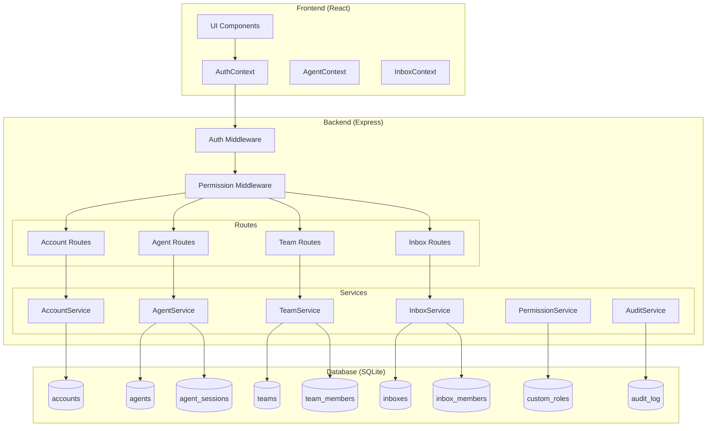
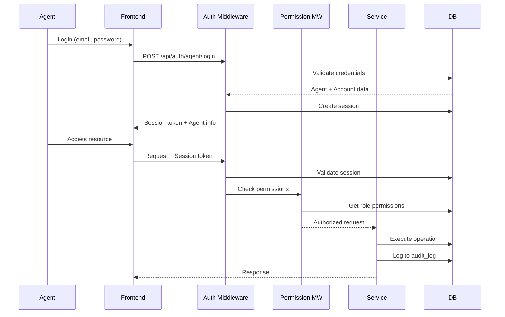

# Design Document: Multi-User Inbox System

## Overview

Este documento descreve o design técnico para implementação de um sistema de multi-usuários e multi-caixas de entrada no WUZAPI Manager. O sistema introduz uma hierarquia de Account → Agent com Teams e Inboxes para organização, permitindo que múltiplas pessoas acessem a mesma conta WhatsApp com credenciais individuais e permissões granulares.

### Objetivos Principais
1. Permitir que Account Owners cadastrem sub-usuários (Agents)
2. Implementar sistema de papéis e permissões granulares
3. Organizar Agents em Teams para distribuição de trabalho
4. Controlar acesso a conversas através de Inboxes
5. Manter auditoria completa de todas as ações

## Architecture

### Diagrama de Arquitetura



### Fluxo de Autenticação



## Components and Interfaces

### Backend Services

#### AccountService
```javascript
class AccountService {
  // Criar nova conta
  async createAccount(ownerData: CreateAccountDTO): Promise<Account>
  
  // Obter conta por ID
  async getAccountById(accountId: string): Promise<Account>
  
  // Atualizar configurações da conta
  async updateAccount(accountId: string, data: UpdateAccountDTO): Promise<Account>
  
  // Desativar conta
  async deactivateAccount(accountId: string): Promise<void>
  
  // Obter estatísticas da conta
  async getAccountStats(accountId: string): Promise<AccountStats>
}
```

#### AgentService
```javascript
class AgentService {
  // Criar convite para novo agent
  async createInvitation(accountId: string, data: CreateInvitationDTO): Promise<Invitation>
  
  // Completar registro via convite
  async completeRegistration(inviteToken: string, data: RegistrationDTO): Promise<Agent>
  
  // Criar agent diretamente (com credenciais)
  async createAgentDirect(accountId: string, data: CreateAgentDTO): Promise<Agent>
  
  // Listar agents da conta
  async listAgents(accountId: string, filters?: AgentFilters): Promise<Agent[]>
  
  // Atualizar agent
  async updateAgent(agentId: string, data: UpdateAgentDTO): Promise<Agent>
  
  // Desativar agent
  async deactivateAgent(agentId: string): Promise<void>
  
  // Atualizar status de disponibilidade
  async updateAvailability(agentId: string, status: AvailabilityStatus): Promise<void>
}
```

#### TeamService
```javascript
class TeamService {
  // Criar equipe
  async createTeam(accountId: string, data: CreateTeamDTO): Promise<Team>
  
  // Adicionar membro à equipe
  async addMember(teamId: string, agentId: string): Promise<TeamMember>
  
  // Remover membro da equipe
  async removeMember(teamId: string, agentId: string): Promise<void>
  
  // Listar equipes da conta
  async listTeams(accountId: string): Promise<Team[]>
  
  // Obter estatísticas da equipe
  async getTeamStats(teamId: string): Promise<TeamStats>
}
```

#### InboxService
```javascript
class InboxService {
  // Criar inbox
  async createInbox(accountId: string, data: CreateInboxDTO): Promise<Inbox>
  
  // Atribuir agents ao inbox
  async assignAgents(inboxId: string, agentIds: string[]): Promise<void>
  
  // Remover agent do inbox
  async removeAgent(inboxId: string, agentId: string): Promise<void>
  
  // Listar inboxes do agent
  async listAgentInboxes(agentId: string): Promise<Inbox[]>
  
  // Verificar acesso do agent ao inbox
  async checkAccess(agentId: string, inboxId: string): Promise<boolean>
}
```

#### PermissionService
```javascript
class PermissionService {
  // Verificar permissão
  async checkPermission(agentId: string, permission: string): Promise<boolean>
  
  // Obter todas as permissões do agent
  async getAgentPermissions(agentId: string): Promise<string[]>
  
  // Criar papel customizado
  async createCustomRole(accountId: string, data: CreateRoleDTO): Promise<CustomRole>
  
  // Atribuir papel ao agent
  async assignRole(agentId: string, roleId: string): Promise<void>
}
```

### Frontend Components

#### AgentContext
```typescript
interface AgentContextValue {
  currentAgent: Agent | null
  account: Account | null
  permissions: string[]
  availability: AvailabilityStatus
  setAvailability: (status: AvailabilityStatus) => Promise<void>
  hasPermission: (permission: string) => boolean
}
```

#### InboxContext
```typescript
interface InboxContextValue {
  inboxes: Inbox[]
  currentInbox: Inbox | null
  setCurrentInbox: (inbox: Inbox) => void
  refreshInboxes: () => Promise<void>
}
```

### API Endpoints

#### Authentication
- `POST /api/auth/agent/login` - Login de agent
- `POST /api/auth/agent/logout` - Logout de agent
- `POST /api/auth/agent/register/:token` - Registro via convite
- `GET /api/auth/agent/me` - Dados do agent atual

#### Agents (Account Owner)
- `GET /api/account/agents` - Listar agents
- `POST /api/account/agents` - Criar agent direto
- `POST /api/account/agents/invite` - Criar convite
- `PUT /api/account/agents/:id` - Atualizar agent
- `DELETE /api/account/agents/:id` - Desativar agent
- `PUT /api/account/agents/:id/role` - Atribuir papel

#### Teams
- `GET /api/account/teams` - Listar equipes
- `POST /api/account/teams` - Criar equipe
- `PUT /api/account/teams/:id` - Atualizar equipe
- `DELETE /api/account/teams/:id` - Excluir equipe
- `POST /api/account/teams/:id/members` - Adicionar membro
- `DELETE /api/account/teams/:id/members/:agentId` - Remover membro

#### Inboxes
- `GET /api/account/inboxes` - Listar inboxes
- `POST /api/account/inboxes` - Criar inbox
- `PUT /api/account/inboxes/:id` - Atualizar inbox
- `DELETE /api/account/inboxes/:id` - Excluir inbox
- `POST /api/account/inboxes/:id/agents` - Atribuir agents
- `DELETE /api/account/inboxes/:id/agents/:agentId` - Remover agent

#### Roles
- `GET /api/account/roles` - Listar papéis
- `POST /api/account/roles` - Criar papel customizado
- `PUT /api/account/roles/:id` - Atualizar papel
- `DELETE /api/account/roles/:id` - Excluir papel

## Data Models

### Database Schema

```sql
-- Tabela de Accounts (evolução da tabela users existente)
CREATE TABLE accounts (
  id TEXT PRIMARY KEY,
  name TEXT NOT NULL,
  owner_user_id TEXT NOT NULL,  -- Referência ao user original do WUZAPI
  wuzapi_token TEXT NOT NULL,   -- Token WUZAPI da conta
  timezone TEXT DEFAULT 'America/Sao_Paulo',
  locale TEXT DEFAULT 'pt-BR',
  status TEXT DEFAULT 'active' CHECK(status IN ('active', 'inactive', 'suspended')),
  settings TEXT DEFAULT '{}',   -- JSON com configurações
  created_at DATETIME DEFAULT CURRENT_TIMESTAMP,
  updated_at DATETIME DEFAULT CURRENT_TIMESTAMP
);

-- Tabela de Agents (sub-usuários)
CREATE TABLE agents (
  id TEXT PRIMARY KEY,
  account_id TEXT NOT NULL REFERENCES accounts(id) ON DELETE CASCADE,
  email TEXT NOT NULL,
  password_hash TEXT NOT NULL,
  name TEXT NOT NULL,
  avatar_url TEXT,
  role TEXT DEFAULT 'agent' CHECK(role IN ('owner', 'administrator', 'agent', 'viewer')),
  custom_role_id TEXT REFERENCES custom_roles(id),
  availability TEXT DEFAULT 'offline' CHECK(availability IN ('online', 'busy', 'offline')),
  status TEXT DEFAULT 'active' CHECK(status IN ('active', 'inactive', 'pending')),
  last_activity_at DATETIME,
  failed_login_attempts INTEGER DEFAULT 0,
  locked_until DATETIME,
  created_at DATETIME DEFAULT CURRENT_TIMESTAMP,
  updated_at DATETIME DEFAULT CURRENT_TIMESTAMP,
  UNIQUE(account_id, email)
);

-- Tabela de Convites
CREATE TABLE agent_invitations (
  id TEXT PRIMARY KEY,
  account_id TEXT NOT NULL REFERENCES accounts(id) ON DELETE CASCADE,
  email TEXT,
  token TEXT UNIQUE NOT NULL,
  role TEXT DEFAULT 'agent',
  custom_role_id TEXT REFERENCES custom_roles(id),
  expires_at DATETIME NOT NULL,
  used_at DATETIME,
  created_by TEXT NOT NULL REFERENCES agents(id),
  created_at DATETIME DEFAULT CURRENT_TIMESTAMP
);

-- Tabela de Sessões de Agents
CREATE TABLE agent_sessions (
  id TEXT PRIMARY KEY,
  agent_id TEXT NOT NULL REFERENCES agents(id) ON DELETE CASCADE,
  account_id TEXT NOT NULL REFERENCES accounts(id) ON DELETE CASCADE,
  token TEXT UNIQUE NOT NULL,
  ip_address TEXT,
  user_agent TEXT,
  expires_at DATETIME NOT NULL,
  created_at DATETIME DEFAULT CURRENT_TIMESTAMP,
  last_activity_at DATETIME DEFAULT CURRENT_TIMESTAMP
);

-- Tabela de Papéis Customizados
CREATE TABLE custom_roles (
  id TEXT PRIMARY KEY,
  account_id TEXT NOT NULL REFERENCES accounts(id) ON DELETE CASCADE,
  name TEXT NOT NULL,
  description TEXT,
  permissions TEXT NOT NULL DEFAULT '[]',  -- JSON array de permissões
  created_at DATETIME DEFAULT CURRENT_TIMESTAMP,
  updated_at DATETIME DEFAULT CURRENT_TIMESTAMP,
  UNIQUE(account_id, name)
);

-- Tabela de Equipes
CREATE TABLE teams (
  id TEXT PRIMARY KEY,
  account_id TEXT NOT NULL REFERENCES accounts(id) ON DELETE CASCADE,
  name TEXT NOT NULL,
  description TEXT,
  allow_auto_assign INTEGER DEFAULT 1,
  created_at DATETIME DEFAULT CURRENT_TIMESTAMP,
  updated_at DATETIME DEFAULT CURRENT_TIMESTAMP,
  UNIQUE(account_id, name)
);

-- Tabela de Membros de Equipe
CREATE TABLE team_members (
  id TEXT PRIMARY KEY,
  team_id TEXT NOT NULL REFERENCES teams(id) ON DELETE CASCADE,
  agent_id TEXT NOT NULL REFERENCES agents(id) ON DELETE CASCADE,
  created_at DATETIME DEFAULT CURRENT_TIMESTAMP,
  UNIQUE(team_id, agent_id)
);

-- Tabela de Inboxes
CREATE TABLE inboxes (
  id TEXT PRIMARY KEY,
  account_id TEXT NOT NULL REFERENCES accounts(id) ON DELETE CASCADE,
  name TEXT NOT NULL,
  description TEXT,
  channel_type TEXT DEFAULT 'whatsapp',
  enable_auto_assignment INTEGER DEFAULT 1,
  auto_assignment_config TEXT DEFAULT '{}',  -- JSON
  greeting_enabled INTEGER DEFAULT 0,
  greeting_message TEXT,
  created_at DATETIME DEFAULT CURRENT_TIMESTAMP,
  updated_at DATETIME DEFAULT CURRENT_TIMESTAMP,
  UNIQUE(account_id, name)
);

-- Tabela de Membros de Inbox
CREATE TABLE inbox_members (
  id TEXT PRIMARY KEY,
  inbox_id TEXT NOT NULL REFERENCES inboxes(id) ON DELETE CASCADE,
  agent_id TEXT NOT NULL REFERENCES agents(id) ON DELETE CASCADE,
  created_at DATETIME DEFAULT CURRENT_TIMESTAMP,
  UNIQUE(inbox_id, agent_id)
);

-- Tabela de Audit Log
CREATE TABLE audit_log (
  id TEXT PRIMARY KEY,
  account_id TEXT NOT NULL REFERENCES accounts(id) ON DELETE CASCADE,
  agent_id TEXT REFERENCES agents(id) ON DELETE SET NULL,
  action TEXT NOT NULL,
  resource_type TEXT NOT NULL,
  resource_id TEXT,
  details TEXT DEFAULT '{}',  -- JSON com detalhes da ação
  ip_address TEXT,
  user_agent TEXT,
  created_at DATETIME DEFAULT CURRENT_TIMESTAMP
);

-- Índices para performance
CREATE INDEX idx_agents_account_id ON agents(account_id);
CREATE INDEX idx_agents_email ON agents(email);
CREATE INDEX idx_agents_status ON agents(status);
CREATE INDEX idx_agent_sessions_token ON agent_sessions(token);
CREATE INDEX idx_agent_sessions_agent_id ON agent_sessions(agent_id);
CREATE INDEX idx_team_members_team_id ON team_members(team_id);
CREATE INDEX idx_team_members_agent_id ON team_members(agent_id);
CREATE INDEX idx_inbox_members_inbox_id ON inbox_members(inbox_id);
CREATE INDEX idx_inbox_members_agent_id ON inbox_members(agent_id);
CREATE INDEX idx_audit_log_account_id ON audit_log(account_id);
CREATE INDEX idx_audit_log_agent_id ON audit_log(agent_id);
CREATE INDEX idx_audit_log_created_at ON audit_log(created_at);
```

### TypeScript Interfaces

```typescript
// Account
interface Account {
  id: string
  name: string
  ownerUserId: string
  wuzapiToken: string
  timezone: string
  locale: string
  status: 'active' | 'inactive' | 'suspended'
  settings: AccountSettings
  createdAt: Date
  updatedAt: Date
}

interface AccountSettings {
  maxAgents?: number
  maxInboxes?: number
  maxTeams?: number
  features?: string[]
}

// Agent
interface Agent {
  id: string
  accountId: string
  email: string
  name: string
  avatarUrl?: string
  role: 'owner' | 'administrator' | 'agent' | 'viewer'
  customRoleId?: string
  availability: 'online' | 'busy' | 'offline'
  status: 'active' | 'inactive' | 'pending'
  lastActivityAt?: Date
  createdAt: Date
  updatedAt: Date
}

// Team
interface Team {
  id: string
  accountId: string
  name: string
  description?: string
  allowAutoAssign: boolean
  members?: Agent[]
  createdAt: Date
  updatedAt: Date
}

// Inbox
interface Inbox {
  id: string
  accountId: string
  name: string
  description?: string
  channelType: string
  enableAutoAssignment: boolean
  autoAssignmentConfig: AutoAssignmentConfig
  greetingEnabled: boolean
  greetingMessage?: string
  members?: Agent[]
  createdAt: Date
  updatedAt: Date
}

// Custom Role
interface CustomRole {
  id: string
  accountId: string
  name: string
  description?: string
  permissions: string[]
  createdAt: Date
  updatedAt: Date
}

// Permissions
type Permission = 
  | 'conversations:view'
  | 'conversations:create'
  | 'conversations:assign'
  | 'conversations:delete'
  | 'messages:send'
  | 'messages:delete'
  | 'contacts:view'
  | 'contacts:create'
  | 'contacts:edit'
  | 'contacts:delete'
  | 'agents:view'
  | 'agents:create'
  | 'agents:edit'
  | 'agents:delete'
  | 'teams:view'
  | 'teams:manage'
  | 'inboxes:view'
  | 'inboxes:manage'
  | 'reports:view'
  | 'settings:view'
  | 'settings:edit'
  | 'webhooks:manage'
  | 'integrations:manage'

// Default Role Permissions
const DEFAULT_ROLE_PERMISSIONS: Record<string, Permission[]> = {
  owner: ['*'],  // Todas as permissões
  administrator: [
    'conversations:view', 'conversations:create', 'conversations:assign', 'conversations:delete',
    'messages:send', 'messages:delete',
    'contacts:view', 'contacts:create', 'contacts:edit', 'contacts:delete',
    'agents:view', 'agents:create', 'agents:edit',
    'teams:view', 'teams:manage',
    'inboxes:view', 'inboxes:manage',
    'reports:view',
    'settings:view', 'settings:edit',
    'webhooks:manage'
  ],
  agent: [
    'conversations:view', 'conversations:create', 'conversations:assign',
    'messages:send',
    'contacts:view', 'contacts:create', 'contacts:edit',
    'teams:view',
    'inboxes:view',
    'reports:view'
  ],
  viewer: [
    'conversations:view',
    'contacts:view',
    'teams:view',
    'inboxes:view',
    'reports:view'
  ]
}
```

## Correctness Properties

*A property is a characteristic or behavior that should hold true across all valid executions of a system-essentially, a formal statement about what the system should do. Properties serve as the bridge between human-readable specifications and machine-verifiable correctness guarantees.*

Based on the prework analysis, the following correctness properties have been identified:

### Property 1: Account Creation Generates Unique Identifiers
*For any* account creation request with valid owner data, the system SHALL generate a unique account ID that does not exist in the database and correctly associate the owner.
**Validates: Requirements 1.1**

### Property 2: Account Default Settings Initialization
*For any* newly created account, the system SHALL initialize all required default settings (timezone, locale, feature flags) with valid values.
**Validates: Requirements 1.2**

### Property 3: Inactive Account Access Denial
*For any* account with status 'inactive' and any agent belonging to that account, authentication attempts SHALL be rejected while all account data remains intact in the database.
**Validates: Requirements 1.4**

### Property 4: Account Deletion Cascade
*For any* account deletion, all associated agents, teams, inboxes, and related records SHALL be deleted, and no orphaned records SHALL remain.
**Validates: Requirements 1.5**

### Property 5: Invitation Link Uniqueness and Expiration
*For any* invitation created, the token SHALL be unique across all invitations and the expiration time SHALL be exactly 48 hours from creation.
**Validates: Requirements 2.1**

### Property 6: Agent Registration Association
*For any* successful registration via invitation link, the created agent SHALL be associated with the correct account and have the role specified in the invitation.
**Validates: Requirements 2.4, 2.5**

### Property 7: Permission Propagation Consistency
*For any* role change (direct assignment or custom role modification), all affected agents SHALL immediately have their effective permissions updated without requiring re-authentication.
**Validates: Requirements 2.7, 3.4, 3.6**

### Property 8: Agent Deactivation Session Invalidation
*For any* agent deactivation, all active sessions for that agent SHALL be invalidated and subsequent authentication attempts SHALL fail.
**Validates: Requirements 2.8, 2.9**

### Property 9: Session Token Identity
*For any* agent login, the created session token SHALL contain both the agent ID and account ID, and these values SHALL match the authenticated agent's data.
**Validates: Requirements 2.10, 6.1**

### Property 10: Permission Check Enforcement
*For any* action requiring a specific permission, agents without that permission SHALL receive a 403 Forbidden response, and agents with the permission SHALL be allowed to proceed.
**Validates: Requirements 3.3, 3.5**

### Property 11: Inbox Access Control
*For any* conversation access request, the system SHALL return only conversations from inboxes where the requesting agent is a member, and SHALL reject access to conversations from other inboxes.
**Validates: Requirements 4.4, 4.5, 7.1, 7.3**

### Property 12: Team Visibility
*For any* conversation assigned to a team, all team members SHALL be able to view that conversation.
**Validates: Requirements 5.3**

### Property 13: Audit Log Completeness
*For any* action performed by an agent, an audit log entry SHALL be created containing the agent ID, timestamp, action type, and relevant details.
**Validates: Requirements 6.2**

### Property 14: Session Expiration Enforcement
*For any* expired session, subsequent requests using that session token SHALL require re-authentication.
**Validates: Requirements 6.3**

### Property 15: Failed Login Lockout
*For any* agent with 5 or more consecutive failed login attempts, the account SHALL be locked for 15 minutes and the account owner SHALL be notified.
**Validates: Requirements 6.5**

### Property 16: Password Change Session Invalidation
*For any* password change, all existing sessions for that agent (except the current one) SHALL be invalidated.
**Validates: Requirements 6.6**

### Property 17: Message Sender Attribution
*For any* message sent by an agent, the audit log SHALL record the agent ID as the sender.
**Validates: Requirements 7.4**

### Property 18: Availability-Based Routing
*For any* auto-assignment, only agents with 'online' availability status SHALL be considered for new assignments, and agents with 'busy' or 'offline' status SHALL be excluded.
**Validates: Requirements 8.1, 8.2, 8.3**

### Property 19: Agent Data Serialization Round-Trip
*For any* agent data, serializing to JSON and deserializing back SHALL produce an equivalent agent object with all fields preserved.
**Validates: Requirements 9.1, 9.2**

### Property 20: WUZAPI Credential Isolation
*For any* message sent by an agent, the system SHALL use the account's WUZAPI credentials (not the agent's) while logging the agent ID for audit purposes.
**Validates: Requirements 10.1**

## Error Handling

### Authentication Errors
- `AUTH_REQUIRED` (401): Sessão não encontrada ou expirada
- `INVALID_CREDENTIALS` (401): Email ou senha incorretos
- `ACCOUNT_LOCKED` (423): Conta bloqueada por tentativas de login
- `ACCOUNT_INACTIVE` (403): Conta desativada
- `AGENT_INACTIVE` (403): Agent desativado

### Authorization Errors
- `FORBIDDEN` (403): Permissão insuficiente para a ação
- `INBOX_ACCESS_DENIED` (403): Agent não é membro do inbox
- `TEAM_ACCESS_DENIED` (403): Agent não é membro da equipe

### Validation Errors
- `INVALID_EMAIL` (400): Formato de email inválido
- `WEAK_PASSWORD` (400): Senha não atende requisitos mínimos
- `DUPLICATE_EMAIL` (409): Email já cadastrado na conta
- `INVITATION_EXPIRED` (410): Link de convite expirado
- `INVITATION_USED` (410): Link de convite já utilizado

### Resource Errors
- `ACCOUNT_NOT_FOUND` (404): Conta não encontrada
- `AGENT_NOT_FOUND` (404): Agent não encontrado
- `TEAM_NOT_FOUND` (404): Equipe não encontrada
- `INBOX_NOT_FOUND` (404): Inbox não encontrado
- `ROLE_NOT_FOUND` (404): Papel não encontrado

## Testing Strategy

### Dual Testing Approach

O sistema utilizará tanto testes unitários quanto testes baseados em propriedades para garantir correção.

#### Unit Tests
- Testes específicos para cada endpoint da API
- Testes de validação de entrada
- Testes de casos de erro específicos
- Testes de integração entre serviços

#### Property-Based Tests

A biblioteca **fast-check** será utilizada para testes baseados em propriedades no TypeScript/JavaScript.

Cada teste de propriedade deve:
1. Ser configurado para executar no mínimo 100 iterações
2. Incluir um comentário referenciando a propriedade do design document
3. Usar geradores inteligentes que constrainem o espaço de entrada

Formato do comentário:
```typescript
// **Feature: multi-user-inbox-system, Property 1: Account Creation Generates Unique Identifiers**
```

### Test Categories

1. **Authentication Tests**
   - Login/logout flow
   - Session management
   - Token validation
   - Lockout mechanism

2. **Authorization Tests**
   - Permission checks
   - Role-based access
   - Inbox membership
   - Team membership

3. **Data Integrity Tests**
   - Cascade deletions
   - Relationship consistency
   - Audit log completeness

4. **Serialization Tests**
   - Round-trip properties
   - Schema validation
   - JSON structure consistency
