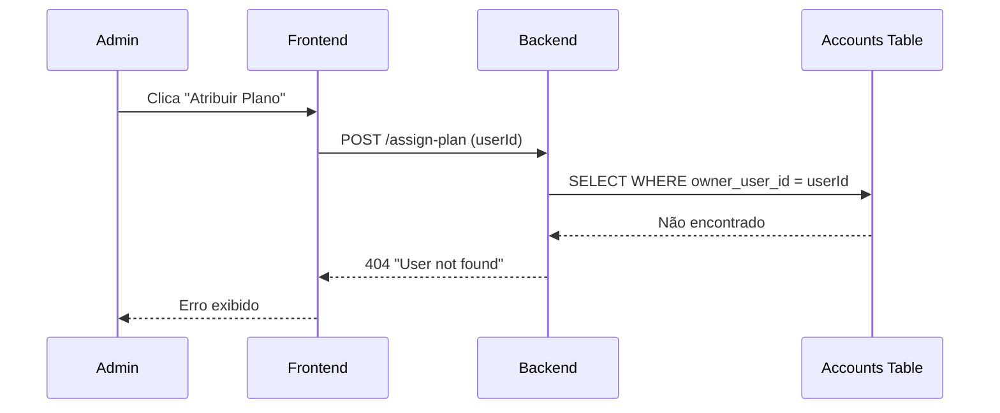
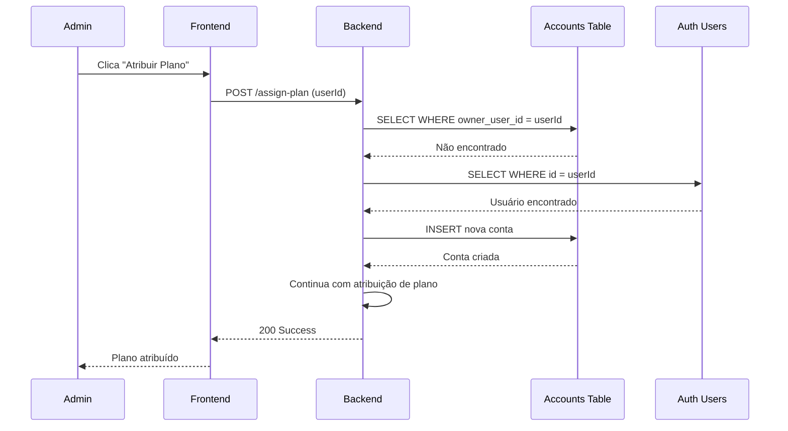

# Design Document: Plan Assignment Fix

## Overview

Este documento descreve a solução para corrigir o bug de atribuição de plano onde usuários Supabase Auth sem conta na tabela `accounts` recebem erro "User not found". A solução implementa um fallback de validação que verifica usuários diretamente no Supabase Auth e cria automaticamente uma conta quando necessário.

## Architecture

### Fluxo Atual (Problemático)



### Fluxo Proposto (Corrigido)



## Components and Interfaces

### 1. Função `validateUserTenant` Modificada

**Localização:** `server/routes/adminUserSubscriptionRoutes.js`

**Mudanças:**
- Adicionar fallback para verificar usuário no Supabase Auth
- Criar conta automaticamente se usuário Auth existir mas não tiver conta
- Garantir que a conta criada tenha o tenant_id correto

```javascript
/**
 * Validate that a user belongs to the admin's tenant
 * Falls back to Supabase Auth if no account exists
 * @param {string} userId - User ID to validate (Supabase Auth UUID)
 * @param {string} tenantId - Admin's tenant ID
 * @returns {Promise<Object|null>} Account if valid, null otherwise
 */
async function validateUserTenant(userId, tenantId) {
  // 1. Try to find existing account
  const account = await findAccountByUserId(userId);
  if (account) {
    return validateAccountTenant(account, tenantId);
  }
  
  // 2. Fallback: Check if user exists in Supabase Auth
  const authUser = await getSupabaseAuthUser(userId);
  if (!authUser) {
    return null; // User doesn't exist anywhere
  }
  
  // 3. Create account for this Auth user
  const newAccount = await createAccountForAuthUser(authUser, tenantId);
  return newAccount;
}
```

### 2. Nova Função `getSupabaseAuthUser`

**Localização:** `server/routes/adminUserSubscriptionRoutes.js` ou `server/services/SupabaseService.js`

```javascript
/**
 * Get user from Supabase Auth by ID
 * @param {string} userId - Supabase Auth user UUID
 * @returns {Promise<Object|null>} Auth user or null
 */
async function getSupabaseAuthUser(userId) {
  const { data: { user }, error } = await SupabaseService.adminClient.auth.admin.getUserById(userId);
  if (error || !user) {
    return null;
  }
  return user;
}
```

### 3. Nova Função `createAccountForAuthUser`

**Localização:** `server/routes/adminUserSubscriptionRoutes.js` ou `server/services/SubscriptionService.js`

```javascript
/**
 * Create an account for a Supabase Auth user
 * @param {Object} authUser - Supabase Auth user object
 * @param {string} tenantId - Tenant ID to associate
 * @returns {Promise<Object>} Created account
 */
async function createAccountForAuthUser(authUser, tenantId) {
  const now = new Date().toISOString();
  const accountId = crypto.randomUUID();
  
  const { data: newAccount, error } = await SupabaseService.insert('accounts', {
    id: accountId,
    name: authUser.email || `User ${authUser.id.substring(0, 8)}`,
    owner_user_id: authUser.id,
    tenant_id: tenantId,
    timezone: 'America/Sao_Paulo',
    locale: 'pt-BR',
    status: 'active',
    settings: {
      maxAgents: 10,
      maxInboxes: 5,
      maxTeams: 5,
      features: ['messaging', 'webhooks', 'contacts']
    },
    created_at: now,
    updated_at: now
  });
  
  if (error) {
    logger.error('Failed to create account for auth user', { 
      userId: authUser.id, 
      tenantId, 
      error: error.message 
    });
    return null;
  }
  
  logger.info('Account created automatically for Supabase Auth user', { 
    accountId, 
    userId: authUser.id, 
    tenantId,
    email: authUser.email 
  });
  
  return newAccount;
}
```

### 4. Página de Edição de Usuário Supabase

**Localização:** Novo componente ou modificação do existente

A página de edição atual (`EditUserPage.tsx`) busca usuários da API WuzAPI. Para usuários Supabase Auth, precisamos de uma abordagem diferente:

**Opção A (Recomendada):** Criar rota separada para edição de usuários Supabase Auth
- `/admin/supabase-users/edit/:userId` → `SupabaseUserEditPage.tsx`

**Opção B:** Modificar `EditUserPage.tsx` para detectar o tipo de usuário e carregar dados apropriadamente

## Data Models

### Tabela `accounts` (Existente)

```sql
CREATE TABLE accounts (
  id UUID PRIMARY KEY DEFAULT gen_random_uuid(),
  name TEXT NOT NULL,
  owner_user_id UUID REFERENCES auth.users(id),
  tenant_id UUID NOT NULL REFERENCES tenants(id),
  wuzapi_token TEXT,
  timezone TEXT DEFAULT 'America/Sao_Paulo',
  locale TEXT DEFAULT 'pt-BR',
  status TEXT DEFAULT 'active',
  settings JSONB DEFAULT '{}',
  created_at TIMESTAMPTZ DEFAULT NOW(),
  updated_at TIMESTAMPTZ DEFAULT NOW()
);
```

### Relacionamento com `auth.users`

```
auth.users (Supabase Auth)
    │
    │ owner_user_id
    ▼
accounts
    │
    │ account_id
    ▼
user_subscriptions
    │
    │ plan_id
    ▼
tenant_plans
```

## Correctness Properties

*A property is a characteristic or behavior that should hold true across all valid executions of a system-essentially, a formal statement about what the system should do. Properties serve as the bridge between human-readable specifications and machine-verifiable correctness guarantees.*

### Property 1: Fallback de Validação de Usuário

*For any* user ID que existe no Supabase Auth mas não tem conta na tabela `accounts`, a função `validateUserTenant` SHALL retornar uma conta válida após criar uma automaticamente.

**Validates: Requirements 1.1, 1.2, 1.3**

### Property 2: Integridade de Conta Criada Automaticamente

*For any* conta criada automaticamente para um usuário Supabase Auth, a conta SHALL ter:
- `owner_user_id` igual ao ID do usuário Auth
- `tenant_id` igual ao tenant do administrador que iniciou a operação
- `status` igual a 'active'
- `name` contendo o email do usuário Auth

**Validates: Requirements 1.4, 2.1, 2.2, 2.3**

### Property 3: Idempotência de Criação de Conta

*For any* usuário Supabase Auth, chamar `validateUserTenant` múltiplas vezes SHALL retornar a mesma conta (não criar duplicatas).

**Validates: Requirements 1.3**

## Error Handling

| Cenário | Código HTTP | Mensagem | Ação |
|---------|-------------|----------|------|
| Tenant context ausente | 403 | "Tenant context required" | Verificar autenticação admin |
| Usuário não existe em nenhum lugar | 404 | "User not found" | Verificar ID do usuário |
| Plano não pertence ao tenant | 404 | "Plan not found" | Verificar plano selecionado |
| Erro ao criar conta | 500 | "Failed to create account" | Verificar logs |
| Erro de banco de dados | 500 | "Internal server error" | Verificar logs |

## Testing Strategy

### Unit Tests

1. **validateUserTenant com conta existente**
   - Deve retornar a conta existente
   - Não deve criar nova conta

2. **validateUserTenant com usuário Auth sem conta**
   - Deve criar conta automaticamente
   - Deve retornar a conta criada

3. **validateUserTenant com usuário inexistente**
   - Deve retornar null
   - Não deve criar conta

4. **createAccountForAuthUser**
   - Deve criar conta com dados corretos
   - Deve logar a criação

### Property-Based Tests

Usar Vitest com fast-check para testes de propriedade:

```typescript
import { fc } from '@fast-check/vitest';

// Property 1: Fallback de validação
test.prop([fc.uuid()])('validateUserTenant creates account for auth users', async (userId) => {
  // Setup: Create auth user without account
  // Act: Call validateUserTenant
  // Assert: Account exists and is valid
});

// Property 2: Integridade de conta
test.prop([fc.uuid(), fc.uuid(), fc.emailAddress()])('created account has correct data', async (userId, tenantId, email) => {
  // Setup: Create auth user
  // Act: Create account
  // Assert: All fields are correct
});
```

### Integration Tests

1. **Fluxo completo de atribuição de plano**
   - Criar usuário Supabase Auth
   - Atribuir plano via API
   - Verificar que conta foi criada
   - Verificar que subscription foi criada

2. **Página de edição de usuário**
   - Navegar para página com ID de usuário Auth
   - Verificar que dados são carregados
   - Verificar que plano pode ser atribuído

