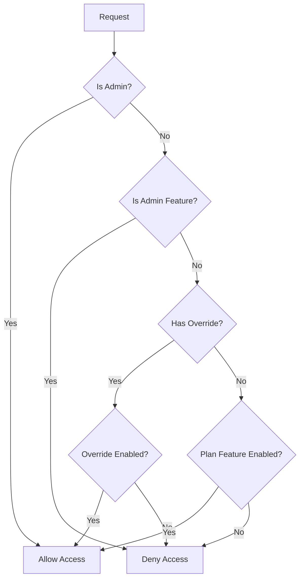

# Design Document: Plan Feature System Refactor

## Overview

Este documento descreve o design para refatoração do sistema de planos e funcionalidades do WUZAPI Manager. O objetivo principal é:

1. Remover features inexistentes (chatwoot_integration, typebot_integration)
2. Separar features de admin das features de usuário
3. Garantir enforcement correto de features e quotas
4. Limpar código legado

## Architecture

### Feature Classification

```
┌─────────────────────────────────────────────────────────────┐
│                    Feature System                           │
├─────────────────────────────────────────────────────────────┤
│                                                             │
│  USER_FEATURES (controladas por plano)                     │
│  ├── bulk_campaigns      - Campanhas em massa              │
│  ├── nocodb_integration  - Integração banco externo        │
│  ├── bot_automation      - Automação de bots               │
│  ├── advanced_reports    - Relatórios avançados            │
│  ├── api_access          - Acesso à API                    │
│  ├── webhooks            - Webhooks                        │
│  ├── scheduled_messages  - Mensagens agendadas             │
│  └── media_storage       - Armazenamento de mídia          │
│                                                             │
│  ADMIN_FEATURES (não controladas por plano)                │
│  ├── page_builder        - Construtor de temas (admin)     │
│  └── custom_branding     - Branding personalizado (admin)  │
│                                                             │
│  REMOVED_FEATURES (código legado a remover)                │
│  ├── chatwoot_integration - NÃO IMPLEMENTADO               │
│  └── typebot_integration  - NÃO IMPLEMENTADO               │
│                                                             │
└─────────────────────────────────────────────────────────────┘
```

### Feature Enforcement Flow



## Components and Interfaces

### 1. FeatureFlagService (Refactored)

```javascript
// server/services/FeatureFlagService.js

// User features - controlled by plans
const USER_FEATURES = {
  BULK_CAMPAIGNS: 'bulk_campaigns',
  NOCODB_INTEGRATION: 'nocodb_integration',
  BOT_AUTOMATION: 'bot_automation',
  ADVANCED_REPORTS: 'advanced_reports',
  API_ACCESS: 'api_access',
  WEBHOOKS: 'webhooks',
  SCHEDULED_MESSAGES: 'scheduled_messages',
  MEDIA_STORAGE: 'media_storage'
};

// Admin features - not controlled by plans
const ADMIN_FEATURES = {
  PAGE_BUILDER: 'page_builder',
  CUSTOM_BRANDING: 'custom_branding'
};

// All valid features (for validation)
const ALL_FEATURES = { ...USER_FEATURES, ...ADMIN_FEATURES };

// Default values for user features
const DEFAULT_USER_FEATURES = {
  [USER_FEATURES.BULK_CAMPAIGNS]: false,
  [USER_FEATURES.NOCODB_INTEGRATION]: false,
  [USER_FEATURES.BOT_AUTOMATION]: false,
  [USER_FEATURES.ADVANCED_REPORTS]: false,
  [USER_FEATURES.API_ACCESS]: true,
  [USER_FEATURES.WEBHOOKS]: true,
  [USER_FEATURES.SCHEDULED_MESSAGES]: false,
  [USER_FEATURES.MEDIA_STORAGE]: true
};
```

### 2. PlanService (Refactored)

```javascript
// server/services/PlanService.js

// Only user features in plan defaults
const DEFAULT_PLAN_FEATURES = {
  bulk_campaigns: false,
  nocodb_integration: false,
  bot_automation: false,
  advanced_reports: false,
  api_access: true,
  webhooks: true,
  scheduled_messages: false,
  media_storage: true
};

// Validation function
function validatePlanFeatures(features) {
  const validFeatures = Object.values(USER_FEATURES);
  const invalidFeatures = Object.keys(features).filter(
    f => !validFeatures.includes(f)
  );
  if (invalidFeatures.length > 0) {
    throw new Error(`Invalid features: ${invalidFeatures.join(', ')}`);
  }
}
```

### 3. Feature Enforcement Middleware (Refactored)

```javascript
// server/middleware/featureEnforcement.js

function requireFeature(featureName) {
  return async (req, res, next) => {
    // Skip for admin users
    if (req.session?.role === 'admin') {
      return next();
    }
    
    // Deny admin features for non-admin users
    if (Object.values(ADMIN_FEATURES).includes(featureName)) {
      return res.status(403).json({
        error: 'Feature not available',
        code: 'ADMIN_FEATURE',
        details: { featureName }
      });
    }
    
    // Check user feature
    const isEnabled = await service.isFeatureEnabled(userId, featureName);
    if (!isEnabled) {
      return res.status(403).json({
        error: 'Feature not available',
        code: 'FEATURE_DISABLED',
        details: { featureName }
      });
    }
    
    next();
  };
}
```

### 4. Frontend Types (Refactored)

```typescript
// src/types/admin-management.ts

// User features only
export type UserFeatureName = 
  | 'bulk_campaigns'
  | 'nocodb_integration'
  | 'bot_automation'
  | 'advanced_reports'
  | 'api_access'
  | 'webhooks'
  | 'scheduled_messages'
  | 'media_storage';

// Admin features (separate type)
export type AdminFeatureName = 
  | 'page_builder'
  | 'custom_branding';

// Combined for internal use
export type FeatureName = UserFeatureName | AdminFeatureName;

// Plan features only include user features
export interface PlanFeatures {
  bulkCampaigns: boolean;
  nocodbIntegration: boolean;
  botAutomation: boolean;
  advancedReports: boolean;
  apiAccess: boolean;
  webhooks: boolean;
  scheduledMessages: boolean;
  mediaStorage: boolean;
}
```

## Data Models

### Plan Features Schema

```sql
-- Features stored as JSON in plans table
-- Only USER_FEATURES should be stored
{
  "bulk_campaigns": boolean,
  "nocodb_integration": boolean,
  "bot_automation": boolean,
  "advanced_reports": boolean,
  "api_access": boolean,
  "webhooks": boolean,
  "scheduled_messages": boolean,
  "media_storage": boolean
}
```

### Default Plan Configurations

| Plan | bulk_campaigns | nocodb_integration | bot_automation | advanced_reports | api_access | webhooks | scheduled_messages | media_storage |
|------|----------------|-------------------|----------------|------------------|------------|----------|-------------------|---------------|
| Free | false | false | false | false | true | true | false | true |
| Basic | true | true | false | false | true | true | true | true |
| Pro | true | true | true | false | true | true | true | true |
| Enterprise | true | true | true | true | true | true | true | true |

## Correctness Properties

*A property is a characteristic or behavior that should hold true across all valid executions of a system-essentially, a formal statement about what the system should do. Properties serve as the bridge between human-readable specifications and machine-verifiable correctness guarantees.*

### Property 1: No Invalid Features in System

*For any* feature name in the FEATURE_FLAGS constant, that feature name should NOT be 'chatwoot_integration' or 'typebot_integration'.

**Validates: Requirements 1.1, 1.2**

### Property 2: Admin Features Excluded from User Features

*For any* feature name in the USER_FEATURES constant, that feature name should NOT be 'page_builder' or 'custom_branding'.

**Validates: Requirements 2.1, 2.2**

### Property 3: User Features List Completeness

*For any* call to getUserFeatures, the returned list should only contain features from USER_FEATURES and never contain admin features.

**Validates: Requirements 2.3, 3.2**

### Property 4: Admin Feature Denial for Non-Admin Users

*For any* non-admin user attempting to access an admin feature, the system should return a 403 status regardless of plan configuration.

**Validates: Requirements 2.4**

### Property 5: Feature Override Precedence

*For any* user with a feature override, the isFeatureEnabled function should return the override value, not the plan default.

**Validates: Requirements 4.3**

### Property 6: Admin User Feature Bypass

*For any* admin user, the feature enforcement middleware should allow access regardless of feature status.

**Validates: Requirements 4.4**

### Property 7: Agent Quota Enforcement

*For any* user attempting to create an agent when their agent count equals max_agents quota, the system should deny the creation.

**Validates: Requirements 6.1, 6.2**

### Property 8: Agent Deletion Updates Count

*For any* agent deletion, the agent count for that account should decrease by exactly 1.

**Validates: Requirements 6.4**

### Property 9: Plan Feature Validation

*For any* plan creation or update with features containing invalid feature names, the system should reject the operation.

**Validates: Requirements 1.4**

## Error Handling

### Feature Access Errors

| Error Code | HTTP Status | Description |
|------------|-------------|-------------|
| FEATURE_DISABLED | 403 | User feature not enabled in plan |
| ADMIN_FEATURE | 403 | Admin-only feature accessed by non-admin |
| INVALID_FEATURE | 400 | Unknown feature name in request |
| QUOTA_EXCEEDED | 403 | Resource quota exceeded |

### Error Response Format

```json
{
  "error": "Feature not available",
  "code": "FEATURE_DISABLED",
  "details": {
    "featureName": "bulk_campaigns",
    "message": "The Bulk Campaigns feature is not available on your current plan."
  }
}
```

## Testing Strategy

### Unit Tests

- Test feature classification (USER_FEATURES vs ADMIN_FEATURES)
- Test feature validation in PlanService
- Test default plan configurations
- Test error message formatting

### Property-Based Tests

Using Vitest with fast-check for property-based testing:

1. **Feature Classification Property**: Generate random feature names and verify classification
2. **Override Precedence Property**: Generate random override scenarios and verify precedence
3. **Quota Enforcement Property**: Generate random agent counts and verify enforcement
4. **Plan Validation Property**: Generate random feature sets and verify validation

### Integration Tests

- Test feature enforcement middleware with real requests
- Test plan CRUD operations with feature validation
- Test agent creation with quota enforcement

