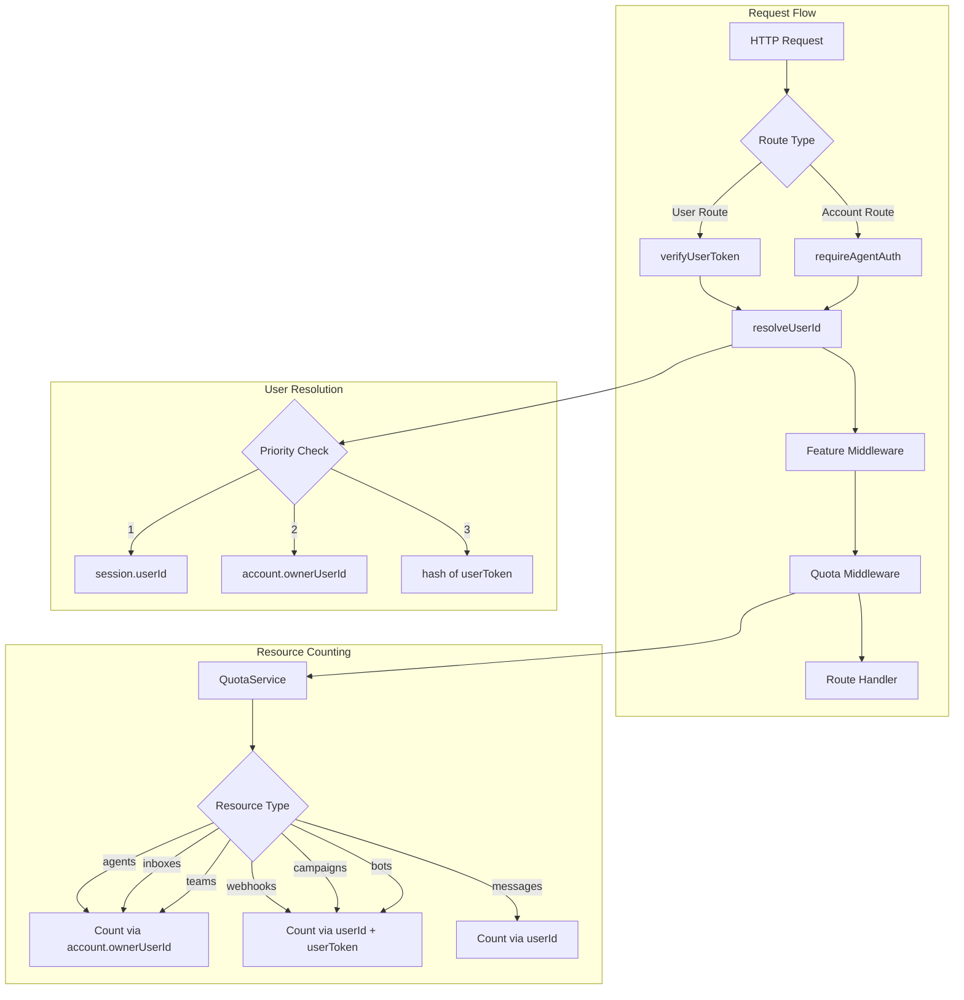

# Design Document: Quota and Feature Enforcement Fix

## Overview

Este documento descreve a arquitetura e implementação para corrigir a aplicação de quotas e features em todas as rotas de usuário do WUZAPI Manager. O objetivo é garantir que:

1. Todas as rotas usem a mesma lógica para identificar o usuário
2. Features sejam verificadas antes de permitir acesso a funcionalidades
3. Quotas sejam verificadas antes de operações de criação/consumo
4. Recursos sejam contados corretamente considerando a hierarquia User → Account → Agents

## Architecture



## Components and Interfaces

### 1. UserIdResolver (New Utility)

Centraliza a lógica de resolução de userId para garantir consistência.

```javascript
// server/utils/userIdResolver.js
const crypto = require('crypto');

/**
 * Resolve user ID from request context
 * Priority: session.userId > account.ownerUserId > hash(userToken)
 */
function resolveUserId(req) {
  // 1. Session userId (set by verifyUserToken or login)
  if (req.session?.userId) {
    return req.session.userId;
  }
  
  // 2. Account owner (set by requireAgentAuth)
  if (req.account?.ownerUserId) {
    return req.account.ownerUserId;
  }
  
  // 3. Hash of userToken (fallback)
  if (req.userToken) {
    return hashToken(req.userToken);
  }
  
  // 4. Legacy patterns
  return req.user?.id || req.userId || null;
}

function hashToken(token) {
  return crypto.createHash('sha256').update(token).digest('hex').substring(0, 32);
}

function getUserToken(req) {
  return req.userToken || req.session?.userToken || null;
}

module.exports = { resolveUserId, hashToken, getUserToken };
```

### 2. Enhanced verifyUserToken Middleware

Atualiza o middleware para definir session.userId consistentemente.

```javascript
// Updates to server/middleware/verifyUserToken.js
const { hashToken } = require('../utils/userIdResolver');

async function verifyUserToken(req, res, next) {
  // ... existing token extraction logic ...
  
  req.userToken = userToken;
  
  // Set session.userId for consistency with quota enforcement
  if (req.session) {
    req.session.userToken = userToken;
    req.session.userId = req.session.userId || hashToken(userToken);
  }
  
  next();
}
```

### 3. Enhanced QuotaService

Atualiza os métodos de contagem para usar a resolução correta de userId.

```javascript
// Updates to server/services/QuotaService.js

/**
 * Count webhooks for a user (checks both userId and userToken)
 */
async countUserWebhooks(userId, userToken = null) {
  const identifiers = [userId];
  if (userToken && userToken !== userId) {
    identifiers.push(userToken);
  }
  
  const placeholders = identifiers.map(() => '?').join(',');
  const result = await this.db.query(
    `SELECT COUNT(*) as count FROM outgoing_webhooks WHERE user_id IN (${placeholders})`,
    identifiers
  );
  return result.rows[0]?.count || 0;
}

/**
 * Count campaigns for a user (checks user_token field)
 */
async countUserCampaigns(userId, userToken = null) {
  const identifiers = [userId];
  if (userToken && userToken !== userId) {
    identifiers.push(userToken);
  }
  
  const placeholders = identifiers.map(() => '?').join(',');
  const result = await this.db.query(
    `SELECT COUNT(*) as count FROM campaigns WHERE user_token IN (${placeholders})`,
    identifiers
  );
  return result.rows[0]?.count || 0;
}
```

### 4. Route Updates

Cada rota será atualizada para usar os middlewares corretos:

| Route | Feature Middleware | Quota Middleware |
|-------|-------------------|------------------|
| POST /api/user/bulk-campaigns | featureMiddleware.bulkCampaigns | quotaMiddleware.campaigns |
| POST /api/chat/send/text | - | quotaMiddleware.messages |
| POST /api/chat/send/image | - | quotaMiddleware.messages |
| POST /api/user/outgoing-webhooks | featureMiddleware.webhooks | quotaMiddleware.webhooks |
| POST /api/user/bots | featureMiddleware.botAutomation | quotaMiddleware.bots |
| POST /api/media/upload | featureMiddleware.mediaStorage | quotaMiddleware.storage |
| POST /api/account/agents | - | quotaMiddleware.agents |
| POST /api/account/inboxes | - | quotaMiddleware.inboxes |
| POST /api/account/teams | - | quotaMiddleware.teams |
| GET /api/user/database/* | featureMiddleware.nocodbIntegration | - |
| GET /api/user/reports/* | featureMiddleware.advancedReports | - |

## Data Models

### Session Data Structure

```javascript
{
  userId: string,      // Hash of userToken or authenticated user ID
  userToken: string,   // WUZAPI token for API calls
  role: 'user' | 'admin',
  accountId: string,   // If authenticated via agent
  agentId: string      // If authenticated via agent
}
```

### Quota Check Result

```javascript
{
  allowed: boolean,
  limit: number,
  usage: number,
  remaining: number,
  quotaType: string,
  source: 'plan' | 'override'
}
```

## Correctness Properties

*A property is a characteristic or behavior that should hold true across all valid executions of a system-essentially, a formal statement about what the system should do. Properties serve as the bridge between human-readable specifications and machine-verifiable correctness guarantees.*

### Property 1: Consistent User ID Resolution

*For any* request context with authentication information, the resolveUserId function SHALL return the same userId regardless of which route processes the request.

**Validates: Requirements 1.1, 1.4**

### Property 2: Quota Attribution to Account Owner

*For any* operation performed by an agent that consumes quota, the usage SHALL be attributed to the account.ownerUserId, not the agent ID.

**Validates: Requirements 13.1, 16.1, 16.2**

### Property 3: Resource Count Consistency

*For any* user with resources created via both userId and userToken, the total count SHALL include resources from both identifiers.

**Validates: Requirements 4.1, 4.2, 5.1, 18.2**

### Property 4: Agent Count Accuracy

*For any* user with multiple accounts, the agent count SHALL equal the sum of active agents across all accounts owned by that user.

**Validates: Requirements 13.2, 14.1**

### Property 5: Inbox Count Accuracy

*For any* user with multiple accounts, the inbox count SHALL equal the sum of inboxes across all accounts owned by that user.

**Validates: Requirements 13.3, 14.2**

### Property 6: Connection Count Accuracy

*For any* user, the connection count SHALL equal the number of inboxes with wuzapi_connected=1 across all accounts owned by that user.

**Validates: Requirements 15.1**

### Property 7: Message Quota Increment

*For any* successful message send operation, the daily message counter SHALL be incremented by exactly 1 for the resolved userId.

**Validates: Requirements 3.4**

### Property 8: Session State Consistency

*For any* request processed by verifyUserToken middleware, the session SHALL contain both userId and userToken.

**Validates: Requirements 1.3, 9.1, 18.1**

## Error Handling

### Feature Disabled Response

```javascript
{
  error: 'Feature not available',
  code: 'FEATURE_DISABLED',
  details: {
    featureName: string,
    message: string
  }
}
```

### Quota Exceeded Response

```javascript
{
  error: 'Quota exceeded',
  code: 'QUOTA_EXCEEDED',
  details: {
    quotaType: string,
    limit: number,
    currentUsage: number,
    remaining: number,
    requested: number
  },
  message: string
}
```

### User Not Identified Response

```javascript
{
  error: 'User not identified',
  code: 'USER_NOT_IDENTIFIED',
  message: 'Unable to identify user from request context'
}
```

## Testing Strategy

### Unit Tests

1. **UserIdResolver tests**: Verify correct priority resolution
2. **QuotaService counting tests**: Verify correct resource counting
3. **Middleware integration tests**: Verify middleware chain execution

### Property-Based Tests

Using fast-check library for property-based testing:

1. **Property 1**: Generate random request contexts and verify consistent userId resolution
2. **Property 2**: Generate agent operations and verify owner attribution
3. **Property 3**: Generate resources with mixed identifiers and verify total count
4. **Property 4-6**: Generate multi-account scenarios and verify counts
5. **Property 7**: Generate message sends and verify counter increment
6. **Property 8**: Generate requests and verify session state

Each property-based test will run a minimum of 100 iterations.

Test annotations will follow the format:
`**Feature: quota-feature-enforcement-fix, Property {number}: {property_text}**`
