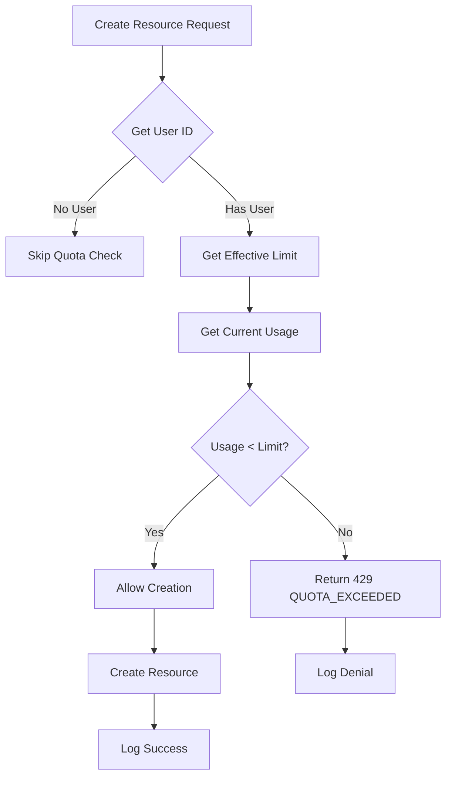

# Design Document: Resource Limits Enforcement

## Overview

Este documento descreve o design para diagnóstico e correção do sistema de limites de recursos do WUZAPI Manager. O sistema atual possui quotas definidas nos planos (max_agents, max_connections, max_inboxes, max_teams, max_webhooks, max_campaigns, max_storage_mb), mas falta:

1. **max_bots**: Limite para bots de automação não existe nos planos
2. **Enforcement inconsistente**: Alguns recursos não verificam quotas antes da criação
3. **Contagem de recursos**: QuotaService tenta contar recursos de tabelas que podem não existir ou ter estrutura diferente

## Architecture

### Quota Types Overview

```
┌─────────────────────────────────────────────────────────────┐
│                    Resource Quotas                          │
├─────────────────────────────────────────────────────────────┤
│                                                             │
│  EXISTING QUOTAS (in plans table)                          │
│  ├── max_agents          - Agentes por conta               │
│  ├── max_connections     - Conexões WhatsApp               │
│  ├── max_inboxes         - Caixas de entrada               │
│  ├── max_teams           - Equipes                         │
│  ├── max_webhooks        - Webhooks de saída               │
│  ├── max_campaigns       - Campanhas em massa              │
│  ├── max_messages_per_day    - Mensagens diárias           │
│  ├── max_messages_per_month  - Mensagens mensais           │
│  └── max_storage_mb      - Armazenamento S3                │
│                                                             │
│  NEW QUOTA (to be added)                                   │
│  └── max_bots            - Bots de automação               │
│                                                             │
└─────────────────────────────────────────────────────────────┘
```

### Quota Enforcement Flow



## Components and Interfaces

### 1. Database Schema Changes

```sql
-- Add max_bots column to plans table
ALTER TABLE plans ADD COLUMN max_bots INTEGER DEFAULT 3;

-- Update default plans with bot limits
UPDATE plans SET max_bots = 1 WHERE name = 'Free';
UPDATE plans SET max_bots = 3 WHERE name = 'Basic';
UPDATE plans SET max_bots = 10 WHERE name = 'Pro';
UPDATE plans SET max_bots = 50 WHERE name = 'Enterprise';
```

### 2. QuotaService Updates

```javascript
// server/services/QuotaService.js

// Add MAX_BOTS to QUOTA_TYPES
const QUOTA_TYPES = {
  MAX_AGENTS: 'max_agents',
  MAX_CONNECTIONS: 'max_connections',
  MAX_MESSAGES_PER_DAY: 'max_messages_per_day',
  MAX_MESSAGES_PER_MONTH: 'max_messages_per_month',
  MAX_INBOXES: 'max_inboxes',
  MAX_TEAMS: 'max_teams',
  MAX_WEBHOOKS: 'max_webhooks',
  MAX_CAMPAIGNS: 'max_campaigns',
  MAX_STORAGE_MB: 'max_storage_mb',
  MAX_BOTS: 'max_bots'  // NEW
};

// Add countUserBots method
async countUserBots(userId) {
  const result = await this.db.query(
    'SELECT COUNT(*) as count FROM agent_bots WHERE user_id = ?',
    [userId]
  );
  return result.rows[0]?.count || 0;
}
```

### 3. Quota Enforcement Middleware Updates

```javascript
// server/middleware/quotaEnforcement.js

// Add bots to quotaMiddleware
const quotaMiddleware = {
  messages: enforceQuota(QuotaService.QUOTA_TYPES.MAX_MESSAGES_PER_DAY),
  monthlyMessages: enforceQuota(QuotaService.QUOTA_TYPES.MAX_MESSAGES_PER_MONTH),
  agents: enforceQuota(QuotaService.QUOTA_TYPES.MAX_AGENTS),
  connections: enforceQuota(QuotaService.QUOTA_TYPES.MAX_CONNECTIONS),
  webhooks: enforceQuota(QuotaService.QUOTA_TYPES.MAX_WEBHOOKS),
  campaigns: enforceQuota(QuotaService.QUOTA_TYPES.MAX_CAMPAIGNS),
  inboxes: enforceQuota(QuotaService.QUOTA_TYPES.MAX_INBOXES),
  teams: enforceQuota(QuotaService.QUOTA_TYPES.MAX_TEAMS),
  bots: enforceQuota(QuotaService.QUOTA_TYPES.MAX_BOTS),  // NEW
  storage: enforceQuota(QuotaService.QUOTA_TYPES.MAX_STORAGE_MB)
};
```

### 4. BotService Quota Integration

```javascript
// server/services/BotService.js

async createBot(userId, data) {
  // Check quota before creation
  const quotaCheck = await this.checkBotQuota(userId);
  if (!quotaCheck.allowed) {
    throw new Error(`QUOTA_EXCEEDED: Cannot create bot. Current: ${quotaCheck.current}, Limit: ${quotaCheck.limit}`);
  }
  // ... existing creation logic
}

async checkBotQuota(userId) {
  const current = await this.countBots(userId);
  const limit = await this.getMaxBots(userId);
  return {
    allowed: current < limit,
    current,
    limit
  };
}
```

### 5. Frontend Types Updates

```typescript
// src/types/admin-management.ts

export interface PlanQuotas {
  maxAgents: number;
  maxConnections: number;
  maxMessagesPerDay: number;
  maxMessagesPerMonth: number;
  maxInboxes: number;
  maxTeams: number;
  maxWebhooks: number;
  maxCampaigns: number;
  maxStorageMb: number;
  maxBots: number;  // NEW
}
```

## Data Models

### Plan Quotas Schema (Updated)

| Column | Type | Default | Description |
|--------|------|---------|-------------|
| max_agents | INTEGER | 1 | Maximum agents per account |
| max_connections | INTEGER | 1 | Maximum WhatsApp connections |
| max_messages_per_day | INTEGER | 100 | Daily message limit |
| max_messages_per_month | INTEGER | 3000 | Monthly message limit |
| max_inboxes | INTEGER | 1 | Maximum inboxes |
| max_teams | INTEGER | 1 | Maximum teams |
| max_webhooks | INTEGER | 5 | Maximum outgoing webhooks |
| max_campaigns | INTEGER | 1 | Maximum bulk campaigns |
| max_storage_mb | INTEGER | 100 | Storage limit in MB |
| max_bots | INTEGER | 3 | Maximum automation bots (NEW) |

### Default Plan Configurations (Updated)

| Plan | max_agents | max_connections | max_inboxes | max_teams | max_webhooks | max_campaigns | max_bots | max_storage_mb |
|------|------------|-----------------|-------------|-----------|--------------|---------------|----------|----------------|
| Free | 1 | 1 | 1 | 0 | 2 | 0 | 1 | 50 |
| Basic | 3 | 2 | 2 | 1 | 5 | 5 | 3 | 500 |
| Pro | 10 | 5 | 5 | 3 | 20 | 20 | 10 | 2000 |
| Enterprise | 100 | 20 | 20 | 10 | 100 | 100 | 50 | 10000 |

## Correctness Properties

*A property is a characteristic or behavior that should hold true across all valid executions of a system-essentially, a formal statement about what the system should do. Properties serve as the bridge between human-readable specifications and machine-verifiable correctness guarantees.*

### Property 1: Quota Enforcement for All Resource Types

*For any* user with a defined quota limit and current usage equal to or exceeding that limit, attempting to create a new resource of that type should be denied with a QUOTA_EXCEEDED error.

**Validates: Requirements 1.1, 1.2, 1.3, 1.4, 1.5, 1.6, 2.2**

### Property 2: Quota Calculation Correctness

*For any* quota with a positive limit, the percentage calculation should equal (currentUsage / limit) * 100, and the remaining capacity should equal max(0, limit - currentUsage).

**Validates: Requirements 3.1, 3.4, 4.3**

### Property 3: Error Response Completeness

*For any* quota exceeded scenario, the error response should include: HTTP status 429, error code 'QUOTA_EXCEEDED', quotaType, currentUsage, limit, and an upgrade suggestion message.

**Validates: Requirements 6.1, 6.2, 6.3**

### Property 4: Audit Logging for Quota Operations

*For any* quota check operation (allowed or denied), a log entry should be created with userId, quotaType, and result.

**Validates: Requirements 7.2, 7.3**

### Property 5: Quota Value Validation

*For any* quota value input, the system should reject non-positive integers (zero, negative, or non-integer values).

**Validates: Requirements 5.4**

### Property 6: Edge Case Handling

*For any* quota with a zero limit, all creation attempts should be denied. For any quota with a negative limit (invalid state), the system should treat it as zero and deny all creations.

**Validates: Requirements 7.4**

## Error Handling

### Quota Error Codes

| Error Code | HTTP Status | Description |
|------------|-------------|-------------|
| QUOTA_EXCEEDED | 429 | Resource quota exceeded |
| INVALID_QUOTA | 400 | Invalid quota type or value |
| QUOTA_CHECK_FAILED | 500 | Internal error during quota check |

### Error Response Format

```json
{
  "error": "Quota exceeded",
  "code": "QUOTA_EXCEEDED",
  "details": {
    "quotaType": "max_bots",
    "limit": 3,
    "currentUsage": 3,
    "remaining": 0,
    "requested": 1
  },
  "message": "Você atingiu o limite de bots. Faça upgrade do seu plano para continuar."
}
```

## Testing Strategy

### Unit Tests

- Test quota calculation functions (percentage, remaining)
- Test error response formatting
- Test quota type validation
- Test edge cases (zero limits, negative values)

### Property-Based Tests

Using Node.js test runner with fast-check for property-based testing:

1. **Quota Enforcement Property**: Generate random user states with varying usage/limits and verify enforcement
2. **Calculation Property**: Generate random usage/limit pairs and verify calculations
3. **Error Response Property**: Generate quota exceeded scenarios and verify response format
4. **Validation Property**: Generate random quota values and verify validation

### Integration Tests

- Test quota middleware with real HTTP requests
- Test bot creation with quota enforcement
- Test storage upload with quota enforcement
- Test admin plan CRUD with new max_bots field

