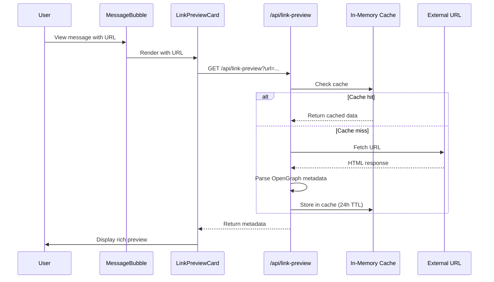

# Design Document: Rich Media Preview

## Overview

Este documento descreve o design para implementar Rich Media Preview no WUZAPI Manager. A feature permite buscar e exibir metadados OpenGraph reais de links compartilhados no chat, incluindo imagem de preview, título e descrição.

A implementação consiste em:
1. **Backend**: Endpoint `/api/link-preview` que faz fetch de URLs e extrai metadados OpenGraph
2. **Frontend**: Atualização do `LinkPreviewCard` para usar o novo endpoint e exibir imagens/descrições reais
3. **Cache**: Sistema de cache em memória para evitar requisições repetidas

## Architecture



## Components and Interfaces

### Backend Components

#### 1. Link Preview Route (`server/routes/linkPreviewRoutes.js`)

```javascript
// GET /api/link-preview?url=<encoded_url>
// Response: { success: true, data: LinkPreviewData }

interface LinkPreviewData {
  url: string
  domain: string
  title: string | null
  description: string | null
  image: string | null
  favicon: string | null
  platform: PlatformInfo | null
}
```

#### 2. Link Preview Service (`server/services/LinkPreviewService.js`)

Responsável por:
- Fazer fetch da URL com timeout de 5 segundos
- Seguir até 3 redirects
- Parsear HTML e extrair metadados OpenGraph
- Resolver URLs relativas para absolutas
- Retornar fallback para conteúdo não-HTML

#### 3. Link Preview Cache (`server/utils/linkPreviewCache.js`)

Cache LRU em memória com:
- TTL de 24 horas
- Máximo de 1000 entradas
- Eviction automática de entradas antigas

### Frontend Components

#### 1. Updated LinkPreviewCard (`src/components/features/chat/MessageBubble.tsx`)

Atualização do componente existente para:
- Chamar o endpoint `/api/link-preview`
- Exibir imagem de preview quando disponível
- Mostrar skeleton durante carregamento
- Fallback gracioso em caso de erro

#### 2. Link Preview Service (`src/services/link-preview.ts`)

```typescript
interface LinkPreviewResponse {
  url: string
  domain: string
  title: string | null
  description: string | null
  image: string | null
  favicon: string | null
  platform: PlatformInfo | null
}

export async function fetchLinkPreview(url: string): Promise<LinkPreviewResponse>
```

## Data Models

### LinkPreviewData

```typescript
interface LinkPreviewData {
  url: string           // URL original
  domain: string        // Domínio extraído (ex: "instagram.com")
  title: string | null  // og:title ou <title>
  description: string | null  // og:description ou meta description (max 100 chars)
  image: string | null  // og:image (URL absoluta)
  favicon: string | null // Favicon URL
  platform: PlatformInfo | null // Info de plataforma conhecida
}
```

### CacheEntry

```typescript
interface CacheEntry {
  data: LinkPreviewData
  timestamp: number  // Unix timestamp de quando foi cacheado
}
```

## Correctness Properties

*A property is a characteristic or behavior that should hold true across all valid executions of a system-essentially, a formal statement about what the system should do. Properties serve as the bridge between human-readable specifications and machine-verifiable correctness guarantees.*

### Property 1: OpenGraph metadata extraction
*For any* HTML document containing OpenGraph meta tags, parsing the document SHALL extract og:title, og:description, and og:image values correctly.
**Validates: Requirements 1.2, 1.3, 4.4**

### Property 2: Description truncation
*For any* description string, if the length exceeds 100 characters, the output SHALL be truncated to 100 characters with ellipsis; otherwise, the original string SHALL be returned unchanged.
**Validates: Requirements 1.4**

### Property 3: Relative URL resolution
*For any* relative image URL and base URL, the resolved URL SHALL be a valid absolute URL combining the base domain with the relative path.
**Validates: Requirements 4.5**

### Property 4: Cache consistency
*For any* URL, after fetching metadata once, subsequent requests within 24 hours SHALL return the same cached data without making external requests.
**Validates: Requirements 3.1, 3.2**

### Property 5: LRU cache eviction
*For any* cache with 1000 entries, adding a new entry SHALL evict the least recently used entry, maintaining the cache size at 1000.
**Validates: Requirements 3.3**

### Property 6: Platform detection consistency
*For any* URL from a known social media platform (Instagram, YouTube, TikTok, Twitter/X, Facebook, LinkedIn), the platform detector SHALL return the correct platform name, icon, and brand color.
**Validates: Requirements 5.1-5.7**

### Property 7: Non-HTML content handling
*For any* URL that returns non-HTML content (JSON, image, etc.), the service SHALL return minimal metadata containing only the domain.
**Validates: Requirements 4.2**

### Property 8: Error fallback
*For any* URL that fails to fetch (network error, timeout, invalid response), the service SHALL return a fallback response with domain and platform info without throwing an error.
**Validates: Requirements 2.3**

## Error Handling

### Backend Errors

| Error Type | Handling |
|------------|----------|
| Network timeout (>5s) | Return fallback with domain only |
| Invalid URL | Return 400 Bad Request |
| Non-HTML response | Return minimal metadata |
| Parse error | Return fallback with domain only |
| Too many redirects (>3) | Return fallback with domain only |

### Frontend Errors

| Error Type | Handling |
|------------|----------|
| API error | Show minimal preview with domain/icon |
| Image load error | Hide image, show text-only preview |
| Timeout | Show minimal preview |

## Testing Strategy

### Unit Tests

1. **HTML Parser Tests**
   - Parse HTML with all OpenGraph tags
   - Parse HTML with missing tags (fallback to title/meta)
   - Parse HTML with relative image URLs
   - Parse malformed HTML

2. **Cache Tests**
   - Cache hit returns data without fetch
   - Cache miss triggers fetch
   - TTL expiration triggers re-fetch
   - LRU eviction works correctly

3. **URL Resolution Tests**
   - Resolve relative paths
   - Handle protocol-relative URLs
   - Handle already absolute URLs

### Property-Based Tests

Using a property-based testing library (e.g., fast-check for TypeScript), the following properties will be tested:

1. **Property 1**: OpenGraph extraction - Generate random HTML with og tags, verify extraction
2. **Property 2**: Description truncation - Generate strings of various lengths, verify truncation
3. **Property 3**: URL resolution - Generate relative/absolute URL pairs, verify resolution
4. **Property 4**: Cache consistency - Generate URL sequences, verify cache behavior
5. **Property 5**: LRU eviction - Generate cache operations, verify size constraint
6. **Property 6**: Platform detection - Generate platform URLs, verify correct detection
7. **Property 7**: Non-HTML handling - Generate non-HTML responses, verify fallback
8. **Property 8**: Error fallback - Generate error scenarios, verify graceful handling

Each property-based test will run a minimum of 100 iterations.

### Integration Tests

1. End-to-end flow: Message with URL → API call → Preview rendered
2. Cache integration: Multiple requests for same URL
3. Error scenarios: Network failures, timeouts

