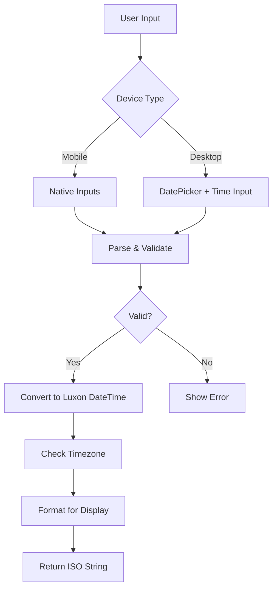

# Design Document - Sistema de Agendamento Melhorado

## Overview

Este documento detalha o design técnico para revisar, corrigir e melhorar o sistema de agendamento de mensagens do WUZAPI Manager. O foco principal é garantir uma experiência mobile impecável, consistência entre componentes e validação robusta.

### Problemas Identificados

**Análise do Código Atual:**

1. **DisparadorUnico.tsx** (linha ~200-250):
   - Usa `react-datepicker` para data
   - Usa `<Input type="time">` nativo para hora
   - Campos separados: `scheduledDate` (Date) + `scheduledTime` (string "HH:mm")
   - Combina os dois na função `getScheduledDateTime()`
   - ✅ Validação de horário passado implementada
   - ⚠️ DatePicker pode ter problemas em alguns dispositivos Android

2. **CampaignBuilder.tsx** (linha ~100-150):
   - Usa `<Input type="datetime-local">` nativo
   - Campo único: `scheduledAt` (string ISO)
   - ⚠️ Não há validação visível de horário passado
   - ⚠️ Formato datetime-local pode não funcionar em Safari iOS antigo

3. **Inconsistências:**
   - Dois componentes usam abordagens diferentes
   - Validação implementada apenas em DisparadorUnico
   - Formatação de timezone pode variar
   - Feedback visual diferente

### Objetivos do Design

1. **Padronizar** a implementação em um componente reutilizável
2. **Otimizar** para mobile com inputs nativos quando possível
3. **Validar** robustamente em tempo real
4. **Garantir** compatibilidade cross-browser/device
5. **Melhorar** feedback visual e UX

## Architecture

### Component Hierarchy

```
SchedulingInput (novo componente compartilhado)
├── DateInput (wrapper inteligente)
│   ├── Native <input type="date"> (mobile)
│   └── DatePicker (desktop fallback)
├── TimeInput (wrapper inteligente)
│   └── Native <input type="time">
├── ValidationFeedback
└── ScheduleSummary
```

### Data Flow



### State Management

```typescript
interface SchedulingState {
  isEnabled: boolean;
  date: Date | null;
  time: string; // "HH:mm"
  dateTime: DateTime | null; // Luxon DateTime
  error: string | null;
  isValid: boolean;
}
```

## Components and Interfaces

### 1. SchedulingInput Component

**Propósito:** Componente reutilizável para seleção de data/hora com validação

**Props:**
```typescript
interface SchedulingInputProps {
  value: Date | null;
  onChange: (date: Date | null) => void;
  onValidationChange?: (isValid: boolean, error?: string) => void;
  minDate?: Date;
  disabled?: boolean;
  className?: string;
  showSummary?: boolean;
  timezone?: string; // default: "America/Sao_Paulo"
}
```

**Features:**
- Detecção automática de dispositivo (mobile vs desktop)
- Validação em tempo real
- Feedback visual imediato
- Formatação brasileira
- Suporte a timezone

**Implementação:**
```typescript
export function SchedulingInput({
  value,
  onChange,
  onValidationChange,
  minDate = new Date(),
  disabled = false,
  className,
  showSummary = true,
  timezone = "America/Sao_Paulo"
}: SchedulingInputProps) {
  const [date, setDate] = useState<Date | null>(value);
  const [time, setTime] = useState<string>("12:00");
  const [error, setError] = useState<string | null>(null);
  const isMobile = useIsMobile();

  // Validation logic
  const validateDateTime = useCallback(() => {
    if (!date) {
      setError("Selecione uma data");
      onValidationChange?.(false, "Selecione uma data");
      return false;
    }

    const [hours, minutes] = time.split(":").map(Number);
    const dateTime = DateTime.fromJSDate(date)
      .setZone(timezone)
      .set({ hour: hours, minute: minutes, second: 0, millisecond: 0 });

    const now = DateTime.now().setZone(timezone);

    if (dateTime <= now) {
      setError("O horário deve ser no futuro");
      onValidationChange?.(false, "O horário deve ser no futuro");
      return false;
    }

    setError(null);
    onValidationChange?.(true);
    onChange(dateTime.toJSDate());
    return true;
  }, [date, time, timezone, onChange, onValidationChange]);

  // Auto-validate on change
  useEffect(() => {
    if (date && time) {
      validateDateTime();
    }
  }, [date, time, validateDateTime]);

  return (
    <div className={cn("space-y-4", className)}>
      {/* Date Input */}
      <div className="space-y-2">
        <Label htmlFor="schedule-date">Data</Label>
        {isMobile ? (
          <Input
            id="schedule-date"
            type="date"
            value={date ? format(date, "yyyy-MM-dd") : ""}
            onChange={(e) => setDate(e.target.value ? new Date(e.target.value) : null)}
            min={format(minDate, "yyyy-MM-dd")}
            disabled={disabled}
            className={cn(error && "border-destructive")}
          />
        ) : (
          <DatePicker
            selected={date}
            onChange={setDate}
            minDate={minDate}
            disabled={disabled}
            locale="pt-BR"
            dateFormat="dd/MM/yyyy"
            className={cn(
              "w-full rounded-md border border-input bg-background px-3 py-2",
              error && "border-destructive"
            )}
          />
        )}
      </div>

      {/* Time Input */}
      <div className="space-y-2">
        <Label htmlFor="schedule-time">Hora</Label>
        <Input
          id="schedule-time"
          type="time"
          value={time}
          onChange={(e) => setTime(e.target.value)}
          disabled={disabled}
          className={cn(error && "border-destructive")}
        />
        <p className="text-xs text-muted-foreground">
          Horário de Brasília (GMT-3)
        </p>
      </div>

      {/* Error Feedback */}
      {error && (
        <Alert variant="destructive">
          <AlertCircle className="h-4 w-4" />
          <AlertDescription>{error}</AlertDescription>
        </Alert>
      )}

      {/* Summary */}
      {showSummary && date && time && !error && (
        <Alert>
          <Calendar className="h-4 w-4" />
          <AlertDescription>
            <strong>Agendado para:</strong>{" "}
            {DateTime.fromJSDate(date)
              .setZone(timezone)
              .set({ 
                hour: Number(time.split(":")[0]), 
                minute: Number(time.split(":")[1]) 
              })
              .toFormat("dd/MM/yyyy 'às' HH:mm")}
          </AlertDescription>
        </Alert>
      )}
    </div>
  );
}
```

### 2. useIsMobile Hook

**Propósito:** Detectar dispositivos mobile de forma confiável

```typescript
export function useIsMobile(): boolean {
  const [isMobile, setIsMobile] = useState(false);

  useEffect(() => {
    const checkMobile = () => {
      // Verifica tanto o tamanho da tela quanto o user agent
      const mobileWidth = window.innerWidth < 768;
      const mobileUA = /Android|webOS|iPhone|iPad|iPod|BlackBerry|IEMobile|Opera Mini/i.test(
        navigator.userAgent
      );
      setIsMobile(mobileWidth || mobileUA);
    };

    checkMobile();
    window.addEventListener("resize", checkMobile);
    return () => window.removeEventListener("resize", checkMobile);
  }, []);

  return isMobile;
}
```

### 3. Integração com DisparadorUnico

**Antes:**
```typescript
// Campos separados com lógica complexa
const [scheduledDate, setScheduledDate] = useState<Date>(new Date());
const [scheduledTime, setScheduledTime] = useState("12:00");

// Função de combinação manual
const getScheduledDateTime = (): DateTime | null => {
  // ... lógica complexa
};
```

**Depois:**
```typescript
// Campo único com validação automática
const [scheduledDateTime, setScheduledDateTime] = useState<Date | null>(null);
const [isSchedulingValid, setIsSchedulingValid] = useState(false);

// Uso simples
<SchedulingInput
  value={scheduledDateTime}
  onChange={setScheduledDateTime}
  onValidationChange={setIsSchedulingValid}
  showSummary={true}
/>
```

### 4. Integração com CampaignBuilder

**Antes:**
```typescript
// Input nativo sem validação
<Input
  type="datetime-local"
  value={scheduledAt}
  onChange={(e) => setScheduledAt(e.target.value)}
  min={new Date().toISOString().slice(0, 16)}
/>
```

**Depois:**
```typescript
// Componente padronizado com validação
<SchedulingInput
  value={scheduledAt ? new Date(scheduledAt) : null}
  onChange={(date) => setScheduledAt(date?.toISOString() || "")}
  onValidationChange={(isValid) => setSchedulingValid(isValid)}
  showSummary={true}
/>
```

## Data Models

### DateTime Handling

```typescript
// Formato de armazenamento (backend)
interface ScheduledMessage {
  id: string;
  scheduledAt: string; // ISO 8601 com timezone: "2024-11-15T14:30:00-03:00"
  timezone: string; // "America/Sao_Paulo"
}

// Formato de trabalho (frontend)
interface SchedulingData {
  date: Date; // JavaScript Date object
  luxonDateTime: DateTime; // Luxon DateTime com timezone
  isoString: string; // Para envio ao backend
  displayString: string; // Para exibição: "15/11/2024 às 14:30"
}

// Conversão
function toBackendFormat(date: Date, timezone: string): string {
  return DateTime.fromJSDate(date)
    .setZone(timezone)
    .toISO({ includeOffset: true });
}

function toDisplayFormat(date: Date, timezone: string): string {
  return DateTime.fromJSDate(date)
    .setZone(timezone)
    .toFormat("dd/MM/yyyy 'às' HH:mm");
}
```

## Error Handling

### Validation Errors

```typescript
enum SchedulingError {
  NO_DATE = "Selecione uma data",
  NO_TIME = "Selecione um horário",
  PAST_DATE = "A data deve ser futura",
  PAST_TIME = "O horário deve ser no futuro",
  INVALID_FORMAT = "Formato de data/hora inválido",
  TIMEZONE_ERROR = "Erro ao processar timezone"
}

function validateScheduling(
  date: Date | null,
  time: string,
  timezone: string
): { isValid: boolean; error?: SchedulingError } {
  if (!date) {
    return { isValid: false, error: SchedulingError.NO_DATE };
  }

  if (!time || !/^\d{2}:\d{2}$/.test(time)) {
    return { isValid: false, error: SchedulingError.NO_TIME };
  }

  try {
    const [hours, minutes] = time.split(":").map(Number);
    const dateTime = DateTime.fromJSDate(date)
      .setZone(timezone)
      .set({ hour: hours, minute: minutes, second: 0, millisecond: 0 });

    const now = DateTime.now().setZone(timezone);

    if (dateTime <= now) {
      return { isValid: false, error: SchedulingError.PAST_TIME };
    }

    return { isValid: true };
  } catch (error) {
    return { isValid: false, error: SchedulingError.TIMEZONE_ERROR };
  }
}
```

### User Feedback

```typescript
// Toast notifications
function showSchedulingSuccess(dateTime: DateTime) {
  toast.success("Mensagem Agendada", {
    description: `Será enviada em ${dateTime.toFormat("dd/MM/yyyy 'às' HH:mm")}`,
    duration: 5000
  });
}

function showSchedulingError(error: SchedulingError) {
  toast.error("Erro no Agendamento", {
    description: error,
    duration: 4000
  });
}
```

## Testing Strategy

### Unit Tests

```typescript
describe("SchedulingInput", () => {
  it("should validate future dates correctly", () => {
    const tomorrow = new Date();
    tomorrow.setDate(tomorrow.getDate() + 1);
    
    const result = validateScheduling(tomorrow, "14:00", "America/Sao_Paulo");
    expect(result.isValid).toBe(true);
  });

  it("should reject past dates", () => {
    const yesterday = new Date();
    yesterday.setDate(yesterday.getDate() - 1);
    
    const result = validateScheduling(yesterday, "14:00", "America/Sao_Paulo");
    expect(result.isValid).toBe(false);
    expect(result.error).toBe(SchedulingError.PAST_TIME);
  });

  it("should reject past times on current date", () => {
    const now = new Date();
    const pastTime = DateTime.now().minus({ hours: 1 }).toFormat("HH:mm");
    
    const result = validateScheduling(now, pastTime, "America/Sao_Paulo");
    expect(result.isValid).toBe(false);
  });

  it("should format display string correctly", () => {
    const date = new Date("2024-11-15T14:30:00");
    const display = toDisplayFormat(date, "America/Sao_Paulo");
    expect(display).toBe("15/11/2024 às 14:30");
  });
});
```

### Integration Tests

```typescript
describe("DisparadorUnico with Scheduling", () => {
  it("should enable scheduling and validate", async () => {
    render(<DisparadorUnico instance="test" />);
    
    // Enable scheduling
    const scheduleSwitch = screen.getByLabelText("Agendar Envio");
    await userEvent.click(scheduleSwitch);
    
    // Select future date
    const dateInput = screen.getByLabelText("Data");
    const tomorrow = new Date();
    tomorrow.setDate(tomorrow.getDate() + 1);
    await userEvent.type(dateInput, format(tomorrow, "yyyy-MM-dd"));
    
    // Select time
    const timeInput = screen.getByLabelText("Hora");
    await userEvent.type(timeInput, "14:30");
    
    // Verify summary
    expect(screen.getByText(/Agendado para:/)).toBeInTheDocument();
  });

  it("should show error for past time", async () => {
    render(<DisparadorUnico instance="test" />);
    
    const scheduleSwitch = screen.getByLabelText("Agendar Envio");
    await userEvent.click(scheduleSwitch);
    
    const dateInput = screen.getByLabelText("Data");
    await userEvent.type(dateInput, format(new Date(), "yyyy-MM-dd"));
    
    const timeInput = screen.getByLabelText("Hora");
    const pastTime = DateTime.now().minus({ hours: 1 }).toFormat("HH:mm");
    await userEvent.type(timeInput, pastTime);
    
    expect(screen.getByText("O horário deve ser no futuro")).toBeInTheDocument();
  });
});
```

### E2E Tests (Cypress)

```typescript
describe("Scheduling on Mobile", () => {
  beforeEach(() => {
    cy.viewport("iphone-x");
    cy.visit("/user/disparador");
  });

  it("should schedule message on mobile device", () => {
    // Enable scheduling
    cy.get('[data-testid="schedule-switch"]').click();
    
    // Select date (native input)
    cy.get('input[type="date"]').type("2024-11-15");
    
    // Select time (native input)
    cy.get('input[type="time"]').type("14:30");
    
    // Verify summary
    cy.contains("Agendado para: 15/11/2024 às 14:30").should("be.visible");
    
    // Submit
    cy.get('[data-testid="submit-button"]').click();
    
    // Verify success
    cy.contains("Mensagem Agendada").should("be.visible");
  });
});
```

## Mobile Optimization

### Native Input Styling

```css
/* Garantir que inputs nativos sejam estilizados corretamente */
input[type="date"],
input[type="time"],
input[type="datetime-local"] {
  /* Estilo base do shadcn/ui */
  @apply flex h-10 w-full rounded-md border border-input bg-background px-3 py-2 text-sm ring-offset-background;
  @apply file:border-0 file:bg-transparent file:text-sm file:font-medium;
  @apply placeholder:text-muted-foreground;
  @apply focus-visible:outline-none focus-visible:ring-2 focus-visible:ring-ring focus-visible:ring-offset-2;
  @apply disabled:cursor-not-allowed disabled:opacity-50;
  
  /* Mobile-specific */
  @apply touch-manipulation;
  
  /* Garantir que o picker nativo apareça */
  -webkit-appearance: none;
  appearance: none;
}

/* Ícone de calendário/relógio no mobile */
input[type="date"]::-webkit-calendar-picker-indicator,
input[type="time"]::-webkit-calendar-picker-indicator,
input[type="datetime-local"]::-webkit-calendar-picker-indicator {
  @apply cursor-pointer opacity-60 hover:opacity-100;
}

/* Validação visual */
input[type="date"].error,
input[type="time"].error {
  @apply border-destructive focus-visible:ring-destructive;
}
```

### Touch Optimization

```typescript
// Garantir área de toque adequada (mínimo 44x44px)
const touchOptimizedStyles = {
  minHeight: "44px",
  minWidth: "44px",
  padding: "12px"
};

// Prevenir zoom em iOS
<meta name="viewport" content="width=device-width, initial-scale=1, maximum-scale=1" />
```

## Browser Compatibility

### Feature Detection

```typescript
function supportsDateInput(): boolean {
  const input = document.createElement("input");
  input.setAttribute("type", "date");
  return input.type === "date";
}

function supportsTimeInput(): boolean {
  const input = document.createElement("input");
  input.setAttribute("type", "time");
  return input.type === "time";
}

// Usar fallback se necessário
const DateInputComponent = supportsDateInput() 
  ? NativeDateInput 
  : DatePickerFallback;
```

### Polyfills

```typescript
// Para navegadores antigos sem suporte a Luxon
import { DateTime } from "luxon";

// Verificar suporte
if (!DateTime.now) {
  // Carregar polyfill
  import("luxon-polyfill");
}
```

## Performance Considerations

### Debouncing Validation

```typescript
// Evitar validação excessiva durante digitação
const debouncedValidate = useMemo(
  () => debounce(validateDateTime, 300),
  [validateDateTime]
);

useEffect(() => {
  if (date && time) {
    debouncedValidate();
  }
}, [date, time, debouncedValidate]);
```

### Memoization

```typescript
// Memoizar formatação de datas
const displayDate = useMemo(() => {
  if (!date || !time) return null;
  return toDisplayFormat(date, timezone);
}, [date, time, timezone]);
```

## Accessibility

### ARIA Labels

```typescript
<div role="group" aria-labelledby="scheduling-label">
  <Label id="scheduling-label">Agendamento</Label>
  
  <Input
    type="date"
    aria-label="Selecione a data do agendamento"
    aria-describedby="date-help"
    aria-invalid={!!error}
    aria-errormessage={error ? "date-error" : undefined}
  />
  
  <p id="date-help" className="text-xs text-muted-foreground">
    Selecione uma data futura
  </p>
  
  {error && (
    <p id="date-error" role="alert" className="text-destructive">
      {error}
    </p>
  )}
</div>
```

### Keyboard Navigation

```typescript
// Garantir navegação por teclado
<Input
  type="date"
  onKeyDown={(e) => {
    if (e.key === "Enter") {
      e.preventDefault();
      timeInputRef.current?.focus();
    }
  }}
/>

<Input
  ref={timeInputRef}
  type="time"
  onKeyDown={(e) => {
    if (e.key === "Enter") {
      e.preventDefault();
      handleSubmit();
    }
  }}
/>
```

## Migration Plan

### Phase 1: Create Shared Component
1. Criar `SchedulingInput.tsx` em `src/components/shared/forms/`
2. Implementar validação e formatação
3. Adicionar testes unitários
4. Documentar uso

### Phase 2: Migrate DisparadorUnico
1. Substituir implementação atual
2. Testar em desktop e mobile
3. Validar timezone handling
4. Verificar feedback visual

### Phase 3: Migrate CampaignBuilder
1. Substituir input datetime-local
2. Adicionar validação
3. Testar fluxo completo
4. Verificar integração com backend

### Phase 4: Testing & Polish
1. Testes E2E em múltiplos dispositivos
2. Ajustes de UX baseados em feedback
3. Otimizações de performance
4. Documentação final

## Rollback Strategy

Se houver problemas críticos:
1. Manter código antigo comentado por 2 sprints
2. Feature flag para alternar entre implementações
3. Monitorar erros no Sentry/logs
4. Rollback rápido se taxa de erro > 5%

```typescript
// Feature flag
const USE_NEW_SCHEDULING = process.env.VITE_NEW_SCHEDULING === "true";

{USE_NEW_SCHEDULING ? (
  <SchedulingInput {...props} />
) : (
  <LegacySchedulingInputs {...props} />
)}
```
