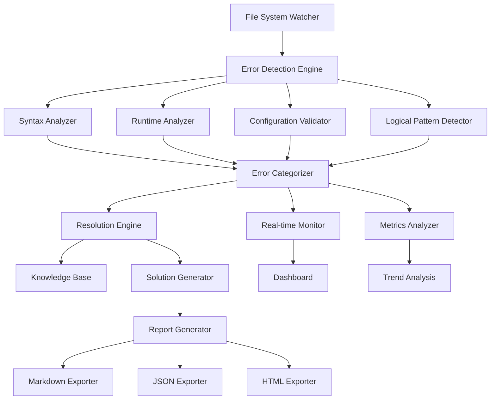

# Software Error Detection System Design

## Overview

The Software Error Detection System is a comprehensive tool that automatically identifies, categorizes, and provides resolution guidance for common software development errors. The system integrates with existing development workflows to provide real-time error detection, detailed analysis, and actionable solutions.

The system operates as a multi-layered architecture that combines static code analysis, configuration validation, runtime error detection, and machine learning-based pattern recognition to identify issues across the entire software development lifecycle.

## Architecture

The system follows a modular architecture with clear separation of concerns:



### Core Components

1. **File System Watcher**: Monitors project files for changes and triggers analysis
2. **Error Detection Engine**: Orchestrates the analysis process across different error types
3. **Analyzers**: Specialized components for different error categories
4. **Error Categorizer**: Classifies and prioritizes detected errors
5. **Resolution Engine**: Generates solutions and prevention strategies
6. **Report Generator**: Creates output in multiple formats
7. **Real-time Monitor**: Provides live error tracking and notifications
8. **Metrics Analyzer**: Tracks trends and generates insights

## Components and Interfaces

### Error Detection Engine

```typescript
interface ErrorDetectionEngine {
  scanProject(projectPath: string): Promise<DetectionResult>
  scanFile(filePath: string): Promise<FileAnalysisResult>
  watchProject(projectPath: string, callback: ErrorCallback): WatchHandle
  stopWatching(handle: WatchHandle): void
}

interface DetectionResult {
  errors: DetectedError[]
  warnings: DetectedWarning[]
  metrics: ProjectMetrics
  timestamp: Date
}
```

### Error Analyzers

```typescript
interface ErrorAnalyzer {
  analyze(content: string, filePath: string): Promise<AnalysisResult>
  getSupportedFileTypes(): string[]
  getErrorCategories(): ErrorCategory[]
}

interface SyntaxAnalyzer extends ErrorAnalyzer {
  parseAST(content: string, language: string): Promise<ASTResult>
  validateSyntax(ast: ASTResult): SyntaxError[]
}

interface RuntimeAnalyzer extends ErrorAnalyzer {
  detectRuntimePatterns(content: string): RuntimeError[]
  analyzeMemoryLeaks(content: string): MemoryError[]
  checkPerformanceIssues(content: string): PerformanceWarning[]
}

interface ConfigurationValidator extends ErrorAnalyzer {
  validateSchema(config: object, schemaPath: string): ValidationResult
  checkBestPractices(config: object, configType: string): BestPracticeViolation[]
}
```

### Error Models

```typescript
interface DetectedError {
  id: string
  type: ErrorType
  category: ErrorCategory
  severity: ErrorSeverity
  message: string
  description: string
  location: ErrorLocation
  causes: string[]
  resolutions: Resolution[]
  preventionStrategies: PreventionStrategy[]
  examples: CodeExample[]
}

interface ErrorLocation {
  filePath: string
  line: number
  column: number
  startOffset: number
  endOffset: number
  context: string
}

interface Resolution {
  id: string
  title: string
  description: string
  steps: ResolutionStep[]
  difficulty: 'easy' | 'medium' | 'hard'
  estimatedTime: number
  requirements: string[]
}
```

### Report Generation

```typescript
interface ReportGenerator {
  generateMarkdown(errors: DetectedError[]): Promise<string>
  generateJSON(errors: DetectedError[]): Promise<object>
  generateHTML(errors: DetectedError[]): Promise<string>
  generateDashboard(errors: DetectedError[]): Promise<DashboardData>
}

interface ExportOptions {
  format: 'markdown' | 'json' | 'html'
  includeResolutions: boolean
  includePrevention: boolean
  includeExamples: boolean
  groupByCategory: boolean
  sortBy: 'severity' | 'type' | 'location'
}
```

## Data Models

### Error Classification

```typescript
enum ErrorType {
  SYNTAX = 'syntax',
  RUNTIME = 'runtime',
  LOGICAL = 'logical',
  CONFIGURATION = 'configuration',
  SECURITY = 'security',
  PERFORMANCE = 'performance',
  ACCESSIBILITY = 'accessibility',
  COMPATIBILITY = 'compatibility'
}

enum ErrorCategory {
  CRITICAL = 'critical',
  HIGH = 'high',
  MEDIUM = 'medium',
  LOW = 'low',
  INFO = 'info'
}

enum ErrorSeverity {
  BLOCKER = 'blocker',
  CRITICAL = 'critical',
  MAJOR = 'major',
  MINOR = 'minor',
  TRIVIAL = 'trivial'
}
```

### Knowledge Base Schema

```typescript
interface ErrorKnowledgeBase {
  patterns: ErrorPattern[]
  solutions: SolutionTemplate[]
  preventionStrategies: PreventionTemplate[]
  bestPractices: BestPracticeRule[]
}

interface ErrorPattern {
  id: string
  name: string
  description: string
  regex: string[]
  languages: string[]
  frameworks: string[]
  commonCauses: string[]
  relatedPatterns: string[]
}

interface SolutionTemplate {
  id: string
  errorPatternId: string
  title: string
  description: string
  steps: string[]
  codeExamples: CodeExample[]
  tools: string[]
  references: string[]
}
```

## Correctness Properties

*A property is a characteristic or behavior that should hold true across all valid executions of a system-essentially, a formal statement about what the system should do. Properties serve as the bridge between human-readable specifications and machine-verifiable correctness guarantees.*

Before defining the correctness properties, let me analyze the acceptance criteria for testability:

<function_calls>
<invoke name="prework">
<parameter name="featureName">software-error-detection

### Property Reflection

After reviewing all identified properties, several can be consolidated to eliminate redundancy:

- Properties about error completeness (descriptions, locations, causes, examples) can be combined into a comprehensive "error information completeness" property
- Properties about resolution completeness (steps, specificity, validation) can be combined into a "resolution completeness" property  
- Properties about report format completeness can be combined into a single "export format completeness" property
- Properties about prevention strategy completeness can be combined into a "prevention strategy completeness" property

**Property 1: Error detection completeness**
*For any* project directory scan, all error types (syntax, runtime, logical, configuration) should be detected and each error should be categorized with both type and severity level
**Validates: Requirements 1.1, 1.2**

**Property 2: Error grouping consistency**
*For any* set of detected errors, errors of the same type should be grouped together for efficient review
**Validates: Requirements 1.3**

**Property 3: Report generation completeness**
*For any* completed scan, a comprehensive error report should be generated containing all detected errors
**Validates: Requirements 1.4**

**Property 4: Configuration validation consistency**
*For any* configuration file with errors, validation should occur against known schemas and best practices
**Validates: Requirements 1.5**

**Property 5: Error information completeness**
*For any* detected error, it should include description, location (line/file), underlying causes, and code examples (both incorrect and correct)
**Validates: Requirements 2.1, 2.2, 2.3, 2.4**

**Property 6: Multi-cause error completeness**
*For any* error with multiple potential causes, all possible scenarios should be listed with diagnostic steps
**Validates: Requirements 2.5**

**Property 7: Resolution completeness**
*For any* identified error, step-by-step resolution instructions should be provided with specific code changes, validation steps, and dependency requirements when applicable
**Validates: Requirements 3.1, 3.2, 3.4, 3.5**

**Property 8: Resolution ranking consistency**
*For any* error with multiple resolution approaches, they should be ranked by effectiveness and ease of implementation
**Validates: Requirements 3.3**

**Property 9: Prevention strategy completeness**
*For any* error category, prevention strategies should be provided with specific tool recommendations, trade-off explanations, configuration examples, and step-by-step breakdowns for complex strategies
**Validates: Requirements 4.1, 4.2, 4.3, 4.4, 4.5**

**Property 10: Export format completeness**
*For any* error analysis, reports should be generated in markdown, JSON, and HTML formats, with each format containing complete error information and format-specific features (interactive elements for HTML, structured data for JSON, readable formatting for markdown)
**Validates: Requirements 5.1, 5.2, 5.3, 5.4, 5.5**

**Property 11: Real-time monitoring consistency**
*For any* file change, automatic re-scanning should occur, new errors should generate notifications, fixed errors should be removed from active lists, and a live dashboard should be available during active monitoring
**Validates: Requirements 6.1, 6.2, 6.3, 6.4**

**Property 12: Critical error prioritization**
*For any* critical error detection, notifications should be prioritized and urgent issues should be highlighted
**Validates: Requirements 6.5**

**Property 13: Metrics and trend analysis completeness**
*For any* project analysis, error frequency and types should be tracked over time, common categories and resolution times should be identified, quality trends should be displayed, team performance insights should be provided, and process improvements should be suggested based on patterns
**Validates: Requirements 7.1, 7.2, 7.3, 7.4, 7.5**

## Error Handling

The system implements comprehensive error handling across all components:

### Analysis Errors
- **File Access Errors**: Handle permission issues, missing files, and corrupted content
- **Parser Errors**: Gracefully handle unparseable code and unknown file formats
- **Memory Errors**: Implement safeguards for large file processing and memory limits
- **Timeout Errors**: Set reasonable timeouts for analysis operations

### Configuration Errors
- **Invalid Schemas**: Provide clear messages for schema validation failures
- **Missing Dependencies**: Guide users through dependency installation
- **Version Conflicts**: Detect and resolve tool version incompatibilities

### Runtime Errors
- **Network Failures**: Handle offline scenarios and API timeouts
- **Database Errors**: Implement retry logic and data recovery
- **Concurrent Access**: Manage file locking and concurrent analysis requests

### Error Recovery Strategies
- **Graceful Degradation**: Continue analysis even when some components fail
- **Partial Results**: Return available results when complete analysis fails
- **Retry Logic**: Implement exponential backoff for transient failures
- **Fallback Mechanisms**: Use alternative analysis methods when primary methods fail

## Testing Strategy

The system employs a dual testing approach combining unit tests and property-based tests:

### Unit Testing
- **Component Integration**: Test interactions between analyzers and the detection engine
- **Error Scenarios**: Verify handling of specific error conditions and edge cases
- **Report Generation**: Validate output formats and content accuracy
- **Configuration Validation**: Test schema validation and best practice checking

### Property-Based Testing
The system uses **fast-check** as the property-based testing library, with each test configured to run a minimum of 100 iterations.

Property-based tests verify universal properties across all inputs:
- **Error Detection Consistency**: Verify that error detection behaves consistently across different project structures
- **Classification Accuracy**: Ensure all errors are properly categorized and prioritized
- **Resolution Completeness**: Validate that all errors receive appropriate resolution guidance
- **Format Consistency**: Verify that all export formats maintain data integrity and completeness

Each property-based test is tagged with comments explicitly referencing the correctness property from this design document using the format: '**Feature: software-error-detection, Property {number}: {property_text}**'

### Integration Testing
- **End-to-End Workflows**: Test complete analysis cycles from file scanning to report generation
- **Real Project Analysis**: Validate system performance on actual codebases
- **Multi-Format Export**: Verify consistency across different output formats
- **Real-Time Monitoring**: Test file watching and live update functionality

### Performance Testing
- **Large Codebase Analysis**: Ensure system scales to enterprise-sized projects
- **Concurrent Analysis**: Test multiple simultaneous analysis operations
- **Memory Usage**: Monitor and optimize memory consumption during analysis
- **Response Time**: Validate real-time monitoring performance requirements