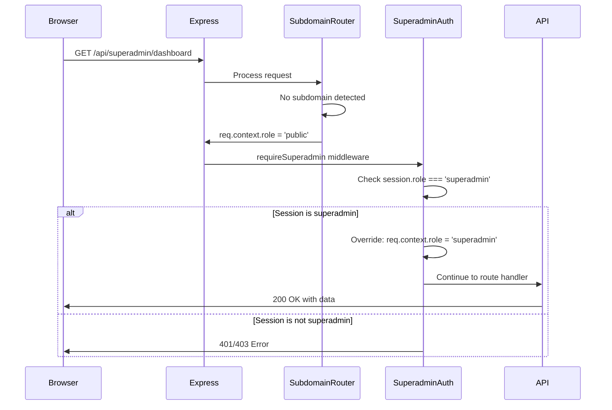

# Design Document

## Overview

Este documento descreve a solução para corrigir o painel de superadmin que ficou não funcional após as mudanças de isolamento multi-tenant. O problema principal é que o middleware `requireSuperadmin` verifica `req.context.role === 'superadmin'`, mas quando o superadmin acessa via `localhost:8080/superadmin/*` (sem subdomain), o `subdomainRouter` define `req.context.role = 'public'`.

A solução é modificar o middleware `requireSuperadmin` para priorizar a sessão sobre o contexto de subdomain, definindo `req.context.role = 'superadmin'` quando uma sessão válida de superadmin é detectada.

## Architecture



## Components and Interfaces

### Modified Component: `requireSuperadmin` Middleware

**File:** `server/middleware/superadminAuth.js`

**Current Behavior (Broken):**
1. Checks if session exists and has userId
2. Checks if session.role === 'superadmin'
3. **Checks if req.context.role === 'superadmin'** ← This fails when no subdomain

**New Behavior (Fixed):**
1. Checks if session exists and has userId
2. Checks if session.role === 'superadmin'
3. **If session is superadmin, override req.context.role = 'superadmin'**
4. Continue to route handler

### Interface Changes

```javascript
/**
 * requireSuperadmin middleware
 * 
 * @param {Request} req - Express request with:
 *   - req.session.userId: string (required)
 *   - req.session.role: 'superadmin' (required)
 *   - req.context: object (may have role='public' from subdomainRouter)
 * 
 * @param {Response} res - Express response
 * @param {NextFunction} next - Express next function
 * 
 * Side Effects:
 *   - Sets req.context.role = 'superadmin' if session is valid
 *   - Sets req.superadmin object with userId, role, sessionToken
 *   - Sets req.supabaseContext for RLS bypass
 */
function requireSuperadmin(req, res, next) {
  // Implementation
}
```

## Data Models

Não há mudanças nos modelos de dados. A correção é puramente no fluxo de middleware.

### Request Context Object

```typescript
interface RequestContext {
  role: 'public' | 'superadmin' | 'tenant_admin' | 'tenant_user';
  subdomain?: string | null;
  tenantId?: string;
  tenant?: {
    id: string;
    subdomain: string;
    name: string;
    status: string;
    branding?: object;
  };
}
```

### Session Object

```typescript
interface SuperadminSession {
  userId: string;
  role: 'superadmin';
  sessionToken: string;
  email?: string;
  name?: string;
}
```

## Correctness Properties

*A property is a characteristic or behavior that should hold true across all valid executions of a system-essentially, a formal statement about what the system should do. Properties serve as the bridge between human-readable specifications and machine-verifiable correctness guarantees.*

### Property 1: Superadmin Session Overrides Context

*For any* request with a valid superadmin session (session.role === 'superadmin' and session.userId exists), the `requireSuperadmin` middleware SHALL set `req.context.role = 'superadmin'` regardless of the initial context role set by subdomainRouter.

**Validates: Requirements 1.1, 1.4**

### Property 2: Unauthenticated Requests Return 401

*For any* request without a valid session (no session or no userId), the `requireSuperadmin` middleware SHALL return HTTP 401 Unauthorized.

**Validates: Requirements 1.2**

### Property 3: Non-Superadmin Sessions Return 403

*For any* request with a valid session but role !== 'superadmin', the `requireSuperadmin` middleware SHALL return HTTP 403 Forbidden.

**Validates: Requirements 1.3**

### Property 4: Tenant Search Filters Correctly

*For any* search query on the tenants list, all returned tenants SHALL contain the search term in either their name or subdomain fields.

**Validates: Requirements 3.3**

### Property 5: Tenant Status Filter Returns Correct Results

*For any* status filter applied to the tenants list, all returned tenants SHALL have the selected status value.

**Validates: Requirements 3.4**

## Error Handling

### Authentication Errors (401)

```javascript
{
  error: 'Authentication required',
  message: 'Superadmin authentication is required to access this resource.'
}
```

**Trigger:** Request without valid session

### Authorization Errors (403)

```javascript
{
  error: 'Insufficient permissions',
  message: 'Superadmin privileges are required to access this resource.'
}
```

**Trigger:** Request with session but role !== 'superadmin'

### Server Errors (500)

```javascript
{
  error: 'Authentication error',
  message: 'An error occurred during superadmin authentication.'
}
```

**Trigger:** Unexpected error during middleware execution

## Testing Strategy

### Unit Tests

**File:** `server/middleware/superadminAuth.test.js`

1. **Test: Valid superadmin session with public context**
   - Setup: req.session.role = 'superadmin', req.context.role = 'public'
   - Expected: next() called, req.context.role = 'superadmin'

2. **Test: Valid superadmin session with no context**
   - Setup: req.session.role = 'superadmin', req.context = undefined
   - Expected: next() called, req.context.role = 'superadmin'

3. **Test: No session returns 401**
   - Setup: req.session = undefined
   - Expected: res.status(401).json() called

4. **Test: Non-superadmin role returns 403**
   - Setup: req.session.role = 'admin'
   - Expected: res.status(403).json() called

### Property-Based Tests

**Framework:** Vitest with fast-check

**Configuration:** Minimum 100 iterations per property test

**Test File:** `server/middleware/superadminAuth.property.test.js`

```javascript
// Property 1: Superadmin session overrides context
// Feature: superadmin-context-fix, Property 1: Superadmin Session Overrides Context
// Validates: Requirements 1.1, 1.4

// Property 2: Unauthenticated requests return 401
// Feature: superadmin-context-fix, Property 2: Unauthenticated Requests Return 401
// Validates: Requirements 1.2

// Property 3: Non-superadmin sessions return 403
// Feature: superadmin-context-fix, Property 3: Non-Superadmin Sessions Return 403
// Validates: Requirements 1.3
```

### Integration Tests

**File:** `server/routes/superadminRoutes.test.js`

1. **Test: Dashboard endpoint with valid session**
   - Call GET /api/superadmin/dashboard with superadmin session
   - Expected: 200 OK with metrics data

2. **Test: Tenants endpoint with valid session**
   - Call GET /api/superadmin/tenants with superadmin session
   - Expected: 200 OK with tenants list

3. **Test: Validate subdomain endpoint**
   - Call POST /api/superadmin/tenants/validate-subdomain
   - Expected: 200 OK with availability status

### E2E Tests

**File:** `cypress/e2e/superadmin-panel.cy.ts`

1. **Test: Superadmin can access dashboard via localhost**
   - Navigate to http://localhost:8080/superadmin/login
   - Login with superadmin credentials
   - Verify dashboard loads with metrics

2. **Test: Superadmin can list and filter tenants**
   - Navigate to tenants page
   - Apply search filter
   - Verify filtered results

## Implementation Notes

### Code Change Summary

**File:** `server/middleware/superadminAuth.js`

**Lines to modify:** 60-70 (remove the context role check that causes the 403)

**Before:**
```javascript
// Validate superadmin context
if (req.context && req.context.role !== 'superadmin') {
  logger.warn('Invalid context for superadmin request', {
    userId: req.session.userId,
    contextRole: req.context.role,
    path: req.path
  });
  
  return res.status(403).json({
    error: 'Invalid context',
    message: 'This resource requires superadmin context.'
  });
}
```

**After:**
```javascript
// Override context role for superadmin session
// This allows superadmin to work without subdomain (e.g., localhost:8080/superadmin/*)
if (!req.context) {
  req.context = {};
}
req.context.role = 'superadmin';

logger.debug('Superadmin context set from session', {
  userId: req.session.userId,
  previousContextRole: req.context.role,
  path: req.path
});
```

### Backward Compatibility

- Superadmin access via `superadmin.domain.com` subdomain continues to work
- Superadmin access via `localhost:8080/superadmin/*` now works
- No changes to tenant authentication flow
- No changes to public routes
