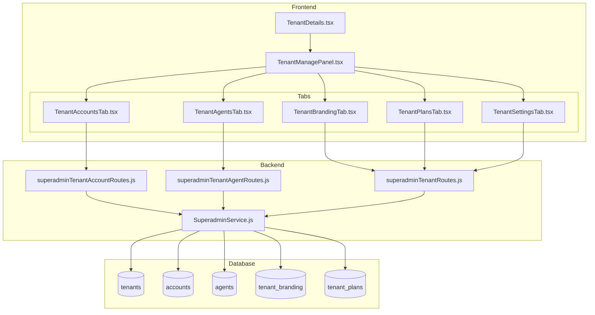

# Design Document: Superadmin Tenant Management

## Overview

Este documento descreve o design para implementar funcionalidades completas de gerenciamento de tenants no painel de Superadmin. A solução envolve criar um painel de gerenciamento com abas que permite ao superadmin gerenciar accounts, agents, branding e planos de cada tenant diretamente, sem precisar fazer impersonation.

A arquitetura segue o padrão já estabelecido no projeto, com rotas backend em CommonJS, componentes React com TypeScript, e uso do Supabase como banco de dados.

## Architecture



## Components and Interfaces

### 1. TenantManagePanel Component

Componente principal que exibe o painel de gerenciamento com abas.

```typescript
// src/components/superadmin/TenantManagePanel.tsx
interface TenantManagePanelProps {
  tenant: Tenant;
  onClose: () => void;
}

type TabType = 'accounts' | 'agents' | 'branding' | 'plans' | 'settings';
```

### 2. TenantAccountsTab Component

Componente para gerenciar accounts do tenant.

```typescript
// src/components/superadmin/TenantAccountsTab.tsx
interface TenantAccountsTabProps {
  tenantId: string;
}

interface TenantAccount {
  id: string;
  name: string;
  owner_user_id: string;
  wuzapi_token: string;
  status: 'active' | 'inactive' | 'suspended';
  created_at: string;
  agent_count?: number;
  inbox_count?: number;
}

interface CreateAccountData {
  name: string;
  ownerEmail: string;
  wuzapiToken?: string;
}
```

### 3. TenantAgentsTab Component

Componente para gerenciar agents do tenant.

```typescript
// src/components/superadmin/TenantAgentsTab.tsx
interface TenantAgentsTabProps {
  tenantId: string;
}

interface TenantAgent {
  id: string;
  account_id: string;
  account_name: string;
  email: string;
  name: string;
  role: 'owner' | 'administrator' | 'agent' | 'viewer';
  status: 'active' | 'inactive' | 'pending';
  created_at: string;
}

interface CreateAgentData {
  accountId: string;
  name: string;
  email: string;
  password: string;
  role: 'administrator' | 'agent' | 'viewer';
}
```

### 4. TenantBrandingTab Component

Componente para gerenciar branding do tenant.

```typescript
// src/components/superadmin/TenantBrandingTab.tsx
interface TenantBrandingTabProps {
  tenantId: string;
}

interface TenantBrandingData {
  app_name: string;
  logo_url: string | null;
  primary_color: string;
  secondary_color: string;
  primary_foreground: string | null;
  secondary_foreground: string | null;
  custom_home_html: string | null;
  support_phone: string | null;
  og_image_url: string | null;
}
```

### 5. TenantPlansTab Component

Componente para gerenciar planos do tenant.

```typescript
// src/components/superadmin/TenantPlansTab.tsx
interface TenantPlansTabProps {
  tenantId: string;
}

interface TenantPlan {
  id: string;
  name: string;
  description: string | null;
  price_cents: number;
  billing_cycle: 'monthly' | 'yearly' | 'quarterly' | 'weekly' | 'lifetime';
  status: 'active' | 'inactive' | 'archived';
  is_default: boolean;
  trial_days: number;
  quotas: Record<string, number>;
  features: Record<string, boolean>;
  subscriber_count?: number;
}
```

### 6. Backend Routes

```javascript
// server/routes/superadminTenantAccountRoutes.js

// GET /api/superadmin/tenants/:tenantId/accounts
// List all accounts for a tenant

// POST /api/superadmin/tenants/:tenantId/accounts
// Create a new account in the tenant

// PUT /api/superadmin/tenants/:tenantId/accounts/:accountId
// Update an account

// DELETE /api/superadmin/tenants/:tenantId/accounts/:accountId
// Delete an account (cascade)

// server/routes/superadminTenantAgentRoutes.js

// GET /api/superadmin/tenants/:tenantId/agents
// List all agents across all accounts in the tenant

// POST /api/superadmin/tenants/:tenantId/agents
// Create a new agent

// PUT /api/superadmin/tenants/:tenantId/agents/:agentId
// Update an agent

// POST /api/superadmin/tenants/:tenantId/agents/:agentId/reset-password
// Reset agent password
```

## Data Models

### TenantAccount (Extended)

```typescript
interface TenantAccount {
  id: string;
  tenant_id: string;
  name: string;
  owner_user_id: string;
  wuzapi_token: string;
  timezone: string;
  locale: string;
  status: 'active' | 'inactive' | 'suspended';
  settings: Record<string, any>;
  created_at: string;
  updated_at: string;
  // Computed fields
  agent_count?: number;
  inbox_count?: number;
  conversation_count?: number;
}
```

### TenantAgent (Extended)

```typescript
interface TenantAgent {
  id: string;
  account_id: string;
  user_id: string;
  email: string;
  name: string;
  avatar_url: string | null;
  role: 'owner' | 'administrator' | 'agent' | 'viewer';
  availability: 'online' | 'busy' | 'offline';
  status: 'active' | 'inactive' | 'pending';
  last_activity_at: string | null;
  created_at: string;
  updated_at: string;
  // Joined fields
  account_name?: string;
}
```

## Correctness Properties

*A property is a characteristic or behavior that should hold true across all valid executions of a system-essentially, a formal statement about what the system should do. Properties serve as the bridge between human-readable specifications and machine-verifiable correctness guarantees.*

### Property 1: Management panel displays all required tabs
*For any* tenant, when the management panel is opened, it SHALL contain tabs for Accounts, Agents, Branding, Plans, and Settings.
**Validates: Requirements 1.1**

### Property 2: Tenant header displays correct information
*For any* tenant data, the management panel header SHALL display the tenant name and status badge.
**Validates: Requirements 1.2**

### Property 3: Account list displays all required fields
*For any* account in the tenant, the rendered list item SHALL contain the account name, owner email, status, and creation date.
**Validates: Requirements 2.1**

### Property 4: Account creation with valid data succeeds
*For any* valid account data (non-empty name, valid email), submitting the create form SHALL result in the account appearing in the list.
**Validates: Requirements 2.3**

### Property 5: Agent list displays all required fields
*For any* agent in the tenant, the rendered list item SHALL contain the agent name, email, role, account name, and status.
**Validates: Requirements 3.1**

### Property 6: Agent creation with valid data succeeds
*For any* valid agent data (valid account, non-empty name, valid email, valid role), submitting the create form SHALL result in the agent appearing in the list.
**Validates: Requirements 3.3**

### Property 7: Branding form displays all required fields
*For any* tenant branding data, the form SHALL display fields for app name, logo URL, primary color, and secondary color with current values.
**Validates: Requirements 4.1**

### Property 8: Color format validation
*For any* color input, the system SHALL accept valid hex colors (#RRGGBB or #RGB) and reject invalid formats.
**Validates: Requirements 4.2**

### Property 9: Plan list displays all required fields
*For any* plan in the tenant, the rendered list item SHALL contain the plan name, price, status, and subscriber count.
**Validates: Requirements 5.1**

### Property 10: Plan edit preserves ID immutability
*For any* plan edit operation, the plan ID SHALL remain unchanged while other fields can be modified.
**Validates: Requirements 5.3**

### Property 11: Default plan uniqueness
*For any* tenant, setting a plan as default SHALL unset any previous default plan, ensuring only one default exists.
**Validates: Requirements 5.4**

### Property 12: Metrics display all required values
*For any* tenant, the settings tab SHALL display total accounts, total agents, total inboxes, and MRR values.
**Validates: Requirements 6.1**

### Property 13: CSV export contains required data
*For any* tenant export, the generated CSV SHALL contain columns for accounts, agents, and usage data.
**Validates: Requirements 6.3**

## Error Handling

### Frontend Error Handling

1. **API Error Handling**: All fetch calls wrapped in try-catch with toast notifications
2. **Form Validation**: Zod schemas for all forms with inline error messages
3. **Loading States**: Show skeleton loaders during data fetching
4. **Empty States**: Display appropriate messages when no data exists

```typescript
// Error handling pattern for API calls
const handleApiCall = async (operation: () => Promise<Response>) => {
  try {
    setLoading(true);
    const response = await operation();
    
    if (!response.ok) {
      if (response.status === 401) {
        toast.error('Session expired. Please login again');
        navigate('/superadmin/login');
        return null;
      }
      const data = await response.json();
      throw new Error(data.error || `Operation failed: ${response.status}`);
    }
    
    return await response.json();
  } catch (error) {
    console.error('API error:', error);
    toast.error(error.message);
    return null;
  } finally {
    setLoading(false);
  }
};
```

### Backend Error Handling

1. **Authentication**: Return 401 for unauthenticated requests
2. **Authorization**: Return 403 for non-superadmin access
3. **Validation**: Return 400 for invalid input with specific error messages
4. **Not Found**: Return 404 when tenant/account/agent doesn't exist
5. **Structured Responses**: Always return `{ success: boolean, data?: any, error?: string }`

## Testing Strategy

### Unit Tests

Unit tests will verify individual component behavior:

1. **TenantManagePanel**: Renders all tabs, handles tab switching
2. **TenantAccountsTab**: Renders account list, handles CRUD operations
3. **TenantAgentsTab**: Renders agent list, handles CRUD operations
4. **TenantBrandingTab**: Renders form with current values, validates inputs
5. **TenantPlansTab**: Renders plan list, handles CRUD operations

### Property-Based Tests

Property-based tests will use **fast-check** library to verify correctness properties:

1. **Tab presence**: For any tenant, all required tabs are present
2. **List rendering**: For any data, all required fields are displayed
3. **Form validation**: For any input, validation rules are correctly applied
4. **Default plan uniqueness**: For any sequence of default plan changes, only one default exists

### Integration Tests

Integration tests will verify end-to-end flows:

1. **Account CRUD**: Create → appears in list → edit → changes reflected → delete → removed
2. **Agent CRUD**: Create → appears in list → edit → changes reflected → reset password → new password works
3. **Branding update**: Edit values → save → values persisted → reload → values displayed
4. **Plan management**: Create → set as default → previous default unset

### Test Configuration

Each property-based test MUST:
- Run a minimum of 100 iterations
- Be tagged with a comment referencing the correctness property: `**Feature: superadmin-tenant-management, Property {number}: {property_text}**`
- Use fast-check arbitraries to generate test inputs

