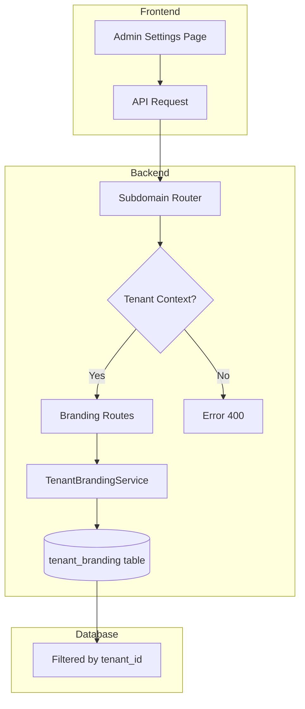

# Design Document: Tenant Branding Isolation

## Overview

Este documento descreve a solução técnica para corrigir o isolamento de branding por tenant. O problema atual é que o sistema usa a tabela global `branding_config` em vez da tabela `tenant_branding` específica por tenant, causando vazamento de dados entre tenants.

A solução envolve:
1. Criar um novo serviço `TenantBrandingService` que encapsula a lógica de branding por tenant
2. Modificar as rotas de branding para usar o contexto de tenant
3. Atualizar o `database.js` para delegar ao novo serviço

## Architecture



## Components and Interfaces

### TenantBrandingService

Novo serviço responsável por gerenciar branding específico por tenant.

```javascript
// server/services/TenantBrandingService.js

class TenantBrandingService {
  /**
   * Get branding configuration for a specific tenant
   * @param {string} tenantId - UUID do tenant
   * @returns {Promise<BrandingConfig>} Configuração de branding
   */
  async getBrandingByTenantId(tenantId) {
    // Query tenant_branding filtered by tenant_id
    // Return default values if not found
  }

  /**
   * Update branding configuration for a tenant
   * @param {string} tenantId - UUID do tenant
   * @param {BrandingData} brandingData - Dados de branding
   * @returns {Promise<BrandingConfig>} Configuração atualizada
   */
  async updateBrandingByTenantId(tenantId, brandingData) {
    // Upsert into tenant_branding
  }

  /**
   * Get default branding values
   * @returns {BrandingConfig} Valores padrão
   */
  getDefaultBranding() {
    return {
      appName: 'WUZAPI',
      logoUrl: null,
      primaryColor: '#0ea5e9',
      secondaryColor: '#64748b',
      customHomeHtml: null,
      supportPhone: null,
      ogImageUrl: null
    };
  }
}
```

### Modified Branding Routes

As rotas de branding serão modificadas para usar o contexto de tenant.

```javascript
// server/routes/brandingRoutes.js (modificado)

// GET /api/branding - Requer contexto de tenant
router.get('/', requireAdmin, async (req, res) => {
  const tenantId = req.context?.tenantId;
  if (!tenantId) {
    return res.status(400).json({ error: 'Tenant context required' });
  }
  
  const branding = await tenantBrandingService.getBrandingByTenantId(tenantId);
  res.json({ success: true, data: branding });
});

// PUT /api/branding - Requer contexto de tenant
router.put('/', requireAdmin, async (req, res) => {
  const tenantId = req.context?.tenantId;
  if (!tenantId) {
    return res.status(400).json({ error: 'Tenant context required' });
  }
  
  // Validate session tenant matches context tenant
  if (req.session.tenantId && req.session.tenantId !== tenantId) {
    logger.warn('Cross-tenant branding access attempt', {
      sessionTenantId: req.session.tenantId,
      contextTenantId: tenantId
    });
    return res.status(403).json({ error: 'Cross-tenant access denied' });
  }
  
  const branding = await tenantBrandingService.updateBrandingByTenantId(tenantId, req.body);
  res.json({ success: true, data: branding });
});

// GET /api/branding/public - Usa subdomínio para determinar tenant
router.get('/public', async (req, res) => {
  const tenantId = req.context?.tenantId;
  // Se não há tenant, usa tenant padrão
  const effectiveTenantId = tenantId || DEFAULT_TENANT_ID;
  
  const branding = await tenantBrandingService.getBrandingByTenantId(effectiveTenantId);
  res.json({ success: true, data: branding });
});
```

## Data Models

### tenant_branding Table (existente)

```sql
CREATE TABLE tenant_branding (
  id UUID PRIMARY KEY DEFAULT gen_random_uuid(),
  tenant_id UUID NOT NULL UNIQUE REFERENCES tenants(id),
  app_name TEXT DEFAULT 'WUZAPI',
  logo_url TEXT,
  primary_color TEXT,
  secondary_color TEXT,
  primary_foreground TEXT,
  secondary_foreground TEXT,
  custom_home_html TEXT,
  support_phone TEXT,
  og_image_url TEXT,
  created_at TIMESTAMPTZ DEFAULT now(),
  updated_at TIMESTAMPTZ DEFAULT now()
);
```

### BrandingConfig Interface

```typescript
interface BrandingConfig {
  id: string;
  tenantId: string;
  appName: string;
  logoUrl: string | null;
  primaryColor: string | null;
  secondaryColor: string | null;
  primaryForeground: string | null;
  secondaryForeground: string | null;
  customHomeHtml: string | null;
  supportPhone: string | null;
  ogImageUrl: string | null;
  createdAt: string;
  updatedAt: string;
}
```

## Correctness Properties

*A property is a characteristic or behavior that should hold true across all valid executions of a system-essentially, a formal statement about what the system should do. Properties serve as the bridge between human-readable specifications and machine-verifiable correctness guarantees.*

### Property 1: Tenant Branding Isolation

*For any* tenant with branding configured, when a user of that tenant requests branding data, the system should return only the branding associated with that specific tenant_id.

**Validates: Requirements 1.1, 1.4**

### Property 2: Tenant Context Extraction and Usage

*For any* request with a valid subdomain, the system should extract the correct tenant_id from the subdomain and use it as a mandatory filter in all branding queries.

**Validates: Requirements 2.1, 2.3**

### Property 3: Public Branding by Subdomain

*For any* public branding request with a valid subdomain, the system should return the branding configuration that matches the tenant associated with that subdomain.

**Validates: Requirements 4.1, 4.2**

### Property 4: Cross-Tenant Access Prevention

*For any* authenticated request where the session tenant_id differs from the context tenant_id, the system should return a 403 error and log the security event.

**Validates: Requirements 5.1, 5.2, 5.3**

### Property 5: Branding Update Persistence

*For any* valid branding update request, the data should be persisted in the tenant_branding table with the correct tenant_id, and subsequent reads should return the updated values.

**Validates: Requirements 1.2**

## Error Handling

| Scenario | HTTP Status | Error Code | Message |
|----------|-------------|------------|---------|
| Missing tenant context | 400 | MISSING_TENANT_CONTEXT | Tenant context is required for this operation |
| Cross-tenant access attempt | 403 | CROSS_TENANT_ACCESS_DENIED | You do not have permission to access resources from this tenant |
| Tenant not found | 404 | TENANT_NOT_FOUND | The requested tenant was not found |
| Invalid branding data | 400 | INVALID_BRANDING_DATA | Invalid branding configuration data |
| Database error | 500 | INTERNAL_ERROR | An error occurred while processing your request |

## Testing Strategy

### Unit Tests

- TenantBrandingService.getBrandingByTenantId returns correct data for valid tenant
- TenantBrandingService.getBrandingByTenantId returns defaults for non-existent tenant
- TenantBrandingService.updateBrandingByTenantId creates new record if not exists
- TenantBrandingService.updateBrandingByTenantId updates existing record
- Branding routes validate tenant context presence
- Branding routes validate cross-tenant access

### Property-Based Tests

Property-based testing will be used to verify the correctness properties using the `fast-check` library.

Each property test should:
- Run minimum 100 iterations
- Generate random tenant IDs and branding data
- Verify the property holds for all generated inputs

**Test Configuration:**
```javascript
// vitest.config.ts
export default {
  test: {
    testTimeout: 30000, // Allow time for property tests
  }
}
```

**Tag Format:** Feature: tenant-branding-isolation, Property {number}: {property_text}

### Integration Tests

- End-to-end test: Login as tenant admin, update branding, verify isolation
- End-to-end test: Access public branding via different subdomains
- End-to-end test: Attempt cross-tenant access, verify 403 response
