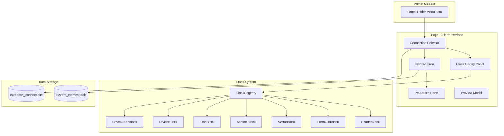

# Design Document: Theme Page Builder

## Overview

O Theme Page Builder é uma interface visual drag-and-drop que permite aos administradores criar temas de edição personalizados. O sistema utiliza a biblioteca `@dnd-kit` (já presente no projeto) para funcionalidade de arrastar e soltar, e armazena os temas como JSON no banco de dados.

A arquitetura segue o padrão de **Builder Pattern** onde blocos são componentes independentes que podem ser compostos para formar layouts complexos.

## Architecture



## Components and Interfaces

### 1. Theme Schema Interface

```typescript
// src/types/page-builder.ts

export interface ThemeBlock {
  id: string;
  type: BlockType;
  props: Record<string, any>;
  children?: ThemeBlock[];
}

export type BlockType = 
  | 'header'
  | 'form-grid'
  | 'single-field'
  | 'avatar'
  | 'section'
  | 'divider'
  | 'save-button'
  | 'info-card';

export interface ThemeSchema {
  id: string;
  name: string;
  description: string;
  connectionId?: number;
  blocks: ThemeBlock[];
  createdAt: string;
  updatedAt: string;
}

export interface BlockDefinition {
  type: BlockType;
  name: string;
  description: string;
  icon: React.ComponentType;
  category: 'layout' | 'fields' | 'display' | 'actions';
  defaultProps: Record<string, any>;
  propsSchema: PropSchema[];
  component: React.ComponentType<BlockComponentProps>;
}

export interface PropSchema {
  name: string;
  label: string;
  type: 'string' | 'number' | 'boolean' | 'select' | 'field-select';
  options?: { value: string; label: string }[];
  defaultValue?: any;
}

export interface BlockComponentProps {
  block: ThemeBlock;
  connection: DatabaseConnection;
  record: Record<string, any>;
  formData: Record<string, any>;
  onRecordChange: (data: Record<string, any>) => void;
  isPreview?: boolean;
}
```

### 2. Block Registry

```typescript
// src/components/features/page-builder/BlockRegistry.ts

class BlockRegistry {
  private blocks: Map<BlockType, BlockDefinition>;
  
  register(definition: BlockDefinition): void;
  get(type: BlockType): BlockDefinition | undefined;
  list(): BlockDefinition[];
  listByCategory(category: string): BlockDefinition[];
}

export const blockRegistry = new BlockRegistry();
```

### 3. Component Hierarchy

```
src/components/features/page-builder/
├── PageBuilder.tsx              # Main page builder component
├── BlockRegistry.ts             # Block registration system
├── ConnectionSelector.tsx       # Database connection dropdown
├── BlockLibrary.tsx             # Draggable block library panel
├── BuilderCanvas.tsx            # Drop zone canvas
├── PropertiesPanel.tsx          # Block properties editor
├── ThemePreview.tsx             # Preview modal
├── blocks/
│   ├── index.ts                 # Block exports and registration
│   ├── HeaderBlock.tsx          # Page header with title
│   ├── FormGridBlock.tsx        # Grid of form fields
│   ├── SingleFieldBlock.tsx     # Single field display
│   ├── AvatarBlock.tsx          # Avatar with name display
│   ├── SectionBlock.tsx         # Collapsible section
│   ├── DividerBlock.tsx         # Visual divider
│   ├── SaveButtonBlock.tsx      # Save action button
│   └── InfoCardBlock.tsx        # Information card
└── DraggableBlock.tsx           # Wrapper for drag functionality
```

### 4. Database Schema

```sql
-- New table for custom themes
CREATE TABLE custom_themes (
  id INTEGER PRIMARY KEY AUTOINCREMENT,
  name TEXT NOT NULL,
  description TEXT,
  connection_id INTEGER,
  schema TEXT NOT NULL, -- JSON ThemeSchema
  preview_image TEXT,   -- Base64 or URL
  created_at DATETIME DEFAULT CURRENT_TIMESTAMP,
  updated_at DATETIME DEFAULT CURRENT_TIMESTAMP,
  FOREIGN KEY (connection_id) REFERENCES database_connections(id) ON DELETE SET NULL
);
```

## Data Models

### ThemeSchema JSON Structure

```json
{
  "id": "custom-theme-1",
  "name": "Perfil Completo",
  "description": "Layout com avatar e seções organizadas",
  "connectionId": 2,
  "blocks": [
    {
      "id": "block-1",
      "type": "header",
      "props": {
        "titleField": "nome",
        "subtitleField": "status_phrase"
      }
    },
    {
      "id": "block-2",
      "type": "avatar",
      "props": {
        "imageField": "avatar",
        "nameField": "nome",
        "size": "large"
      }
    },
    {
      "id": "block-3",
      "type": "section",
      "props": {
        "title": "Informações Pessoais",
        "collapsible": true,
        "defaultOpen": true
      },
      "children": [
        {
          "id": "block-4",
          "type": "form-grid",
          "props": {
            "columns": 2,
            "fields": ["nome", "descricao", "status_phrase"]
          }
        }
      ]
    },
    {
      "id": "block-5",
      "type": "save-button",
      "props": {
        "label": "Salvar Alterações",
        "position": "bottom-right"
      }
    }
  ],
  "createdAt": "2024-12-08T10:00:00Z",
  "updatedAt": "2024-12-08T10:00:00Z"
}
```

## Correctness Properties

*A property is a characteristic or behavior that should hold true across all valid executions of a system-essentially, a formal statement about what the system should do. Properties serve as the bridge between human-readable specifications and machine-verifiable correctness guarantees.*

### Property 1: Block Registry Consistency
*For any* block registered in the BlockRegistry, calling `get(blockType)` SHALL return the same block definition that was registered, and the definition SHALL contain all required fields (type, name, component).
**Validates: Requirements 7.1, 7.3**

### Property 2: Theme Schema Round-Trip
*For any* ThemeSchema saved to the database, loading it back SHALL produce an equivalent ThemeSchema object with all blocks and properties preserved.
**Validates: Requirements 5.2, 6.2**

### Property 3: Block Drag-Drop Integrity
*For any* block dragged from the library to the canvas, the resulting canvas state SHALL contain exactly one new block with the correct type and default props.
**Validates: Requirements 2.3, 2.4**

### Property 4: Custom Theme Availability
*For any* custom theme saved through the Page Builder, the theme SHALL appear in the EditThemeSelector list alongside built-in themes.
**Validates: Requirements 5.3, 5.4**

### Property 5: Field Binding Validity
*For any* block with field bindings, the bound fields SHALL exist in the selected connection's field list, or the block SHALL display a warning indicator.
**Validates: Requirements 3.2**

## Error Handling

| Error Scenario | Handling Strategy |
|----------------|-------------------|
| Connection not found | Show error message, disable canvas |
| Invalid block type | Skip block, log warning |
| Field binding to non-existent field | Show warning badge on block |
| Save fails | Show toast error, keep builder state |
| Theme schema corrupted | Fallback to empty canvas, log error |

## Testing Strategy

### Dual Testing Approach

1. **Unit Tests**: Verify block rendering, registry operations, schema validation
2. **Property-Based Tests**: Verify schema round-trip, block integrity

### Property-Based Testing

**Library**: fast-check

**Test Configuration**: Minimum 100 iterations per property test

**Property Tests to Implement**:

1. **Block Registry Round-Trip** (Property 1)
   - Generate random block definitions
   - Register and retrieve, verify equality

2. **Theme Schema Persistence** (Property 2)
   - Generate random ThemeSchema objects
   - Save to DB, load back, verify equality

3. **Drag-Drop State Integrity** (Property 3)
   - Generate random drag operations
   - Verify canvas state consistency

4. **Custom Theme Listing** (Property 4)
   - Create random custom themes
   - Verify they appear in theme list

### Unit Tests

1. **BlockRegistry** - register, get, list operations
2. **BuilderCanvas** - drop handling, reordering
3. **PropertiesPanel** - property updates
4. **Block Components** - rendering with various props

