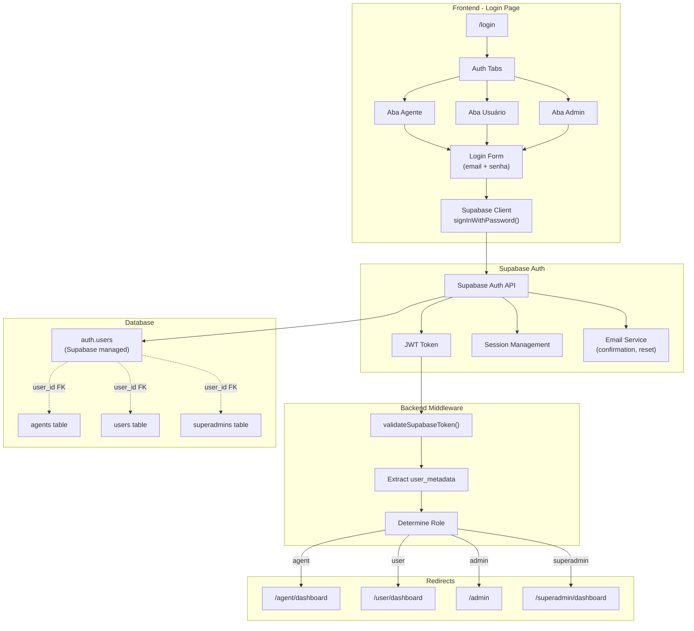
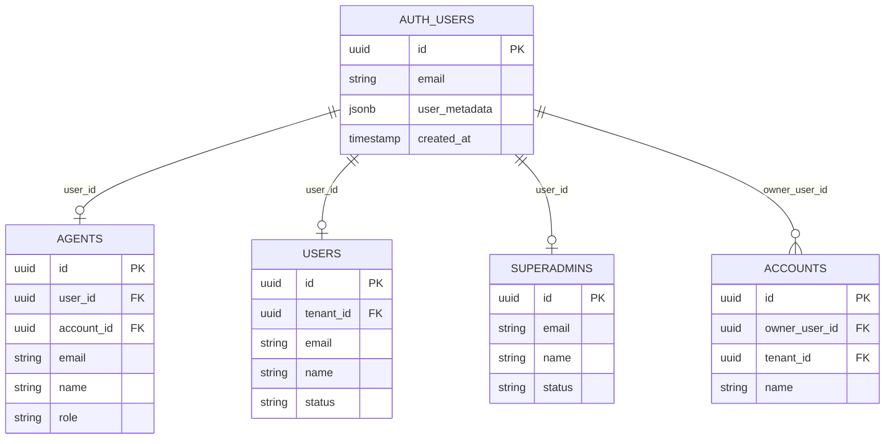

# Design Document: Unified Login System

## Overview

Este documento descreve o design técnico para a unificação do sistema de login da plataforma WUZAPI Manager. O sistema consolidará as múltiplas páginas de login existentes em uma única interface em `/login`, utilizando exclusivamente o Supabase Auth para autenticação.

### Objetivos
- Simplificar a experiência do usuário com uma única página de login
- Aproveitar os recursos nativos do Supabase Auth (confirmação de email, reset de senha)
- Manter compatibilidade com o sistema multi-tenant existente
- Migrar usuários existentes sem perda de acesso

### Escopo
- Nova página de login unificada com abas para diferentes tipos de usuários
- Integração completa com Supabase Auth
- Script de migração de usuários existentes
- Atualização das rotas e redirecionamentos

## Architecture



## Components and Interfaces

### Frontend Components

#### UnifiedLoginPage
Componente principal da página de login unificada.

```typescript
interface UnifiedLoginPageProps {
  defaultTab?: 'agent' | 'user' | 'admin';
}

interface LoginFormData {
  email: string;
  password: string;
}

interface AuthTab {
  id: 'agent' | 'user' | 'admin';
  label: string;
  icon: React.ComponentType;
  description: string;
}
```

#### LoginForm
Formulário de login reutilizável para todas as abas.

```typescript
interface LoginFormProps {
  onSubmit: (data: LoginFormData) => Promise<void>;
  isLoading: boolean;
  error: string | null;
  showRegisterLink?: boolean;
  showForgotPassword?: boolean;
}
```

#### PasswordResetForm
Formulário para solicitação de reset de senha.

```typescript
interface PasswordResetFormProps {
  onSubmit: (email: string) => Promise<void>;
  onBack: () => void;
  isLoading: boolean;
  message: { type: 'success' | 'error'; text: string } | null;
}
```

### Backend Services

#### AuthService (atualizado)
Serviço para operações de autenticação via Supabase.

```typescript
interface AuthService {
  // Autenticação
  signIn(email: string, password: string): Promise<AuthResponse>;
  signOut(): Promise<void>;
  
  // Registro
  signUp(data: SignUpData): Promise<AuthResponse>;
  
  // Reset de senha
  resetPassword(email: string): Promise<void>;
  updatePassword(newPassword: string): Promise<void>;
  
  // Sessão
  getSession(): Promise<Session | null>;
  onAuthStateChange(callback: AuthStateChangeCallback): Subscription;
  
  // Role
  getUserRole(user: User): UserRole;
  getRedirectPath(role: UserRole): string;
}

interface SignUpData {
  email: string;
  password: string;
  name: string;
  role: UserRole;
  tenantId: string;
}

type UserRole = 'agent' | 'user' | 'admin' | 'superadmin';
```

### API Endpoints

#### POST /api/auth/migrate-user
Endpoint para migração de usuários existentes para Supabase Auth.

```typescript
interface MigrateUserRequest {
  sourceTable: 'agents' | 'users' | 'superadmins';
  sourceId: string;
}

interface MigrateUserResponse {
  success: boolean;
  supabaseUserId: string;
  temporaryPassword: string;
}
```

## Data Models

### Supabase Auth User Metadata
Estrutura de metadados armazenados no `user_metadata` do Supabase Auth.

```typescript
interface UserMetadata {
  role: UserRole;
  tenant_id: string;
  name: string;
  avatar_url?: string;
  // Referência ao registro original (para migração)
  legacy_table?: 'agents' | 'users' | 'superadmins';
  legacy_id?: string;
  // Flag para forçar troca de senha
  requires_password_change?: boolean;
}
```

### Relacionamento com Tabelas Existentes



## Correctness Properties

*A property is a characteristic or behavior that should hold true across all valid executions of a system-essentially, a formal statement about what the system should do. Properties serve as the bridge between human-readable specifications and machine-verifiable correctness guarantees.*

### Property 1: Authentication Creates Valid Session
*For any* valid email and password combination belonging to an existing user, calling `signInWithPassword()` SHALL create a valid session with a JWT token containing the user's ID and metadata.
**Validates: Requirements 2.1, 3.1, 4.1**

### Property 2: Error Messages Prevent Email Enumeration
*For any* authentication or registration attempt, the error messages displayed SHALL NOT reveal whether a specific email address exists in the system.
**Validates: Requirements 2.3, 3.3, 4.4, 5.5**

### Property 3: Role-Based Redirect Consistency
*For any* authenticated user with a valid role in `user_metadata.role`, the system SHALL redirect to the correct dashboard path: agent→`/agent/dashboard`, user→`/user/dashboard`, admin→`/admin`, superadmin→`/superadmin/dashboard`.
**Validates: Requirements 8.2, 8.3, 8.4, 8.5**

### Property 4: Legacy Route Redirect Preserves Parameters
*For any* navigation to legacy routes (`/agent/login`, `/user-login`) with query parameters, the redirect to `/login` SHALL preserve all query parameters.
**Validates: Requirements 1.2**

### Property 5: Tenant Isolation on Authentication
*For any* authentication attempt, the system SHALL verify that the user's `tenant_id` in metadata matches the current subdomain's tenant, denying access if they don't match.
**Validates: Requirements 10.2, 10.3**

### Property 6: Migration Preserves User Identity
*For any* user migrated from legacy tables (`agents`, `users`, `superadmins`), the Supabase Auth user SHALL have the same email, correct role in metadata, and a valid foreign key link to the original record.
**Validates: Requirements 9.3, 9.4**

### Property 7: Registration Associates Correct Tenant
*For any* new user registration, the system SHALL store the current subdomain's `tenant_id` in the user's metadata.
**Validates: Requirements 10.1, 10.5**

## Error Handling

### Authentication Errors

| Error Code | User Message | Internal Action |
|------------|--------------|-----------------|
| `invalid_credentials` | "Email ou senha incorretos" | Log attempt, increment failed count |
| `email_not_confirmed` | "Por favor, confirme seu email" | Offer to resend confirmation |
| `user_locked` | "Conta temporariamente bloqueada" | Show unlock time if available |
| `tenant_mismatch` | "Acesso não autorizado para este domínio" | Log security event |
| `session_expired` | "Sua sessão expirou" | Redirect to login |

### Registration Errors

| Error Code | User Message | Internal Action |
|------------|--------------|-----------------|
| `email_exists` | "Não foi possível criar a conta" | Generic message to prevent enumeration |
| `weak_password` | "Senha muito fraca" | Show password requirements |
| `invalid_email` | "Email inválido" | Validate format |

### Password Reset Errors

| Error Code | User Message | Internal Action |
|------------|--------------|-----------------|
| `token_expired` | "Link expirado. Solicite um novo." | Offer to resend |
| `token_invalid` | "Link inválido" | Log potential attack |

## Testing Strategy

### Unit Tests
- Validação de formulários (email, senha)
- Extração de role do user_metadata
- Determinação de redirect path por role
- Parsing de query parameters em redirects

### Property-Based Tests
- **Property 1**: Gerar credenciais válidas e verificar criação de sessão
- **Property 2**: Gerar emails aleatórios e verificar que mensagens de erro são genéricas
- **Property 3**: Gerar roles válidos e verificar redirects corretos
- **Property 4**: Gerar query parameters aleatórios e verificar preservação
- **Property 5**: Gerar combinações de tenant_id e verificar isolamento
- **Property 6**: Migrar usuários de teste e verificar integridade
- **Property 7**: Registrar usuários em diferentes subdomínios e verificar tenant_id

### Integration Tests
- Fluxo completo de login para cada tipo de usuário
- Fluxo de registro com confirmação de email
- Fluxo de reset de senha
- Migração de usuários existentes

### E2E Tests (Cypress)
- Login de agente e navegação para dashboard
- Login de usuário e navegação para dashboard
- Login de admin e navegação para painel
- Redirect de rotas legadas
- Exibição de branding por tenant

### Test Configuration
- Property tests: mínimo 100 iterações
- Framework: Vitest com fast-check para property-based testing
- Tag format: `Feature: unified-login-system, Property N: [description]`
