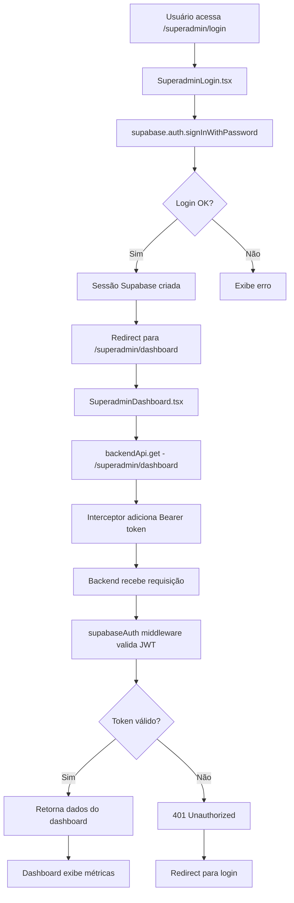
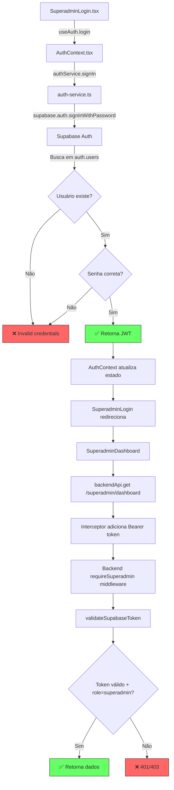

# Implementation Plan: Unified Login System

## Overview

Este plano implementa a unificação do sistema de login em uma única página `/login` com abas para Agente, Usuário e Admin, utilizando Supabase Auth para autenticação.

## Diagrama de Fluxo de Autenticação (Corrigido)



## Tasks

- [x] 1. Criar componente UnifiedLoginPage com abas
  - [x] 1.1 Criar estrutura base do componente com Tabs (shadcn/ui)
    - Implementar três abas: Agente, Usuário, Admin
    - Usar ícones distintos para cada aba (Users, User, Shield)
    - Aplicar branding do tenant (logo, cores)
    - _Requirements: 1.1, 1.3, 1.5_

  - [x] 1.2 Implementar formulário de login reutilizável
    - Campos: email, senha
    - Validação com Zod
    - Estados de loading e erro
    - Link "Esqueci minha senha"
    - _Requirements: 2.1, 3.1, 4.1_

  - [x] 1.3 Implementar formulário de reset de senha
    - Campo: email
    - Integração com `supabase.auth.resetPasswordForEmail()`
    - Mensagem de sucesso genérica (prevenir enumeração)
    - _Requirements: 6.1, 6.5_

  - [ ]* 1.4 Write property test for error message enumeration prevention
    - **Property 2: Error Messages Prevent Email Enumeration**
    - **Validates: Requirements 2.3, 3.3, 4.4, 5.5**

- [x] 2. Implementar lógica de autenticação com Supabase Auth
  - [x] 2.1 Criar serviço de autenticação unificado
    - Função `signIn(email, password)` usando `signInWithPassword()`
    - Função `signOut()` usando `signOut()`
    - Função `getSession()` para verificar sessão existente
    - Listener `onAuthStateChange()` para mudanças de estado
    - _Requirements: 2.1, 3.1, 4.1, 7.1, 7.5_

  - [x] 2.2 Implementar extração de role do user_metadata
    - Função `getUserRole(user)` que lê `user_metadata.role`
    - Default para "user" se role não definido
    - _Requirements: 8.1, 8.6_

  - [x] 2.3 Implementar redirect baseado em role
    - Função `getRedirectPath(role)` retornando path correto
    - agent → `/agent/dashboard`
    - user → `/user/dashboard`
    - admin → `/admin`
    - superadmin → `/superadmin/dashboard`
    - _Requirements: 8.2, 8.3, 8.4, 8.5_

  - [ ]* 2.4 Write property test for role-based redirects
    - **Property 3: Role-Based Redirect Consistency**
    - **Validates: Requirements 8.2, 8.3, 8.4, 8.5**

- [x] 3. Checkpoint - Verificar autenticação básica
  - Ensure all tests pass, ask the user if questions arise.

- [x] 4. Implementar validação de tenant
  - [x] 4.1 Criar função para extrair tenant_id do subdomain
    - Buscar tenant pelo subdomain atual
    - Retornar tenant_id ou null se não encontrado
    - _Requirements: 10.1_

  - [x] 4.2 Implementar verificação de tenant na autenticação
    - Comparar `user_metadata.tenant_id` com tenant atual
    - Negar acesso se não corresponder
    - Exibir mensagem de erro apropriada
    - _Requirements: 10.2, 10.3_

  - [ ]* 4.3 Write property test for tenant isolation
    - **Property 5: Tenant Isolation on Authentication**
    - **Validates: Requirements 10.2, 10.3**

- [x] 5. Atualizar rotas e redirects
  - [x] 5.1 Configurar rota `/login` para UnifiedLoginPage
    - Remover rotas legadas ou configurar redirects
    - Preservar query parameters em redirects
    - _Requirements: 1.1, 1.2_

  - [x] 5.2 Implementar redirects de rotas legadas
    - `/agent/login` → `/login?tab=agent`
    - `/user-login` → `/login?tab=user`
    - Preservar todos os query parameters
    - _Requirements: 1.2_

  - [ ]* 5.3 Write property test for query parameter preservation
    - **Property 4: Legacy Route Redirect Preserves Parameters**
    - **Validates: Requirements 1.2**

- [x] 6. Implementar página de registro
  - [x] 6.1 Criar componente RegisterPage
    - Campos: nome, email, senha, confirmação de senha
    - Validação com Zod
    - Integração com `supabase.auth.signUp()`
    - _Requirements: 5.1_

  - [x] 6.2 Configurar user_metadata no registro
    - Definir role como "user" por padrão
    - Armazenar tenant_id do subdomain atual
    - Armazenar nome do usuário
    - _Requirements: 10.5_

  - [ ]* 6.3 Write property test for tenant association on registration
    - **Property 7: Registration Associates Correct Tenant**
    - **Validates: Requirements 10.1, 10.5**

- [x] 7. Checkpoint - Verificar fluxo completo de registro e login
  - Ensure all tests pass, ask the user if questions arise.

- [x] 8. Implementar página de reset de senha
  - [x] 8.1 Criar componente ResetPasswordPage
    - Extrair token da URL
    - Campos: nova senha, confirmação
    - Integração com `supabase.auth.updateUser()`
    - _Requirements: 6.2, 6.3_

  - [x] 8.2 Implementar tratamento de token expirado/inválido
    - Verificar validade do token
    - Exibir erro e opção de reenviar email
    - _Requirements: 6.4_

- [x] 9. Criar script de migração de usuários
  - [x] 9.1 Implementar migração de agents para Supabase Auth
    - Criar usuário no Supabase Auth com email existente
    - Definir role="agent" no user_metadata
    - Gerar senha temporária
    - Atualizar campo user_id na tabela agents
    - _Requirements: 9.1, 9.2, 9.3, 9.4_

  - [x] 9.2 Implementar migração de users para Supabase Auth
    - Criar usuário no Supabase Auth com email existente
    - Definir role="user" no user_metadata
    - Gerar senha temporária
    - Atualizar campo user_id na tabela users
    - _Requirements: 9.1, 9.2, 9.3, 9.4_

  - [x] 9.3 Implementar migração de superadmins para Supabase Auth
    - Criar usuário no Supabase Auth com email existente
    - Definir role="superadmin" no user_metadata
    - Gerar senha temporária
    - Atualizar campo user_id na tabela superadmins
    - _Requirements: 9.1, 9.2, 9.3, 9.4_

  - [ ]* 9.4 Write property test for migration integrity
    - **Property 6: Migration Preserves User Identity**
    - **Validates: Requirements 9.3, 9.4**

- [x] 10. Implementar flag de troca de senha obrigatória
  - [x] 10.1 Verificar requires_password_change no login
    - Ler flag do user_metadata
    - Redirecionar para página de troca de senha se true
    - _Requirements: 9.5_

  - [x] 10.2 Criar página de troca de senha obrigatória
    - Campos: nova senha, confirmação
    - Atualizar senha e remover flag
    - Redirecionar para dashboard após sucesso
    - _Requirements: 9.5_

- [x] 11. Checkpoint - Verificar migração e fluxos completos
  - Ensure all tests pass, ask the user if questions arise.

- [x] 12. Atualizar middleware de autenticação do backend
  - [x] 12.1 Atualizar validateSupabaseToken para extrair role
    - Ler role do user_metadata
    - Anexar role ao req.user
    - _Requirements: 8.1_

  - [x] 12.2 Implementar verificação de tenant no middleware
    - Comparar tenant_id do token com tenant da requisição
    - Rejeitar se não corresponder
    - _Requirements: 10.2, 10.3_

- [x] 13. Remover código legado de autenticação
  - [x] 13.1 Remover páginas de login antigas
    - Remover AgentLoginPage.tsx (ou manter como redirect)
    - Atualizar imports e referências
    - _Requirements: 1.1_

  - [x] 13.2 Atualizar AuthContext para usar apenas Supabase Auth
    - Remover lógica de autenticação por token
    - Usar apenas sessão do Supabase
    - Manter compatibilidade com código legado (user.token)
    - _Requirements: 7.1, 7.2, 7.3_

- [ ] 14. Implementar testes E2E
  - [ ]* 14.1 Write E2E test for agent login flow
    - Login como agente
    - Verificar redirect para /agent/dashboard
    - _Requirements: 2.1, 2.2_

  - [ ]* 14.2 Write E2E test for user login flow
    - Login como usuário
    - Verificar redirect para /user/dashboard
    - _Requirements: 3.1, 3.2_

  - [ ]* 14.3 Write E2E test for legacy route redirects
    - Navegar para /agent/login
    - Verificar redirect para /login
    - _Requirements: 1.2_

- [x] 15. Final checkpoint - Verificar todos os testes e funcionalidades
  - All TypeScript diagnostics pass
  - AuthContext updated to use Supabase Auth exclusively
  - Legacy pages redirect to unified login
  - Backward compatibility maintained (user.token available)

## Notes

- Tasks marked with `*` are optional and can be skipped for faster MVP
- Each task references specific requirements for traceability
- Checkpoints ensure incremental validation
- Property tests validate universal correctness properties
- Unit tests validate specific examples and edge cases
- A migração de usuários deve ser executada em ambiente de staging antes de produção
- Considerar período de transição onde ambos os sistemas funcionam em paralelo


## Correção Aplicada (21/12/2024)

### Problema 1: Erro 401 no SuperadminDashboard após login

**Causa Raiz:**
- As páginas do superadmin (`SuperadminDashboard.tsx`, `SuperadminSettings.tsx`, `TenantManagement.tsx`, `ImpersonationBanner.tsx`) usavam `fetch()` diretamente sem incluir o token de autenticação do Supabase
- O `BackendApiClient` em `src/services/api-client.ts` já tinha sido atualizado com um interceptor que adiciona automaticamente o token Supabase, mas as páginas não usavam esse cliente

**Solução:**
1. Atualizado `SuperadminDashboard.tsx` para usar `backendApi` ao invés de `fetch()`
2. Atualizado `SuperadminSettings.tsx` para usar `backendApi`
3. Atualizado `TenantManagement.tsx` para usar `backendApi`
4. Atualizado `ImpersonationBanner.tsx` para usar `backendApi`
5. Removida a função `getCsrfToken()` duplicada (o `backendApi` já gerencia CSRF automaticamente)
6. Traduzidas mensagens de erro para português

**Arquivos Modificados:**
- `src/pages/superadmin/SuperadminDashboard.tsx`
- `src/pages/superadmin/SuperadminSettings.tsx`
- `src/pages/superadmin/TenantManagement.tsx`
- `src/components/superadmin/ImpersonationBanner.tsx`

**Resultado:**
- Todas as requisições agora incluem automaticamente o token Bearer do Supabase Auth
- O CSRF token é gerenciado automaticamente pelo `BackendApiClient`
- O fluxo de login → dashboard funciona corretamente

---

### Problema 2: Login falha com "Email ou senha incorretos" (21/12/2024)

**Diagnóstico Completo:**



**Causa Raiz:**
O usuário `admin@cortex.online` existia no Supabase Auth, mas a senha estava incorreta ou não foi definida corretamente durante a criação.

**Verificações Realizadas:**
1. ✅ Usuário existe em `auth.users` com ID `d4d2b5df-b61c-472b-a146-37504122e527`
2. ✅ Role `superadmin` está definido em `user_metadata`
3. ✅ Email confirmado (`email_confirmed_at` não é null)
4. ✅ `encrypted_password` estava definido (has_password = true)
5. ❌ Senha não correspondia à esperada `Admin@123456`

**Solução Aplicada:**
Atualizada a senha do usuário no Supabase Auth usando SQL:

```sql
UPDATE auth.users 
SET encrypted_password = crypt('Admin@123456', gen_salt('bf'))
WHERE email = 'admin@cortex.online';
```

**Arquitetura de Autenticação (Confirmada):**

| Componente | Responsabilidade |
|------------|------------------|
| `SuperadminLogin.tsx` | UI de login, chama `useAuth().login()` |
| `AuthContext.tsx` | Gerencia estado de autenticação, chama `authService.signIn()` |
| `auth-service.ts` | Wrapper para `supabase.auth.signInWithPassword()` |
| `api-client.ts` | Interceptor que adiciona `Authorization: Bearer <token>` |
| `superadminAuth.js` | Middleware que valida JWT e verifica role `superadmin` |
| `supabaseAuth.js` | Middleware que valida token Supabase e extrai user info |

**Fluxo de Autenticação Completo:**
1. Usuário insere email/senha em `SuperadminLogin.tsx`
2. `useAuth().login()` chama `authService.signIn()`
3. `signInWithPassword()` autentica com Supabase Auth
4. Supabase retorna JWT com `user_metadata.role = 'superadmin'`
5. `AuthContext` atualiza estado com user e session
6. Redirect para `/superadmin/dashboard`
7. `SuperadminDashboard` usa `backendApi.get('/superadmin/dashboard')`
8. Interceptor do `backendApi` adiciona `Authorization: Bearer <jwt>`
9. Backend `requireSuperadmin` valida JWT via `validateSupabaseToken`
10. Se role = 'superadmin', acesso permitido

**Credenciais do Superadmin:**
- Email: `admin@cortex.online`
- Senha: `Admin@123456`
- User ID: `d4d2b5df-b61c-472b-a146-37504122e527`
- Role: `superadmin` (em user_metadata)

---

### Problema 3: Middlewares usando autenticação por sessão (21/12/2024)

**Diagnóstico:**
Após corrigir o login do superadmin, foi identificado que outros middlewares ainda usavam `req.session` para autenticação ao invés de `req.user` (JWT do Supabase Auth). Isso poderia causar problemas de autenticação para outros perfis de usuário (agent, user, admin).

**Arquivos Atualizados:**

| Arquivo | Tipo de Mudança |
|---------|-----------------|
| `server/middleware/tenantAuth.js` | Autenticação + Logging |
| `server/middleware/featureEnforcement.js` | Verificação de role |
| `server/middleware/securityLogging.js` | Logging |
| `server/middleware/tenantResourceValidator.js` | Logging |
| `server/middleware/csrf.js` | Verificação condicional |
| `server/middleware/rateLimiter.js` | Logging |

**Padrão Aplicado:**
Todos os middlewares agora usam funções helper para obter userId e role de forma consistente:

```javascript
/**
 * Helper to get user ID from request (JWT or session)
 */
function getUserId(req) {
  return req.user?.id || req.session?.userId;
}

/**
 * Helper to get user role from request (JWT or session)
 */
function getUserRole(req) {
  return req.user?.role || req.session?.role;
}
```

**Mudanças Principais:**

1. **tenantAuth.js:**
   - `requireTenantAdmin()` agora verifica JWT primeiro, depois fallback para sessão
   - `requireTenantUser()` atualizado com mesma lógica
   - `requireAccountOwnership()` usa helpers para userId/role
   - Adicionado suporte para roles JWT: `admin`, `user`, `owner`, `administrator`

2. **featureEnforcement.js:**
   - `requireFeature()` agora verifica `req.user?.role` além de `req.session?.role`
   - Skip para roles `admin` e `superadmin`

3. **securityLogging.js:**
   - Todos os logs agora usam `getUserId(req)` ao invés de `req.session?.userId`
   - Adicionado campo `authMethod` nos logs de sessão

4. **tenantResourceValidator.js:**
   - Logs de segurança usam `getUserId(req)`
   - `requireTenantContext()` atualizado

5. **csrf.js:**
   - `conditionalCsrf()` verifica `getUserId(req)` ao invés de `req.session?.userId`
   - Logs atualizados

6. **rateLimiter.js:**
   - `adminLimiter` handler usa `getUserId(req)` para logging

**Resultado:**
- ✅ Login do superadmin continua funcionando
- ✅ Todos os middlewares suportam autenticação JWT (Supabase Auth)
- ✅ Backward compatibility mantida com autenticação por sessão
- ✅ Sem erros de sintaxe nos arquivos atualizados
